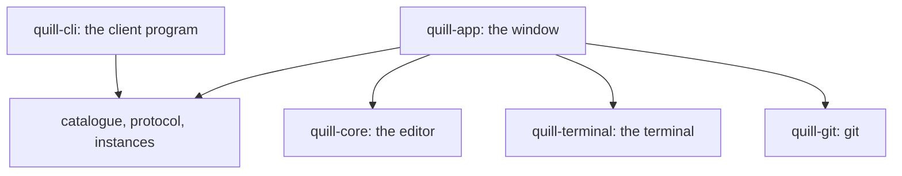

# Quill

A text editor for macOS and Windows, written in Rust. It opens any file holding text, has a file explorer
with folders that expand in place, a terminal along the bottom with tabs, and it lets the desktop show
through its background while the text stays solid.

It is also, now, an editor you can write code in: line numbers down the left, a tab for each open
file, a right click menu on the explorer, git in full, and plugins that colour CSS, JavaScript,
TypeScript, Rust and Mermaid.

The first half of this file is what Quill is and how to use it. The second half is how it is built:
[Architecture](#architecture) for the crates, the seams and what one frame does,
[How plugins work](#how-plugins-work) for what is in a manifest and what the tokeniser does with it,
[The command line](#the-command-line-and-the-channel-underneath-it) for the channel a running Quill is
driven down, and [Where a change goes](#where-a-change-goes) for which file to open first.

## Installing it

```powershell
powershell -File installer\windows\build.ps1 -Install   # Windows
```
```bash
installer/macos/build.sh --install                        # macOS
```

`installer/` builds a real installer for each platform out of the same drawn icon: on Windows a single
`QuillSetup-<version>-x64.exe` that puts Quill in the Start Menu, on the PATH and in *Open with*, and
on macOS a `Quill.app` and a disk image to drag into `/Applications`. `installer/README.md` says what
each switch does; `tasks/quill-installer-tdd.md` says why it is built the way it is.

## Driving it from the command line

```sh
quill-cli launch .                                   # start a Quill here and wait for it
quill-cli tab open README.md                         # open a file
quill-cli editor view preview                        # look at its Markdown preview
quill-cli terminal send cargo test                   # run something in the terminal
quill-cli terminal read --wait-for "test result"     # wait for it, and read what it said
quill-cli window screenshot shot.png                 # a real picture of the window
```

Everything the menus, the keyboard and the mouse can ask for is a command, and `--json` makes every
answer machine-readable. `quill-cli/README.md` says how it works; `quill-cli/docs/commands.md` is the
reference, written to be handed to an AI agent whole.

## Running it

```
cargo run --release -- sample/welcome.md
```

The argument is a folder to show in the explorer, or a file to open, in which case the explorer shows the
folder that file is in. With no argument the explorer shows the current directory — except when the
current directory is the folder `quill.exe` itself lives in, which is what a desktop shortcut gives you
and nobody chose, and then it reopens the project that was open last time.

Switches, all of which exist so a starting state can be chosen without clicking, which is what makes it
possible to capture the window in a particular state:

| Switch | What it does |
|---|---|
| `--opacity N` | The starting background opacity, from 0.05 to 1.0. The same setting as `Settings -> Appearance -> Background`. |
| `--view raw\|side\|preview` | Which of the three ways of looking at a Markdown file it starts on. |
| `--terminal` | Open the terminal at the bottom straight away. |
| `--menu-bar native\|in-window` | Where the menus are drawn. macOS uses the bar along the top of the screen and everything else uses Quill's own title bar; naming it is how the bar inside the window can be looked at on a Mac. |
| `--control on\|off` | Whether this window listens for the command line. On unless it is turned off, which closes the channel `quill-cli` drives it down. |
| `--print-menus` | Print the menus and their shortcuts, and stop. The macOS menu bar cannot be read by a test, so this is how what went into it can be checked. |

Several Quills can run at once, each on its own project. `File -> New Window` opens another window on the
same project, `File -> Open Folder` opens one on a folder you choose, and `File -> Recent Projects` opens
one on a folder that has been open before. Each is its own process, so they share nothing but the settings
file. What each project had open — its tabs, which of them was showing, which folders in the explorer were
opened out, and whether the terminal was up — is kept in a `.quill` folder beside the project and put back
when it is opened again.

## What the window looks like

A title bar Quill draws itself, holding the menus at the left, the project's name after them, and the text
options and the three Markdown view modes at the right beside the window buttons. Down the far left a thin
rail with a button for each pane: the explorer, git, and the terminal at the bottom. Then the explorer with
its filter box, a tab for each open file, the editing area, the terminal along the bottom when it is
showing, and a status bar. The text options are drawn only for a file whose controls mean something for it:
a `.rs` file, a `.json` file and a picture have none, and because they live in the title bar rather than in
a strip of their own, a file without them does not move anything below it. The palette was read out of
`design/intial-design-screenshot.png` rather than chosen by eye; run `cargo run --example sample_design` to
print the colour of each region of that image.

The window is dragged by its title bar and resized by any of its four edges or four corners, which Quill
draws itself because a window with no operating system frame has none of its own.

`documentation/overview.md` is the whole of this file in pictures: twenty-two captures of the running
window, each cropped with a margin of desktop round it so that what shows through the background is
visible.

`design/verification/live-window-over-desktop.png` is a capture of the running window over a real desktop.
The wallpaper is visible through the explorer, the editing area and the status bar, and every piece of text
is solid on top of it, which is what the opacity setting is for. It was taken before the font controls moved
into the settings and before the text options moved into the title bar, so it has a strip across the top
that the window no longer has.
`design/verification/terminal-claude.png` and `terminal-codex.png` are captures of `claude` and `codex`
running in Quill's terminal, with `terminal-claude-resized.png` and `terminal-codex-resized.png` showing the
same programs after the tile was made shorter and the explorer wider.

## The menus

`Quill`, `File`, `Edit`, `View` and `Git`, in that order, with `Quill` first. On macOS they are in the bar along the
top of the screen, where macOS puts menus. On Windows they are drawn at the left of Quill's own title bar,
and the three window buttons move to the right hand end, where Windows puts them.

| Menu | What is in it |
|---|---|
| `Quill` | About Quill, Settings, Quit. |
| `File` | New Window, Open File, Go to File, Open Folder, Recent Projects, Save, Save As, Close Window. Opening a folder opens it in a window of its own, the way Recent Projects does. |
| `Edit` | Undo, Redo, Cut, Copy, Paste, Select All, a `Highlight` submenu holding the four colours and the two ways of clearing one, Find in Files, Settings. |
| `View` | The three view modes, show or hide the explorer, show or hide the line numbers, the editor's font size and how to put it back, close a tab and move between tabs, select the opened file in the explorer, a `Split` submenu holding everything to do with the panes, show or hide the terminal, a new terminal tab and closing one. |
| `Git` | Commit, Add, Show Diff, Compare with Revision, Show History, Show Current Revision, Annotate with Git Blame, Rollback, Push, Pull, Fetch, Merge, Rebase, Branches, New Branch, New Tag, Reset HEAD, Stash, Unstash, Manage Remotes, Clone. Dimmed when the folder is not in a repository, and it grows `Continue` and `Abort` while a merge or a rebase has stopped on a conflict. |

Both bars are built from one list, so they hold the same entries with the same shortcuts. Run
`quill --print-menus` to see it.

## Settings

`Edit -> Settings`, `Quill -> Settings`, or command and comma, opens a modal laid out like IntelliJ's: the
pages down the left under their headings, and the chosen page on the right.

- `Appearance & Behavior -> Appearance -> Font` sets the family and the size the editor shows the document
  in. It applies to the whole document and leaves bold, italic and colour as they were. It is not an edit:
  it pushes nothing onto the undo history and does not mark the file as having unsaved changes, because what
  Quill saves is plain text and carries no formatting.
- `Appearance & Behavior -> Appearance -> Background` sets the background opacity, which is what lets the
  desktop show through the window. It works on both platforms, though Windows takes three things to get
  there that macOS does not need, all of them in `services/windows_transparency.rs`: wgpu is told to use
  DX12, because left to choose it picked Vulkan, whose surface offers no transparent composite mode;
  the swapchain is built from a DirectComposition visual, because one built from a plain window handle
  can only be `Opaque`; and the window's redirection surface — the GDI bitmap the desktop window manager
  composites the window from — is filled with black once a frame, because winit asks the manager to
  honour its alpha but never clears it, so it holds undefined bytes that read as opaque white. Without
  the last of those the window really does fade, but towards white rather than towards the desktop.
  Section 9.2 of `tasks/quill-technical-design-document.md` records how each was measured and what was
  rejected.
- `Editor -> Editor -> Gutter` shows or hides the line numbers.
- `Plugins` is the marketplace and what is installed.
- `Tools -> Terminal` sets which program a terminal tab runs and the size the terminal draws its grid
  at. Left empty, it is `$SHELL` on macOS and the newer PowerShell this machine has on Windows, and the
  note under the field says which that is.

Changes take effect as they are made. The settings, the recent projects and where the dividers between the
panes were left are kept in `~/Library/Application Support/Quill` on macOS and `%APPDATA%\Quill` on Windows,
in two plain text files that can be read and edited by hand.

## Writing code in it

**Line numbers** down the left of the editing area. Quill wraps, so a paragraph that runs over several
rows on screen carries one number against its first row and nothing against its continuations, which
is what a line number means everywhere else. Right clicking the gutter puts them away or annotates
the file with git blame.

**A tab for each open file.** A single click in the explorer opens a file in the tab a single click
reuses, drawn faintly to say so; a double click opens it in a tab of its own, and so does typing into
a tab you were only glancing at. The tab that is showing carries an accent line along its bottom
edge. `Ctrl+Tab` and `Ctrl+Shift+Tab` move between them and `Ctrl+F4` closes one.

**A right click menu on the explorer**: New > File with any extension you like, Cut, Copy, Copy Path,
Paste, Rename, Show in Explorer or Reveal in Finder, Reload from Disk, and a `Git` submenu aimed at
that row. Cut and paste go through Quill's own clipboard rather than the operating system's, so a
file cut in Quill cannot be pasted in Explorer; pasting onto a name that is taken adds a number
rather than overwriting what is there.

**Git**, in the `Git` menu, in the same submenu on any explorer row, and in three places you do not
have to ask for: the branch and how far it is from its upstream in the status bar, each file in the
explorer tinted by what git thinks of it, and a change bar in the gutter against each line that
differs from the version git has.

`Commit...` opens a panel laid out like IntelliJ's: a changes tree with a tick box a file, the
repository's row carrying its branch, an `Unversioned Files` group, `Amend`, the counts, the message
box with the last twenty messages behind a button, and `COMMIT` and `COMMIT AND PUSH...`. **Ticking a
file stages it at once**, so Quill's idea of what is staged and git's cannot disagree while the panel
is open.

Quill runs the `git` program rather than a library, so a push from Quill is the same push you get in
your terminal — the same credential helper, the same ssh agent, the same hooks, the same signing.
When something goes wrong it shows **git's own message**, because a rejected push and a merge
conflict explain themselves better than anything Quill could say about them. Every command runs on a
thread, so the window never stops drawing to wait for one. `Rollback`, a hard `Reset HEAD` and
dropping a stash each ask first, because none of them can be undone. Pushing with force always uses
`--force-with-lease`.

A merge or a rebase that stops on a conflict is not hidden: the status bar says so, the conflicted
files are marked, the Git menu grows `Continue` and `Abort`, and the file opens with its markers in
it — which is a file holding text, and therefore something Quill already edits.

**Plugins** colour a file by what its text is. Five ship with Quill — JavaScript, TypeScript, Rust,
CSS and Mermaid — and each gives its files an icon, a set of words to colour, and the Dracula colour
scheme. A plugin is a folder holding a `plugin.conf` and an icon, in the same `name = value` format
the settings file uses; **nothing in one is executed**, so installing one is copying a folder.
`Settings -> Plugins` lists them, and `Install` writes a plugin's folder out where it can be edited
by hand. [How plugins work](#how-plugins-work) is the whole of it: what a manifest holds, what the
tokeniser does with it, and how to write one.

A colour scheme colours the tokens and not the editing area, so a coloured file still lets the
desktop through.

## What it does

Editing, in the modes that show the source: select with the mouse or with shift and an arrow key, cut, copy,
paste, move the caret by character, by word, to the start or end of a line, and to the start or end of the
document, undo and redo.

Character formatting: bold, italic, underline, strikethrough and colour, behind the `F` button at the right
of the title bar, with the family and the size in the settings.

Paragraph formatting: left, centre, right and justified alignment, and single, one and a half or double line
spacing, behind the same button.

The font: one family and one size for the whole window, the way IntelliJ has one editor font, set in
`Edit -> Settings -> Appearance -> Font`. Changing it changes every file that is open, not only the one
showing. The size is also on the keyboard at command or control with plus and minus, on `View -> Reset Font
Size` to put it back, and on a trackpad pinch or the wheel with the modifier held over the editing area.
Whichever of them is used, it is the one setting, so it is still there next time Quill starts.

Finding things: `Ctrl/Cmd+Shift+O` opens `Go to File`, which narrows the project's files as a name is
typed — the letters are matched in order rather than as a substring, so `mdrs` finds `markdown.rs` —
and a double click or Enter opens the one that is chosen. `Ctrl/Cmd+Shift+F` opens `Find in Files`,
which searches every file's text as you type, on a thread so the window never stops drawing, with
`Match case` beside the box. Choosing a result shows the whole of the file it is in underneath the
results with the matching line picked out; opening one opens the file with the match itself selected.

Modals: every dialog in Quill is dragged by its header and resized from any of its four edges or four
corners, and a double click on its header puts it back in the middle at the size it started.

Files: any file holding text opens. A `.md` file is Markdown, which means the preview shows it rendered;
a `.mmd` or `.mermaid` file is a Mermaid diagram, which means the preview **draws** it; everything else
opens as plain text, whether Quill knows the file type or not, so a `.rs` or a `.js` file opens as what it
is. A picture opens too, in a tab that shows it: `.png`, `.jpg`, `.gif`, `.bmp`, `.ico`,
`.webp` and `.tiff`, scaled to fit the editing area to begin with, zoomed with command or control and plus
and minus, with the wheel and that modifier held, or with a pinch, dragged about with the mouse, and put
back to filling the area with a double click. A file that is neither text nor a picture, such as an archive,
is listed in the explorer, dimmed, and says why it cannot be opened when the pointer rests on it. So is a
file larger than 16 MB.

Diagrams: a `.mmd` file gets the same three view modes a Markdown file has — the source, the source and the
diagram side by side, or the diagram filling the pane — and a ```mermaid block inside a Markdown document is
drawn in its preview rather than shown as code. Twenty of Mermaid's diagram types are drawn: flowchart,
sequence, class, state, entity relationship, requirement, pie, gantt, user journey, git graph, mindmap,
timeline, quadrant, xy chart, sankey, block, packet, kanban, radar and treemap. The pictures are Quill's own
drawing rather than `mermaid.js` output, so they are not pixel identical to it; ten further types are
**named** rather than drawn. Nothing is fetched and nothing in a diagram is run.
`tasks/quill-mermaid-plugin-tdd.md` sets out why it is written in Rust rather than by running Mermaid's own
JavaScript, and what each type becomes on the screen.

Panes: the explorer's width, the split between the Markdown source and its preview, and the terminal's
height are all set by dragging the divider, and a double click puts one back to its usual size. Where they
were left is remembered. The rail down the far left puts each pane away and brings it back, in the same
place whether the pane is showing or not.

Splitting the editing area: right click a tab and choose `Split Right`, or use `View -> Split`, and the
editing area is cut into panes side by side, each with its own tabs, its own scroll position, its own
view mode and its own gutter. A tab is dragged along its own strip to reorder it and into another pane
to move it there, and dropping it outside every pane does nothing, so a drag can be thought better of.
The file showing in the pane with the keyboard is the one selected in the explorer, with the folders
above it opened out.

Scrolling: a thin bar down the right hand edge of the editing area and of the Markdown preview says how
far through a file you are and can be dragged. In the side by side view, scrolling either half scrolls
the other, and it crosses through the text rather than through the height — a heading is one line of
source and half again as tall on the page, so the same fraction of each half would drift further apart
the further down you went.

Highlighting a passage: select some words, right click, and choose one of four colours or open the
colour wheel. The colour is behind those words in this file, next time it is opened, and until it is
cleared, and it moves with the text as the file is edited. Marking is not an edit: it pushes nothing
onto the undo history and does not mark the file as having unsaved changes. The marks are kept in the
project's own `.quill` folder, and `quill-cli highlight` does the same thing across as many files as
you like without opening any of them.

The terminal: a tile along the bottom of the window with tabs, opened with control and backtick or from the
`View` menu. Each tab runs a shell in the folder the explorer is showing — `$SHELL` on macOS, and on
Windows `pwsh.exe` when it is installed and `powershell.exe` otherwise, because `COMSPEC` names the
interpreter that runs a batch file rather than the shell a person actually uses. It handles colour
including 24 bit colour, bold, italic, underline, strikethrough, inverse and dim, wide characters, the
alternate screen a full screen program draws on, ten thousand lines of scrollback, selecting with the mouse,
copying with command and C, and mouse reporting for a program that asked for it. A tab is named after the
title the program set, so a tab running `claude` says so. `tasks/quill-terminal-tdd.md` sets out how it
works and what it does not do.

Keyboard: command plus B, I or U for bold, italic and underline. Command plus shift plus X for
strikethrough. Command plus L, E, R or J for the four alignments. Command plus plus and command plus minus
for the editor's font size — `+` and `=` are one key, so either does it, with or without shift, and so does
the keypad's `+`. Everything else is on a menu, and the menu shows its shortcut. On Windows the control key
takes the place of the command key.

## Architecture

### The shape of it

Five crates. The editor, the terminal and git each know nothing about a window; the window knows
nothing about a rope, an escape sequence or `--porcelain=v2`; and the command line client knows
nothing about any of them but the names of the commands.



An arrow is "depends on". Everything points towards the things with no user interface in them, and
nothing points back: `quill-core`, `quill-terminal` and `quill-git` cannot mention `egui`, and
`quill-cli` cannot mention `quill-app`. That is what makes the tests of most of Quill run with no
window, no graphics card and no fonts, and it is what keeps the client a small program you can run on
a machine that has never drawn anything.

The one shared piece is the box the client and the window both point at: the catalogue of command
line commands, the wire format, and the file a running Quill writes to say how to reach it. Both halves read the same list, so the CLI
cannot accept a command the window has never heard of.

### The five crates

| Crate | What is in it | What must never be in it |
|---|---|---|
| `crates/quill-core` | The editor: the rope, the character and paragraph formatting, the caret, layout, undo, the Markdown parser, the syntax tokeniser, the highlight ranges, and the Mermaid reader and diagram layout. One dependency, `unicode-segmentation`. | Any user interface dependency. |
| `crates/quill-terminal` | The terminal: the session over a pseudoterminal, the screen the painter reads, the colour palette, the key encoding, the mouse reports, and which shell to start and where. `alacritty_terminal` supplies the escape sequence emulation and the pseudoterminal; the rest is ours. | Any user interface dependency. |
| `crates/quill-git` | Reading and changing a repository: status, blame, log, diffs, branches, every operation on the Git menu, and the thread they run on. No dependencies at all, because it runs the `git` program. | Any user interface dependency, and any decision about what a dialog looks like. |
| `crates/quill-app` | The window: drawing, input, real fonts, the settings on disk, the menus, the plugin registry, and the socket the command line drives it down. | Editor behaviour, terminal emulation or git plumbing. Those belong in the crates above. |
| `quill-cli` | The command line: the catalogue of commands, the wire format, and the client program. It lives beside its own documentation rather than under `crates/`, because the two are read together. | Anything that depends on `quill-app`. |

### Inside `quill-core`: the editor with no window

A `Document` is four things and a history: a `Rope` of text, a `StyleSpans` of character formatting
covering it with no gaps, a `ParagraphStyles` of one setting a line, and a sparse `Highlights` of
marked passages. Everything that changes it goes through `Document::apply`, which takes a `Command`.
One function is what makes undo and the stale layout flag reliable: there is one place a change is
recorded and one place the revision moves.

The rope is a B-tree. Leaves hold a short run of UTF-8 bytes and every parent holds a summary of each
child — bytes, characters and line breaks — which is what makes an editor's operations cheap: finding
where line 4,000 starts walks down the tree adding counts without reading any text, and inserting in
the middle of a large file rewrites one leaf and the path above it instead of moving the rest of the
file.

**Undo restores a state rather than applying an inverse.** A `Snapshot` holds the text, both kinds of
formatting, the selection and the marks, and undoing swaps one in. An inverse operation for every
command would be a second implementation of the editor, and the first one that is subtly wrong leaves
a document nobody can explain.

**A document counts two revisions.** `revision()` moves for any change at all and is what "does the
window need painting again" reads. `text_revision()` moves only for what alters the text or its
formatting, and is what layout, the preview and the syntax colouring are keyed on. Moving the caret
is not a change to the text, and keeping those two apart is worth 800 milliseconds a frame while a
selection is being dragged.

`layout` turns a document and a width into lines, which hold runs, which hold positioned clusters
that share one style. `relayout` does the same job given the previous layout, keeping every paragraph
whose text, formatting and paragraph style fingerprint the same, so an edit costs the paragraph it
changed rather than the file it was in. The fingerprint is derived from the state and never reported
by the editor: a list of the places that have to say "I changed this" is a list whose next entry is
the one that forgets.

Measurement is a trait, `FontMetrics`. `quill-core` asks for the advance width of a grapheme cluster
and the vertical metrics of a style, and never asks how a glyph is drawn, so the window backs it with
real font files and the tests back it with a fixed width stub. Every layout test is then arithmetic a
reader can check by hand, and it gives the same answer on macOS and on Windows.

The Markdown preview is not a second renderer. `markdown::render` reads the source and produces the
same three things a document holds — text, character spans, one paragraph setting a line — and a
fourth structure, `source_lines`, saying which line of the source each line of the preview came from.
The ordinary layout and the ordinary painter draw it, so nothing in the window knows how to render
Markdown, and `scroll_sync` can cross from one half of the side by side view to the other through the
text rather than through the height.

Mermaid is the same idea one step further out. `mermaid` reads a diagram and hands back a `Scene`:
rectangles, circles, polygons, lines and text at absolute positions, and nothing else. An arrowhead is
a filled polygon of three points and a crow's foot is three lines, both built where they can be tested
with no window, so `components::diagram_view` has no diagram knowledge in it at all.

### Inside `quill-app`: the window

Four folders, and a new file belongs in one of them.

- `app/` — the window's own state, and `app/actions.rs`, which is what the menus and the keyboard ask
  for. `app/files.rs` is the open tabs and the panes, `app/git.rs` the repository, `app/cli.rs` what a
  command line command means.
- `components/` — drawing. One file for each piece of the window.
- `services/` — everything that is not drawing: the file tree, the fonts and the glyph atlas, the
  settings and recent projects on disk, what one project remembers about itself, decoding a picture,
  starting a second window, the macOS menu bar, the plugins, the socket the command line drives the
  window down, and what Windows needs before the desktop will show through.
- `theme/` — the palette, the measurements and the drawn icons. Every colour was read out of
  `design/intial-design-screenshot.png` rather than chosen by eye.

Two rules hold that together.

**A component takes a rectangle and returns what happened.** It draws itself into the `Ui` it is
given and changes nothing: not the document, not the window's state. The state changes in `app`, so
two components cannot disagree about what the user did, and a component can be drawn by a test with
no document behind it. Everything is painted at an absolute position rather than through egui's
layout, because the measurements come from the design image and live in `theme::size`.

**One action, one place.** Everything a menu or a keyboard shortcut can ask for is an
`actions::Action`, and `QuillApp::run_action` is the only place an action turns into a change. There
are two menu bars — the one macOS draws along the top of the screen and the one Quill draws in its own
title bar — and both are built from `actions::menus`, so they cannot drift apart. `run_cli` is the
same rule for the command line, and wherever there is already a way in, it uses it.

Every control calls `widget_info` with a plain name — `Save`, `Bold`, `Terminal tab: claude` — because
the screenshot tests find controls by name rather than by position, and a control with no name cannot
be tested at all.

### What one frame does, in order

`QuillApp::ui` is the frame, and the order in it is deliberate.

1. Apply the theme and remember the context, on the first frame only.
2. **Answer the command line.** The control channel's queue is drained before anything is drawn, so a
   screenshot taken straight after a command shows what the command did.
3. Ask git what it thinks of the file showing in each pane, and colour that file if its text revision
   has moved.
4. Reveal the file that is showing in the explorer — before the explorer is drawn, so the folders it
   needs are already open on this frame.
5. Paint the window: one rounded rectangle at the opacity setting's alpha, then the title bar, the
   rail of pane buttons, the explorer, the panes, the terminal and the status bar.
6. For each pane in turn, borrow the focus, draw the tab strip and the editing area exactly as a
   single pane is drawn, and put the focus back at the end. Everything in a pane is drawn into a `Ui`
   carrying the pane's number as its id salt, because egui identifies a widget by its id and two
   gutters would otherwise be one widget.
7. Settle what only the window can settle: which pane took the frame's zoom gesture, where a dragged
   tab landed, and which half of a side by side view drove the other.
8. Add the dividers and the window's own resize grips **last**, because egui gives a pointer to the
   last widget that asked for the point and the editing area asks for all of it.

Transparency is two paints rather than one. `clear_color` hands the compositor an alpha taken from the
opacity setting, and every glyph is painted at full alpha, so the desktop shows through the background
while the writing stays sharp. That is the whole of it on macOS. On Windows the compositor has to be
talked into honouring the alpha at all, which is three separate fixes in
`services::windows_transparency` and the one platform call the frame makes.

Painting touches what is on the screen rather than what is in the file. `Layout::visible_lines` is a
pair of binary searches over the clip rectangle, and the painter, the selection rectangles and the
decorations all take a line range: egui culls a mesh against its bounding box, and the bounding box of
a whole document plainly overlaps the window, so collecting every glyph in the file meant tessellating
and uploading every glyph in the file, sixty times a second.

### The seams

Each of these is a narrow interface with something large behind it, and each is where a replacement
would go.

| Seam | Between | What crosses it |
|---|---|---|
| `FontMetrics` | the editor and real fonts | the advance width of a cluster, and a style's vertical metrics |
| `Scene` | Mermaid and the painter | rectangles, circles, polygons, lines and text at absolute positions |
| `Preview` | the Markdown parser and the editor | text, character spans, paragraph styles, and the source line each preview line came from |
| `Screen` | the terminal emulator and the painter | a snapshot of the grid with no locks in it and nothing borrowed |
| `Outcome` | git and the window | git's own standard output and standard error, whether it worked or not |
| `Grammar` and `Token` | a plugin and the tokeniser | the words of a language, and what a stretch of source *is* — never a colour |
| `catalogue::Command` | the client and the window | the name of a command, its arguments and its flags |

### The threads, and what crosses them

The window is one thread with a frame loop, and everything that could stop it drawing is somewhere
else. There are four, and they are arranged the same way: a request goes out, a reply comes back, and
the thread holds a **waker** that asks the window to draw again — because a reply arriving while the
window is idle has to draw itself rather than wait for the next mouse move.

- **git.** `quill_git::Worker` runs one command at a time. One at a time on purpose: two commands at
  once in one repository fight over `index.lock`, and a person cannot press two menu entries at once.
- **The terminal.** `alacritty_terminal`'s event loop reads the pseudoterminal and updates the grid
  behind a lock. A frame takes a `Screen` while holding that lock and then draws from it with the lock
  released, because drawing touches the font atlas and the graphics device, and holding the lock
  across all of that would stall the thread reading the shell.
- **`Find in Files`.** Reading every file on every key press where the window draws looks exactly like
  a crash on a large folder. Only the newest question is answered: each request carries a number, the
  newest is shared with the thread as an `AtomicU64`, and a search whose number has been passed stops
  where it is. That is what makes typing quick with no debounce timer, which would be wrong at both
  ends — too long on a small project and too short on a large one.
- **The control channel.** A listener on `127.0.0.1` reads one JSON object a line and queues it. The
  thread touches nothing the window owns: the window drains the queue at the top of a frame.

Four command line commands are asked on one frame and answered on a later one — a screenshot, because
the picture of a frame arrives after that frame has been painted; a terminal read waiting for a shell;
a search still running; a git operation still running. Each keeps its request until it is ready, and
every one of them takes a timeout, because a command that could wait for ever is a script that hangs.

### Where state lives

Five places, and which one a thing belongs in is settled by asking who it belongs to.

| It belongs to | Where it lives | What is in it |
|---|---|---|
| The tab | `OpenFile` | the document, the scroll position, the view mode, what git said, which pane it is in, and everything laid out for it |
| The window | `QuillApp` | the explorer, the terminal, the plugins, the repository, the modals, and the three caches that are not keyed on a document |
| The project | `.quill/` beside the project | which files were open and in which pane, which folders were expanded, whether the terminal was up, and the marked passages |
| The person | `%APPDATA%\Quill`, or `~/Library/Application Support/Quill` | the settings, the pane sizes, the recent projects, and the plugins installed by hand |
| This run | `<settings folder>/instances/<pid>.conf` | the port this window is listening on, and the token a request has to carry |

What was laid out belongs to the **tab**, not to the window, and that was not always true. With the
editing area split, one cache for the whole window is not slow so much as wrong in the way a cache is
wrong: the first pane lays its file out, the second lays its own over the top, and the next frame does
it again for ever.

A project's own state is written by the released binary and by nothing else, which is why
`restore_project` is called from `main.rs` and never from `QuillApp::new`. A test must not read or
write the settings of the person running it, and a `.quill` folder written into a screenshot test's
sample project would change what the explorer draws in the middle of a test.

### What a frame costs

`task-1666` measured one frame of dragging a selection through a large file at **818 ms**. It costs
20.8 ms now, which is one frame at sixty a second plus the loopback round trip. Four rules came out of
it, and a change to the editing area has to keep all four: a caret move is not a change to the text,
the painter touches the lines it can see, an edit costs the paragraph it changed, and nothing that
runs once a letter may allocate.

They are measured rather than asserted.
`cargo run --release -p quill-app --example frame_cost -- <file> [width]` lays a real file out with
the real fonts of this machine, colours it as the window colours it, and prints what each part of a
frame costs. A threshold in milliseconds would be a different number on every machine; what *is* a
test is the work itself — how many glyphs the painter placed, how many clusters the fonts were asked
to measure — because those are the same everywhere.

## How plugins work

### A plugin is data, and nothing in one is executed

A plugin describes a language: the extensions it claims, the words worth colouring, what a comment and
a string look like, and a colour for each kind of token. That is a **description**, not a program, so
a plugin is a folder holding a manifest and an icon, and loading one is reading a file.

The two alternatives were weighed and both are the right answer to a question this is not asking yet.
A **dynamic library** would let a plugin run arbitrary Rust, and it also means an unstable interface
across a `dlopen` boundary — a Rust structure passed over one is undefined behaviour unless both sides
were built by the same compiler with the same flags — so every plugin would have to be rebuilt for
every release of Quill, and a plugin that crashes would take the editor with it. **WebAssembly**
answers both of those and costs a runtime plus a host interface that has to be designed, versioned and
documented before the first plugin can be written. For "colour these keywords", both are a great deal
of risk bought for nothing.

So the seam is named now and left empty. `plugin.kind` is read and checked, and a manifest saying
anything but `language` is refused **with a message** rather than half-loaded. That is the line a
later version widens, the day a plugin wants to *do* something — run a formatter, talk to a language
server, add a tool window. It should not be widened quietly.

### The manifest

`plugin.conf`, in the same `name = value` format the settings file uses, read by the same value store.
No new dependency, and a plugin can be read and corrected in a text editor, which is fitting in a text
editor. A list is comma separated, a flag is `true` or `false`, and a colour is `#RRGGBB`.

| Key | What it is |
|---|---|
| `plugin.id` | the name of its folder, and how it is switched off. Required. |
| `plugin.kind` | `language`. Anything else is refused. |
| `plugin.name`, `.version`, `.vendor`, `.description` | what `Settings -> Plugins` shows. |
| `plugin.limitations` | what it does not do. Every bundled plugin has one, and it is worth reading before wondering why a regular expression is coloured as division. |
| `language.extensions` | the extensions it claims, with or without the dot. Empty is refused, because nothing would ever use it. |
| `language.line_comment` | what starts a comment that runs to the end of the line. |
| `language.block_comment` | the opener and the terminator, as two values. |
| `language.strings` | the quote characters that open a string. `", '` unless it says otherwise. |
| `language.escapes` | whether a backslash escapes the next character inside a string. On unless it says otherwise. |
| `language.numbers` | whether a run of digits is a number. On unless it says otherwise. |
| `language.operators` | the characters that are operators. |
| `language.keywords` | the words the language reserves. |
| `language.builtins` | the names the language provides. |
| `language.types` | a third list of words, tried after the other two. |
| `language.word_characters` | characters that are part of a word wherever they appear, such as the hyphen in CSS. |
| `language.hex_colors` | whether `#` and hexadecimal digits are a number. |
| `language.renders` | the built-in renderer this language's files are drawn with. |
| `theme.name` | what the colour scheme is called. |
| `theme.keyword`, `.builtin`, `.function`, `.type`, `.string`, `.number`, `.comment`, `.operator`, `.text` | one colour a token. A token with no colour is left as ordinary text. |

The three keys `word_characters`, `types` and `hex_colors` are **off unless a manifest names them**,
so no plugin written before they existed changes by a pixel. All three arrived with the CSS plugin,
which none of the tokeniser's rules could read: a hyphen is a letter in CSS, and a pass that split a
word there could not name a single property; `#ff0000` is a colour and the number rule wants a digit
first, so half the colours in a stylesheet were coloured and half were not; and a stylesheet has three
kinds of word worth telling apart — the at-rule, the property and the value — where a grammar had two
lists.

### Where plugins come from, and in what order

Five ship inside the binary: JavaScript, TypeScript, Rust, CSS and Mermaid. They are bundled so that a
Quill that has just been installed colours a `.rs` file the first time it opens one, and so that the
marketplace has something in it with no network involved.

`Plugins::load` reads those first, then every folder under `<settings folder>/plugins`. **A plugin on
disk shadows a bundled one with the same id**, so a bundled plugin can be corrected by hand without
rebuilding Quill. Then `plugins.disabled` in the settings file switches off the ones that were
switched off last time.

A plugin that will not parse is **skipped and its reason kept** rather than thrown away, and Quill
starts with one plugin fewer. That is the rule the settings file already keeps: starting with a
default is better than refusing to start because a file has a stray line in it.

`Plugins::for_path` is the whole of "which plugin claims this file" — the first one that is switched
on and lists the extension. Nothing else asks the question.

### What the tokeniser does with a grammar

`quill_core::syntax::highlight` takes the text and a `Grammar` and returns a range and a `Token` for
each stretch. One linear pass, no regular expressions, no dependency, and the order of the rules is
the whole design: a line comment, then a block comment, then a string, then a number, then a word in
one of the three lists, then a word directly followed by `(` as a function or one starting with a
capital letter as a type, then text. Comments and strings win over everything, because a keyword
inside a string is not a keyword.

Those last two are a **heuristic and are meant to be one**. `Promise.all(` colours `all` as a function
and `Promise` as a type without Quill understanding a single thing about JavaScript. Real
understanding is a language server, and that is not what this is.

Nothing in `quill-core` knows what a colour scheme is. A `Token` says what a stretch of text *is*, and
the window turns it into a colour: `colour_the_file` runs the tokeniser, maps each token through the
plugin's theme, and hands the whole result to `Document::set_syntax` in one pass rather than one pass
per token — 561 ms to 1.4 ms on a coloured 170 kilobyte file. It is keyed on the document's **text**
revision, so moving the caret does not re-tokenise the file, and a file over two megabytes is left as
plain text with a line in the status bar saying so.

A colour scheme **colours the tokens and not the editing area**. Dracula's own background is not used
and Quill's stays: the window letting the desktop show through is the whole character of the product,
and a scheme that repainted the editing area opaque would trade that away to be a shade nearer a
screenshot.

### A language that has a picture

Mermaid did not widen the seam. It **is** a language — keywords, comments, strings, an extension — so
it is an ordinary `language` plugin, and colouring `.mmd` source is worth having on its own.

It carries one extra key, `language.renders = mermaid`, naming a renderer that is **built into
Quill**. Nothing is loaded from the plugin and nothing is executed: the manifest says "files of this
language have a picture, and this is which picture", and the code that draws it shipped with the
binary. The value is checked against the renderers this version has, and a manifest naming one it does
not have is refused with a message, exactly as `plugin.kind` is.

What it buys is that switching the plugin off actually withdraws the feature. The window asks
`Plugins::renders` before it draws a diagram anywhere, so `.mmd` files stop being drawn and mermaid
blocks inside Markdown go back to being code — in the same frame, not at the next restart.

### Switching one off, and installing one

`Settings -> Plugins` is the marketplace and the list of what is installed. Switching one off writes
`plugins.disabled` and takes effect at once: the files it claims lose their colours and their icon on
the next frame.

`Install` writes a bundled plugin's folder out to `<settings folder>/plugins/<id>/` and then **reads
it back from disk**. Reading it back rather than simply marking it installed is the point: it is what
proves the loader works on real files and not only on what was baked into the binary. From then on it
is an ordinary plugin folder that can be edited by hand, and it shadows the bundled one it came from.

A plugin's icon is `icon.png` beside the manifest, decoded once and drawn in front of every file the
plugin claims. A bundled plugin's icon is generated rather than drawn, and each one records how:
`crates/quill-app/plugins/mermaid/icon.md` and its neighbour under `css/` each hold the prompt, the endpoint and the two
commands, so it can be made again without guessing.

### Writing one

Copy a bundled plugin's folder out of `crates/quill-app/plugins`, or press `Install` and edit what it
wrote. Change `plugin.id` and `language.extensions`, put the language's words in the three lists, and
start Quill again. There is nothing to compile and nothing to register.

Which word goes in which list is the whole of a plugin's design, and one rule decides the awkward
cases: **a word that is both a property and a value is coloured whichever way it is written more
often**. In the CSS plugin `inset`, `left` and `content` are properties; `flex`, `grid` and `all` are
values, because `display: flex` and `transition: all` are far commoner than the shorthand properties
of the same name. `tasks/task-1671-css-plugin-tdd.md` has the table and the reasoning.

## The command line, and the channel underneath it

`quill-cli` drives a **running** Quill. It is not a second way of doing things: `QuillApp::run_cli` is
to the command line what `run_action` is to the menus, and wherever there is already a way in it uses
it, so a thing done from the command line and the same thing done by hand are the same thing.

Three rules keep it honest, and all three are tests rather than promises.

**A menu entry needs nothing at all.** `quill-cli action list` is built by walking the real menus, so
an entry added tomorrow can be run from the command line tomorrow. A test fails the day a menu entry
has no name.

**Anything with no menu entry** is a row in `quill-cli/src/catalogue.rs` and an arm in `app/cli.rs`.
The catalogue is one list in a crate both halves depend on, so a command the client accepts is a
command the window knows.

**Documentation is a test.** One fails while a command has no section in `quill-cli/docs/commands.md`,
while a section's usage line is out of date, or while a section describes a command that no longer
exists. A second parses every example in the catalogue and checks it runs the command it is filed
under, because the examples are what an agent copies.

Underneath is a socket on `127.0.0.1`, a port the operating system chose, one JSON object a line, and
a per-run token in an instance file under the person's own settings folder:

```text
-> {"token":"4f1a...","command":"tab.open","arguments":{"path":"README.md"}}
<- {"ok":true,"command":"tab.open","message":"Opened README.md","result":{"tab":2}}
```

A loopback socket rather than a Unix domain socket or a named pipe, because it is the same `std::net`
on both platforms — and because any language with a socket and a JSON library can drive Quill in three
lines, which makes `quill-cli` the comfortable way in rather than the only one. Nothing is ever bound
to anything but `127.0.0.1`, and there is a test for that. The token is what stops a page in a
browser, which can post to a loopback port and cannot read a file, from driving somebody's editor; it
is not protection against a program already running as them, and nothing on a desktop is.
`quill --control off` closes the channel altogether.

The sentence in `message` is written by the **window** rather than by the client, because the window
is the only one that knows what actually happened — which tab the file landed in, what the setting was
before it changed, how many results a search found. `quill-cli/docs/protocol.md` is what a client in
another language needs.

## Where a change goes

| To add | Change | And you get |
|---|---|---|
| A menu entry or a shortcut | a variant on `actions::Action`, an entry in `actions::menus`, an arm in `run_action` | both menu bars, the keyboard, and a command line command, with no further work |
| A command with no menu entry | a row in `quill-cli/src/catalogue.rs`, an arm in `app/cli.rs`, a section in `docs/commands.md` | the client parses it, `--help` prints it, and the documentation test passes |
| A piece of the window | a file in `components/`, taking a rectangle and returning what happened | something a screenshot test can drive, and a name it can be found by |
| A modal | `components::modal`'s frame, header, body, footer and rows | dragging, eight resize grips and a double click that puts it back, without asking |
| A pane | `components::splitter` for its divider, and a size in `settings::Panes` | one grab width, one highlight, one pointer shape, and a pane that is where it was left |
| A language | a folder with a `plugin.conf` and an `icon.png` | colours and an icon, with nothing compiled and nothing registered |
| A diagram type | a module under `crates/quill-core/src/mermaid` producing a `Scene`, and a file in `sample-diagrams/` | the four properties every type is held to, and no change to the painter at all |
| A setting | a field on `Settings`, a name in the file, a control on a Settings page | it is written, read back, and reachable as `quill-cli settings set` |

## Tests

```
cargo test
```

Four layers, 1,199 tests, and a change should leave all four green.

**1. The crates with no window.** `quill-core` has 481 unit tests, including the Markdown parser, the
syntax tokeniser, every Mermaid diagram type, and a randomised comparison of the rope against a plain
`String` over 1,500 edits with the tree invariants checked after every one. Layout tests measure
through a fixed width stub, so their expected numbers are arithmetic a reader can check and are the
same on every machine. `quill-terminal` has 77: every key in the encoding table, the sixteen named
colours and the colour cube, what the screen holds after a run of escape sequences, the alternate
screen, scrollback, resizing, the mouse reports and the tabs. Two of them start a real shell and wait
for its output, which is what proves the pseudoterminal, the reader thread and the writing work
together. `quill-git` has 43 unit tests and 23 more that build real repositories in a temporary folder
and ask **git** what happened afterwards. `quill-cli` has 51, and among them are the ones that make the
documentation a test rather than a promise.

**2. The window's own logic.** `quill-app` has 305 unit tests covering the file explorer and its
filter, what counts as a text file or a picture, the settings file, the project's own state, the
plugins and their manifests, the menus and their shortcuts, the panes and the tabs in them, real font
measurement and glyph packing.

**3. The whole window, rendered.** `crates/quill-app/tests/screenshots.rs` has 219 tests that build
the entire application through `egui_kittest`, feed it real events, render it through `wgpu` and write
a PNG for each one. **Look at the images.** They are how a person or an agent confirms that bold text
is bolder, that the settings window is laid out like the design, and that the terminal's colours are
right. Once accepted they are the comparison baseline, so a later change that alters the rendering
fails a test.

Each platform has its own accepted set, because the window is deliberately not the same on both: macOS
has the menus in the bar along the top of the screen and the window buttons at the left, Windows draws
both in Quill's own title bar, and the text is Arial rather than Helvetica because Helvetica is not
installed there. macOS reads `tests/snapshots` and Windows `tests/snapshots/windows`.

To accept new images after a deliberate change:

```
UPDATE_SNAPSHOTS=1 cargo test
```

A run that differs writes `{name}.new.png` and `{name}.diff.png` next to the accepted image, and
nothing should be accepted without opening it.

Three rules those tests keep, each the answer to a test failing for a reason that was not a fault in
Quill. **Nothing builds a graphics device of its own** — a small pool is built once and shared,
because ninety one devices built and torn down across as many threads killed the process with an
access violation about one run in nine. **A fixture two tests share is written once**, behind a
`OnceLock`, or one test reads a file another has truncated and not yet filled in. And **a loop that
waits calls `pump`, not `Harness::run`**, because `run` gives the window four steps to go quiet and
panics otherwise, which is right for a settled window and wrong while git or an image is still being
worked on.

**4. The real application**, because the first three render offscreen and cannot show that the
operating system honoured the window's transparency or drew the menu bar. `cargo run --release` for
the window, and for the terminal:

```
cargo run --example terminal_capture -- --wait 10 --send "\r" --wait 10 claude
cargo run --example terminal_capture -- --wait 12 --send "\r" --wait 12 codex
```

That builds the real window offscreen, runs the program in the terminal, answers it, and writes a
picture to `design/verification`, along with a second one after the tile has been made shorter, which
is where a program that was not told its new size draws in the wrong place. The images are not
compared against a baseline, because both programs draw something different every time they run; they
exist to be looked at.

For git, `pwsh tools/build-git-demo.ps1` builds a small repository under the temporary folder — three
commits by three authors on three widely separated dates, a branch, an uncommitted change and an
untracked file — which is enough to exercise every entry on the Git menu by hand. For diagrams,
`cargo run --example mermaid_check` lays out every file in `sample-diagrams/` and says what came of
each, which is the quickest way to see that a layout change has broken nothing.

## Not included

Right to left and complex writing systems. Version one places one grapheme cluster after another from
left to right, which is correct for Latin, Greek and Cyrillic and wrong for Arabic and Hindi. The
`FontMetrics` boundary is where a shaping step would go.

Search and replace inside the open file, and several carets at once. `Find in Files` searches the
project and opens what it finds; it does not replace, which is a destructive operation across a whole
project and wants a ticket and a confirmation of its own.

Code folding. The 12 point gap beside the line numbers is where its arrows would go, and nothing else
about the gutter would have to move; what it needs is a notion of a block, which needs a real parser.

A three way merge editor, a language server, and a marketplace that fetches a plugin over the
network. Each is named with its reason in `tasks/quill-ide-tdd.md`.

In the syntax colouring: a regular expression literal, which cannot be told from division without
parsing; nested block comments in Rust; interpolation inside a template literal; and JSX. Each
plugin says so on its own page in `Settings -> Plugins`.

In the Markdown preview: tables, footnotes, reference style links, nested block quotes and HTML.

In diagrams: ten of Mermaid's thirty types — C4, ZenUML, architecture, swimlanes, event modelling, Venn,
Ishikawa, Wardley, Cynefin and tree view — which are named rather than drawn. A diagram's own `style`,
`classDef` and `click` directives are read and ignored: a document does not choose the window's colours, and
nothing in a diagram is going to run.
Tables need layout Quill does not have; the rest are rare in prose. A picture **is** drawn, when it is
the whole of a line and it is a file on this machine — one inside a line of prose stays its alt text,
because it would need inline layout the engine does not have, and one with a scheme in front of it is
refused, because Quill makes no network requests.

In the terminal: images, the Kitty keyboard protocol, a blinking cursor, and searching the
scrollback. `tasks/quill-terminal-tdd.md` lists them with the reasons.

## The documents

Each stands on its own, and states any fact it needs rather than pointing at another one for it.

| Document | What is in it |
|---|---|
| `documentation/overview.md` | What Quill looks like: captures of each part of the window, over a real desktop. |
| `design/style-guide.md` | How a control in Quill is built: the closed palette, the row heights, the one shape a modal has, and the plain name every control carries. Read it before drawing anything new. |
| `CLAUDE.md` | The conventions the code already follows, written for whoever changes it next. |
| `quill-cli/docs/commands.md` | The command line reference, written to be handed to an AI agent whole. |
| `quill-cli/docs/protocol.md` | The socket underneath it, for a client in another language. |
| `quill-cli/agent-assessment/qwen-38-27B-assessment.md` | How well a local model does with that reference, measured against a live window. |
| `installer/README.md` | How to build an installer, on either platform. |
| `tasks/quill-technical-design-document.md` | The editor: what was chosen, what was rejected, and what is deliberately not included. |
| `tasks/quill-ide-tdd.md` | The line numbers, the tabs, the explorer's menu, git, and the plugins. |
| `tasks/quill-terminal-tdd.md` | The terminal: where the line was drawn between `alacritty_terminal` and Quill, and what it does not do. |
| `tasks/quill-mermaid-plugin-tdd.md` | Mermaid: the four ways of drawing it that were weighed, what each of the twenty types becomes, and what `language.renders` buys. |
| `tasks/quill-cli-tdd.md` | The command line: the transports that were weighed, the wire format, and what the token is and is not worth. |
| `tasks/quill-installer-tdd.md` | How Quill is delivered: the icon, the Windows installer and the macOS bundle. |
| `tasks/task-1666-performance-tdd.md` | Why a frame cost 818 ms and now costs 20: the eight faults, the two revisions a document counts, and the incremental layout. |
| `tasks/task-1663-highlights-tdd.md` | Highlighting a passage: where the ranges live so they move with the text, and the file beside the project that remembers them. |
| `tasks/task-1664-split-view-tdd.md` | The editing area split into panes: why a tab moves rather than being copied, and why the layout caches moved onto the tab. |
| `tasks/task-1671-css-plugin-tdd.md` | The CSS plugin: the four shapes of CSS the tokeniser could not read, and the three grammar keys added for them. |
| `tasks/task-1672-zoom-tdd.md` | The zoom that keeps the line you were reading where it was. |
| `tasks/task-1673-split-view-tdd.md` | The source and its preview scrolling together, dragging a tab into another pane, and the scrollbar. |
