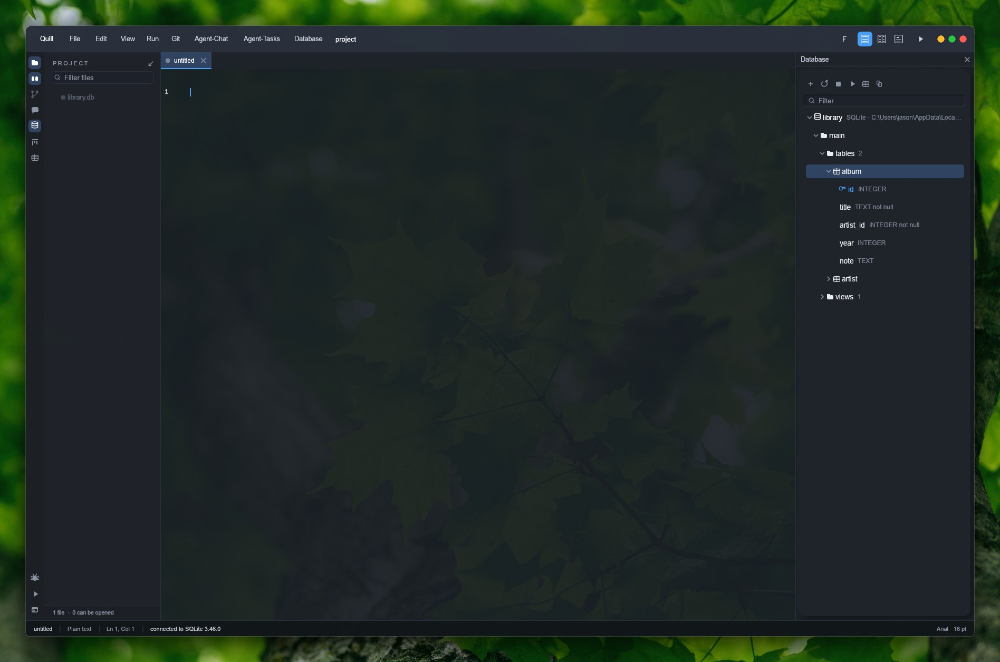
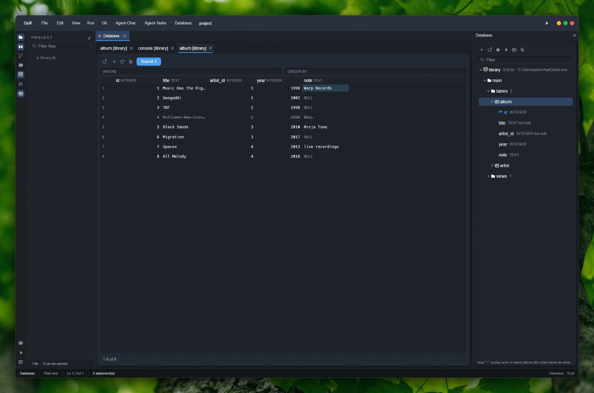
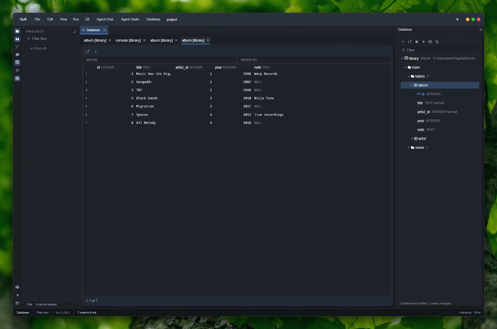
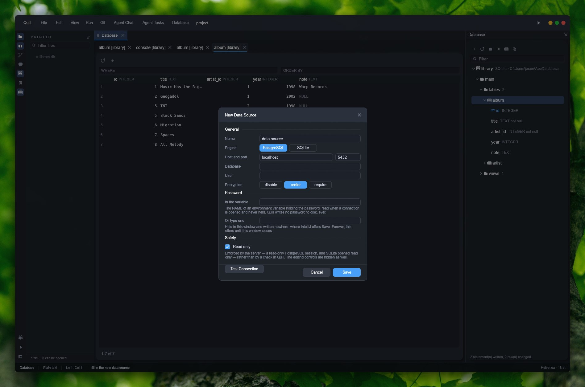
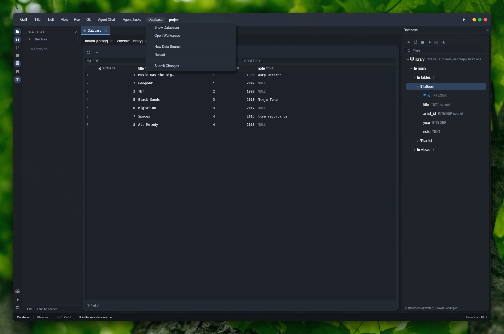

# The Database plugin

Nine captures of the Database plugin, taken from the real window the way `documentation/overview.md`'s
own pictures were — a photograph of `unluminate.exe` running, not a render. `task-1777` built the plugin;
this is what it looks like doing the things the reference editor's Database tool window does: showing what a
schema holds, running a query, editing rows, and writing the edits back.

`tasks/task-1777-database-plugin-tdd.md` is the design, and it is worth reading before this page:
which third of the reference editor's database tools were worth copying, why the client for PostgreSQL is written
inside Unluminate rather than shelled out to `psql`, and the one rule that decides whether a grid can be
edited at all — a row can only be changed if it can be addressed, by a primary key or a SQLite
`rowid`, and otherwise the grid is read only and says why.

The fixture behind every picture is a small SQLite library database — two tables, `artist` and
`album`, a foreign key between them, and a view — built for this page rather than pointed at anything
real. `library.db` is not part of the repository; how it was made is at the bottom of this page.

---

## The tree, and what is in a table

`Database` on the rail opens the pane docked to the right, the way the reference editor docks its own Database
tool window. A data source is a row; opened, it asks the server for its schemas, and a schema opens
into `tables`, `views`, `routines` and `sequences` — the order the reference editor's own tree uses, and a folder
with nothing in it is left out rather than drawn empty. A table opens into its columns, each with its
type, whether it is `not null`, and a key icon on the one that names the row.

Nothing here is a second reading of the schema: the tree, the grid and the console all ask the same
`unluminate-db` connection the same questions, so a column typed `not null` in the tree is the column an
`UPDATE` will refuse to leave blank.



## Opening a grid

A double click on a table — or the grid button in the pane's toolbar — opens it as a tab in the
workspace, with a `WHERE` and an `ORDER BY` field above the rows: two fragments of SQL rather than a
query builder, which is what a person who already knows SQL wants to type into. The footer says how
many rows are showing and pages through more, one more than the setting's row limit asked for, so
`1-200 of 200+` is honest about nobody having counted the rest.


## A console runs what you type

`Database -> Open Workspace`, or a console button in the pane, opens a query console: a plain text
field with SQL colouring — selection, undo, the clipboard, no folding, no gutter, because it is a
place to type a statement rather than a second copy of the editor. `Execute` runs whatever the caret
is in, and what comes back is a result panel below it, exactly as the reference editor's own console shows one
result a run.


## Editing rows is a pending change until you say so

Typing into a cell does not send anything. It is recorded as a pending change — the cell is
highlighted, a deleted row is struck through — and the toolbar's `Submit` button carries the count.
Nothing is sent until it is pressed, which is the reference editor's own arrangement and the right one: a grid is
somewhere people type continuously, and a statement per keystroke would be both slow and impossible to
back out of.

Here `note` has been typed over on the first row and the fourth row has been marked for deletion —
struck through rather than removed from the grid, so what is about to happen stays visible until it
happens.



`pending` reads back the *actual statements* a submit will send, not a summary of them — the same call
`Submit` itself makes, so the preview can never drift from what happens:

```
UPDATE "album" SET "note" = ?1 WHERE "id" = ?2      -- "Warp Records", "1"
DELETE FROM "album" WHERE "id" = ?1                 -- "4"
```

Every value is a bound parameter rather than text pasted into the statement, so a title with a quote
or a newline in it is a non-event rather than a broken query. Submit sends every pending change as
**one transaction**: all of it happens or none of it does, which is what stopped a `NOT NULL` column
on one pending insert from silently taking a delete and an update down with it while this page's own
pictures were being taken.



## The `CREATE` statement, on demand

The DDL button in a table's toolbar asks the server for the statement that made it and shows it in a
modal — not a dialog with fields for a name and a type, because changing a table's shape is a
statement you write, the same as everywhere else in this plugin. `Copy` puts it on the clipboard.


## Adding a data source, and what Unluminate will not do with a password

`+` in the pane, or `Database -> New Data Source`, opens the dialog a source is added from: PostgreSQL
or SQLite, the address, and — the part worth reading — where the password is. Unluminate never writes one
down. A source names the environment variable a password is read from at the moment a connection
opens, or a keychain entry on the platforms that have one; a password typed into this dialog is held
in the process and gone when the window closes, which is the reference editor's `Save: Forever` answered the other
way. **A new source is read only by default**, the opposite of the reference editor's own default and deliberate:
one added in a hurry points at something real, and clearing the tick box is far cheaper than the first
`UPDATE` nobody meant.



## Settings — the data sources you already have, in one place

`Settings -> Plugins -> Database` lists every data source, where it points, whether it is connected,
and where its password is — never the password. `Edit` reopens the same dialog above; `Remove` takes
one away. The row limit and the console's write confirmation live on the same page, because both are
about how much a mistake here can cost: the confirmation is a person's own dialog, and it is not asked
of a command, because an agent cannot press a button in a modal and a command that can never finish is
worse than no confirmation at all.


## The menu

`Database` joins Unluminate's own six menus, after `Agent-Tasks`: showing the pane, opening the workspace,
adding a source, reloading the tree, and submitting whatever is pending — the same five things the
rail button, the toolbar and `unluminate-cli plugins run database …` all reach, because a menu entry in
Unluminate needs nothing else to be run from the command line.



---

## The agent's half

Everything on this page has a command behind it: `unluminate-cli plugins run database <command>` —
`sources`, `add-source`, `password`, `connect`, `schemas`, `tables`, `columns`, `ddl`, `open`,
`console`, `query`, `state`, `result`, `page`, `filter`, `sort`, `set`, `add-row`, `delete-row`,
`pending`, `submit`, `read-only`, `confirm` — and `unluminate-cli plugins view database` answers the whole
pane as data. `query` does not wait, for the reason nothing that runs inside a frame does; `state`
says when it has finished and `result` has the rows. `unluminate-cli/docs/commands.md` is the full
reference.

```sh
unluminate-cli plugins run database add-source library C:\path\to\library.db
unluminate-cli plugins run database connect library
unluminate-cli plugins run database open album
unluminate-cli plugins run database set 1 note "Warp Records"
unluminate-cli plugins run database pending --json
unluminate-cli plugins run database submit
```

---

## How these were taken

Real captures of `unluminate.exe`, driven the way `documentation/overview.md`'s own pictures were: the
window put at a fixed rectangle, a settings folder of its own so the pictures carry a fixed opacity
and font rather than whatever is set on the machine taking them, and the screen copied rather than
rendered offscreen — which is what shows that the desktop really does show through a translucent
window with a data grid open in it. `_agent_output/task-1792-database-docs/capture.ps1` is the script.

What made this page different from `overview.md`'s is that most of what it shows is *state* —
which data source is connected, what a grid's pending changes are, what a console just ran — rather
than a fixed picture. So the state was built through `unluminate-cli`, the same command line
`unluminate-cli/docs/commands.md` documents, against a small SQLite fixture built for this page:

```sh
sqlite3 library.db <<'SQL'
CREATE TABLE artist (id INTEGER PRIMARY KEY, name TEXT NOT NULL, country TEXT);
CREATE TABLE album (
  id INTEGER PRIMARY KEY, title TEXT NOT NULL,
  artist_id INTEGER NOT NULL REFERENCES artist(id), year INTEGER, note TEXT
);
CREATE VIEW recent_albums AS
  SELECT album.title, artist.name AS artist, album.year FROM album
  JOIN artist ON artist.id = album.artist_id WHERE album.year >= 2000 ORDER BY album.year DESC;
-- eight albums by four artists followed
SQL
```

Each command left the window in a real state — a real connection, a real query, a real pending
edit — and the picture is of that state rather than of anything staged to look like it. `db-05` is the
same database `db-04` shows, submitted; the `NOT NULL` failure that a `DEFAULT VALUES` insert produced
the first time (an added row with nothing typed into it, against a column with no default) was real
too and is described rather than hidden, because it is what the transaction guarantee this page
already describes is for.
