# What Quill looks like

Twenty captures of Quill running on Windows, taken from the real window rather than rendered
offscreen, and cropped with a margin of desktop left round the edge. The margin is there on purpose:
Quill's background is translucent, and a picture cropped tight to the window cannot show that the
green in it is the desktop rather than a shade someone chose.

They were taken from `quill 0.1.0` after `task-1657`, on a 3840 by 2160 screen, with the window at
1800 by 1160. Nothing in them is a mock up; every one is a photograph of the program working.

`README.md` says what Quill is and how to run it. This file is the same ground covered in pictures.

---

## The window

A title bar Quill draws itself with the menus at the left and the window buttons at the right, a
strip holding the text options and the Markdown view modes, the file explorer down the left with a
filter box, a tab for each open file, the line numbers, the editing area, and a status bar naming the
file, its kind, the caret's position, the branch and the font.

The desktop is visible through the explorer, the editing area and the status bar, and every piece of
text on top of it is solid. That is the whole character of the product, and it is the first thing to
look at in any of these pictures.

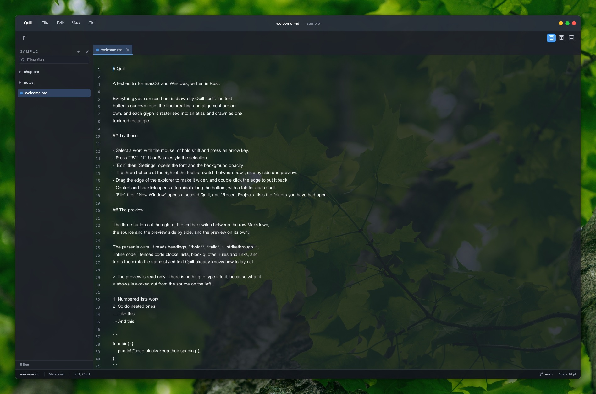

## The desktop shows through, and how far is a setting

`Settings -> Appearance -> Background` is one slider from 5 per cent to 100. At the bottom of its
range the window is nearly all desktop and the text still reads; at the top it is a solid dark
editor and only the margin round the window gives the wallpaper away. Text is painted at full
opacity at every setting, so turning the background down never makes the document harder to read.

It works on both platforms, but Windows takes three separate things to get there that macOS does not
need. All three are in `services/windows_transparency.rs`, and section 9.2 of
`tasks/quill-technical-design-document.md` records how each was measured.

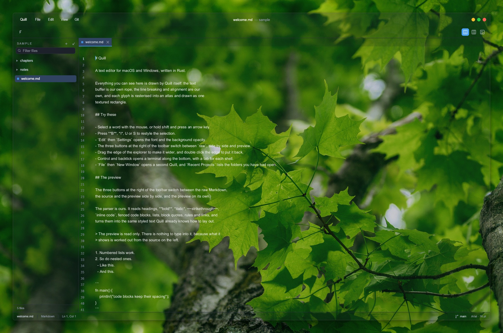

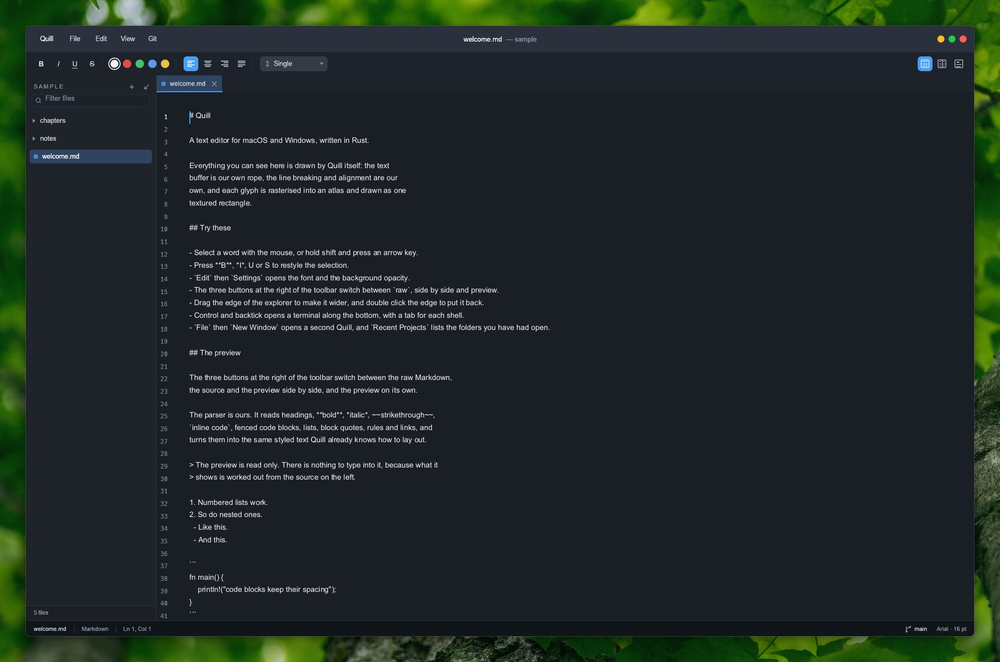

## The text options are behind one button

Bold, italic, underline and strikethrough, five colours, four alignments and three line spacings, all
behind the `F` at the left of the strip. They used to be spread along the whole width of the window,
which gave the top of the screen permanently to nine settings that are set rarely.

The panel is four named rows with a rule between what applies to the selected text and what applies
to the paragraph it is in. It stays open until the pointer goes elsewhere, so a colour and an
alignment are two clicks rather than two visits.

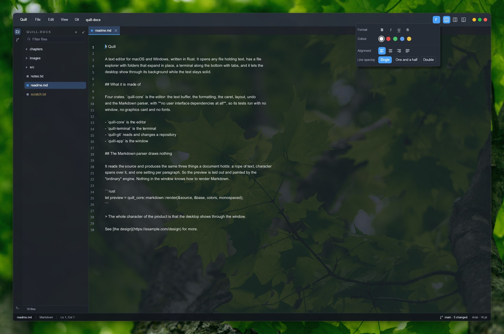

Below, the third line has been made bold and red from that panel, the heading under it centred and
the line after it italic. The dot on the tab and against the file in the explorer is how Quill says
there are changes that have not been saved.

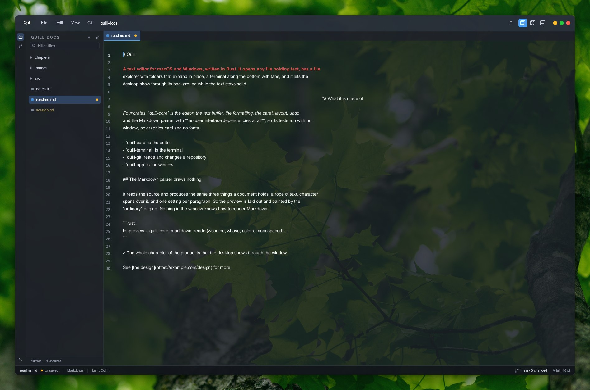

## Nothing is shown that does not apply to the file

The strip is drawn for prose — a `.md` file, a `.txt` file, a document that has not been saved
anywhere yet. Quill saves plain text and carries no formatting to disk, so above a `.rs` or a `.json`
file every one of those controls is a decoration that lasts until the file is reopened, and the three
view modes offer the Markdown parser's reading of a file that was never Markdown. So a source file
gets no strip at all, and the forty four points go to the text instead — which is the next picture.

The two questions are asked separately. A `.txt` file is prose, so it keeps the `F` button; it is not
Markdown, so it loses the view modes.

## Markdown, three ways

The three buttons at the right of the strip switch between the raw source, the source and the preview
side by side, and the preview on its own. The parser is ours and it draws nothing: it reads the
source and produces the same rope, character spans and paragraph settings any other document holds,
so the preview is laid out and painted by the ordinary engine. Nothing in the window knows how to
render Markdown.

The preview is read only, because what it shows is worked out from the source beside it.

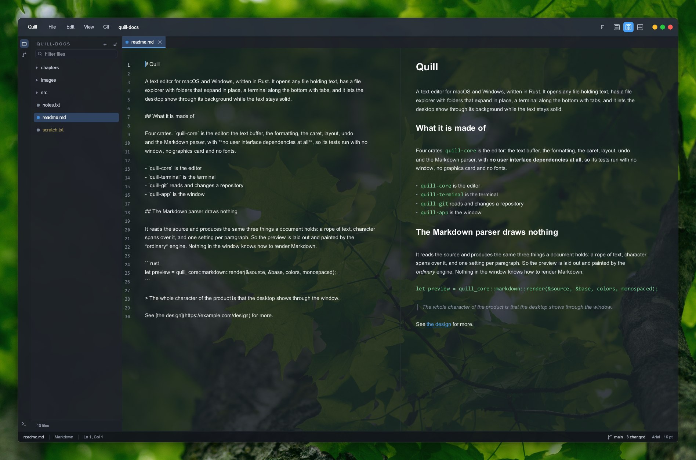

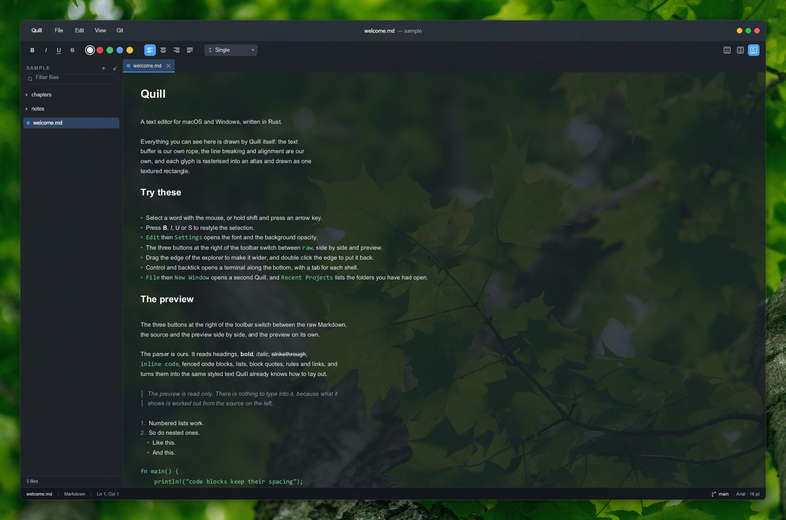

## Writing code in it

Line numbers down the left, a tab for each open file, syntax colouring from a plugin — and no strip
above any of it, because there is nothing in one that means anything for a Rust file. Quill wraps, so
a paragraph that runs over several rows on screen carries one number against its first row and
nothing against its continuations, which is what a line number means everywhere else.

A single click in the explorer opens a file in the tab a single click reuses, drawn faintly to say
so; a double click opens it in a tab of its own. The tab that is showing carries an accent line
along its bottom edge.

The colouring comes from the Rust plugin. A colour scheme colours the tokens and not the editing
area, so a coloured file still lets the desktop through — which is why the leaves are still visible
behind the code.

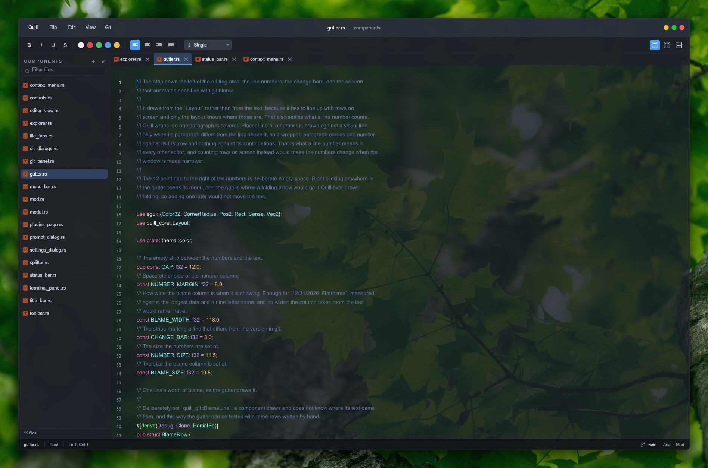

## The font is one setting for the whole window

`Settings -> Appearance -> Font` sets the family and the size the editor shows text in, the way
IntelliJ has one editor font. A change reaches every file that is open, not only the one showing,
and the preview with them. Setting it is not an edit: it pushes nothing onto the undo history and
does not mark any file as changed, because what Quill saves is plain text and carries no formatting.

The size is on the keyboard as well — command or control with plus and minus, and `Reset Font Size`
to put it back — and on a trackpad pinch, or the wheel with the same modifier held, over the editing
area. All of them change that one setting, so whichever is used the size is still there next time
Quill starts. `+` and `=` are one key on nearly every layout, so either does it, with or without
shift, and so does the keypad's `+`.

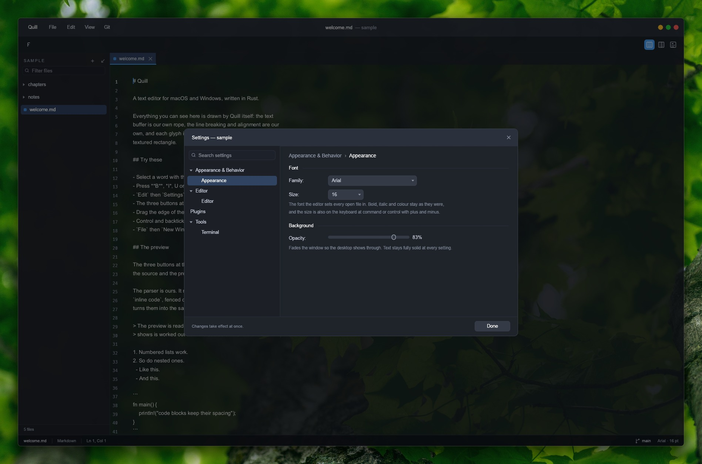

## The file explorer

Folders expand in place rather than replacing the list, so where a file sits stays visible. Each row
carries an icon for its kind, and files git knows something about are tinted by what it thinks of
them. The footer counts the files and how many of them can be opened. The filter box above the list
matches file names anywhere in the tree, not only the rows that happen to be showing.

The divider between the explorer and the editing area is dragged to resize it, and a double click on
the divider puts it back to its usual width. The split between the Markdown source and its preview
and the height of the terminal work the same way, through the same code, and where each was left is
written to the settings file so it is the same next time Quill starts.

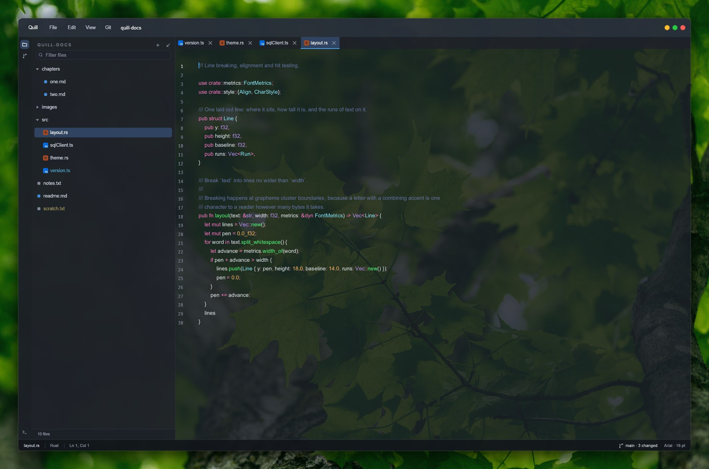

Right clicking a row opens a menu aimed at that row: a `New` submenu, cut, copy, copy path and
paste, rename, show the file in Explorer, reload it from disk, and a `Git` section that acts on that
file alone. Cut and paste go through Quill's own clipboard rather than the operating system's, and
pasting onto a name that is already taken adds a number rather than overwriting what is there.

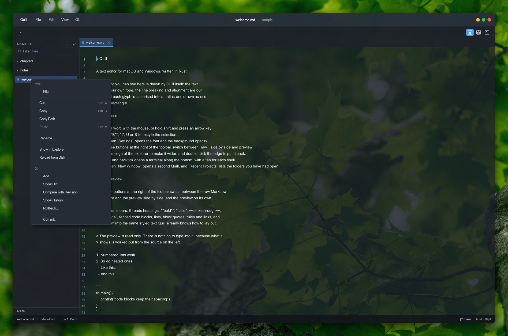

## The menus

`Quill`, `File`, `Edit`, `View` and `Git`. On macOS they are in the bar along the top of the screen,
where macOS puts menus; on Windows they are drawn at the left of Quill's own title bar and the three
window buttons move to the right hand end, where Windows puts them. Both bars are built from one
list, so they hold the same entries with the same shortcuts, and adding an entry adds it to both.

The `File` menu opens another window, opens a file or a folder, and lists the folders that have been
open before. Each window is its own process, so several Quills can run at once on different projects
and share nothing but the settings file.

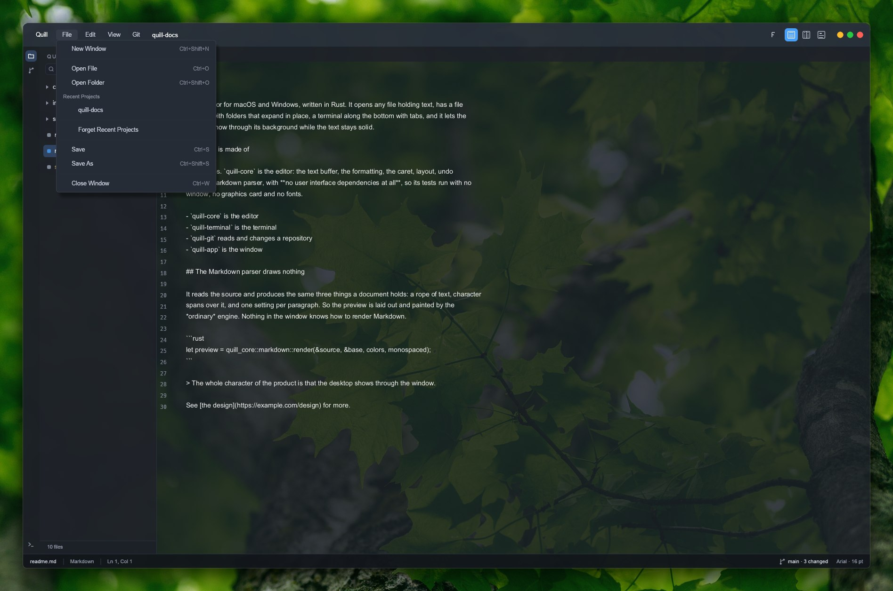

The `View` menu holds the three Markdown modes, the explorer, the line numbers, the editor's font
size, the file tabs and the terminal. The three modes are dimmed for a file there is nothing to
preview of, which is the same question the buttons on the strip are drawn from.

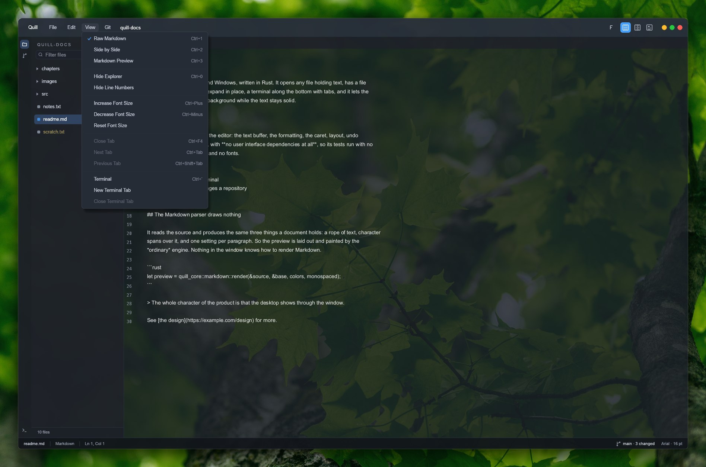

The `Git` menu is the whole of git: commit, add, diff, compare with a revision, history, blame,
rollback, push, pull, fetch, merge, rebase, branches, tags, reset, stash, remotes and clone. It is
dimmed when the folder is not in a repository, and it grows `Continue` and `Abort` while a merge or
a rebase has stopped on a conflict.

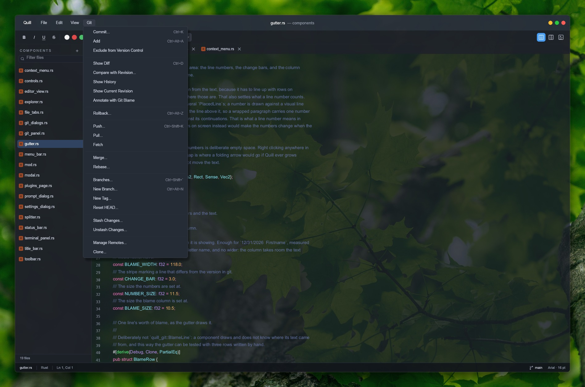

## The terminal

A tile along the bottom of the window with a tab for each shell, opened with control and backtick or
from the `View` menu. Each tab runs the shell in the folder the explorer is showing, and is named
after the title the program set. It handles colour including 24 bit colour, bold, italic, underline,
inverse and dim, wide characters, the alternate screen a full screen program draws on, ten thousand
lines of scrollback, selecting with the mouse, and mouse reporting for a program that asked for it.

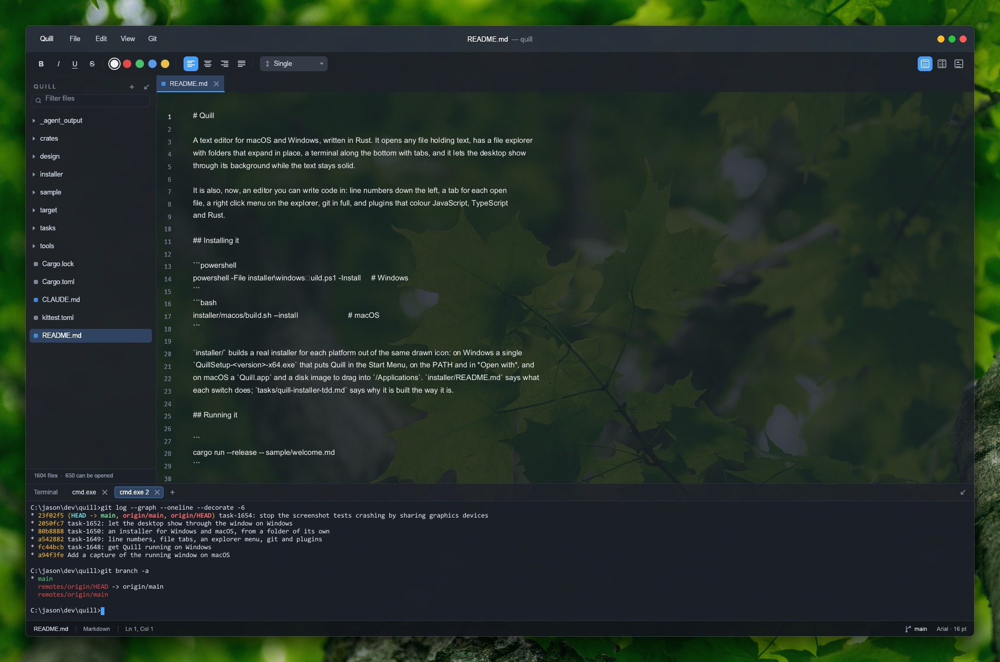

## Git

Quill runs the `git` program rather than binding a library. What matters is that the machine's own
git is already configured — a credential helper, an ssh agent, signing, hooks, an identity for this
repository in particular — and a push from Quill has to be the same push you get in a terminal.
Every command runs on a thread, one at a time, so the window never stops drawing to wait for one and
two commands cannot fight over `index.lock`. When something goes wrong, what the status bar shows is
git's own message, because a rejected push and a merge conflict explain themselves better than
anything Quill could say about them.

`Commit...` opens a panel with a changes tree, a tick box a file, the repository's row carrying its
branch, an `Unversioned Files` group, `Amend`, the counts, the message box with the last twenty
messages behind a button, and `COMMIT` and `COMMIT AND PUSH...`. Ticking a file stages it at once,
so Quill's idea of what is staged and git's cannot disagree while the panel is open.

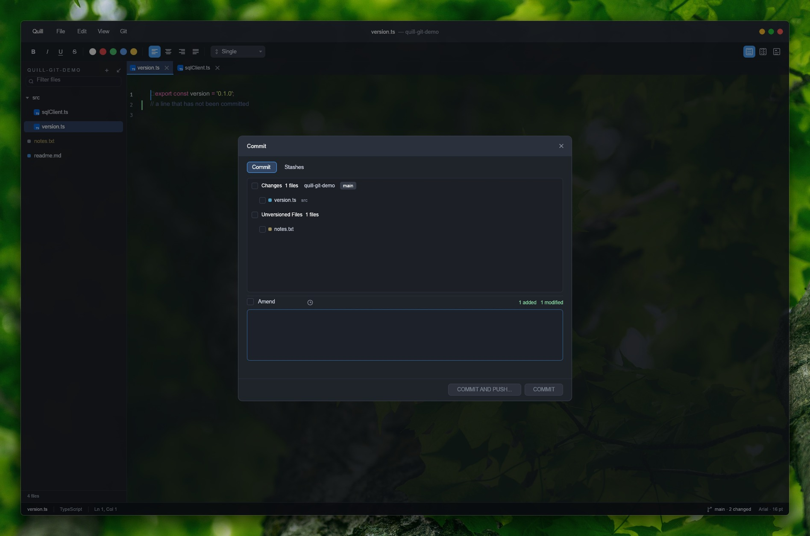

`Show History` lists the commits that touched the file, each with its hash, its message, its author
and its date, and marks the commit `HEAD` is sitting on when it is one of them.

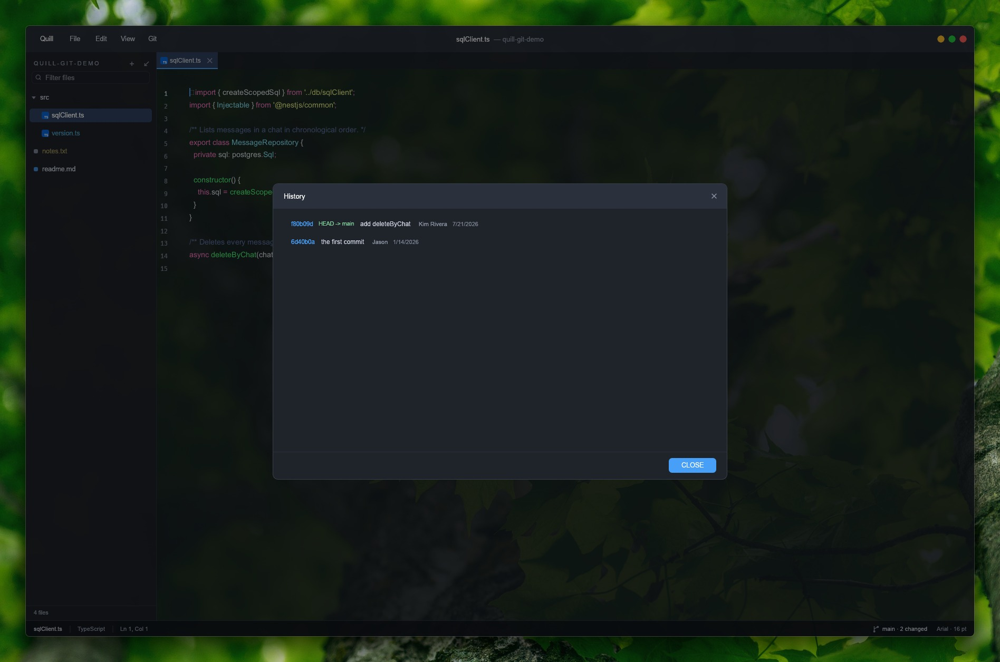

`Show Diff` shows git's own diff for the file against the version git has. The stripe in the gutter
beside the changed line in the editor behind it is the same information in the margin: a change bar
against each line that differs from the committed version.

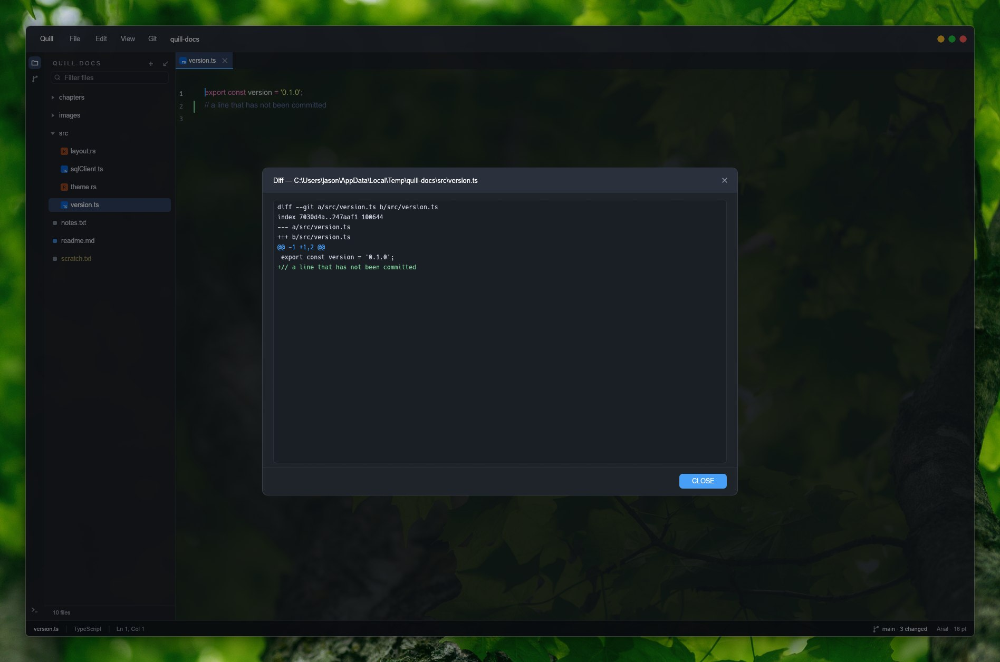

`Annotate with Git Blame` puts a column beside the line numbers with the date and author of the
commit each line came from, coloured by age: the oldest commit in the file green, the newest pink,
and everything between interpolated by rank. It is the fastest way to see that a file is three
authors' work and which part is new.

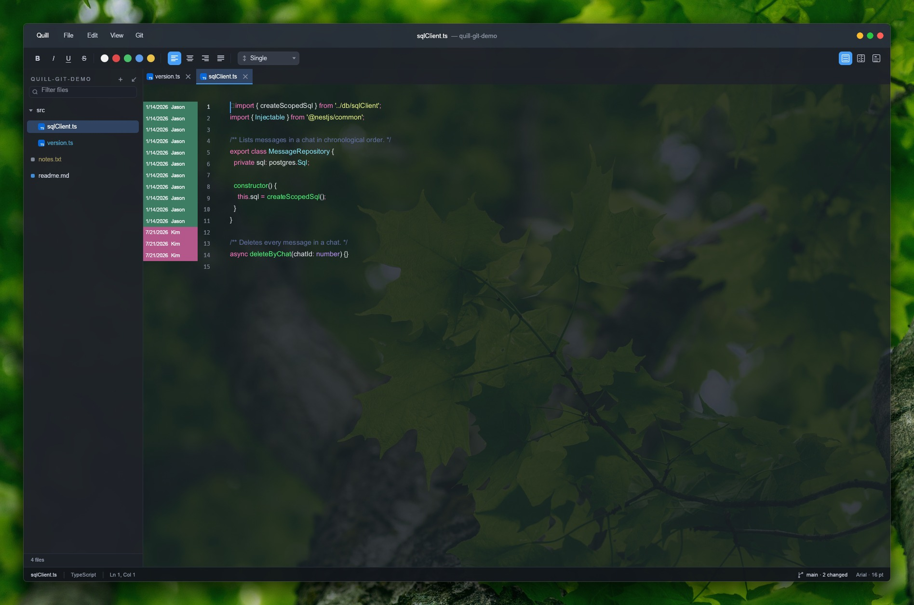

## Settings

`Edit -> Settings`, `Quill -> Settings`, or control and comma, opens a modal laid out like
IntelliJ's: the pages down the left under their headings, and the chosen page on the right. Changes
take effect as they are made, and are written to two plain text files that can be read and edited by
hand — `%APPDATA%\Quill` on Windows and `~/Library/Application Support/Quill` on macOS.

`Plugins` is the marketplace and what is installed. A plugin is a folder holding a `plugin.conf` and
an icon, in the same `name = value` format the settings file uses, and it describes a language: its
extensions, its keywords, what a comment and a string look like, and a colour per kind of token.
**Nothing in one is executed**, so installing one is copying a folder. Three ship with Quill —
JavaScript, TypeScript and Rust — and each page says plainly what its colouring does not handle.

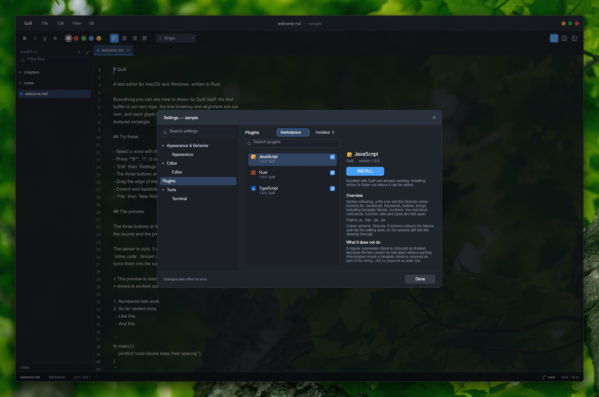

---

## How these were taken

They are captures of the screen, not renders. `crates/quill-app/tests/screenshots.rs` builds the
same window offscreen and writes a PNG for each of its tests, and those images are the right ones for
checking that a control moved or a colour changed; they cannot show that the operating system
honoured the window's transparency, because there is no desktop behind them.

So each of these was taken by starting the real `quill.exe`, putting the window at a fixed rectangle,
driving it with real mouse clicks and key presses, and copying the screen. The crop is the window's
rectangle grown by 48 pixels on every side, which is the margin of desktop you can see. The scripts
that do it are in `_agent_output/task-1657-screenshots/`, which is not tracked; the switches that
put Quill into a particular state without clicking — `--opacity`, `--view`, `--terminal` — are the
ones documented in `README.md`.

Three of the folders in the pictures are fixtures built under the temporary folder rather than the
real ones, and `_agent_output/task-1657-screenshots/SAMPLE.md` says how each is made. The reason is
the status bar: `sample/` lives inside Quill's own repository, so opening it where it lies makes the
picture say how many files happened to be uncommitted that day. A copy with one commit in it says
`main`, which is what a reader with a fresh checkout sees.

They are JPEGs rather than PNGs. Most of what is in each picture is a photograph showing through a
translucent window, which PNG stores badly: the same captures are several times the size as PNG at
no visible difference in the text at full size.
