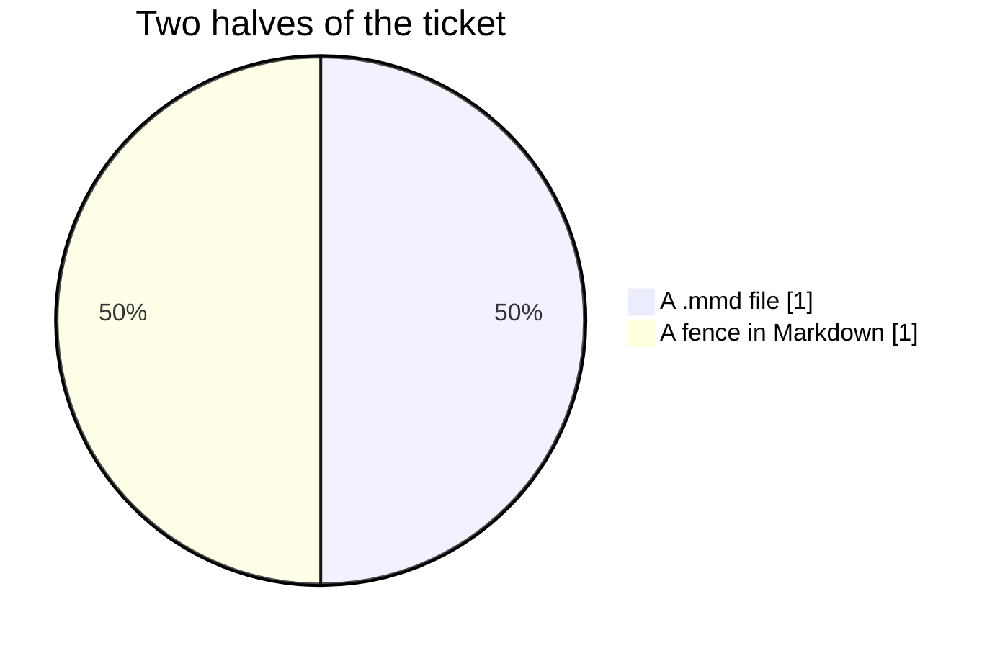

# Diagrams inside a document

A fence whose language is mermaid is drawn rather than shown as code, which is the other half of what
`task-1660` asks for. Everything round it is ordinary Markdown: **bold**, *italic*,
`inline code`, and a list.

- The fence is gathered whole rather than a line at a time.
- Its paragraph is left empty and the window paints into the room it reserved.
- A fence nobody has closed yet still draws what it has.


Two diagrams in one document are both found, in the order they appear.



And a fence that is **not** mermaid is still shown as code, which it always was:

```rust
fn main() {
    println!("still code");
}
```

A diagram that will not parse keeps its room and says which line went wrong, rather than taking the
rest of the document away with it:

```mermaid
flowchart LR
  A --> B
  C[never closed --> D
```

That is the last of it.
