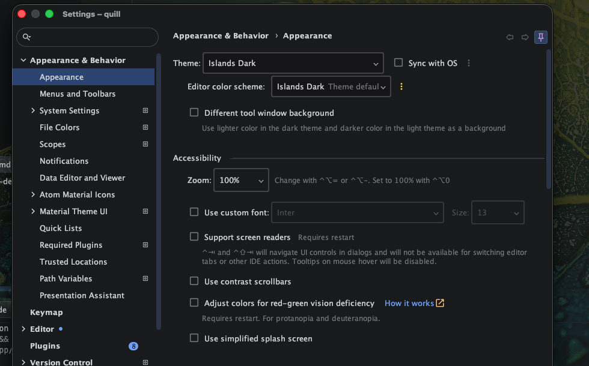
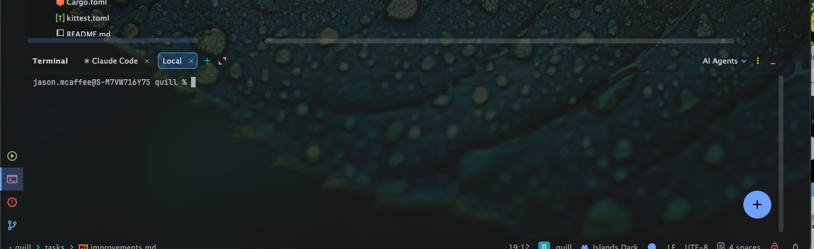

# Move font Options to Quill -> Settings -> Appearance -> Font
The font top bar section should be moved to Edit -> Settings that opens a modal.
It's layout and style should be like the main window, with settings options on the left, similar to Intellij's :

We don't need undo/redo buttons, it should just be Ctrl/CMD+Z, CMD+SHIFT+Z, etc.

Background opacity should be moved to Edit -> Settings -> Appearance -> Background.

# File types
If we don't handle a certain text file type, just as js, rs, etc, default open with text file view, like a txt file would be.

# Left Pane
The left pane should be adjustable width so i can drag to resize.
This goes for any panes in the project, so ensure that future agents understand that.

# Open multiple instances
I should be able to have multiple instances of Quill open, each with their own project opened, similar to Intellij.

I should be able to click File -> Recent Projects and see a list of recent project's I've had open.

# Terminal 
I want a terminal bottom tile, with multiple tabs, similar to Intellij.
This needs extensive online research, and extensive testing, and a separate tasks quill-terminal-tdd.md technical design document.
We need lots of visual and functional testing to ensure that our terminal behaves exactly like a native terminal would.
Verify `claude` and `codex` format perfectly in it.
Verify that resizing paints correctly.

# Menu Items
On mac, menu items belong in the top bar, not in the application window.

# Quill label
That belongs at the very left of the top bar, so its Quill, File
# Code Layout
Make sure that our code is appropriately broken up, with separation of concerns, sub folders for components, functionality, services, etc.
