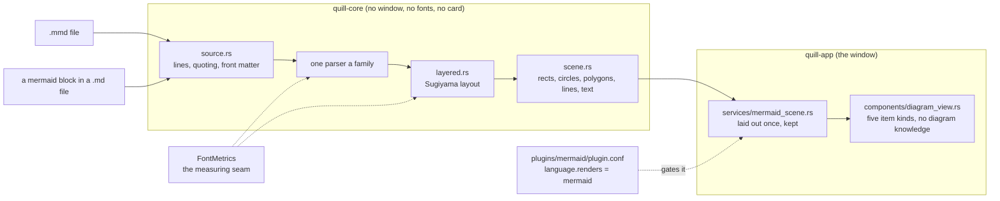
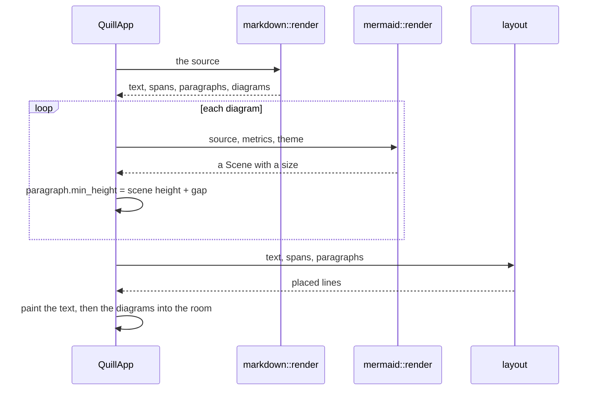

# Mermaid in Quill

`task-1660` asks for three things:

- a `.mmd` file opens as a **drawn diagram**, with the same raw / side by side / preview toggle a
  `.md` file has;
- a ` ```mermaid ` block inside a Markdown file is **drawn in the Markdown preview** rather than
  shown as code;
- it arrives as a **plugin**, so it can be switched off.

This document records what Mermaid is, the four ways of drawing it that were weighed, the one that
was chosen and why, what each diagram type becomes on the screen, and what is deliberately refused.

Every diagram in this document is written in Mermaid, and every one of them is also a fixture: they
are the first things Quill's own renderer is pointed at, so a document about drawing Mermaid is
checked by the thing it describes.

## Where the work goes



## The two passes a diagram in Markdown takes

A diagram's height depends on how wide the pane is, and `quill-core` has no pane. This is the same
shape `task-1659` used for pictures, and it is reused rather than reinvented.



## Goals, and how each one is measured

| Goal | How it is measured, not asserted |
|---|---|
| A `.mmd` file opens as a drawn diagram | A screenshot test per diagram type, rendered through the real window and the graphics card, looked at before it is accepted. |
| It has the same raw / side by side / preview toggle a `.md` file has | The three buttons are found **by name** on a `.mmd` file, each switches the mode, and `quill-cli editor view side` does the same thing from a script. |
| A mermaid block is drawn in the Markdown preview | A preview of a document with three diagrams in it places three scenes, and the paragraphs they stand in for are as tall as the scenes. |
| It is a plugin | Switching the Mermaid plugin off in `Plugins` withdraws the diagram from both places, in the same frame. |
| The pictures are right | Four properties asserted for **every** diagram type (§11): nothing outside the scene, no two node rectangles overlapping, every edge touching both its ends, every label present exactly once. |
| The pictures are stable | Laying the same source out twice gives a byte-identical scene. Without this the screenshot tests are noise. |

**Non-goals**, stated so that nobody has to guess at review:

- **Not pixel-identical to `mermaid.js`.** §2.4 says what is given up and why. The bar is correct and
  readable.
- **Not all thirty diagram types.** Twenty are drawn; the other ten are *named* rather than
  mis-drawn (§7), and that distinction is itself tested.
- **Not a control surface.** `click`, `href` and callbacks are read and ignored (§13).
- **Not a second theme.** A document does not get to choose the window's colours (§13).
- **Not a network client.** There is no path through any of this that opens a socket. This is the one
  security property that matters here, and it is a property of the design rather than of a setting:
  nothing in `quill-core` can make a request, and the app never hands a diagram's text to anything
  but its own painter.

## Risks, and what answers each

| Risk | What answers it |
|---|---|
| A layout that loops or explodes on a pathological graph | Every sweep count and every iteration in `layered.rs` is a **fixed** number, so the layout is O(n) passes whatever the input. A parse that produces more than a few thousand nodes is refused with a `Problem` rather than laid out. |
| A diagram in a preview redrawn sixty times a second | Laid out once and kept in `services::mermaid_scene`, keyed by the source text, exactly as a decoded picture is. |
| The screenshot baselines churn on every layout tweak | They should — that is what they are for. The four shared properties are what catch a *wrong* layout; the images catch a *changed* one, and a person looks at the image before accepting it. |
| Mermaid's syntax moves under us | The parsers are permissive: an unknown statement inside a known diagram is skipped rather than fatal, so a file using a newer flowchart feature still draws the parts Quill understands. |

---

## 1. What Mermaid is

Mermaid is a text format for diagrams. A block of lines says what the diagram *means* — these nodes,
these edges, this order — and the renderer decides where everything goes. It is the format GitHub,
GitLab, Obsidian, Notion and every AI assistant now emit when asked for a diagram, which is why a
`.md` file in this repository already has them in it.

The reference implementation is `mermaid.js`, a JavaScript library that parses the text, lays it out
(with `dagre` for the graph-shaped diagrams), and writes SVG into a browser's DOM. Version 11 lists
**thirty** diagram types, though the list is long-tailed: flowcharts, sequence diagrams, class
diagrams, state diagrams and ER diagrams are the overwhelming majority of what is written.

Two properties of the format matter for what follows:

**It is line-oriented.** Almost every diagram type is one statement per line, and the statements are
short. `A --> B`, `Alice ->> Bob: Hello`, `"Dogs" : 386`. There is no nesting to speak of outside
`subgraph`/`end` and the brace blocks, and no expression grammar at all. A parser for it is a matter
of care rather than of cleverness.

**The layout is the hard part.** Where a flowchart's boxes go is a layered graph drawing problem, not
a parsing problem. That is the work, and it is the same work whatever language it is written in.

---

## 2. Four ways to draw it, and why Quill writes its own

### 2.1 Shell out to `mermaid-cli`

`@mermaid-js/mermaid-cli` renders a `.mmd` file to SVG or PNG. It is the official tool and its
pictures are by definition correct.

Rejected. It needs Node.js and a Puppeteer-controlled headless Chromium on the machine — several
hundred megabytes that Quill does not otherwise need, that the installer would have to acquire, and
that a person who installed a text editor did not agree to. It also spawns a **browser** to draw a
picture in a preview pane, and a browser is a program that makes network requests. `task-1659` was
careful that the Markdown preview can never fetch anything; handing the same document to Chromium
gives that away in one step. And it is slow enough to be felt: a process launch and a page load per
diagram, against a preview that is worked out again on every keystroke.

### 2.2 Embed a JavaScript engine and run `mermaid.js`

`boa` or a QuickJS binding could run the real library, which would make the pictures exactly right.

Rejected. `mermaid.js` does not merely compute — it *builds a document*. It calls
`document.createElementNS`, appends SVG elements, and then asks the browser `getBBox()` for the size
of every label it has just inserted, because that is how it finds out how big a box has to be. So
embedding it means implementing enough of the DOM, of SVG, and of CSS layout to answer `getBBox`
truthfully for arbitrary text — which is a larger project than the renderer, and one whose failures
would be silent and strange rather than obvious.

### 2.3 Embed a web view

`wry` would put a real browser engine in the window and let it render the SVG.

Rejected, and for Quill more firmly than for most applications. The whole character of this window is
that it has no operating system frame, rounded corners, and the desktop showing through it —
`services/windows_transparency.rs` exists because getting that right on Windows took three separate
fixes. Putting a second rendering engine with its own compositing behaviour inside that window is
asking for the transparency to come back as a bug report. It is also a second thing to install, a
second thing to keep up to date, and a different one on each platform.

### 2.4 Write the renderer in Rust

Chosen.

The argument is the same one `quill_core::markdown` already made, and it is worth restating because
it is the reason this fits at all. **Quill is not short of a way to draw.** It has a layout engine, a
painter, real fonts and a font metrics seam. What a diagram needs on top of that is arithmetic:
work out where the boxes go, then hand back rectangles, polygons, lines and pieces of text. That is
a self-contained problem with no dependencies, it is testable with no window, and it runs in
microseconds rather than in process launches.

**What is given up, said plainly.** The pictures will not be pixel-identical to `mermaid.js`. Edge
curves are polylines rather than splines, the fonts are Quill's, the colours are Quill's palette
rather than Mermaid's default theme, and where two layouts are both reasonable Quill may choose the
other one. The bar this is held to is not "identical" — it is **correct and readable**: the right
nodes, the right edges in the right direction, the right labels, nothing overlapping, and nothing
running off the edge.

---

## 3. Where the code lives

The crate boundary in `CLAUDE.md` decides this, and it decides it cleanly.

| Where | What |
|---|---|
| `quill-core/src/mermaid/` | Reading the source and working out where everything goes. No user interface dependency; measured through `FontMetrics`; tested with `FixedMetrics`, so the expected numbers are arithmetic a reader can check and are the same on every machine. |
| `quill-app/src/components/diagram_view.rs` | Painting a laid-out diagram, and the scrolling and zooming over it. |
| `quill-app/src/services/mermaid_scene.rs` | Keeping a laid-out diagram between frames, so a preview redrawn sixty times a second lays a diagram out once. |
| `quill-app/plugins/mermaid/` | The plugin: the manifest, the grammar for colouring `.mmd` source, the colour scheme and the icon. |

`quill-core::mermaid` is laid out as one file for the shared parts and one for each family of
diagram:

```
mermaid/
  mod.rs          the public API, the kinds, and the errors
  source.rs       reading lines: frontmatter, directives, comments, indentation, quoting
  text.rs         measuring and wrapping a label through FontMetrics
  scene.rs        what comes out: rectangles, polygons, lines, circles and text
  theme.rs        the colours, given by whoever is drawing
  layered.rs      the layered graph layout, shared by five diagram types
  flowchart.rs  sequence.rs  class.rs  state.rs  er.rs  requirement.rs
  pie.rs  gantt.rs  journey.rs  gitgraph.rs  mindmap.rs  timeline.rs
  quadrant.rs  xychart.rs  sankey.rs  block.rs  packet.rs  kanban.rs
  radar.rs  treemap.rs
```

---

## 4. What comes out: the scene

`quill-core` cannot name an `egui` type, and it should not want to: what a diagram is, once it has
been laid out, is a list of shapes at absolute positions. So the output is a `Scene`:

```rust
pub struct Scene { pub size: Size, pub items: Vec<Item> }

pub enum Item {
    Rect    { rect: Rect, radius: f32, fill: Option<Paint>, stroke: Option<Stroke> },
    Circle  { centre: Point, radius: f32, fill: Option<Paint>, stroke: Option<Stroke> },
    Polygon { points: Vec<Point>, fill: Option<Paint>, stroke: Option<Stroke> },
    Line    { points: Vec<Point>, stroke: Stroke, dash: Dash },
    Text    { at: Point, text: String, style: TextStyle, anchor: Anchor },
}
```

Five kinds and nothing else, which is the point: everything else is built out of them in
`quill-core` where it can be tested. An arrowhead is a filled `Polygon` of three points. A pie slice
is a `Polygon` whose arc has been flattened into segments. A crow's foot is three `Line`s. A dashed
relationship is a `Line` with a `Dash`. The painter in `quill-app` is then about a hundred lines with
no diagram knowledge in it at all, which means a diagram type added later needs no change there.

`Paint` is a colour and an alpha. `quill_core::style::Color` has no alpha, deliberately — text in
Quill is always opaque — and diagrams do want a wash behind a subgraph, so `Paint` carries its own
rather than changing that decision for everyone.

**Coordinates are in points, with the origin at the top left of the diagram**, and the scene's `size`
is how big the whole thing is. Whoever draws it decides where to put that origin and whether to scale
it; nothing in the scene knows about a pane.

---

## 5. Reading the source

`source.rs` is what every diagram type reads through, so that the things that are true of all of
them are true in one place:

- **YAML front matter** — a `---` block at the top. Skipped, except `title:`, which becomes the
  diagram's title. Mermaid also carries `config:` there; Quill has one theme and ignores it.
- **Directives** — `%%{init: {...}}%%`. Skipped. Same reason.
- **Comments** — a line whose first non-blank characters are `%%`. Skipped.
- **Accessibility** — `accTitle:` and `accDescr:`. `accTitle` becomes the title if there is none.
- **Blank lines** — skipped, except in the two places they mean something (`sankey` allows them
  between rows, `packet` does not care).
- **Indentation** — kept, as a count of columns with a tab worth four, because `mindmap`, `treemap`
  and `kanban` are indentation-structured. Mermaid's own rule is that only the *comparison* with the
  previous line matters, not the absolute amount, and that is the rule used here.
- **Quoting** — `"..."` round a label, `#35;`-style entity codes, and `<br>` / `<br/>` as a forced
  line break. One function, so every diagram type agrees about what a label is.

The first non-blank, non-comment line names the diagram. That word is matched case-insensitively
against the known kinds, and everything after it on the line is kept, because several kinds carry
their options there (`flowchart LR`, `gitGraph TB:`, `pie showData title Pets`).

### 5.1 When it will not parse

A `Problem` carries the line number, the line itself, and what was wrong with it. It is drawn as a
panel in place of the diagram — the same idea as the alt text a picture falls back to. Mermaid's own
error box says only that there was a syntax error; saying *which line* is more use to somebody
writing one.

A diagram type Quill has no renderer for is not an error, and is not drawn as a broken diagram
either. It is a panel naming the type — `Quill does not draw a wardley diagram yet` — above the
source, so the file is still readable. That distinction is tested: a `c4Diagram` must be *named*,
not mis-parsed as something else and drawn wrongly.

---

## 6. Laying out a graph

Five diagram types — flowchart, class, state, ER and requirement — are the same problem underneath:
a directed graph of boxes with labelled edges, drawn in a direction. `layered.rs` does it once,
following Sugiyama's method, which is what `dagre` does and so what Mermaid's own pictures look like.

1. **Break the cycles.** A depth-first walk; an edge that points back at a node already on the stack
   is reversed for the purpose of layering and remembered, so it is drawn with its real direction.
2. **Rank.** Longest path from the sources. A node sits one rank below the lowest of its parents.
3. **Fill in the gaps.** An edge spanning more than one rank gets a chain of dummy nodes, one a rank.
   Those dummies are what the edge is later routed through, which is what keeps a long edge from
   cutting across a box.
4. **Order within a rank.** Start with the order the nodes were declared in, then sweep down and up a
   fixed number of times moving each node to the median position of its neighbours, keeping a sweep
   only when it reduces the number of crossings. **A fixed number of sweeps, and no randomness**, so
   the same source always produces the same picture — which is what makes a screenshot test of a
   diagram possible at all.
5. **Place.** Rank position along the flow direction, from the tallest node in each rank plus a gap.
   Across the flow, each node is pulled towards the median of its neighbours and then pushed apart
   until nothing overlaps; a dummy node is treated as a zero-width node, so an edge passing a rank
   takes a lane of its own rather than a box's width.
6. **Route.** A polyline from the source's border, through the dummy positions, to the target's
   border, clipped against each end's own shape. The label sits at the middle segment.

`direction TB` / `BT` / `LR` / `RL` is applied at the end by transposing and flipping, so the whole
of the above is written once for top-to-bottom.

**Subgraphs** are laid out by ranking their members together and then drawing a frame round the
result with the title in the top left. A subgraph whose members would be split across the diagram is
not repaired — Mermaid does not repair it either, and pretending to would mean a second layout pass
with no clear rule.

---

## 7. What each diagram type becomes

Twenty are drawn. The table says what each one is on the screen, since that is the thing a reader
wants to know and it is not always obvious from the name.

| Keyword | Drawn as |
|---|---|
| `flowchart`, `graph` | Boxes in the fourteen shapes, edges in the six styles with labels, subgraph frames. Layered layout (§6). |
| `sequenceDiagram` | A column per participant with a lifeline, a row per message, activation bars, notes, and framed blocks for `loop` / `alt` / `opt` / `par` / `critical` / `break` / `rect`. |
| `classDiagram` | A three-compartment box a class — name with any `<<annotation>>`, attributes, methods — with the eight relationship arrowheads, cardinalities and labels. Layered layout. |
| `stateDiagram`, `stateDiagram-v2` | Rounded states, a filled circle for the start and a ringed one for the end, composite states as frames, choice as a diamond, fork and join as bars. Layered layout. |
| `erDiagram` | An entity as a titled table of attributes, joined by lines whose ends carry the crow's-foot, bar and circle markers, solid for identifying and dashed for not. Layered layout. |
| `requirementDiagram` | A two-compartment box per requirement or element, with the seven relationship kinds as dashed labelled arrows. Layered layout. |
| `pie` | Slices, clockwise from twelve o'clock in declaration order, with a legend down the right and the percentage — or the value with `showData` — on each slice. |
| `gantt` | Sections down the left, a date axis across the top, and a bar per task, with `done`, `active` and `crit` shaded differently and a milestone drawn as a diamond. `after` and `until` are resolved before anything is placed. |
| `journey` | Sections as a band across the top, a task under each, the score as a face-height mark on a five-point scale, and the actors listed under the task. |
| `gitGraph` | A lane per branch, a circle per commit along it, merge lines curving between lanes, tags as flags, and `HIGHLIGHT` / `REVERSE` commits drawn as Mermaid draws them. |
| `mindmap` | A tree growing to the right from the root, with the six node shapes, laid out so that a subtree occupies exactly the height its leaves need. |
| `timeline` | A horizontal axis with a period below it and that period's events stacked under it, coloured by section. |
| `quadrantChart` | Four quadrants with their labels, axis titles at both ends of both axes, and a labelled point per row. |
| `xychart`, `xychart-beta` | Axes with ticks and labels, bars and lines over a shared scale, horizontal as well as vertical. |
| `sankey`, `sankey-beta` | Nodes in columns by depth, sized by the flow through them, joined by ribbons whose width is the value. |
| `block`, `block-beta` | A grid of `columns N`, blocks spanning columns, nested blocks as frames, arrows between them. |
| `packet`, `packet-beta` | A grid thirty two bits wide with a labelled field per range, and the bit numbers along the top. |
| `kanban` | A column per list, a card per item, with the assignee, ticket and priority shown on the card. |
| `radar`, `radar-beta` | A polygon graticule with an axis per label and a closed curve per series, with a legend. |
| `treemap`, `treemap-beta` | Squarified rectangles, sized by value and nested by section, with the labels laid inside them. |

Ten are **named and not drawn**: `c4Diagram`, `zenuml`, `architecture`, `swimlanes`,
`eventModeling`, `venn`, `ishikawa`, `wardley`, `cynefin`, `treeView`. Each is either a large grammar
of its own serving a narrow audience, or is new enough that its syntax is still moving. Naming them
is the honest answer, and it is what makes adding one later a small change rather than a discovery.

---

## 8. A `.mmd` file in the window

`services::file_kind` learns two extensions, `mmd` and `mermaid`, and one new answer:
`preview_applies` becomes true for them. That is the whole of what makes the three view mode buttons
appear, because everything else already asks that one function — the buttons, the `View` menu, the
keyboard's command-1/2/3, and `quill-cli editor view`.

Two adjustments follow from it.

**The tools are drawn for a file that has a preview even when it has no formatting.**
`components::text_tools::applies` was `file_kind::formatting_applies`, which is prose only. A `.mmd`
file is not prose — bold and a line spacing mean nothing in it, so the `F` button must not be there —
but it does have a preview. So `applies` becomes "either", and the `F` is drawn only when formatting
applies. A control that cannot apply is absent, which is the rule the window already keeps.

**The buttons say what they are showing.** `ViewMode::label` takes the kind of preview, so a `.md`
file's buttons keep the exact words they have — `Raw Markdown`, `Side by side`, `Markdown preview` —
and a `.mmd` file's read `Raw Mermaid`, `Side by side`, `Mermaid diagram`. Two files never have their
buttons on the screen at once, so `Side by side` naming both is not two controls sharing a name.

The `Preview` mode draws the diagram filling the pane; `SideBySide` puts the source on the left and
the diagram on the right, over the same draggable splitter the Markdown preview uses, so it is the
same divider with the same double-click reset.

### 8.1 Moving about in a diagram

A diagram is not text and does not scroll like text. It is drawn **fit to the pane** when it is
larger than the pane and at its own size when it is smaller — never blown up, which is what `fit`
means everywhere else in Quill and what `services::picture` already decided for a picture in a tab.
The wheel scrolls it, a pinch or the zoom modifier scales it, and a drag moves it, all through the
same gestures `components::picture_view` uses, because a diagram and a picture are the same kind of
thing to a reader.

---

## 9. A mermaid block in a Markdown file

This is the two-pass pattern `task-1659` established for pictures, and it works here for exactly the
same reason: `quill-core::markdown` cannot know how wide the pane is, and until it knows that it
cannot know how tall a diagram will be.

1. `markdown::render` sees a ` ```mermaid ` fence, and instead of emitting the code it emits an
   **empty paragraph** and an entry in `Preview::diagrams` holding the paragraph number and the
   source between the fences.
2. The window lays each diagram out at the width of the preview pane, asks that paragraph to be at
   least as tall as the diagram through `ParagraphStyle::min_height`, and only then lays the preview
   out.
3. The diagrams are painted into the room their paragraphs were given, after the text, exactly as the
   pictures are.

So `Preview::diagrams` sits beside `Preview::images` and is the same shape. Nothing about the layout
engine changes: it still knows only about glyphs and about a paragraph that has asked to be tall.

A block that will not parse falls back to being **shown as code**, which is what it was before and
what every other Markdown renderer does with a fence it cannot handle. Losing the text would be worse
than not drawing the picture.

---

## 10. The plugin

`task-1660` asks for a plugin, and `CLAUDE.md` says `plugin.kind` is a seam that must not be widened
quietly. Both are satisfied without widening it.

A Mermaid plugin is a `language` plugin, because Mermaid *is* a language: it has keywords, comments,
strings and a file extension, and colouring `.mmd` source is worth having on its own. So
`plugins/mermaid/plugin.conf` is an ordinary manifest — `language.extensions = .mmd, .mermaid`,
the diagram keywords and the statement keywords as `language.keywords` and `language.builtins`,
`language.line_comment = %%`, and a colour scheme.

It carries one new key:

```
language.renders = mermaid
```

`language.renders` names a renderer that is **built into Quill**. It is read, checked against the
list of renderers this version has, and refused with a message if it names one Quill does not know —
the same rule `plugin.kind` keeps. Nothing is executed and nothing is loaded from the plugin: the
manifest is data saying "files of this language have a picture, and this is which picture", and the
code that draws it shipped with the binary.

This is what makes it a plugin rather than a feature with a plugin painted on it. Switching the
Mermaid plugin off in `Plugins` stops `.mmd` files offering a diagram and leaves ` ```mermaid ` blocks
in Markdown as code, immediately, because both ask the registry rather than asking the extension.

The icon is generated rather than drawn by hand, as the other three bundled plugins' icons were, and
is written down in §12 so it can be made again.

---

## 11. Testing

Four layers, matching the four the repository already has.

**`quill-core`, with no window.** The bulk of it. Every diagram type has a parse test asserting on
the model — the right nodes with the right shapes, the right edges in the right direction with the
right labels — and a layout test asserting on the scene through `FixedMetrics`, where every number is
arithmetic. The properties asserted for every type are the same four, so a type added later inherits
the list:

1. Nothing is placed outside the scene's own `size`.
2. No two node rectangles overlap.
3. Every edge starts on its source's border and ends on its target's.
4. Every label the source contained appears in the scene exactly once.

Those four are written as one function each type is run through, so they cannot be forgotten. There
is a fifth for the whole module: **laying the same source out twice produces exactly the same
scene**, which is what the screenshot tests depend on.

**`quill-app`, with no window.** The plugin manifest parses and claims `.mmd`; `language.renders` is
refused when it names a renderer that does not exist; `file_kind` answers the two new questions;
switching the plugin off withdraws the diagram.

**Screenshot tests.** One per diagram type, rendered through the real window and the graphics card,
plus the three view modes on a `.mmd` file, a Markdown file with diagrams in its preview, a diagram
that will not parse, and a diagram type that is named rather than drawn. **The images are looked at**
before any of them is accepted, which is the only way to find out that an arrowhead is pointing the
wrong way.

**The real application.** `cargo run --release` on a folder of samples, one file per diagram type,
which is also what a person uses to check a change to the layout by eye.

The sample files live in `sample-diagrams/`, one per diagram type, and are what both the screenshot
tests and a person read. Written once, so the picture in a test and the picture on the screen come
from the same source.

They are **not** in `sample/`, and that is worth a line. `sample/` is the folder
`design/intial-design-screenshot.png` shows and `the_window_matches_the_design` compares against, so
dropping twenty-one files into the explorer changed that picture. `design/` holds intent and is not
edited to suit a new feature, so the diagrams went somewhere of their own.

`cargo run --example mermaid_check` lays every sample out and prints its type, its size and how many
things are in it — or the line a refusal was on. It measures through the fixed width stub rather than
through real fonts, so it needs no window and finishes in milliseconds, which makes it the first
thing to run after a change to the layout, before going to the trouble of rendering the screenshots.

## 11.1 What the pictures caught that the assertions did not

This is the argument for the third layer, so it is written down rather than left as a claim. Every
one of these passed all four shared properties and every parse test, and every one was obvious the
moment the image was opened.

| What was wrong | Why no assertion could have caught it |
|---|---|
| **Edge labels sat under the boxes on every left-to-right diagram.** The rank gap was widened by the label's *height*; in a turned layout the label lies along that gap and it is its **width** that has to fit. | Nothing overlapped in the sense the overlap check means. A label is text, and text claims only its origin, because this crate cannot measure a string. |
| **`editor --> painter` silently reset `editor[...]:3` to one column.** Naming a block again in an arrow re-assigned its span. | The scene was perfectly valid. It was simply not the diagram that had been written. |
| **A nested block crushed its children** — a three column grid inside a one column parent gave each child a third of a cell. | The boxes nested correctly and nothing overlapped. It was only unreadable. |
| **A sequence diagram's actor was drawn in the border colour** and was very nearly invisible; and drawn above its name at both ends, the one at the bottom landed inside the last `alt` frame. | A colour that is present but wrong, and a figure inside a frame it should be outside of, are both perfectly valid scenes. |
| **Gantt sections were never drawn at all.** | The properties say every label the source contained is present, and a section's name was not among the words that test passed in. Nothing said it should have been. |
| **gitGraph commit names ran together** as soon as one id was more than a word long. | Text does not claim its own width here, so two labels overlapping is not something the scene can know about. |
| **Sankey node names were unreadable over the ribbons**, and a class relationship's line ran through the middle of its own label. | Both are legible-in-principle scenes with a fill behind them that happens to be the wrong colour. |
| **A treemap leaf's value ran off the bottom** when its label wrapped to three lines. | The guard was a fixed multiple of the font size rather than the label's real height, and the value's own origin was still inside the scene. |

The pattern is one thing, and it is the whole reason the third layer exists: a scene can be **valid
and wrong at the same time**, and text is where the two come apart, because `quill-core` cannot
measure a string and so cannot know what a piece of text covers.

---

## 12. Making the icon again

The plugin's `icon.png` is 128 by 128, generated on this machine through the ai-service image API
rather than drawn by hand, so it matches the three bundled plugin icons that were made the same way.
The prompt and the model are recorded in `plugins/mermaid/icon.md` beside it, so it can be made again
without guessing.

---

## 13. What is deliberately not done

- **No Mermaid theme.** Quill has one palette, read out of the design, and a diagram is drawn in it.
  A diagram that repainted its background opaque would take away the desktop showing through, which
  is the same decision `services::plugins` already made about colour schemes.
- **No `click`, no `href`, no callbacks.** A diagram in Quill is a picture, not a control surface.
  Nothing in a document is going to run and nothing is going to be opened.
- **No `style` / `classDef` / `:::` colouring.** Read and ignored. Honouring arbitrary CSS colours
  from a document would put a document in charge of the window's palette, and a diagram whose author
  chose white on white would be unreadable in a dark editor.
- **No icons or images inside nodes.** `fa:` and `@{ img: ... }` fall back to their text. Fetching is
  refused everywhere in Quill and a font of icons is a dependency for a rare case.
- **No animation.** `gitGraph`'s animated edges and flowchart edge animation are static.
- **Nothing is fetched, ever.** There is no path in any of this that opens a socket.
