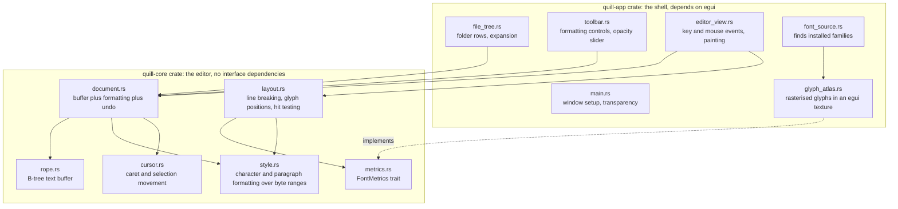

# Quill Technical Design Document

Author: Claude (agent), for Jason McAffee
Date: 2026-08-24
Status: proposed, with Option 1 implemented and the window built to `design/intial-design-screenshot.png`
Board ticket: task-14 "Dev Quill Project" on the local Tasks and Remote Control board

## 1. What Quill is

Quill is a desktop text editor for macOS and Windows, written in Rust, that opens and saves `.md` and
`.txt` files. It shows a file explorer on the left with folders that expand in place, and an editing
area on the right. The editing area supports the ordinary set of editing actions plus character
formatting and paragraph formatting. The window background can be faded with a slider so the desktop
behind Quill shows through, while the text stays fully opaque and readable.

Quill exists so that a writer can keep a reference window, a terminal, or a design open behind the
editor and still see it, without giving up a real editing experience.

## 2. Requirements

These come from the ticket. Each one is given a short name so the rest of this document can refer to
it without counting.

| Name | Requirement |
|---|---|
| Platforms | Runs on macOS and Windows |
| Language | Written in Rust |
| Fast interface | The interface must stay responsive while editing |
| File types | Opens and saves `.md` and `.txt` |
| File explorer | A file tree on the left, folders expand and collapse in place, nested to any depth |
| Selection | Select text with the mouse and with shift plus arrow keys |
| Clipboard | Cut, copy and paste |
| Cursor movement | Move the caret up, down, left and right, plus line start and line end |
| Font family | Choose a font family, for example Helvetica, and a face within it such as regular or italic |
| Character formatting | Bold, italic, underline and strikethrough |
| Font colour | Set the colour of the selected text |
| Font size | Set the point size of the selected text |
| Alignment | Left, centre, right and justified paragraph alignment |
| Line spacing | Set the spacing between lines of a paragraph |
| Own implementation | Write the editor ourselves instead of using an existing editor component, but read existing code and credit it |
| Transparency | A slider sets background transparency so the desktop shows through, and text stays opaque |
| Visual tests | End to end tests that save screenshots so an agent can confirm behaviour by looking at them |

## 3. Where the line is drawn between our code and other people's code

The ticket says to implement this ourselves rather than depend on other libraries, and also to pull
down any code that may be useful and credit it. Taken literally, writing every layer ourselves would
mean writing a Metal renderer, a Direct3D renderer, a TrueType parser and a glyph rasteriser before
any text appeared on screen. That is months of work that has nothing to do with editing text.

So the line is drawn at the editor itself. This is a decision, and it is recorded here so that a
reviewer can disagree with it in one place rather than in fifty files.

We write ourselves:

- The text buffer, including its data structure and the counts it maintains.
- The caret and the selection, including how they move over grapheme clusters and words.
- The formatting model: which byte ranges carry bold, italic, underline, strikethrough, font family,
  font size and colour, and how those ranges survive insertion and deletion.
- The paragraph model: alignment and line spacing.
- Text layout: breaking a paragraph into lines that fit the available width, positioning every glyph,
  and mapping a mouse position back to a position in the text.
- Undo and redo.
- Hit testing, caret painting and selection painting.
- The file tree model and its expansion state.

We use existing crates for:

- Creating a window, receiving keyboard and mouse events, and reaching the graphics card. Written by
  hand this is platform code, not editor code.
- Reading font files and turning a glyph into pixels. This is font technology.
- Finding installed fonts by family name.
- Reading and writing the operating system clipboard.

Section 8 lists the exact crates and section 12 lists the code that was read as reference.

## 4. Options considered

Every number below was read on 2026-08-24 from the crates.io API and the GitHub API, not from memory.

| Option | Core crates | Version | crates.io downloads | GitHub stars | Last push |
|---|---|---|---|---|---|
| 1. egui and eframe | `egui`, `eframe` | 0.36.1 | 22,098,666 and 17,034,390 | 30,151 | 2026-08-24 |
| 2. winit and wgpu, everything else ours | `winit`, `wgpu` | 0.30.13, 30.0.1 | 50,341,095 and 32,380,599 | 6,119 and n/a | 2026-08-21 |
| 3. Linebender stack | `vello`, `parley`, `masonry`, `xilem` | 0.10.0, 0.11.1, 0.4.0, 0.4.0 | 752,050 / 2,479,242 / 20,370 / 9,964 | 4,282 / 710 / 5,500 | 2026-08-24 |
| 4. iced | `iced` | 0.14.0 | 2,582,641 | 31,346 | 2026-08-16 |
| 5. GPUI | `gpui` | 0.2.2 | 227,912 | 89,157 (all of Zed) | 2026-08-24 |
| 6. Slint | `slint` | 1.17.1 | 1,527,757 | 23,569 | 2026-08-24 |
| 7. Freya on Skia | `freya` | 0.4.1 | 38,764 | 3,056 | 2026-08-24 |
| 8. Web view shell | `tauri` | n/a | n/a | n/a | n/a |

### Option 1: egui and eframe, with our own text engine

`egui` draws its interface by producing a list of shapes every frame and handing them to a painter,
which `eframe` runs on the graphics card through `wgpu`. Nothing about that pipeline forces us to use
`egui`'s own text widget. We take the window, the input events and the ability to paint triangles and
textured quads, and we paint our editor with our own layout.

What it gives us:

- The window, the input events and the graphics device on both macOS and Windows from one code path.
- Transparency that is already proven: `egui::ViewportBuilder::with_transparent(true)` plus an
  `eframe::App::clear_color` that eframe asks for on every frame.
- The surrounding controls, meaning the toolbar buttons, the colour picker, the size box and the
  transparency slider, for very little code. These are not the part the ticket asks us to write.
- A test harness, `egui_kittest`, described in section 11, that renders the real interface and writes
  PNG files. No other option in this list ships an equivalent.
- The largest user base of any option here, so problems are already reported and answered.

What it costs us:

- `egui` redraws the interface every frame by default. For a text editor that is wasteful. It is
  fixed by asking for redraws only when something changed, which `eframe` supports.
- `egui` is not a native control toolkit, so the interface does not inherit macOS or Windows widget
  appearance. For this application that is acceptable, because a translucent editor is already not
  trying to look like a system window.
- To paint our own glyphs we have to build and maintain a glyph atlas texture ourselves. That is
  roughly two hundred lines, and it is work we would do in every option except option 4 and option 6.

### Option 2: winit and wgpu, with every layer above them ours

`winit` creates the window and delivers events. `wgpu` gives us the graphics card. Everything above
that, including buttons, sliders, scroll bars, the colour picker and the file tree rows, would be
ours.

This is the most faithful reading of "implement this ourselves". It is also the option where most of
the work goes into things the ticket does not ask for. A slider and a colour picker are not text
editing features, and writing them buys nothing. It also has no test harness at all, so the
screenshot requirement would mean writing our own offscreen render and comparison code.

Note that option 1 is this option with `egui` supplying the chrome, because `eframe` is built on
`winit` and `wgpu`. Choosing option 1 does not close the door on this one.

### Option 3: The Linebender stack: winit, vello, parley and masonry

`vello` renders two dimensional graphics using compute shaders and is the most modern renderer in
this list. `parley` is a rich text layout library, and it is genuinely good: it models styles as
ranges over the text, which is the same model Quill needs.

The problem is that `parley` does the job the ticket asks us to do. Adopting it means the interesting
part of Quill, laying out styled text and breaking it into lines, comes from a library. `parley` is
still the right thing to read, and section 12 records that we did read it.

The second problem is maturity for this purpose. `masonry` and `xilem`, the widget and application
layers, were last released on 2025-10-29 and have 20,370 and 9,964 downloads all time. Building a
product on them today means tracking a moving interface.

### Option 4: iced

`iced` follows the Elm architecture, where the application is a state value, a message type and an
update function. It has the most stars of any option here and a real `text_editor` widget at
`widget/src/text_editor.rs`.

That widget is the reason to reject it. `iced`'s text handling is built on `cosmic-text`, so the
editing behaviour we are asked to write would come from `iced` and `cosmic-text`. Writing our own
editor inside `iced` means fighting the framework's own text stack rather than using it, which is
more work than option 1 for less control.

### Option 5: GPUI

`gpui` is the framework Zed is built on, and Zed is the fastest editor available today, so on the
fast interface requirement this option is the strongest in the list.

Against it: `gpui` is developed inside the Zed monorepo for Zed's needs. The published crate is at
0.2.2 and was last released on 2025-10-22, ten months before today. It has now been split into per
platform crates, and `gpui_windows` exists, so Windows is supported, but documentation for use
outside Zed is thin and the interface changes with Zed's needs rather than on a release schedule. It
also has no screenshot test harness we can use. For a first version this is too much risk for speed
we do not yet need.

### Option 6: Slint

`slint` describes the interface in its own markup language, compiled ahead of time. It is aimed
first at embedded devices, and it is good at that. For Quill the markup language is a poor fit,
because the editing area is one custom painted surface driven by our own layout, so almost none of
what Slint offers would be used. Its licence model, which offers a royalty free option with
conditions alongside commercial and GPL terms, is also more to think about than the MIT and Apache
terms of the other options.

### Option 7: Freya, on Skia

`freya` puts a Dioxus style component model over Skia. Skia is an excellent renderer. It is also a
large C++ dependency, which means longer builds and a harder time producing a Windows build. At
38,764 downloads all time it is the least used option here.

### Option 8: A web view shell, for example Tauri

Rejected against two requirements at once. The fast interface requirement is not met, because text
layout would be done by the system web engine in JavaScript. The own implementation requirement is
not met either, because a `contenteditable` element would be doing the editing. It is listed because
it is the obvious cheap answer and the reader deserves to know it was considered and why it lost.

## 5. Recommendation

Build Option 1: `eframe` and `egui` for the window, the input, the graphics device and the
surrounding controls, with the whole editor written by us in a separate crate that has no interface
dependencies at all.

The reasoning, in order of weight:

1. It is the only option that ships a way to satisfy the visual tests requirement. `egui_kittest`
   renders the real interface and writes PNG files with pixel comparison. Every other option would
   need that harness written first.
2. Keeping the editor in a crate with no interface dependencies means the editor is testable without
   a window, and it means a later move to option 2 or option 3 replaces the shell and keeps the
   editor. This is the cheapest way to be wrong about the framework choice.
3. Transparency is confirmed working rather than assumed.
4. It is the most used and most actively maintained option in the list.

## 6. Architecture

The important edge is the dashed one. `quill-core` never asks how a glyph is drawn. It asks a
`FontMetrics` implementation for the advance width and vertical metrics of a glyph, and it returns
positioned glyphs. In the application that implementation is backed by real font files. In tests it
is a fixed width stub, so every layout test is exact arithmetic with no font dependency and no
platform variation.

### Data flow for one keystroke

1. `eframe` delivers a `egui::Event::Text` or `egui::Event::Key` to `editor_view.rs`.
2. `editor_view.rs` turns it into a `quill_core::Command`, for example `InsertText`, `MoveCaret` or
   `ToggleBold`.
3. `Document::apply` runs the command: it edits the rope, shifts the formatting ranges to match, moves
   the caret, and pushes an entry onto the undo stack.
4. The document marks its layout stale.
5. On the next frame `editor_view.rs` asks `layout.rs` for the layout, which is recomputed only if
   stale, and paints it.
6. `editor_view.rs` asks for one more frame only if something changed, so an idle window uses no
   processor time.

## 7. The editor design

### 7.1 The text buffer

A B-tree rope, following the design ropey documents. Leaf nodes hold a short run of UTF-8 bytes.
Internal nodes hold child pointers and, next to each one, a summary of that child. The summary is
three counts: bytes, characters and line breaks.

Carrying the summaries in the parent is what makes the operations an editor needs cheap. Finding the
byte offset where line 4,000 starts walks down the tree adding line break counts, without touching
the text. Inserting in the middle of a large file touches one leaf and the path above it, rather than
moving the rest of the file.

The alternative considered was a gap buffer, which is simpler and faster for typing in one place, and
much worse when edits jump around, which is what happens when formatting is applied across a
selection. Ropey's design document makes the same argument, and we follow it.

Chunk sizes: leaves split above 512 bytes and merge below 192 bytes, on a character boundary so that
no leaf ever splits a UTF-8 sequence. Internal nodes hold up to 12 children. These are smaller than
ropey's, which sizes its nodes to fill a cache line exactly; ours are chosen to be easy to reason
about and to make the tree deep enough in tests that the split and merge paths actually run.

### 7.2 Formatting

Character formatting is a list of spans. A span is a byte range and a `CharStyle`, and the list is
kept sorted with no overlaps and no gaps, covering the whole document. `CharStyle` holds the family
name, the size in points, bold, italic, underline, strikethrough and colour.

This is the same model `cosmic-text` uses, where it is a range map from byte ranges to attributes.
Ours is a plain sorted vector, because a document of the size Quill targets never has enough spans
for the difference to matter, and a vector is far easier to test.

Two operations keep it correct:

- On insertion at byte offset `n`, every span starting at or after `n` moves along by the inserted
  length, and a span containing `n` grows. Text typed inside a span inherits that span's formatting,
  which is what a writer expects.
- On deletion of a range, spans are clipped to the surviving text, spans wholly inside it are
  dropped, and neighbours that now hold identical formatting are merged. Merging matters: without it
  every keystroke would add a span and the list would grow without bound.

Paragraph formatting is separate, because alignment and line spacing belong to a whole paragraph
rather than to a range of characters. A paragraph is the text between two line breaks, and each one
carries an alignment and a line spacing multiplier.

### 7.3 Caret and selection

One structure holds an anchor byte offset and a head byte offset. When they are equal there is a
caret and no selection. Shift with an arrow key moves the head and leaves the anchor, which is how
selection by keyboard works everywhere.

Left and right move by grapheme cluster, not by byte and not by character. A grapheme cluster is what
a reader would call one character even when it is several Unicode code points, such as an accented
letter written as a letter plus a combining accent, or a flag emoji. Moving by byte would land inside
a character and moving by code point would split the accent from its letter. The cluster boundaries
come from `unicode-segmentation`, which implements the Unicode rules for this.

Up and down move to the nearest position in the line above or below, using the laid out lines rather
than the text, because with word wrap one paragraph is several lines on screen. The caret keeps a
remembered horizontal position so that moving down through a short line and on to a long one returns
to the original column, which is the behaviour every editor has and every naive implementation gets
wrong.

### 7.4 Layout

Layout takes the document and an available width and produces lines. For each paragraph:

1. Split the paragraph into runs, where a run is a stretch of text with one `CharStyle`, so one run
   is one font at one size in one colour.
2. Ask `FontMetrics` for the advance width of each grapheme cluster in the run.
3. Accumulate clusters into a line until the next word would not fit, then break at the last word
   boundary. If a single word is wider than the available width it is broken at a cluster boundary,
   because the alternative is text disappearing past the edge.
4. Position the line horizontally according to the paragraph alignment. Justified alignment
   distributes the leftover width across the gaps between words, and the last line of a paragraph is
   left aligned, because stretching a short last line looks broken.
5. Advance vertically by the tallest run in the line multiplied by the paragraph line spacing.

The result is a list of `LaidOutLine`, each holding positioned glyphs with the style that produced
them. Painting walks that list. Hit testing walks it in reverse: a mouse position picks the line by
its vertical range and then the closest cluster boundary within it, so clicking in the right half of
a character puts the caret after it.

Underline and strikethrough are drawn by the shell as rectangles from the positions the layout
reports, not baked into glyphs. Bold and italic select a different face of the family when the family
has one. Helvetica on macOS ships regular, bold, oblique and bold oblique inside
`/System/Library/Fonts/Helvetica.ttc`, so the real faces are used rather than a synthetic slant.

### 7.5 Undo and redo

Undo restores a saved state of the document: the text, the character spans, the paragraph list and the
caret, all four together.

The first design was to store the inverse of each edit, which uses far less memory. It was dropped
during implementation. Undoing a deletion by inverse has to rebuild the character spans and the
paragraph entries that the deletion destroyed, and getting that wrong corrupts the document without
anything failing at the time. Restoring a saved state cannot be wrong. The cost is bounded by keeping
at most 256 states, and Quill opens plain text files rather than very large ones. If a file ever turns
up where this matters, the fix is to store inverses for the text and keep saved states for the
formatting.

Consecutive single character insertions with no caret movement between them are merged into one entry,
so undo removes a word rather than a letter. A caret move, a deletion or a formatting change ends the
run. Redo is a second stack, cleared by any new edit.

## 8. Crates used, and why each one

| Crate | Version | Used for | Why not write it |
|---|---|---|---|
| `eframe`, `egui` | 0.36 | Window, input events, graphics device, toolbar controls | Platform code and ordinary controls, not editor behaviour |
| `fontdb` | 0.24 | Finding installed font families by name | A database of installed fonts differs on every operating system |
| `ab_glyph` | 0.2 | Reading font files, glyph metrics, turning glyphs into pixels | Font file parsing and rasterising is font technology |
| `unicode-segmentation` | 1.13 | Grapheme cluster boundaries | An implementation of a Unicode standard annex, 514M downloads |
| `rfd` | 0.17 | The operating system's folder and file pickers | Three different platform APIs, and a modal dialog is platform work |
| `egui_kittest` | 0.36 | Tests that render the interface and write PNG files | Test only |
| `image` | 0.25 | Reading PNG files in tests to assert on pixels | Test only |

The clipboard needs no crate. egui delivers `Event::Copy`, `Event::Cut` and `Event::Paste` from the
platform integration and takes text back through `Context::copy_text`, so cut, copy and paste work
through the same events in the real window and in the tests. `arboard` was in the first plan and was
removed once that was found.

`quill-core` depends on `unicode-segmentation` and nothing else. That is deliberate: the editor
compiles and its tests run with no window, no graphics card and no fonts.

## 9. Transparency

The requirement is that the background fades and the text does not. These are two separate paints, so
it falls out of the design rather than needing a trick.

1. The window is created with `ViewportBuilder::with_transparent(true)`, and on macOS also
   `with_has_shadow(false)`, which the egui source documents as the fix for ghosting artefacts on a
   translucent window.
2. `eframe::App::clear_color` returns black with alpha taken from the slider. eframe asks for this
   value every frame, so dragging the slider changes the window immediately.
3. Every panel is given a background fill with the same alpha.
4. Text, the caret, the selection highlight, the underline and strikethrough rules and the toolbar
   labels are all painted with alpha 255.

Because the operating system compositor blends the window against the desktop using the alpha we
supply, and because the glyphs are opaque, the desktop shows through the gaps between letters and not
through the letters.

One qualification, so that nobody reads the tests as claiming more than they do. A pixel at the edge of
a letter is only partly covered, because the rasteriser softens the outline, so at the edges the
background does show through a little and always will. That is correct rendering rather than a fault.
The claim being tested is about the body of the letters: however faint the background is, the ink is
solid.

At alpha 0 the background is invisible, so the requirement is met at the extreme; the slider is
limited to a floor of 0.05 in the interface so that the window cannot be lost entirely by dragging
the slider to the end.

### 9.1 Two rules the glyph painting has to follow

Both of these were found by a failing test rather than by reading the code, and both are recorded
because either one silently spoils the text.

First, every glyph that is going to be drawn must be rasterised into the atlas before the atlas texture
is uploaded. The first implementation uploaded the texture and then rasterised while building the mesh,
so any letter appearing for the first time was drawn from a texture that did not yet contain it, and it
came out blank. Because collecting glyphs can itself fill the atlas and force it to be cleared, which
moves the glyphs already collected, the atlas carries a counter that is bumped on every clear and the
painting pass is repeated if it changed.

Second, a glyph is drawn at exactly the size it was rasterised at, so its rectangle is snapped to whole
pixels and the atlas is sampled without filtering. Landing a glyph on a fraction of a pixel resamples
it and softens every letter on screen.

## 10. The file explorer

A tree of nodes, each a file or a directory, with directories holding an expanded flag and their
children. Children are read from disk the first time a directory is expanded rather than at startup,
so opening Quill on a large folder is not slow. Directories sort before files and both sort by name.
Only `.md` and `.txt` files are listed, because those are the file types Quill can open, and showing
a file that cannot be opened is worse than not showing it.

The marker in front of a folder is U+23F5 when closed and U+23F7 when open. Those two are used because
egui's default fonts contain them. The smaller triangles at U+25B8 and U+25BE, and the three bar symbol
at U+2261 that the alignment buttons first used, are not in those fonts and render as empty boxes.

Expansion state lives in the tree, so it survives while the application runs. Clicking a file loads
it into the editor. A file with unsaved changes is marked, and switching away from it while it has
unsaved changes asks first.

## 10.1 The window's look

The window follows `design/intial-design-screenshot.png`. The palette was read out of that file rather than chosen by eye:
`crates/quill-app/examples/sample_design.rs` reports, for each region of the image, the colour covering
most of it and the most saturated colour in it, which is how the accents were found. Run
`cargo run --example sample_design` to check any value in `theme.rs` against the design again.

The colours that matter: the accent for anything switched on is `#489FF8`, the amber for unsaved changes
is `#FEBC2E`, the row of the open file is `#304361`, the title bar is `#2A313D`, the toolbar is `#1E222A`,
the explorer is `#1F232A`, the editing area is `#1A1F26` and the status bar is `#101519`.

Quill draws its own title bar. The window is created with no operating system decorations, because
rounded corners and a translucent background need them turned off, so the three window buttons, the file
name centred with its folder after it, and the amber dot are all painted by `title_bar.rs`. Dragging the
bar moves the window through `ViewportCommand::StartDrag`.

Three things in the design needed more than styling:

The toolbar's B has to be genuinely bold. egui's built in fonts have no bold face, so its `strong`
styling only brightens the colour. `theme::install_fonts` hands egui the same family Quill is using, with
its bold face under a name the toolbar asks for, and leaves egui's own fonts in the list behind it because
they carry symbols a text face does not have, such as the triangles in front of a folder. This has to
happen before the first frame: `Context::set_fonts` takes effect at the start of the next frame, and asking
for a font family that has not been bound yet panics inside egui. `QuillApp::prepare` does it, and both the
released binary and the screenshot tests call it from the same place, the creation closure.

The alignment buttons, undo and redo, the magnifier, the plus, the collapse arrow and the opacity circle
are drawn with the painter in `theme::icon`, because the characters for them are not in egui's fonts.

The design's lines sit further apart than Helvetica's own metrics ask for. A font's line height sets the
lines as close together as the shapes allow, which is tiring to read at length. The extra is asked for in
`TextRenderer::line_metrics` as part of the line gap, which is the honest place for it: the gap is defined
as the space the font asks for between one line and the next, and Quill's renderer asks for more. Putting
it there leaves `quill-core`'s arithmetic exact and its layout tests independent of any platform.

One contradiction inside the design was resolved rather than guessed at silently. Its editor text is set
in a monospaced face, but its own font box reads `Helvetica` and its status bar reads `Helvetica · 16 pt`.
Those cannot both be true. Quill keeps Helvetica, so that the labels in the window match what is actually
drawn.

## 10.2 Opening a folder, and listing what is in it

The `File` menu in the title bar holds `Open Folder`, `Open File`, `Save` and `Save As`. Quill draws its own
title bar, so there is no operating system menu bar to put these in. The pickers themselves come from `rfd`,
because a native folder picker is platform work in the same way that creating a window is, and it sits on
the same side of the line drawn in section 3 as `winit` and `fontdb`.

The explorer lists every file, not only the ones Quill can open. Version one listed `.md` and `.txt` only,
reasoning that showing a file that cannot be opened is worse than not showing it. That was wrong: an
explorer that hides most of a folder does not tell you what is in the folder. Files Quill cannot open are
drawn dimmed and do not respond to a click, and the footer says how many of the files can be opened, so the
tree is honest about what is there and about what it can do with it.

## 10.3 The Markdown preview

Three buttons in the toolbar, immediately to the left of undo, switch between the raw source, the source and
the preview side by side, and the preview on its own.

The parser is ours, in `quill-core/src/markdown.rs`. It is the kind of thing the ticket's instruction to
write our own was aimed at, and it fits the existing design exactly: Quill already has a styled text model,
a layout engine and a painter, so the parser does not draw anything. It reads the source and produces the
same three things a document holds, a rope with character spans over it and one paragraph setting per line.
The preview is then laid out by `quill_core::layout` and painted by `editor_view::paint_text`, which is the
ordinary painting code with the selection and the caret left out. Nothing in the window knows how to render
Markdown.

Handled: headings one to six, bold, italic, bold and italic together, strikethrough, inline code, fenced
code blocks, indented bullet lists, numbered lists, block quotes, horizontal rules and links.

Not handled, and stated rather than hidden: tables, footnotes, images shown as pictures rather than as their
text, reference style links, nested block quotes and HTML. A table needs layout Quill does not have. The
others are rare in prose.

Some decisions inside the parser that a reader might otherwise wonder about:

An underscore inside a word is part of the word, so `snake_case_name` is left alone while `_emphasis_`
works. Without that rule, every identifier in a technical document turns italic halfway through.

Nothing inside a backtick pair or a fenced block is interpreted, and a fenced block keeps its own
indentation, because the point of showing code is to show it as it was written.

A heading mark has to be followed by a space, so `#hashtag` is not a heading, and seven hashes is not a
heading either.

Indenting a nested list item is done with spaces in the preview text, because the layout engine has no left
margin for a paragraph. A horizontal rule is drawn as a run of box drawing characters for the same reason:
the layout engine places glyphs and has no notion of a line that is not text. Both are honest limitations of
reusing the text layout rather than writing a second one, and both look right.

The preview is read only in every mode. There is nothing to type into it, because what it shows is worked
out from the source.

## 11. Testing plan

Three layers. The middle one is the one the ticket asks for by name.

### Layer 1: unit tests on quill-core

Plain `cargo test` in a crate with no interface dependencies. These cover the rope across split and
merge boundaries, the formatting spans across insertion and deletion including the merging of
neighbours, grapheme movement over accented characters and emoji, remembered column on vertical
movement, word wrap, all four alignments, line spacing, and undo including the merging of
consecutive typing.

Layout tests use a stub `FontMetrics` where every glyph is exactly 10 units wide and the line height
is 20, so the expected positions are arithmetic a reader can check by hand, and the test gives the
same answer on macOS and on Windows.

### Layer 2: end to end tests that render the interface and save screenshots

`egui_kittest` builds the real application, feeds it real events, renders through `wgpu` on the
graphics card, and writes a PNG file. From the harness source: the image goes to
`tests/snapshots/{name}.png`, the image from the most recent run goes to `{name}.new.png`, and when
they differ it writes `{name}.diff.png`. Tolerance is set in `kittest.toml` as a per pixel colour
distance plus a count of pixels allowed to exceed it.

The allowance is set in `kittest.toml` to a colour distance of 1.0 and at most 60 pixels over it. It is
deliberately small. A generous allowance lets a real change through: an earlier setting of 2000 pixels
hid a change to the folder markers in the explorer, and the tests passed while the window looked
different. The Windows allowance is still a guess, because no Windows baseline has been taken yet.

This satisfies the requirement in the ticket two ways. The PNG files are the screenshots an agent
opens and looks at, so a person or an agent can confirm that bold text is actually bolder and that
centred text is actually centred. And once accepted, the same files are the comparison baseline, so a
later change that alters the rendering fails the test instead of passing unnoticed.

The tests find the text they format by searching for it rather than by writing down a byte offset. A
counted offset drifts as soon as the text changes: the first version counted one line's start wrongly
and left the first letter out of the selection, which the screenshot showed as one small letter in front
of a large word.

One screenshot test per feature that has a visible result:

| Snapshot | What an agent should see in it |
|---|---|
| `startup` | The whole window: file tree on the left, toolbar, empty editor |
| `file_tree_expanded` | A nested folder open, its children indented under it |
| `typed_text` | Typed text laid out in the editor with the caret after it |
| `selection` | A highlight behind part of a line only |
| `bold`, `italic`, `underline`, `strikethrough` | The formatting applied to the middle word and not to the words either side |
| `font_size` | Three sizes on three lines, visibly different heights |
| `font_colour` | Three words in three colours |
| `font_family` | The same sentence in Helvetica, Times New Roman and Courier |
| `align_left`, `align_centre`, `align_right`, `align_justify` | The same paragraph positioned four ways |
| `line_spacing` | The same paragraph at single and at double spacing |
| `word_wrap` | A long paragraph broken into lines inside the editor width |
| `opacity_low`, `opacity_high` | The background at two alpha values with the text equally sharp in both |
| `title_bar` | The three window buttons, and the file name centred with its folder after it |
| `unsaved` | The amber dot in the title bar, on the file's row and in the status bar |
| `filter` | The file list narrowed to what matches what was typed in the filter box |
| `explorer_hidden` | The explorer put away, with the editing area filling its place |
| `opacity_menu` | The opacity menu open with its slider |
| `design_comparison` | The whole window set up as `design/intial-design-screenshot.png` shows it, for putting side by side |
| `view_raw` | The Markdown source, marks and all |
| `view_side_by_side` | The source on the left and the preview on the right |
| `view_preview` | The preview filling the editing area |
| `file_menu` | The File menu open, with its four entries and their shortcuts |
| `opened_folder` | A different folder showing in the explorer |
| `unopenable_file` | A file Quill cannot open, listed and dimmed |

The last pair also gets an assertion rather than only an image, because a screenshot on its own cannot
prove text stayed opaque: the test reads the rendered pixels and asserts that pixels belonging to
glyphs have full alpha at both slider positions while the background alpha differs. That is the
transparency requirement checked by measurement.

### Layer 3: launching the real application

`cargo run` on macOS, with a screen capture of the real window over a visible desktop. Layer 2 renders
through the same `wgpu` path but into an offscreen target, so it cannot prove that the operating system
compositor honoured the window alpha. Only a capture of the real window on a real desktop shows that.

That capture is kept at `design/verification/live-window-over-desktop.png`. The desktop wallpaper is
visible through the explorer, the editing area and the status bar, and every piece of text is solid on top
of it.

The opacity setting is applied to every background in the window rather than to the editing area alone.
The first attempt faded only the editing area, which the live capture showed straight away: the toolbar and
the explorer stayed solid while the text behind the window showed through the middle of it. The ticket asks
for the desktop to be shown through the window, so `theme::faded` is applied to the title bar, the toolbar,
the explorer, its footer, the editing area and the status bar. Text, icons and the caret never go through
it.

## 12. Reference code that was read

Pulled into `~/dev/quill/reference` at these commits. None of it is compiled into Quill; all of it
was read.

| Repository | Commit | What was taken from it |
|---|---|---|
| [ropey](https://github.com/cessen/ropey) | `42f6fc791b20e61c1b631465f69465dfa4c4fae2` | The B-tree rope design, and specifically carrying byte, character and line break counts in the parent next to each child pointer. Its `design/design.md` argues for a B-tree over a gap buffer for edits that jump around, which is the argument section 7.1 follows. |
| [cosmic-text](https://github.com/pop-os/cosmic-text) | `daae9c75d52322f8fb3af6168d76561540914e1f` | The formatting model. `src/attrs.rs` holds `AttrsList` as a range map from byte ranges to attributes, which is the model section 7.2 uses in a simpler form. |
| [parley](https://github.com/linebender/parley) | `1aba7cacb2030dea204efa87ba55317c0a59964a` | How a rich text layout interface is shaped: styles as ranges over text, layout producing lines that hold runs that hold positioned glyphs. |
| [ab-glyph](https://github.com/alexheretic/ab-glyph) | `f02491a1bd5dda92263acb0af2e326b73ca28978` | Glyph metrics and rasterising. Also compiled into Quill. |
| [glyphon](https://github.com/grovesNL/glyphon) | `49dc8f7bafa8091f4d71521fd62ee6f647b556f5` | How to keep rasterised glyphs in one texture and draw them as textured quads, which is what `glyph_atlas.rs` does against an egui texture. |
| [egui](https://github.com/emilk/egui) | version 0.36.1 as published | `examples/custom_window_frame/src/main.rs` for the transparent window, and `crates/egui_kittest` for the screenshot tests. |

## 13. Risks

| Risk | What we do about it |
|---|---|
| The framework choice turns out wrong | `quill-core` has no interface dependencies, so replacing the shell does not touch the editor |
| Complex writing systems: Arabic, Hindi, and any text that runs right to left | Version one lays out one cluster at a time left to right, which is correct for Latin, Greek and Cyrillic and wrong for Arabic and Hindi. Stated as a limitation rather than hidden. The fix is a shaping step using `rustybuzz` or `swash` inside `layout.rs`, and the `FontMetrics` boundary is where it goes |
| Screenshot tests differ between machines because of font rendering | `kittest.toml` sets a per pixel tolerance and a separate threshold for macOS and for Windows. It is kept small, because a large one hides real changes, which happened once already |
| Windows is not tested on this machine, which is a Mac | The Windows build is checked by compiling, and the layer 1 and layer 2 tests are written to be independent of platform font rendering. Running on Windows is left as a task for a machine that has Windows |
| A large file makes layout slow | Layout is recomputed only when the document or the width changed, and only paragraphs in view are painted. If a file large enough to be slow shows up, layout becomes per paragraph with a cache, which the paragraph structure already allows |

## 14. What version one includes and what it does not

Included: everything in the requirements table in section 2.

The status bar reports the line and column of the caret. The column counts grapheme clusters rather than
bytes, because a column number is meant to say how many characters along the line the caret is, and a
letter with a combining accent is one character to a reader however many bytes it takes.

Not included, and deliberately so:

- Right to left and complex writing systems, as described in section 13.
- Search and replace, multiple carets, and tabbed documents. None are in the requirements.
- A saved settings file. The transparency setting resets when Quill restarts.

## 15. Milestones

1. The workspace, with `quill-core` and `quill-app` both compiling on macOS and Windows.
2. The rope, the formatting spans and the caret, with unit tests.
3. Layout, with unit tests against the stub metrics.
4. The shell: window, transparency, file tree, editor painting, toolbar.
5. The screenshot tests, with every image looked at before it is accepted as the baseline.
6. Launch on macOS and capture the real window over a desktop.
