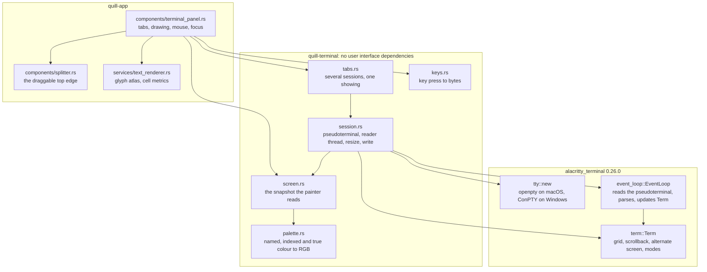

# Quill Terminal Technical Design Document

Author: Claude (agent), for Jason McAffee
Date: 2026-08-24
Status: proposed, and implemented as described
Ask: `tasks/improvements.md`, the section headed `Terminal`

## 1. What this is

Quill gets a terminal along the bottom of the window with several tabs, the way IntelliJ has one. Each
tab runs a shell in a pseudoterminal. A pseudoterminal is a pair of file descriptors that behave like a
serial terminal: the program on the far side, usually a shell, writes the bytes it would write to a
physical terminal, and reads the bytes a keyboard would send. Everything a terminal does beyond carrying
bytes, which means moving the cursor, colouring text, clearing the screen, switching to a second screen
for a full screen program, and reflowing when the window changes size, is carried in escape sequences
inside that byte stream.

The requirement in `tasks/improvements.md` is that the terminal behaves the way a native terminal
behaves, that `claude` and `codex` are formatted correctly inside it, and that resizing repaints
correctly. `claude` and `codex` are the demanding cases on purpose: both draw a full screen interface,
both use 24 bit colour, both redraw as they think, and both notice the terminal size.

## 2. Requirements

| Name | Requirement |
|---|---|
| Bottom tile | A terminal along the bottom of the window, which can be shown and hidden |
| Tabs | Several terminals at once, each its own tab, with a tab that can be added and closed |
| Draggable height | The tile's height is set by dragging its top edge |
| Native behaviour | Escape sequences, colour, the alternate screen, scrollback, the cursor and the keyboard all behave as they do in Terminal.app or IntelliJ's terminal |
| `claude` and `codex` | Both are formatted correctly, checked by looking at a capture of the running terminal |
| Resizing repaints | Changing the size tells the program on the far side and repaints without leftover pixels from the old size |
| Testing | Unit tests with no window, screenshot tests that are the same on every run, and a capture of the real thing |

## 3. Where the line is drawn between our code and other people's code

The original ticket for Quill asked for the editor to be written here rather than taken from a library,
and `tasks/quill-technical-design-document.md` section 3 records where that line was drawn: the text
buffer, the formatting, the caret, layout, undo and hit testing are ours, and the window, the graphics
device, font parsing and the font database come from crates.

A terminal emulator is not the editor. The escape sequence emulation is a large, exactly specified,
heavily tested piece of work whose correctness a person cannot judge by looking at it: the reason
`claude` looks right in one terminal and wrong in another is nearly always a mode or a sequence handled
differently, and there are several hundred of them. Writing that here would take weeks and would still
be worse than what exists.

So the line for the terminal is drawn one layer higher than it is for the editor.

We write ourselves:

- The tile, the tabs, and which tab is showing.
- The drawing: one background rectangle per run of cells that share a background colour, one glyph per
  cell out of Quill's own glyph atlas, the cursor, and the rules for underline and strikethrough.
- The colour palette: the sixteen named colours, the two hundred and sixteen colour cube, the twenty four
  step grey ramp, and what the default foreground, background and cursor colours are.
- The key encoding: turning a key press and its modifiers into the bytes a terminal sends.
- The screen snapshot that the drawing reads, and the rule about how long the terminal's lock is held.
- Resizing: working out how many rows and columns fit, telling the pseudoterminal and telling the
  emulator.
- Focus: which of the editor and the terminal the keyboard is talking to.

We take from a crate:

- The escape sequence parser and the terminal state it drives: the grid, the scrollback, the alternate
  screen, the modes, the character attributes, wide characters and the selection.
- The pseudoterminal itself, which is platform work: `openpty` and `SIGCHLD` on macOS, ConPTY on Windows.

## 4. Options considered

Every number was read on 2026-08-24 from the crates.io API and the GitHub API rather than from memory.

| Option | Crates | Version | crates.io downloads | GitHub stars | Last push | Licence |
|---|---|---|---|---|---|---|
| 1. `alacritty_terminal` | [`alacritty_terminal`](https://crates.io/crates/alacritty_terminal) | 0.26.0 | 1,227,542 | 65,488 (all of Alacritty) | 2026-08-17 | Apache-2.0 |
| 2. `vte` plus our own grid | [`vte`](https://crates.io/crates/vte), [`portable-pty`](https://crates.io/crates/portable-pty) | 0.15.0, 0.9.0 | 69,737,204 and 12,509,391 | 324 and 28,533 | 2026-02-28, 2026-08-24 | Apache-2.0, MIT |
| 3. `wezterm-term` | `wezterm-term`, [`termwiz`](https://crates.io/crates/termwiz) | not published, 0.23.3 | n/a and 19,061,594 | 28,533 (all of WezTerm) | 2026-08-24 | MIT |
| 4. `vt100` | [`vt100`](https://crates.io/crates/vt100), `portable-pty` | 0.16.2, 0.9.0 | 10,156,075 | 118 | 2025-07-12 | MIT |
| 5. A real terminal in a web view | `xterm.js` inside a web view | n/a | n/a | n/a | n/a | MIT |

### Option 1: `alacritty_terminal`

The library Alacritty is built from. It holds the grid, the scrollback, the alternate screen, the modes,
the character attributes, wide character handling, the selection, and a search over the grid. It also
holds the pseudoterminal for both platforms in its `tty` module and a reader thread in its `event_loop`
module, so one crate covers both halves of the job. It re exports the `vte` parser it uses, so a host
application cannot end up with two versions of the parser.

The interface a host application uses is small. `Term::new(config, &dimensions, listener)` builds the
terminal state, `tty::new(&options, window_size, window_id)` opens the pseudoterminal,
`EventLoop::new(terminal, listener, pty, drain_on_exit, ref_test)` starts the reader thread that parses
what the shell writes into that state, and `Notifier` writes bytes back to the shell and tells it about a
new size. Drawing reads `Term::renderable_content()`, which hands back an iterator over the visible
cells, the cursor position and shape, the selection and the current colour table.

Against it: it is developed for Alacritty rather than as a general library, its published documentation
covers 63 per cent of the crate, and the interface changes between versions. It is Apache-2.0 while Quill
is MIT or Apache-2.0, which is compatible because it is a dependency rather than code copied in.

### Option 2: `vte` for parsing, with the grid written here

`vte` is the parser Alacritty extracted, and it is the most used of anything in this list at 69,737,204
downloads. It turns bytes into calls on a handler: print this character, move the cursor there, set this
mode. What it does not do is hold a grid, a scrollback, an alternate screen, or any of the state those
calls change. That would be ours, and it is the part that decides whether `claude` looks right.

This is the option that matches the original ticket's instruction most closely, and it is the one this
document rejects deliberately. Writing a grid that handles the alternate screen, wide characters, the
scrolling region, insert and delete of lines and characters, tab stops, saved cursor state, and the
hundred small behaviours a full screen program relies on is weeks of work that ends up worse than
option 1. The requirement in `improvements.md` is that the terminal behaves exactly as a native terminal
does, and hand writing the emulation is the least likely way to reach that.

### Option 3: `wezterm-term`

WezTerm's terminal model, and it is good: it handles more of the modern extensions than Alacritty does,
including image protocols. It is not published on crates.io, so depending on it means a git dependency on
a large workspace pinned to a commit, and building it pulls in much of WezTerm. `termwiz`, which is
published, is the terminal user interface toolkit rather than the emulator.

### Option 4: `vt100`

Small, MIT licensed, and it does hold a grid. At 118 stars and last pushed on 2025-07-12 it is a much
smaller project than the other two, it does not handle the full set of modes a program like `claude`
sets, and it has no pseudoterminal of its own, so `portable-pty` would come with it. The saving over
option 1 is one dependency; the cost is emulation that is less complete.

### Option 5: A real terminal inside a web view

`xterm.js` is the most widely used terminal front end there is, and putting it in a web view alongside a
Rust process holding the pseudoterminal would work. It also means shipping a web engine inside Quill,
drawing the terminal with a different renderer from the rest of the window, and a font that does not
match the editor's. Rejected on the same grounds section 4 of the main design document rejects a web view
shell.

## 5. Recommendation

Build option 1. `alacritty_terminal` 0.26.0 supplies the escape sequence emulation and the
pseudoterminal. Everything above it, meaning the tile, the tabs, the drawing, the palette, the key
encoding and the resizing, is written in a new crate `quill-terminal` and in
`quill-app/src/components/terminal_panel.rs`.

The reasoning, in order of weight:

1. The requirement is behaviour a person judges by looking at `claude` and `codex` running. The emulation
   in Alacritty is what those two programs are tested against every day by a large number of people.
2. One crate covers the emulation and the pseudoterminal on both macOS and Windows, so there is one code
   path for the part that is platform work.
3. `renderable_content` hands over exactly what a painter needs and nothing else, so Quill's own drawing
   stays ours and stays small.
4. The parts most likely to need changing for Quill, which are the palette, the key encoding and the
   drawing, are the parts kept here.

## 6. Architecture



`quill-terminal` has no user interface dependency, for the same reason `quill-core` has none: its tests
run with no window and no graphics card, and the key encoding and the palette are then plain functions
with plain expected values.

### 6.1 One frame, and one keystroke

A frame:

1. The panel asks the active session for a snapshot. The session locks the terminal, copies the visible
   cells into a `Screen`, resolving every colour to RGB as it goes, and unlocks.
2. The panel draws the `Screen`: one rectangle per run of cells sharing a background colour, then one
   glyph per cell from Quill's glyph atlas, then the underline and strikethrough rules, then the cursor.

The lock is held for the copy and not for the drawing. Drawing a frame touches the font atlas, the
texture and egui's shape list, and holding the terminal's lock across all of that would stall the reader
thread every frame. The copy is one pass over at most a few thousand cells.

A keystroke, when the terminal has focus:

1. The panel reads egui's key and text events.
2. `keys::encode` turns the key and its modifiers into bytes, taking into account whether the program has
   asked for application cursor keys.
3. The session writes those bytes to the pseudoterminal.
4. The shell echoes, or the program redraws. The reader thread parses what comes back and updates the
   terminal state, then wakes the window so the next frame draws it.

The waking is a function the session is given when it is built, so `quill-terminal` never learns what
egui is. The panel passes a closure holding an `egui::Context` that calls `request_repaint`.

## 7. The screen snapshot

`Screen` is plain data:

```rust
pub struct Screen {
    pub rows: usize,
    pub columns: usize,
    pub cells: Vec<ScreenCell>,   // rows * columns, row by row
    pub cursor: Option<Cursor>,   // absent when the program has hidden it
    pub selection: Option<Range>, // what the mouse has selected
    pub scrollback: usize,        // how far above the bottom the view is
    pub title: String,            // what the program set with OSC 0 or 2
}

pub struct ScreenCell {
    pub character: char,
    pub extra: Vec<char>,   // combining marks that go over the character
    pub foreground: Rgb,
    pub background: Rgb,
    pub bold: bool,
    pub italic: bool,
    pub underline: bool,
    pub strikethrough: bool,
    pub wide: bool,         // takes two columns
    pub spacer: bool,       // the second column of a wide character: draw nothing
    pub hidden: bool,
}
```

Inverse video and dim are resolved into the two colours during the copy rather than carried as flags,
because the painter should not have to know that inverse means swap the two colours and that dim means
use the dim variant of a named colour. Everything the painter needs is a colour or a flag it can draw.

## 8. The colour palette

`alacritty_terminal` keeps a colour table of 269 entries and leaves every entry that has not been set by
an escape sequence as `None`, so a host application supplies the defaults. Ours are in `palette.rs`:

- Indices 0 to 15 are the named colours. They are set to the values in Quill's own palette so the
  terminal belongs to the window rather than looking like a different application: the same blue as the
  accent, the same amber as the unsaved marker, and greens and reds that carry against the editor's
  background.
- Indices 16 to 231 are the colour cube, worked out arithmetically: each of red, green and blue takes one
  of the six values 0, 95, 135, 175, 215 and 255, which is what every terminal uses.
- Indices 232 to 255 are the grey ramp, `8 + 10 * step`.
- Foreground, background, cursor, the dim colours and the bright foreground come last. The background is
  the editor's background colour, so the terminal fades with the window when the background opacity is
  turned down.

A cell's colour is `Color::Named`, `Color::Indexed` or `Color::Spec`. Named and indexed go through the
table. `Spec` is a colour the program gave in full, which is what 24 bit colour uses, and it is taken as
it is. Bold text with a named colour is drawn in the bright variant, which is what every terminal does
and what makes `claude`'s headings look right.

## 9. The key encoding

`keys::encode(key, modifiers, mode) -> Option<Vec<u8>>` is ours, and it is a table. The sequences are the
ones xterm defines and every terminal follows.

| Key | Bytes | Note |
|---|---|---|
| A printed character | the character in UTF-8 | Comes from egui's text event, so dead keys and input methods work |
| Enter | `0x0d` | Carriage return, not line feed |
| Backspace | `0x7f` | Delete, which is what a terminal sends |
| Tab | `0x09` | Shift and Tab sends `ESC [ Z` |
| Escape | `0x1b` | |
| Up, Down, Right, Left | `ESC [ A B C D` | `ESC O A B C D` when the program asked for application cursor keys |
| Home, End | `ESC [ H`, `ESC [ F` | `ESC O H`, `ESC O F` in application cursor keys |
| Insert, Delete | `ESC [ 2 ~`, `ESC [ 3 ~` | |
| Page up, Page down | `ESC [ 5 ~`, `ESC [ 6 ~` | |
| F1 to F4 | `ESC O P Q R S` | |
| F5 to F12 | `ESC [ 15 ~` and on | With the gaps at 16, 22, 27 and 30 that the standard leaves |
| Control and a letter | the control code, `A` is `0x01` | Which is how Control C and Control D reach the shell |
| Control and `[ \ ] ^ _` | `0x1b 0x1c 0x1d 0x1e 0x1f` | |
| Alt and a key | `ESC` then the key | Which is how a shell reads Alt as a prefix |
| A modified arrow or tilde key | the modifier as a parameter | `ESC [ 1 ; 5 D` is Control and Left, `ESC [ 3 ; 5 ~` is Control and Delete |

The modifier parameter is the xterm number: 2 is shift, 3 is alt, 5 is control, and the combinations add
one less than each, so shift and control is 6 and all three is 8.

Two sequences are not keys and are sent anyway. Bracketed paste wraps pasted text in `ESC [ 200 ~` and
`ESC [ 201 ~` when the program asked for it, which is what stops a shell running each pasted line as it
arrives. A focus report sends `ESC [ I` and `ESC [ O` when the program asked for that, which is how
`claude` knows to dim its cursor.

On macOS the command key is not a terminal modifier. Command and C copies the selection, command and V
pastes, and nothing else with command reaches the shell.

## 10. Resizing

Three things have to agree: how many rows and columns of the drawn grid fit in the tile, what the
emulator thinks the size is, and what the program on the far side thinks the size is. When they disagree
a full screen program draws in the wrong place, which is exactly the fault `improvements.md` asks to be
checked.

The tile works out `columns = floor(width / cell_width)` and `rows = floor(height / cell_height)` from the
monospaced font's own advance and line height at the terminal's font size. When either number changes, or
the font size changes, the session is told once: `Term::resize` for the emulator and
`Notifier::on_resize` for the pseudoterminal, which sends `SIGWINCH` to the program. The leftover pixels
at the right and the bottom, which are less than one cell, are painted in the background colour, so no
part of the tile shows what was there before.

The grid is drawn into a clipped rectangle of exactly the tile's size, so a tile that is dragged smaller
cannot leave glyphs outside it.

## 11. Tabs

`tabs.rs` holds a list of sessions and which one is showing. A new tab starts a new session in the
project's folder. Closing a tab shuts its session down, which sends `Msg::Shutdown` to its reader thread
and drops the pseudoterminal, so the shell gets a hangup rather than being left behind. Closing the last
tab hides the tile.

A tab's name is the title the program set with `OSC 0` or `OSC 2` if it set one, and the shell's own name
otherwise, so a tab running `claude` says so. The number in front keeps two tabs of the same name apart.

## 12. Focus

The window has one focus, either the editor or the terminal, held in the application state rather than in
egui's own focus system, because the terminal is painted rather than being a widget. Clicking the terminal
moves focus to it and clicking the editor moves it back. While the terminal has focus:

- Key events are encoded and sent to the shell instead of reaching the document.
- egui's text input focus is cleared, so Tab and Escape do not move between widgets.
- The editor draws no caret, and the terminal draws a solid cursor. Without focus the terminal draws the
  cursor as an outline, which is what tells you where the keys are going.

## 13. Selection, copy and the mouse

Dragging over the grid selects, through `alacritty_terminal`'s own `Selection`, which understands wide
characters and lines that wrapped. Command and C, or Control and Shift and C on Windows, copies what
`Term::selection_to_string` returns. A double click selects a word and a triple click selects a line,
which the same type provides.

When the program has asked for mouse reporting, which `claude` does, a click and the scroll wheel are
encoded as a mouse report and sent to it instead of selecting, because that is what makes clicking inside
a full screen program work. Holding shift selects locally even then, which is the convention every
terminal follows.

The scroll wheel moves the view through the scrollback when the ordinary screen is showing. On the
alternate screen there is no scrollback, so the wheel is sent as arrow keys when the program asked for
that, and does nothing otherwise.

## 14. Testing plan

Four layers. The first two run in `cargo test` on every machine; the third is a capture a person or an
agent looks at; the fourth is the real application.

### Layer 1: unit tests in `quill-terminal`, with no window and no shell

The key encoding, the palette and the snapshot are pure functions over data, so they are tested by
value. A session can also be built with no pseudoterminal at all, which is what makes the snapshot
testable: `Session::detached(rows, columns)` builds the emulator on its own, and `feed(bytes)` runs the
parser over bytes given by the test. So a test can write `ESC [ 31 m hello` and assert that the first
five cells are red, with no shell, no thread and no timing.

Tests: every key in the table above, application cursor keys changing four of them, the modifier
parameter, the sixteen named colours, a colour from the cube, a colour from the grey ramp, 24 bit colour,
bold making a named colour bright, inverse swapping the two colours, a wide character taking two columns
with a spacer after it, a combining mark staying with its character, the alternate screen leaving the
ordinary screen untouched, `ESC [ 2 J` clearing, the cursor being hidden and shown, scrollback filling as
lines leave the top, and resizing changing the number of rows and columns.

### Layer 2: tests that run a real shell, and screenshot tests that do not

Two separate things, because they answer different questions.

A handful of functional tests spawn a real shell in a real pseudoterminal, write a command, and wait with
a timeout for the output to appear in the snapshot. That is the only way to know the pseudoterminal, the
reader thread, the writing and the waking all work together. They assert on text rather than on pixels,
because when a shell prints its prompt is not something a test can know.

The screenshot tests use `Session::detached` and feed fixed bytes, so the image is the same on every run
and can be a comparison baseline like every other Quill snapshot. They cover the tile with output in it,
the sixteen colours drawn as a grid, two tabs with the second showing, the tile at two heights after a
drag, and a full screen interface drawn with box drawing characters.

### Layer 3: `claude` and `codex`, captured and looked at

`cargo run --example terminal_capture -- claude` builds the real window offscreen, opens the terminal,
starts `claude` in it, waits for it to draw, and writes a PNG. The same for `codex`, and the same again
after a resize. These images are not compared against a baseline, because both programs draw something
different every time they run. They exist to be looked at, which is what `improvements.md` asks for.

### Layer 4: the real application

`cargo run`, with the terminal open and `claude` running in it, captured from the screen. Layer 3 renders
through the same code but offscreen, so only a capture of the real window shows that the terminal works
against a real keyboard and a real compositor.

## 15. What is not included, and why

- Ligatures and shaped text in the terminal. A terminal grid puts one character in one cell, which is
  what makes it a grid. `quill-core`'s layout is not used here at all.
- Images: sixel, the iTerm2 protocol and the Kitty graphics protocol. `alacritty_terminal` does not carry
  them either.
- The Kitty keyboard protocol, which reports key releases and modifiers a terminal cannot otherwise
  express. `alacritty_terminal` supports it and it is left switched off, because nothing Quill runs needs
  it and every extra mode is another way for a program to draw something we have not looked at.
- A blinking cursor. The cursor is solid when the terminal has focus and an outline when it does not.
- Shell integration: no marks around prompts, no jumping between commands.
- Searching the scrollback. `alacritty_terminal` has the search; the interface for it is not built.
- Setting the shell in Settings. It uses `$SHELL` on macOS and the Windows default, and starts in the
  project's folder.

## 16. Reference code read

Pulled into `~/dev/quill/reference` and read. Nothing was copied.

| What | Version or commit | What was taken from it |
|---|---|---|
| [`alacritty_terminal`](https://crates.io/crates/alacritty_terminal) | 0.26.0 as published | The interface a host application drives: `Term::new`, `tty::new`, `EventLoop::new`, `Notifier`, `renderable_content`, and the shape of `Cell` and its flags. Also compiled into Quill. |
| [`vte`](https://crates.io/crates/vte) | 0.15.0 as published | `NamedColor`, `Color` and `Rgb`, which is what the palette resolves, and the list of attributes a cell can carry. |
| [`egui_term`](https://github.com/Harzu/egui_term) | 0.1.0, read on GitHub | How another egui application drives `alacritty_terminal`: the event proxy over a channel, `FairMutex` round the terminal, and the snapshot taken under the lock. Not a dependency. |

## 17. Risks

| Risk | What we do about it |
|---|---|
| `alacritty_terminal`'s interface changes between versions | It is used from one file, `quill-terminal/src/session.rs`, and everything above it works on our own `Screen`. A version bump touches that one file. |
| A full screen program draws in the wrong place because the size disagrees | The size is worked out in one place and sent to both the emulator and the pseudoterminal together. Layer 3 captures `claude` at two sizes, which is where this fault shows. |
| The reader thread and the painter fight over the lock | The lock is held for the copy of the visible cells and never for drawing. |
| A tab is closed and the shell is left running | Closing a tab sends the shutdown message and drops the pseudoterminal, so the child gets a hangup. Closing the window drops every session. |
| Windows is not tested on this machine, which is a Mac | The Windows build is checked by compiling. `alacritty_terminal` carries the ConPTY path, and the key encoding has no platform code in it apart from which modifier copies. |
| The terminal's font is not monospaced because the system has none of the families Quill offers | The renderer falls back to the first family it has, and a proportional face in a grid is legible but uneven. Stated rather than hidden. |
