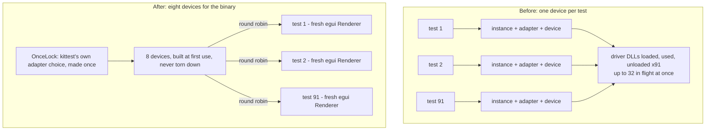

# task-1654 — The screenshots test binary dies with 0xC0000005

## Introduction

`cargo test --workspace --release` in `C:\jason\dev\quill` fails about two runs in five with
`STATUS_ACCESS_VIOLATION` from `screenshots-<hash>.exe`, listing 91 passing tests and no failures.
The ticket reads it as a teardown fault that only appears in a full-workspace run. Measurement says
otherwise on both counts, and the difference matters because it changes what has to be fixed.

This document records what the crash actually is, why the test binary provokes it, the change that
removes the provocation — build the graphics devices **once for the whole test binary** instead of
once per test — and the two further flakes that turned up once the crash stopped hiding them.

## Goals and Non-Goals

**Goals**

- `cargo test --workspace --release` means what it says: repeated runs of the screenshots target with
  zero abnormal exits and zero failures, measured, not asserted.
- The cause is named, not worked around. A "run the screenshots target as its own step" split is the
  fallback, not the answer.
- The 91 screenshots keep rendering through `wgpu` on the same adapter, against the same accepted
  images, with no baseline churn.

**Non-Goals**

- Patching `wgpu`, `egui_kittest` or the graphics driver. The change lives in Quill's own test setup.
- Changing anything the released binary runs. This is test-harness code only.

## Problem statement

### It is not workspace-only

The built binary was run 12 times **on its own** — no cargo, no other test target — and then 25 more
as the baseline arm of a bisection:

| Sample | Abnormal exits | Rate |
|---|---|---|
| 12 isolated runs | 2 | 17% |
| 25 baseline runs | 2 | 8% |
| **37 runs total** | **4** | **~11%** |

Three clean isolated runs — the evidence in the ticket for "clean every time in isolation" — happens
57% of the time at this rate. It was a small sample, not a difference.

### It is not a teardown fault

The `... ok` lines were counted in each crashing run. libtest's stdout is line-buffered, so every line
printed is a test that genuinely finished:

| Crashing run | Tests finished before the fault |
|---|---|
| isolated run 8 | 58 of 91 |
| isolated run 10 | 25 of 91 |
| baseline run 7 | **8 of 91** |
| baseline run 16 | 26 of 91 |

The process dies in the middle of the run, with dozens of tests still to go. The instance in the
ticket — 91 `ok` lines and no `test result:` line — was the same fault landing near the end rather
than a different thing happening at exit.

That rules out both hypotheses the ticket offers: the harness leaving a `wgpu` device alive at exit,
and two test binaries' GPU contexts overlapping as one process exits and the next starts. Neither can
kill a process eight tests in.

### What the binary is actually doing

`egui_kittest`'s `.wgpu()` builds a **brand new** `wgpu` instance for every harness:

```rust
// egui_kittest-0.36.1/src/wgpu.rs
pub fn create_render_state(setup: WgpuSetup, options: RendererOptions) -> RenderState {
    let instance = pollster::block_on(setup.new_instance());
    pollster::block_on(RenderState::create(..., &instance, None, options)).expect(...)
}
```

`screenshots.rs` called it 91 times, once per test, through `harness()` / `harness_in()` /
`with_terminal()`. libtest runs tests on `num_cpus` threads — 32 on this box — so the binary spent
its whole life creating and destroying graphics instances, adapters and devices, dozens alive at
once, on 32 threads, for eight seconds.

Watching the module list under a Win32 debugger written for this ticket
(`_agent_output/task-1654-screenshots-teardown-crash/crashcatch`) shows the cost: `vulkan-1.dll`, the
Intel Vulkan ICD, the NVIDIA D3D user-mode driver, `D3D12Core.dll`, `d3d10warp.dll` and
`dxilconv.dll` all get loaded and unloaded during a single run, some repeatedly. Adapter enumeration
touches every installed backend, so each of the 91 instances walks the whole set.

Nothing in Quill needs that. Every one of the 91 tests wants the same thing: a device to draw
1180x740 into and read back. It is the churn that is unusual, and removing the churn removes the
fault.

## Architectural overview



## Components and interfaces

### The change, in `crates/quill-app/tests/screenshots.rs`

```rust
const DEVICES: usize = 8;

fn shared_render_state() -> RenderState {
    static SHARED: OnceLock<Vec<RenderState>> = OnceLock::new();
    static NEXT: AtomicUsize = AtomicUsize::new(0);
    let shared = SHARED.get_or_init(|| (0..DEVICES).map(|_| {
        egui_kittest::wgpu::create_render_state(
            egui_kittest::wgpu::default_wgpu_setup(), RendererOptions::PREDICTABLE)
    }).collect());
    let mut state = shared[NEXT.fetch_add(1, Ordering::Relaxed) % DEVICES].clone();
    state.renderer = Arc::new(RwLock::new(Renderer::new(
        &state.device, state.target_format, RendererOptions::PREDICTABLE)));
    state
}

fn builder<State>() -> egui_kittest::HarnessBuilder<State> {
    egui_kittest::HarnessBuilder::default()
        .renderer(WgpuTestRenderer::from_render_state(shared_render_state()))
}
```

Every harness in the file is built through `builder()` rather than `Harness::builder()...wgpu()`, so
a test added later cannot go back to a device of its own without meaning to.

The adapter is still chosen by `egui_kittest::wgpu::default_wgpu_setup()`, so *which* adapter draws
the screenshots does not change and neither do the accepted images. `eframe` re-exports `egui_wgpu`,
so this needs no new dependency.

### Why not `WgpuSetup::Existing`, which looks like the obvious route

`egui_wgpu::WgpuSetup` has an `Existing { instance, adapter, device, queue }` variant and
`HarnessBuilder::wgpu_setup` takes it. It is the wrong tool here, because `RenderState::create` runs
this **before** it looks at which variant it was given:

```rust
// egui-wgpu-0.36.1/src/lib.rs, RenderState::create
let available_adapters = instance.enumerate_adapters(backends).await;
```

On the D3D12 path, exposing an adapter *creates a device* to query its features and then destroys it.
So `Existing` keeps the instance but leaves the per-harness enumeration — and its device churn — in
place. Going through `WgpuTestRenderer::from_render_state` with a cloned `RenderState` skips
enumeration entirely, which is the point.

### Why eight devices and not one

One device is correct and was the first fix. It was also four times slower, because each harness still
builds its own `egui_wgpu::Renderer`, which means a shader to compile and a pipeline to build, and on
one device those queue behind each other instead of proceeding on 32 threads:

| Devices | Run time | Result |
|---|---|---|
| 91, built and destroyed (before) | 7.00 s | 91 pass, ~11% of runs die |
| 1, shared | 26.77 s | 91 pass |
| **8, shared** | **5.97 s** | **91 pass** |

Eight gives the tests somewhere to spread out while keeping the property that matters: a fixed number,
built once, never torn down. It comes out quicker than what it replaces as well as safer.

### Is a shared device safe across 32 test threads?

- `wgpu::Device` and `wgpu::Queue` are `Send + Sync` and internally synchronised.
- The screenshot read-back waits on **its own** submission, not on the device as a whole
  (`poll(PollType::Wait { submission_index: Some(index), .. })` in `texture_to_image`), so one test's
  read-back cannot be made to wait for another test's frame.
- Per-test state that must stay separate — the `Renderer`, its textures, the command encoders — is
  still created per harness.
- Device memory: 32 concurrent 1180x740 render targets and their read-back buffers is about 110 MB.

## The two flakes underneath

Both were hidden by the crash and both are the same class of problem — a test failing for a reason
that is not a defect in Quill.

### 1. A shared fixture folder rewritten from 32 threads

`sample_folder()` wrote its eight files on **every** call, and most of the 91 tests call it. A test
could be reading `readme.md` at the moment another test's `File::create` had truncated it and not yet
written the bytes back:

```text
---- clicking_a_file_in_the_explorer_opens_it_in_the_editor ----
assertion `left == right` failed: clicking the file should have loaded it
  left: ""
 right: "# Quill\n"
```

It now builds the folder once behind a `OnceLock`; everyone else waits for it and then reads a file
nobody is writing. The doc comment already claimed the folder was "written once" — now it is.

### 2. Polling loops that used `Harness::run`

`Harness::run` gives the window four steps to go quiet and panics if it has not. That budget is right
for a settled window and wrong inside a loop whose whole job is waiting: while git is still running or
a picture is still being decoded, the window is *meant* to keep asking to be drawn, and on a loaded
machine it can ask for longer than four steps. Under the debugger, which slows the run about 2.5x,
`every_git_operation_can_be_driven_from_the_window` failed with

```text
Harness::run exceeded max_steps (4). Repaint causes: []
```

The three polling loops — `git_harness`, the blame loop and `settle` — now go through a `pump()`
helper on `try_run()`. Running out of steps inside one attempt is no longer a failure; running out of
*attempts* still is, and the caller says which one it gave up on.

## Alternatives considered

| Option | Pros | Cons |
|---|---|---|
| **A small pool of shared devices (chosen)** | Removes the cause. No new dependency, all in the test file. Ends up faster than before. | Introduces process-wide shared state in a test binary; needs the "does it change the images" check. |
| One shared device | Simplest form of the same idea | 4x slower for no extra safety. |
| Serialise harness construction behind a global mutex | Small change | Only narrows the window — devices are still built and destroyed 91 times, and destruction happens at drop, scattered. Treats the symptom. |
| Force `--test-threads=1` | Trivial | Turns a 6 second target into minutes, and a single-threaded run still builds 91 devices. |
| Pin `WGPU_BACKEND` | Trivial | Changes what the screenshots are rendered on, risking the baselines, and leaves the churn for whoever runs it elsewhere. |
| Run the screenshots as their own CI step | Zero code | The ticket's own fallback. Hides the failure; `cargo test --workspace` still cannot be trusted. |

## Testing strategy

Functional, on the real binary, with counts rather than impressions. Everything lives in
`_agent_output/task-1654-screenshots-teardown-crash/`.

1. **Crash rate, before and after.** The built binary is run 40 times in a loop; every non-zero exit
   is recorded along with how many tests had printed `ok`. Before: 4 in 37. After: zero is the bar. At
   the measured 11% rate, 40 clean runs in a row has about a 1% chance of happening by luck.
2. **The images are unchanged.** Every run is checked for a `.new.png` or `.diff.png` appearing beside
   the accepted baselines. This is what catches a shared device quietly changing the rendering.
3. **The whole workspace.** `cargo test --workspace --release` run end to end, repeatedly, since that
   is the command the ticket says cannot be trusted.
4. **The bisection is kept** as the evidence for the diagnosis, along with the debugger written to get
   the faulting module, so the reasoning can be re-checked rather than taken on trust.

### Results

Measured on this machine, all of it in
`_agent_output/task-1654-screenshots-teardown-crash/`.

| Sample | Abnormal exits | Notes |
|---|---|---|
| **Before**, 37 runs of the unmodified binary | **4** (~11%) | all `0xC0000005`, all mid-run: 8, 25, 26 and 58 tests in |
| After the device pool, 40 runs | 1 | **no access violations**; the one was the fixture race below, exit 101 |
| **After all three fixes, 40 runs** | **0** | 91/91 every run, and no `.new.png` or `.diff.png` written |
| `cargo test --workspace --release`, **31 runs** | **0** | 489 passing, about 10 seconds a run |

The run also got quicker: 5.97 s against 7.00 s for the screenshots target.

Three separate things were making this suite untrustworthy, and the crash was hiding the other two:

| | What | Fix |
|---|---|---|
| 1 | 91 wgpu devices built and destroyed across 32 threads | a fixed pool of 8, built once, never torn down |
| 2 | `sample_folder()` rewritten concurrently by most of the tests | built once behind a `OnceLock` |
| 3 | polling loops using `Harness::run`, which panics after four unsettled steps | a `pump()` helper on `try_run()` |

The three rules that keep them fixed are written into `CLAUDE.md` under Tests, and the reasoning for
each sits on the code it belongs to — `DEVICES`, `shared_render_state`, `sample_folder` and `pump`.

### What was measured and then abandoned, and why

A `--test-threads=1` arm was started and stopped. At eight runs against an 11% per-run rate, a clean
result has a 39% chance of meaning nothing, so it could not have settled anything either way, and each
run cost about three minutes and held the lock on the test binary. The `WGPU_BACKEND=dx12` and
`WGPU_BACKEND=vulkan` arms went with it. Removing the churn is a direct test of the same claim and is
both cheaper and better powered; if it had not held, those arms would have come back.
