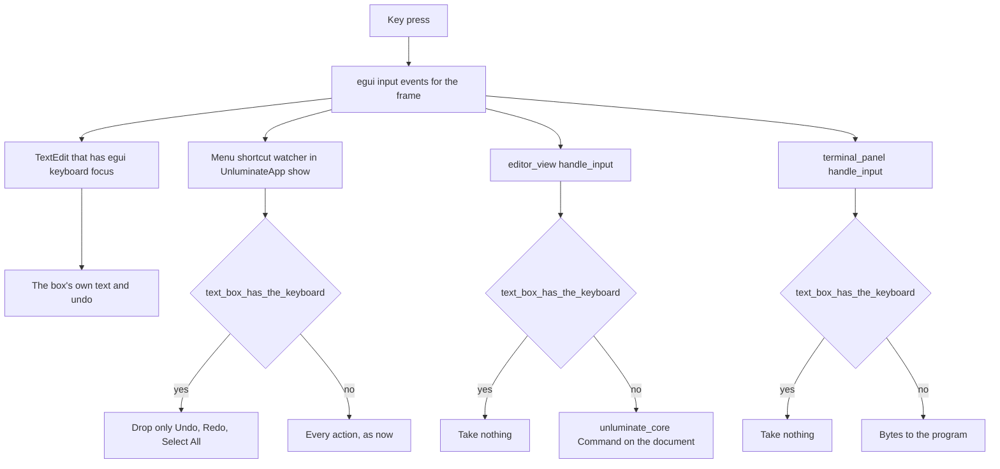

# Typing in a text box must not also type into the document

## Introduction

Clicking into the file explorer's filter box and typing puts the characters in the filter box, which
is right, and puts the same characters into the open file as well, which is not: the tab grows an
unsaved dot and the caret moves. `Ctrl+Z` then undoes the document's insert and clears the filter box
in one press, because both are reacting to the same key.

The fault is that the editing area reads the frame's raw key and text events and knows nothing about
egui's own keyboard focus. This document says what the editing area should ask before it consumes a
key press, where that question belongs, and which of the menu's shortcuts a focused text box is
entitled to keep for itself.

## Goals and Non-Goals

**Goals**

- Typing in any of the window's text boxes — the explorer's filter, the commit message, the rename
  prompt, the plugin search, the settings search — changes only that box. The document's text, its
  caret and its modified flag are untouched.
- `Ctrl+Z`, `Ctrl+Shift+Z` and `Ctrl+A` mean the box that has the keyboard while one has it, not the
  document.
- The rest of the menu keeps working while a box has the keyboard: `Ctrl+S` in the filter box still
  saves the file, as it does in every other editor.
- One place decides the question, used by the editing area, the terminal and the shortcut watcher.
- A regression test for each box, so a tenth text box added later is covered by the same guard rather
  than by a tenth fix.

**Non-Goals**

- No change to how Unluminate's own two-way focus works — `Focus::Editor` and `Focus::Terminal` stay as
  they are. This is the other half of the question, not a replacement for it.
- No new text boxes, no change to what any box does, and no change to the rendering. The accepted
  screenshots must not move.
- The terminal is already correct; it is only being moved on to the shared question.

## Problem statement

`components::editor_view::handle_input` takes the frame's events and turns each one into a
`unluminate_core::Command`:

```rust
let events = ui.input(|input| input.events.clone());
```

Its only guard is `has_focus`, which `app::UnluminateApp::show_editor` computes as
`self.focus == Focus::Editor`. That enum has two values, `Editor` and `Terminal`, and answers the
question *editing area or terminal*. It cannot answer *has some other widget taken the keyboard*,
and nothing else asks.

egui does not remove the events a `TextEdit` has consumed from `input.events` — the list is the
frame's input and every reader sees all of it. So while the explorer's filter box has egui's
keyboard focus and is taking `Event::Text("n")` for itself, the editing area reads the same event a
moment later and inserts `n` into the file.

The same is true of the menu shortcut watcher in `UnluminateApp::show`, which walks `input.events` looking
for a shortcut. `Ctrl+Z` in the filter box reaches egui's text box undo **and** `Action::Undo`, which
is why one press does both.

The terminal had this fault and it was fixed: `terminal_panel::handle_input` returns early when
`ui.memory(|memory| memory.focused().is_some())`, so the filter box can be typed into with the
terminal open. The editing area never got the same guard, and the shortcut watcher never got one at
all.

Impact: the filter box, the rename prompt, the commit message and both searches all silently corrupt
the file that is open. The commit message box is the worst of them — a paragraph of prose typed into
a commit message is a paragraph inserted into the source file behind it.

## Architectural Overview



Today `Q2` and `Q1` do not exist, so `RAW` reaches `DOC` and `ACT` at the same time as it reaches
`BOX`. `Q3` is already there.

## Detailed Technical Sections

### One question, one place

`app::text_box_has_the_keyboard(ctx) -> bool`, next to `Focus` in `app/mod.rs`, because it is the
other half of what `Focus` means: `Focus` says whether the editing area or the terminal is the one
being typed into, and this says whether either of them is being typed into at all.

```rust
pub fn text_box_has_the_keyboard(ctx: &egui::Context) -> bool {
    ctx.text_edit_focused()
}
```

`Context::text_edit_focused` is asked rather than `Context::egui_wants_keyboard_input`. The second is
`memory.focused().is_some()`, which is true of **any** focusable widget, and every control Unluminate
draws with `Sense::click` is focusable — so a control reached with Tab would stop the document being
typed into. `text_edit_focused` is true only when the widget holding focus is one that takes text,
which is exactly the case being guarded against. In egui 0.36 only `TextEdit` and `DragValue` ask
for focus when clicked, and Unluminate has no `DragValue`.

### The editing area

The guard goes inside `editor_view::handle_input`, beside the `has_focus` check it already has,
rather than at the call site — the same shape the terminal uses, so a later caller cannot forget it,
and so a test that calls `handle_input` directly is testing the real rule.

The mouse is untouched. `handle_pointer` still places the caret, because clicking in the document is
how the document is meant to take the keyboard back, and egui surrenders the box's focus on that same
click.

**Ordering is already right and does not need arranging.** `UnluminateApp::show` draws the explorer before
the editing area, so on the frame the filter box is clicked it has already asked for focus by the
time the editing area asks the question. The dialogs are drawn *after* the editing area, but focus
persists in `egui::Memory` between frames, so on every frame that carries a typed character the
answer from the previous frame is the right one. The frame in which a box is first clicked carries a
click and no text.

### The shortcuts

`actions::action_for_key` keeps its signature. A new predicate says which actions a focused text box
is entitled to:

```rust
impl Action {
    /// True when a text box that has the keyboard does this for itself.
    pub fn belongs_to_a_focused_text_box(&self) -> bool {
        matches!(self, Action::Undo | Action::Redo | Action::SelectAll)
    }
}
```

Three, and no more. Cut, copy and paste are already `keyboard: false` in `menus`, because the
platform delivers them as clipboard events, so they never reach this watcher. Everything else on
every menu keeps working while a box has the keyboard, which is what a person expects: `Ctrl+S` in a
search box saves the file in every editor there is.

The watcher in `UnluminateApp::show` asks the question once per frame and skips those three when the
answer is yes.

### What each box gets, and why nothing is per-box

| Box | Today | After |
|---|---|---|
| Explorer filter | text also inserted into the file | filter only |
| Commit message | text also inserted into the file | message only |
| Rename and new file prompt | text also inserted into the file | prompt only |
| Plugin search | text also inserted into the file | search only |
| Settings search | text also inserted into the file | search only |

Nothing in that list is named in the fix. The guard is one question about egui's focus, so a text box
added next year is covered on the day it is added.

## Data Flows and Security

No new data, no new files, no new process, nothing read or written. The change is which reader of an
existing in-memory event list acts on it.

The risk worth naming is **over-blocking**: a guard that is too broad leaves the document unable to
be typed into after some other control takes focus. That is why the predicate is `text_edit_focused`
rather than `focused().is_some()`, and why only three of the menu's actions are withheld. Both are
covered by tests that assert the positive case — the document is typed into normally, and `Ctrl+S`
still saves while a box has the keyboard.

The second risk is a **one frame leak**: a character reaching the document on the frame focus
changes. Ruled out above by the draw order and by focus persisting across frames, and covered by a
test that types a whole word rather than a single letter.

## Alternatives Considered

| Option | Pros | Cons |
|---|---|---|
| **Ask `text_edit_focused` in one shared place** (chosen) | One question, three readers; covers every text box now and later; the terminal moves on to the same answer | Depends on an egui predicate rather than something Unluminate owns |
| Ask `egui_wants_keyboard_input`, which is `focused().is_some()` | What the terminal used; slightly cheaper | True for any focusable widget, and every Unluminate control is focusable, so tabbing to a button would stop the document taking typing |
| Give each box a flag the app reads, such as `filter_has_focus` | Explicit; no egui internals | One flag per box, five today, and a sixth box means a sixth flag and a sixth chance to forget one |
| Add a `Focus::TextBox` variant to Unluminate's own enum | Fits the existing idea of focus | Unluminate would have to be told which box, and by whom, and would then be tracking what egui already tracks correctly |
| Consume the events in the box so later readers cannot see them | No guard needed anywhere | egui's `TextEdit` does not offer it, so it would mean draining `input.events` behind egui's back and breaking anything downstream that legitimately wants them |
| Stop drawing the editing area while a box has focus | Trivially correct | The document would vanish from the window while a filter is typed |

## Testing strategy

Functional, through the real window, in `crates/unluminate-app/tests/screenshots.rs`, driving the same
controls a person drives. No new accepted image is needed — nothing about the rendering changes.

| Test | What it does | What it asserts |
|---|---|---|
| `typing_in_the_explorers_filter_box_leaves_the_document_alone` | open `readme.md`, click `Filter files`, type `note`, press backspace | the filter is `not`; the document's text is what it was and it is not modified |
| `clicking_back_into_the_document_takes_the_keyboard_back` | type in the filter box, click the editing area, type again | the filter keeps its text and the document takes the second word — the guard lets go |
| `undo_in_a_text_box_does_not_undo_the_document` | type into the document, click the filter box, press `Ctrl+Z` | the document still has what was typed into it |
| `select_all_in_a_text_box_does_not_select_the_document` | click the filter box, press `Ctrl+A` | the document's selection is still empty |
| `the_rest_of_the_menu_still_works_while_a_text_box_has_the_keyboard` | click the filter box, press `Ctrl+S` | the file on disk has the document's text, so the guard did not swallow the rest of the menu |
| `typing_a_new_name_in_the_rename_prompt_leaves_the_document_alone` | open the rename prompt, type | the prompt's value is what was typed; the document is unchanged |
| `typing_a_commit_message_leaves_the_document_alone` | open the commit panel, type into the message | the message is what was typed; the document is unchanged |
| `typing_in_the_plugin_search_leaves_the_document_alone` | open the plugins page, type in the search | the document is unchanged |
| `a_box_that_takes_typing_keeps_the_keyboard_while_the_terminal_is_open` | already exists | still passes with the terminal on the shared question |

**The undo test deliberately types nothing into the filter box first.** With a character in the box,
`Ctrl+Z` would be undoing the box's own insert and the document would come back to the same text
whether or not the watcher had been fixed — the test passed against the unfixed code when it was
written that way. Focusing the box and pressing the shortcut with nothing typed is what tells the two
apart.

Unit tests in `app/actions.rs` for `belongs_to_a_focused_text_box`: true for undo, redo and select
all, false for save, save as, the settings, both toggles and the view mode.

**Every test above was run against the unfixed code**, and eight of the nine fail there — the
exception is the `Ctrl+S` one, which is the over-blocking guard and is meant to pass either way.

### Two things the run turned up that were not in the plan

`typing_in_the_terminal_reaches_the_shell_and_not_the_document` failed once on the first full run,
with `Harness::run exceeded max_steps (4)` and the terminal's own waker as the repaint cause. It is
the one test that starts a real shell, and it called `Harness::run` in its waiting loop — the thing
this file's own rules say not to do, because a shell writing its prompt keeps asking for the window
to be drawn and four steps is the budget for a settled window. Those calls are `pump` now. Four full
runs since, all green.

The live walk on Windows is a script, `_agent_output/task-1656-keyboard-focus/walk-the-reproduction.ps1`,
which takes the path of the binary so the same steps can be run against a build from either side of
the fix. Two attempts at it proved nothing before it worked, and both are worth writing down:

- **`SendKeys` and a real mouse click go to whatever window is in front.** The first attempt typed
  `note` into a terminal that happened to be over Unluminate, and reported the document unchanged, which
  was true and meaningless.
- **Messages posted to the window handle never arrive.** `WM_LBUTTONDOWN` and `WM_CHAR` posted to the
  window left both the filter box and the document untouched on a build from *before* the fix — the
  run that should have shown the fault. That is what says the mechanism was dead rather than the
  window being right.

What works is raising the window, taking the foreground with the synthetic Alt press in front of
`SetForegroundWindow`, and then **refusing to type at all** unless `GetForegroundWindow` agrees the
window is Unluminate's. `MainWindowHandle` is no good either — it comes back with a zero sized client
area, because the window has no decorations and is composed through a DirectComposition visual, so
the window is found by walking the process's top level windows.

Before the fix: the filter box reads `note`, line one reads `note# Unluminate`, the tab, the title bar and
the status bar all carry the unsaved mark and the caret is at `Ln 1, Col 5`. After it: the filter box
reads `note`, line one reads `# Unluminate`, there is no unsaved mark anywhere and the caret is at
`Ln 1, Col 1`. The two pictures are beside the script.
