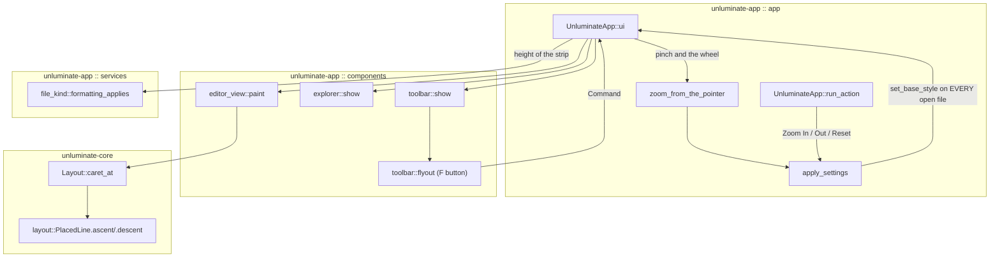

# Text options: a font button, a global font, zooming, and two things that look wrong

A technical design for `task-1657`. Six asks, and they divide cleanly into two halves: three that
change what the window offers about text, and three that are small, visible faults with a single
cause each.

The three that change the window:

1. The formatting strip along the top is shown whether or not it means anything for the file being
   edited, and it takes forty-four points of the window to do it. It becomes **one button** — an
   `F` — that opens a flyout, and the strip itself is drawn **only when it applies to the open file**.
2. The font family and size chosen in Settings reach only the file that happens to be showing. They
   become **global**, the way IntelliJ's editor font is: every open tab, the Markdown preview and
   every file opened afterwards are set in it.
3. There is no way to change the size without opening Settings. **Pinch** on a trackpad and
   **Ctrl/Cmd with plus, minus and zero** change it in place, and what they change is the same global
   setting, so it is still there next time Unluminate starts.

The three that are faults:

4. `Filter files` sits against the top of its box rather than in the middle of it.
5. The caret is drawn the full height of the line box, which includes the reading leading below the
   text, so it stands taller than the letters beside it.
6. The documentation's captures are of the window as it was before any of the above.

---

## Goals

- The formatting controls are reachable from one named button and nothing else in the toolbar moves.
- No formatting strip at all on a file where formatting means nothing — a `.rs`, a `.json`, a `.toml`
  — and the editing area gets those forty-four points.
- Changing the font in Settings changes **every** open document, and a document opened afterwards.
- Pinching over the editing area, and Ctrl/Cmd `+` `-` `0`, change the editor's font size, are
  clamped to the range Settings offers, and are written to the settings file.
- The caret is the height of the text it sits in.
- `Filter files` is centred in its box.
- `documentation/overview.md` and its images show the window as it is after this work.

## Non-goals

- **Not** a per-file font. IntelliJ has one editor font; so does Unluminate.
- **Not** egui's own zoom. `Ctrl+=` in egui scales the whole interface, menus and all. That is not
  what IntelliJ's `Ctrl+Mouse Wheel` does and not what is being asked for, so egui's keyboard zoom is
  switched off and the key presses become Unluminate's own actions.
- **Not** a change to what formatting *does*. Bold is still bold; it is only reached differently.
- **Not** a new row height, colour or type size. Everything here is drawn out of `theme::color`,
  `theme::size` and the type scale already in `design/style-guide.md`.

---

## Problem statement

Unluminate draws a 44-point strip under the title bar holding bold, italic, underline, strikethrough, five
colour circles, four alignments, a line-spacing dropdown and the three Markdown view modes. It is
drawn identically for `welcome.md` and for `main.rs`.

For a code file every one of those controls is meaningless. Unluminate saves plain text and carries no
formatting to disk, so bold on a `.rs` file is a decoration that lasts until the file is reopened,
and the three view-mode buttons switch between a Markdown source and a Markdown preview of a file
that is not Markdown. Fourteen controls that do nothing, above the code, on every code file.

Even for prose the strip is a lot of window given permanently to nine settings that are set rarely.

The font is worse than useless — it is inconsistent. `Settings -> Appearance -> Font` writes
`appearance.font.family` and `appearance.font.size` to the settings file, but
`UnluminateApp::apply_settings` applies the change to `self.document_mut()`, which is the **active tab
only**. Open three files, change the font, and the two tabs that were not showing keep the old one
until Unluminate is restarted. The Markdown preview keeps it too, because `self.preview` is rebuilt from
the source and the source's base style was never changed.

And there is no way to change the size without the modal. Every editor has had a keyboard zoom for
thirty years; a trackpad pinch is what a person tries first.

The two drawing faults are one line each and both are visible in any screenshot:

- `explorer.rs` puts the filter `TextEdit` in a child `Ui` whose rectangle is the whole 24-point box.
  With `Frame::NONE` there is no margin, so egui lays the text out at the **top** of that rectangle
  and the words sit about three points high.
- `editor_view::paint` draws the caret at `caret.height`, which is `PlacedLine::height` — the line
  metrics multiplied by the paragraph's line spacing. `TextRenderer::line_metrics` deliberately adds
  `READING_LEADING` on top of the font's own ascent, descent and line gap, because prose wants air
  between lines. The caret therefore includes air that no glyph occupies, and at double spacing it is
  twice as tall as the text.

---

## Architectural overview



Nothing new is drawn by a component that also changes state, and nothing new is decided in two
places: whether the strip is shown, whether the `F` button is shown and whether the view modes are
shown are all one function of the open file's path.

---

## 1. The formatting controls become one button

### What the toolbar holds afterwards

| Open file | The 44-point strip | `F` button | View modes |
|---|---|---|---|
| `welcome.md` | yes | yes | yes |
| an untitled document | yes | yes | yes |
| `notes.txt` | yes | yes | no |
| `main.rs`, `Cargo.toml`, `data.json` | **no strip at all** | — | — |

The rule is one function, in the service that already answers every other question about what a file
is:

```rust
/// True for the files the character and paragraph formatting means something for.
///
/// Unluminate saves plain text and carries no formatting to disk, so formatting is how a document is
/// *shown*. That is worth having for prose — Markdown, a text file, a document that has not been
/// saved yet — and is noise above a source file, where the reader wants the code and the plugin's
/// colouring decides what it looks like.
pub fn formatting_applies(path: Option<&Path>) -> bool
```

Markdown, `.txt`/`.text`, and a document with no path are prose. Everything else is not. It is
written against `kind_name`'s own table so a file gains prose or loses it in one place.

The view modes are a second question, `file_kind::preview_applies`, and not the same one: Markdown,
and a document that has not been saved anywhere yet. An unsaved document has no extension to go on,
is very often the beginning of a Markdown file, and is the one Unluminate starts with. The `View` menu's
three mode entries are dimmed by the same function, so the menu and the buttons cannot come to
different answers about the same file.

### The flyout

`components::toolbar` grows a second entry point. `toolbar::show` draws the strip; when formatting
applies it draws one 28-point square button at the left carrying the `F` mark, and the four format
buttons, the five colours, the four alignments and the line spacing move inside a popup hung off it.

The popup is `controls::flyout`, a thin wrapper over the same `egui::Popup::from_toggle_button_response`
that `controls::dropdown` already uses — the same fill, the same one-point `CONTROL_BORDER` stroke,
the same close-on-click-outside. `dropdown` is a value picker and gives back one `T`; a flyout is a
panel and gives back a `Vec<Command>`, so it is a sibling rather than a parameter on the existing one.

Inside, the controls keep their present drawing exactly — `format_button`, the colour circles,
`alignment_button` and the spacing dropdown are moved, not rewritten — laid out in three rows with a
`DIVIDER` rule between them and the section names at 11.5 points, which is the "line of explanation"
step of the type scale:

```
Format    B  I  U  S
Colour    (o)(o)(o)(o)(o)
Paragraph [<] [=] [>] [J]      Line spacing [ Single      v ]
```

Every control keeps the name it already has — `Bold`, `Red`, `Left`, `Line spacing` — so the existing
tests find them once the flyout is open, and the button itself is named `Text options`.

### The `F` mark

`theme::icon::font`, drawn like every other icon: three strokes inside a 10-point square, a stem and
two arms. The style guide's rule that "nothing is a letter or a Unicode symbol" is about *glyphs* —
egui's fonts have no shape for most icons and an absent glyph renders as an empty box — and a drawn
`F` is a drawing, not a glyph. It is the same argument the toolbar's `B` already makes and loses:
`B` is real text and needs `theme::BOLD_FAMILY` bound before the first frame to look right. An `F`
built from three lines needs no font at all, matches the stroke weight of `plus`, `collapse` and
`branch`, and stays sharp at any scale.

The ticket offers to have one generated with Ideogram. That is refused, and the reason is written
here so it is not re-proposed: every other icon in Unluminate is vector strokes tinted at the point of
use — `color::TEXT_DIM` when idle, `color::TEXT_STRONG` when the flyout is open — and a raster PNG
can be neither tinted nor drawn at the window's scale without resampling. One image among fourteen
drawings would be the one that looks wrong.

### Where the height is decided

`UnluminateApp::ui` currently reserves `size::TOOLBAR` unconditionally. It becomes:

```rust
let toolbar_height = if toolbar::applies(self.document().path()) { size::TOOLBAR } else { 0.0 };
```

and the divider under it is drawn only when the height is not zero. Everything below already measures
from `toolbar_rect.bottom()`, so the editing area, the explorer, the tabs and the terminal all take
the room without any other change.

---

## 2. The font becomes global

One method, and every path that sets a base style goes through it:

```rust
/// Show every open file in the settings' font.
///
/// The editor's font is one setting, the way IntelliJ has one editor font, so a change reaches
/// every tab rather than the one that happens to be showing. This is not an edit: it pushes
/// nothing onto any document's undo history and marks no file as changed, because what Unluminate
/// saves is plain text and carries no formatting.
fn set_the_font_everywhere(&mut self)
```

It walks `self.files` and calls `Document::set_base_style` on each, drops `self.preview` so the
preview is rebuilt in the new font, and calls `forget_layout`. `apply_settings` calls it instead of
touching `document_mut()`. `open_path_in_tab` and `reload_from_disk` keep their single call, because
a document that has just been read is the only one whose base style is stale.

A test opens three files, changes the size and asserts the base style of all three.

---

## 3. Pinch, and Ctrl/Cmd with plus, minus and zero

### The keyboard

Three actions, three entries at the foot of the `View` menu, one arm each in `run_action`:

| Entry | Shortcut | What it does |
|---|---|---|
| `Increase Font Size` | `Cmd/Ctrl` `+` | the next size up in `settings::FONT_SIZES` |
| `Decrease Font Size` | `Cmd/Ctrl` `-` | the next size down |
| `Reset Font Size` | none | back to 16, the size a new Unluminate has |

They are menu entries rather than keys read in the editing area because of the rule already in
`CLAUDE.md`: on macOS a shortcut on a menu item is a key equivalent and AppKit takes it before egui
sees it, so a key watched for in `editor_view` would work on Windows and be dead on macOS.

**`Reset Font Size` gets no shortcut, and this is a change from what this document first said.** The
obvious one is `Cmd+0`, and `View -> Show/Hide Explorer` already has it; the first plan was to move
the explorer to `Cmd+1` and shift the three view modes to `Cmd+2`, `Cmd+3` and `Cmd+4`. That churns
three shortcuts a person may already have in their fingers, and three documented ones, to buy one the
ticket never asked for. Two menu items sharing one key equivalent is a fault on macOS and there is a
test asserting none do, so the choice was between renumbering and going without; going without costs
nothing.

`Shortcut::matches` grows one rule, and only one: **a shortcut asking for `Plus` accepts `Equals` as
well, and does not compare shift**. They are one key on nearly every layout and `+` is the shifted
one, so `Ctrl+=`, `Ctrl+Shift+=` and the keypad's `+` are all a person pressing "control and plus".
Every other shortcut still compares shift exactly, which is what keeps `Cmd+S` and `Cmd+Shift+S`
apart, and there is a test for that too.

The stepping walks `FONT_SIZES` — 9, 11, 13, 16, 20, 24, 32, 48, 64 — so the keyboard and the
Settings dropdown cannot disagree about what sizes exist. A size not in the list, which the file can
hold, steps to the nearest neighbour in the direction asked for.

**egui's own keyboard zoom is switched off** in `theme::apply`:

```rust
ctx.options_mut(|options| options.zoom_with_keyboard = false);
```

Without this, `Cmd+=` would scale the whole interface — every menu, the explorer, the status bar —
*as well as* running the action, which is two zooms on one press and is not what any editor does.

### The pinch

`egui::InputState::zoom_delta()` reports a trackpad pinch as a multiplier, and reports `Ctrl` with
the wheel as the same multiplier — which is IntelliJ's `Ctrl+Mouse Wheel` for free. egui also
suppresses `smooth_scroll_delta` while the zoom modifier is held, so the document does not scroll
while it is being zoomed.

It is read in `show_editor` and accumulated, and it **steps the same list the keyboard steps**
rather than setting whatever size the multiplier works out to. A size the dialog cannot show is a
size a person cannot get back to, and one step per notch of a wheel is what every other editor does.

```rust
self.zoom_pending *= gesture;
while self.zoom_pending >= ZOOM_STEP {
    self.zoom_pending /= ZOOM_STEP;
    self.set_font_size(settings::step_font_size(self.settings.font_size, true));
}
```

`ZOOM_STEP` is 1.18, the smallest gap between two of the sizes Settings offers. A ratio rather than a
number of points on purpose: what one notch of a wheel is worth in points is a platform's business
— measured on this machine it is about 55, a third more than egui's own default assumes — and the
ratio a gesture is asking for is the same everywhere. The remainder is carried into the next frame,
because a pinch arrives as a stream of multipliers a fraction over one and a slow one would otherwise
never move anything. `unsaved_settings` is set, and the existing rule writes the file once the
pointer comes up, so a whole gesture writes the settings file once.

**What it must not be gated on is `response.hovered()`, and finding that out took measuring the real
window.** A two notch gesture produced thirty eight frames, eleven of them carrying a zoom — and on
every one of those eleven `hovered()` was false *and* `pointer.hover_pos()` was `None`, because egui
reports no pointer at all on a frame whose only input is a wheel event. Gated on either, the whole
gesture was thrown away and the text never moved. It runs when the editing area has the keyboard, or
when the pointer is demonstrably inside it.

---

## 4. The filter box

The child `Ui` is given a rectangle the height of one line of text, centred in the box:

```rust
let row = ui.text_style_height(&egui::TextStyle::Body);
let text_rect = Rect::from_min_size(
    Pos2::new(filter_rect.left() + 26.0, filter_rect.center().y - row / 2.0),
    Vec2::new(filter_rect.right() - filter_rect.left() - 34.0, row),
);
```

The magnifier is already centred on `filter_rect.center().y`; after this the words are on the same
line as it. The same shape is what the style guide calls "a text field", so the plugin search and the
settings search are checked against it and moved onto it if they have the same fault.

## 5. The caret

`PlacedLine` gains the two numbers layout already computed and threw away:

```rust
/// The tallest ascent in the line, and the deepest descent, without the line gap or the
/// reading leading. Together they are the box the glyphs actually occupy, which is what the
/// caret is drawn to: a caret the full height of the line stands above and below the letters
/// beside it, by the leading that was added to give prose air.
pub ascent: f32,
pub descent: f32,
```

`Layout::caret_at` returns the glyph box rather than the line box:

```rust
Caret {
    x,
    y: line.y + line.baseline - line.ascent,
    height: line.ascent + line.descent,
    line: index,
}
```

Both branches of `layout` already compute `ascent`; `descent` is `max` over the same runs. The empty
paragraph keeps its centred baseline, so the caret on a blank line sits where the text would.

Scrolling to the caret uses `caret.y` and `caret.height` and still works: the box is inside the line,
so a caret brought into view brings its line with it.

---

## Alternatives considered

| Instead of | Why not |
|---|---|
| **Keep the strip and dim the controls on a code file.** | Fourteen dimmed controls still take the room and still have to be read past. The ask is that it not be shown. |
| **Hide only the controls and keep the empty 44-point strip.** | An empty bar is worse than either answer: it looks like something failed to draw. |
| **Put the formatting on the `Edit` menu instead of a flyout.** | The ask names an icon and a flyout. A menu also loses the state — the flyout shows which colour and which alignment are on, and a menu row cannot show a colour circle. |
| **A generated `F` image from Ideogram.** | A raster cannot be tinted for hover or drawn at the window's scale without resampling, and would be the one icon in Unluminate that is not vector strokes. Recorded above so it is not proposed again. |
| **A per-file font.** | Not what IntelliJ does and not what was asked. It would also need a place to store a font per path. |
| **Let egui's `zoom_factor` do the zooming.** | It scales the whole interface — the menus, the explorer, the status bar — not the editor's text. IntelliJ zooms the editor. |
| **Read `Ctrl` `+`/`-` in `editor_view::handle_input`.** | Dead on macOS if the same shortcut is ever on a menu, and it would not work in preview mode where there is no editing area taking keys. |
| **Make the caret a fixed fraction of the font size.** | It would be wrong for a line holding two sizes. The layout already knows the tallest ascent in the line. |

---

## Testing strategy

Four layers, as `CLAUDE.md` requires, and every new control has a name so a test can find it.

**`unluminate-core`, no window:**

- `a_caret_is_the_height_of_the_text_and_not_of_the_line_box` — with `ScaledMetrics` at double
  spacing, `caret_at(0).height` is `ascent + descent` and strictly less than `lines[0].height`.
- `a_caret_on_a_line_of_two_sizes_takes_the_taller` — a line holding 12-point and 32-point runs gives
  a caret as tall as the 32-point box.
- `a_caret_on_an_empty_line_sits_where_the_text_would` — the empty-paragraph branch.

**`unluminate-app` units:**

- `formatting_applies_to_prose_and_not_to_code` — `.md`, `.txt` and `None` are true; `.rs`, `.json`,
  `.toml`, `Makefile` are false.
- `the_view_menu_has_no_two_entries_on_one_shortcut` — already exists; it now covers `Cmd+0`
  through `Cmd+4` and the three zoom entries.
- `stepping_up_and_down_walks_the_sizes_the_settings_offer`, including from a size not in the list.

**`unluminate-app` screenshots, through the real window:**

- `the_toolbar_is_one_font_button_and_the_controls_are_behind_it` — `Text options` exists,
  `Bold` does not until it is clicked, and does after.
- `a_code_file_has_no_formatting_strip` — open `main.rs`; `Text options` is absent and the editing
  area's top is 44 points higher than it is on a Markdown file.
- `changing_the_font_size_changes_every_open_tab` — three files open, one setting changed, all three
  base styles asserted.
- `control_and_plus_makes_the_text_bigger_and_control_and_zero_puts_it_back`.
- `the_filter_box_text_sits_in_the_middle_of_its_box` — the `TextEdit`'s rectangle is centred in the
  field, within half a point.
- `the_caret_is_no_taller_than_the_text` — asserted from the layout rather than from pixels.

Every existing image that holds the toolbar is re-accepted with `UPDATE_SNAPSHOTS=1`, and each one is
opened and looked at before it is accepted, which is the rule in `CLAUDE.md`.

**The real application:** `cargo run --release`, then the eighteen documentation captures are retaken
with the harness in `_agent_output/task-1655-screenshots/` and `documentation/overview.md` is
rewritten around them — including a new capture of the flyout open, and one of a code file with no
strip above it.


---

## What else this turned up

Four faults that were already there, found by doing the work above rather than by looking for them.
All four are fixed here, because each is a line or two and each was visible in something this ticket
had to produce.

- **Control and Tab typed a tab into the file it was leaving.** `Next Tab` and `Previous Tab` are
  menu entries on control and Tab, and finding an action for a key press does not consume it, so
  `editor_view::handle_input` saw the same press and inserted `	`. Both files came out marked as
  having unsaved changes that nobody had made — which is how it was found: the file tabs capture for
  the documentation had two amber dots in it. The same shape of fault as `task-1656`, and the guard
  is the same shape too: a bare Tab inserts, a Tab with control does not.
- **The tick on a menu row was an empty box.** `controls::menu_row` drew the character at U+2713, and
  no font in the stack Unluminate hands egui has a shape for it. It is the exact fault the style guide
  already records for the shift symbol at U+21E7, and it was on `Raw Markdown` on the `View` menu in
  every capture of it. It uses `icon::tick` now, which is the tick every tick box in Unluminate draws.
- **Four keys were missing from the macOS menu bar's key code table.** `D`, `K`, `Tab` and `F4`, so
  `Show Diff`, `Commit...`, `Next Tab` and `Close Tab` would have been drawn in the bar along the top
  of the screen with no shortcut beside them — and `every_shortcut_in_the_menus_has_a_key_code`, which
  only compiles on macOS, would have been failing. Found while adding `Plus` and `Minus` for this
  ticket.
- **All five text fields laid their words out against their top edge**, not only the explorer's
  filter. `controls::field_text_rect` is one answer for all of them.
