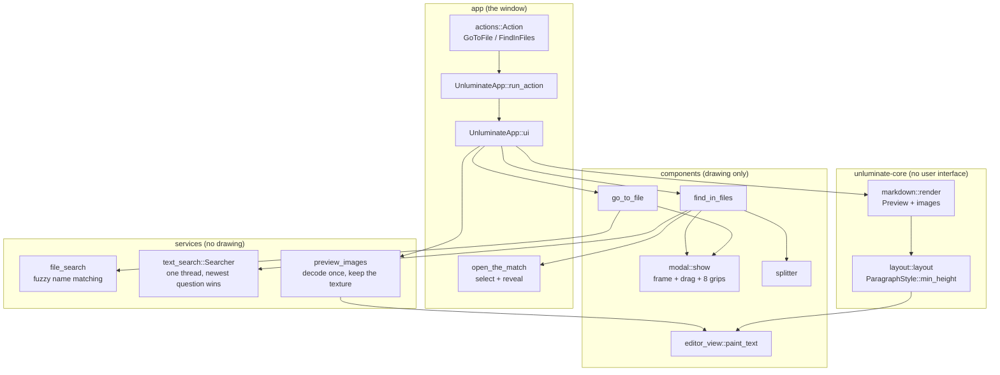
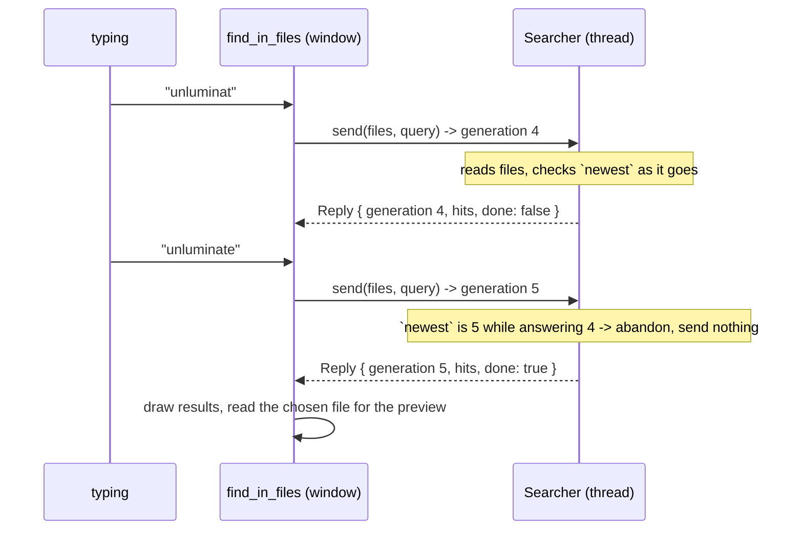
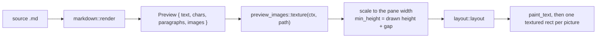

# task-1659 — Go to File, Find in Files, movable modals, and pictures in the Markdown preview

## Introduction

`task-1659` asks for three things Unluminate has not had, all of them modelled on IntelliJ: a **Go to
File** box on `Ctrl/Cmd+Shift+O` that narrows a list of the project's files as you type and opens one
on a double click; a **Find in Files** modal on `Ctrl/Cmd+Shift+F` that searches the whole project as
you type, highlights the match in the document it opens, and shows the whole of the chosen file in a
preview under the results; and a **Markdown preview that draws pictures** rather than showing the
alt text where an image should be. It also asks that the modals involved be **draggable and
resizable**.

Three of the four are new user interface over machinery Unluminate already has — a file tree, a text
buffer, a layout engine, a modal shape. The fourth, pictures in the preview, is the only one that
reaches into `unluminate-core`: the layout engine places glyphs and has no notion of a line that is taller
than its letters, and an image is exactly that.

## Goals and non-goals

**Goals**

| # | Done means |
|---|---|
| 1 | `Ctrl/Cmd+Shift+O` opens a modal; typing narrows the project's files; a double click or Enter opens one and shuts the modal. |
| 2 | `Ctrl/Cmd+Shift+F` opens a modal; typing searches every text file in the project without the window stopping; results appear as they are found. |
| 3 | Choosing a result shows the **whole** of that file under the results, with the matching line picked out and scrolled to. |
| 4 | Opening a result opens the file with **the match itself selected**, and scrolls the editor to it. |
| 5 | Every modal in Unluminate can be dragged by its header and resized from any of its four edges and four corners. |
| 6 | `` in a `.md` file draws the picture in the preview and in the right hand pane of the side by side view. |
| 7 | All four test layers stay green, and each new piece has a screenshot a person has looked at. |

**Non-goals**

- The rest of IntelliJ's `Search Everywhere`: tabs for classes, symbols and actions. Unluminate has no
  symbol index, and its actions are two short menus.
- Replace in files. `task-1659` asks to find, not to change, and replacing across a project is a
  destructive operation that wants its own ticket and its own confirmation.
- Regular expressions in the search box. `Match case` is offered because it is one line of code and
  is asked for constantly; a regular expression box wants a syntax error message, a highlighter and a
  performance story.
- Remote images (``) in the preview. Unluminate makes no network requests, and a preview
  that quietly fetched from the internet would be a surprise.
- An index. Both searches read the project when they are asked to. An index is what a project of a
  million files needs and is a cache to keep correct; the thread and the cap answer the sizes Unluminate
  is used at. Measured on Unluminate's own repository: 618 files, and a search of all of them in 20 ms.
- Refreshing `documentation/overview.md`'s gallery with captures of the three new pieces. Every
  capture in it has a clear desktop behind it, which cannot be had without minimising whatever else
  is open on the machine. The file says so, and it is a pass of its own.

## Problem statement

**Finding a file means knowing where it is.** The explorer's filter box searches names by substring,
inside the explorer, and its results are rows in the tree. There is no way to type four letters and
open a file, which is the single most used key press in any IntelliJ.

**Finding text means leaving Unluminate.** Nothing in the editor searches more than the open file — in
fact nothing searches even that. A person looking for where a word is used has to go to a terminal
and grep, then come back and open the file by hand.

**The Markdown preview shows `alt text` where a picture should be.** `unluminate-core::markdown` reads
`` as an ordinary link, because that is what its inline pass does with `[alt](src)` and
the `!` in front of it falls through as plain text. Every other Markdown previewer draws the picture,
and a document of screenshots — which is what `documentation/overview.md` is — previews as a list of
file names.

**A modal is stuck in the middle of the window.** Every dialog is an `egui::Modal` anchored to the
centre at a size its dialog names. A diff you want to read beside the file it is about cannot be
moved, and a history list cannot be made taller.

## Architectural overview



Two rules hold the shape together, and both are already written down in `CLAUDE.md`. A component
takes a rectangle, draws, and **returns what happened**; the window is the only place state changes.
And everything a menu or a shortcut can ask for is an `Action` with one arm in `run_action`, so the
two menu bars and the keyboard cannot disagree.

## Components and interfaces

### 1. A modal that moves and resizes — `components::modal`

`egui::Modal` anchors its area to the centre of the window, and egui applies an anchor *after* a
fixed position rather than instead of it, so a modal that can be dragged has to build its own
`Area`. `modal::show` now does that, and owns two numbers per modal:

```rust
pub struct Placement { pub offset: Vec2, pub grown: Vec2 }
```

Held as differences from "middle of the window, at the size the dialog asked for", so that resizing
the Unluminate window carries a dragged modal along with the middle it was dragged from. They live in
egui's own memory under the modal's id rather than in `UnluminateApp`: the window has no decision to make
about a modal's geometry, nothing is written to disk, and a dialog closed and reopened is where it
was left.

```rust
pub fn fit(window: Vec2, asked: Vec2, grown: Vec2, offset: Vec2) -> (Vec2, Vec2)
```

is the whole of the clamping — never larger than the window less its margin, never smaller than
`MIN_WIDTH × MIN_HEIGHT` (or than the dialog asked for, if it asked for less), never dragged so far
that any of it leaves the window — and it is pure, so it is unit tested without a window.

Order matters, twice, and for the same reason `components::resize_edges` records about the window's
own grips: egui gives a pointer to the **last** widget that wants it.

- The drag strip is added **before** the contents, so the close cross the header draws sits over it.
- The eight grips are added **after** the contents, so a list reaching the modal's edge cannot take a
  drag meant for the edge.

Dragging an edge keeps the opposite edge still. The modal is positioned from its middle, so growing
it by `d` moves that middle by `d / 2` towards the edge being dragged; that is the entire
arithmetic. A double click on the header puts it back, exactly as a double click on a pane divider
does.

`prompt_dialog` and `settings_dialog` each had a copy of the modal frame; both now call
`modal::show`, so the drag and the grips arrive there without either file asking, and there is one
frame rather than three.

### 2. Go to File — `services::file_search` + `components::go_to_file`

```rust
pub struct Found { path: PathBuf, name: String, folder: String, score: i32, hits: Vec<usize> }
pub fn find(root: &Path, files: &[PathBuf], query: &str, limit: usize) -> Vec<Found>
```

The matching is a **subsequence**, not a substring: `mdrs` finds `markdown.rs`, because nobody
remembers the middle of a file name. The score is built per matched letter rather than counted, so
that letters next to each other and letters starting a word rank above scattered ones, and a match in
the **name** outranks a match anywhere in the path by a flat `NAME_BONUS`. `hits` is which characters
matched, which is what lets the row pick them out in the accent colour.

The walk is greedy, which can rank a row a place or two lower than an exhaustive matcher would. That
is a deliberate trade: greedy decides the *order*, never whether a file appears at all, and the
exhaustive alternative is a matrix over every path on every key press.

The component holds the query, the chosen row and the results, and works the results out only when
the query changes. Opening is a double click (what the ticket asks for) or Enter; a single click
chooses without opening, so the list reads the same way with a mouse as with the keyboard.

### 3. Find in Files — `services::text_search` + `components::find_in_files`

Searching a project on every key press means reading every file on every key press, and a window
that did that where it draws would stop drawing while it read. So there is a thread, arranged exactly
as `unluminate_git::Worker` and the terminal already are, with a waker that asks the window to draw again.



Only the newest question is answered: each request carries a number, the newest number is shared with
the thread as an `AtomicU64`, and a search whose number has been passed stops where it is and its
part-finished answer is thrown away. That is what makes typing quick without a debounce timer. The
answer arrives in batches so results fill in from the top, and `Reply::done` says there is no more.

```rust
pub struct Hit { path: PathBuf, line: usize, text: String, range: Range<usize>, offset: Range<usize> }
pub fn hits_in(path: &Path, text: &str, query: &Query, limit: usize) -> Vec<Hit>
```

`range` is where the match sits in the line (so the row can pick it out) and `offset` is where it
sits in the whole file (so the editor can select it). `hits_in` is pure and carries the unit tests:
case folding, several matches on one line, and cutting a minified line down without moving the match
out of it.

The modal is two panes with a `components::splitter` between them, because every pane in Unluminate is
resized by dragging its edge and a pane inside a modal is still a pane. Its size is
`settings::Panes::find_split`, written to the settings file like every other divider.

Opening a result goes through `UnluminateApp::open_the_match`, which opens the file in a tab of its own,
selects `offset`, and sets `reveal_caret` so the next frame scrolls the editor to it. A selection is
how a document highlights a piece of itself — the same highlight a search inside a file leaves —
which is what the ticket means by "the results highlight the matching spot in the document".

### 4. Pictures in the Markdown preview

This is the only part that reaches into `unluminate-core`. The preview is not a second renderer: markdown
is turned into the same three things a document holds — a rope, character spans, paragraph styles —
and the ordinary layout and painter draw it. An image is a line that is as tall as a picture, and
`layout::layout` currently makes every line as tall as its tallest font.

```rust
// unluminate-core::style
pub struct ParagraphStyle {
    pub align: Align,
    pub line_spacing: f32,
    /// The least this paragraph may be, in points. 0 means "as tall as its letters".
    pub min_height: f32,
}

// unluminate-core::markdown
pub struct PreviewImage { pub paragraph: usize, pub source: String, pub alt: String }
pub struct Preview { pub text: Rope, pub chars: StyleSpans, pub paragraphs: ParagraphStyles,
                     pub images: Vec<PreviewImage> }
```

A line whose whole content is `` becomes an **empty paragraph** in the preview text plus
an entry in `images`. Empty, rather than carrying the alt text, because the application draws that
line itself: the picture when it decodes, and the alt text in the quiet colour when it does not. An
image mark *inside* a line of prose keeps today's behaviour — its alt text, in the quiet colour —
because a picture in the middle of a paragraph needs inline layout the engine does not have.

`min_height` is the smallest honest change to the layout engine: `height = (natural * line_spacing)
.max(min_height)`. One line, one meaning, and it is the same thing a table row or a horizontal rule
would need later.



`services::preview_images` decodes each picture once and keeps the texture, keyed by path and by the
file's modification time so that editing a picture on disk redraws it. Sources are resolved relative
to the document's own folder; an absolute path is used as it is; anything with a scheme (`http:`,
`data:`) is refused with a line of alt text rather than fetched.

The preview's two passes — measure, then lay out — are the cost of this design: the height of a
picture depends on the width of the pane, which is known only where the window draws. The alternative
is a layout engine that knows about images, which would put a user interface concern inside
`unluminate-core`, and that crate's whole point is that its tests run with no window, no graphics card and
no fonts.

## Data flows, risks and error handling

| Risk | What happens | Answer |
|---|---|---|
| A project with tens of thousands of files | Every key press re-reads it | The search runs on a thread; the newest question cancels the ones before it; results are capped at 500 matches and the footer says so |
| A binary or enormous file | Nonsense in the results, or a long read | `file_kind::is_openable` and `is_image` are asked before the file is read, and non-UTF-8 bytes are skipped rather than mangled |
| A minified file: one line, a megabyte long | A row that lays out a megabyte of text | The line is cut to 400 bytes round the match, on a character boundary, with the match still inside it |
| The file changed between the search and the open | The selection lands on the wrong text, or panics | The range is checked against the length of the text that opened; a range past the end says so in the status bar and selects nothing |
| A picture that will not decode | An empty gap in the preview | The alt text is drawn in the quiet colour, which is what the preview did before this ticket |
| A picture path pointing outside the project | A file read that was not asked for | It is read only if it resolves to a real file; nothing is fetched over a network, ever |
| A modal dragged off the screen | A dialog that cannot be reached | `fit` clamps the offset so a modal always stays whole and inside the window |
| The search thread outliving the modal | A thread per opening | The `Searcher` is owned by the modal's state; shutting the modal drops it, the channel closes and the thread ends |

Nothing here invents an error message. A file that will not read reports the operating system's own
words, exactly as `unluminate-git` reports git's.

## Alternatives considered

**Modal geometry in `UnluminateApp` rather than in egui's memory.** Rejected: it is state no other part of
the window has a decision to make about, and every dialog would have to thread a field through.
`gutter_menu` is held in `UnluminateApp` for a reason that does not apply here — a screenshot test cannot
press the right mouse button, but it *can* drag a header.

**One `Search Everywhere` modal with tabs**, as IntelliJ has. Rejected: two of the four tabs would be
empty, and the two that are not want completely different rooms — a list of names against a list of
lines with a file preview under them.

**Substring matching for Go to File**, like the explorer's filter. Rejected: it is what the explorer
already offers, and it fails the ordinary case of typing the initials of a name.

**A debounce timer on the search box.** Rejected: a timer adds a delay that is wrong at both ends —
too long on a small project, too short on a large one — where a generation counter is exact and
costs one atomic read per file.

**An index of the project's text**, built once and updated on save. Rejected for now: it is a cache
to keep correct, it costs memory proportional to the project, and the thread answers the sizes Unluminate
is used at in well under a second. If a project ever makes it feel slow, this is where to go.

**Images through a new `Command`/`Document` concept in `unluminate-core`.** Rejected: the preview is not a
document and cannot be edited, so an image needs no undo, no selection and no clipboard. A paragraph
that is at least so tall is the smallest thing that makes it drawable.

**Paint the picture over the alt text.** Rejected: the alt text would show round a picture narrower
than its words, and the fallback would have to be "cover it up", which is not a fallback.

## Testing strategy

Four layers, as `CLAUDE.md` requires, and the weight is on the ones that drive the real window.

**`unluminate-core` (no window).** `markdown::render` produces an image entry for a line that is only an
image, with the right paragraph index; an image mark inside prose still produces its alt text;
`layout` makes a paragraph with `min_height` exactly that tall and leaves every other line alone;
`min_height` never *shrinks* a line whose letters are taller.

**`unluminate-app` services (no window).** `file_search`: subsequence matching, name beating folder,
adjacency ranking, the returned hit positions, the cap. `text_search`: line numbers from one, the
whole-file offset, several matches on a line, case folding both ways, one file not filling the list,
a very long line cut with the match still in it and its file offset untouched, and a live thread
answering only the newest of two questions.

**Screenshot tests (the whole window, real events, rendered through wgpu).** These are the ones that
matter, and each writes a PNG a person opens before it is accepted as a baseline:

| Test | What it proves |
|---|---|
| `go_to_file_lists_the_project_before_anything_is_typed` | The box opens with something in it |
| `go_to_file_narrows_as_a_name_is_typed` + snapshot | Filtering works and the matched letters are picked out |
| `double_clicking_a_row_in_go_to_file_opens_the_file_and_shuts_the_modal` | The ticket's own words |
| `the_arrow_keys_and_enter_open_a_file_from_go_to_file` | Keyboard navigation, and that the field does not eat the arrows |
| `escape_shuts_go_to_file_without_opening_anything` | Escape, on the modal furniture |
| `the_shortcut_on_the_menu_opens_go_to_file` / `..._find_in_files` | The key presses the ticket names really reach the action |
| `typing_in_go_to_file_leaves_the_document_alone` / `typing_in_find_in_files_...` | `task-1656`'s rule holds for two new boxes |
| `find_in_files_finds_text_anywhere_in_the_project` + snapshot | The search, the results, the preview pane |
| `find_in_files_narrows_to_nothing_when_nothing_matches` | An empty answer is an answer |
| `opening_a_result_selects_the_match_in_the_document` | The match is selected, not merely the file opened |
| `the_case_of_a_search_can_be_insisted_on` | `Match case` really changes the answer |
| `the_preview_under_the_results_follows_the_one_that_is_chosen` | The preview scrolls to the match rather than sitting at the top |
| `the_divider_in_find_in_files_moves_the_split...` | The pane inside the modal is a pane like any other |
| `a_modal_is_moved_by_dragging_its_header` + snapshot | Dragging, and that the modal really moved |
| `a_modal_is_resized_by_dragging_a_corner` | Resizing |
| `dragging_the_left_edge_of_a_modal_leaves_its_right_edge_where_it_was` | The arithmetic above |
| `double_clicking_a_modals_header_puts_it_back_in_the_middle` | The reset |
| `a_modal_cannot_be_dragged_out_of_the_window` | The clamp |
| `the_markdown_preview_draws_a_picture` + snapshot | The picture is drawn, at the right size, in the right place |
| `a_picture_that_is_not_there_leaves_its_alt_text` | The fallback |
| `the_line_holding_a_picture_is_as_tall_as_the_picture` | `min_height` really reserves the room |
| `a_wide_picture_is_scaled_down_to_the_width_of_the_pane` | And a huge one does not end the program |

A search test waits for the thread with `pump` in a loop rather than `Harness::run`, for the reason
`task-1654` records: `run` gives the window four steps to go quiet and panics otherwise, which is
right for a settled window and wrong while something is still being worked on.

**The real application.** `cargo run --release` on Unluminate's own repository — a project with a few
thousand files, which is the size that says whether the search feels quick — driving all three
shortcuts by hand and looking at `documentation/overview.md` in the preview, which is a document made
of screenshots and so is the honest test of the images.

## What the real application found that the tests did not

Three things, all of them from looking at the running window on a real project. They are recorded
here because each is an argument for the fourth layer of tests existing at all.

**The preview did not follow the result that was chosen.** `follow` was set when the query changed,
and the thread answers in batches, so on that frame there was usually nothing chosen yet: the scroll
was spent on an empty preview, the first result then arrived, and the pane opened at the top of a two
thousand line file. It is now set whenever the chosen result changes — which covers the first answer
arriving, the arrow keys, and a click.

**The scroll landed a quarter short.** `ScrollArea::show_rows` is given the height of a row *without*
the spacing between rows and adds `item_spacing.y` itself, so an offset worked out from the row height
alone put a match on line 1770 at line 1307. `scroll_to_line` is now a function of its own with the
arithmetic in it and three tests against it.

**Half the project was not being searched.** The walk that fills `FileTree::all_files` gives up after
a fixed number of files, and on a Rust project `target/` was eating that budget before the source was
reached — `ParagraphStyle` had 49 matches when it really had 52. Build output is now left out of that
list (and only that list; the explorer still shows it), which took the project from 2022 files to 618
and the search from 60 ms to 20.

And one crash that was already there before this ticket: egui **panics** when handed a texture larger
than the graphics card will take, so a four thousand pixel screenshot — in a preview or in a tab —
would have ended the program on any machine with a low limit. `services::picture::upload` now shrinks
a picture to the card's limit first, by averaging rather than dropping rows and columns.
