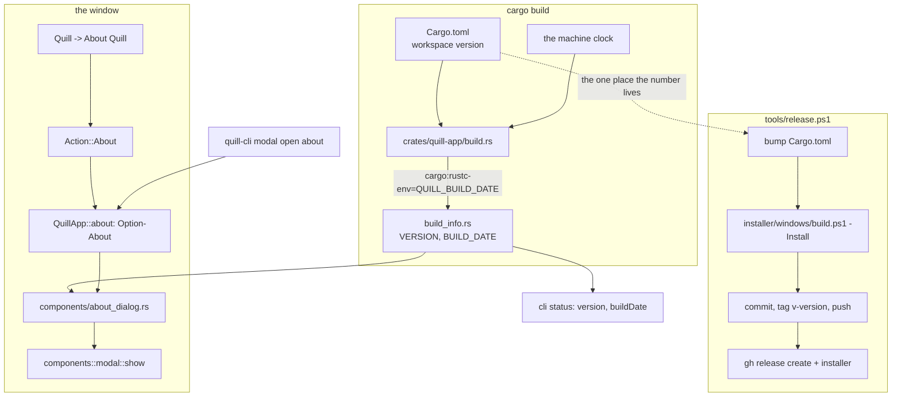

# task-1667 — The About box, the build stamp, and a one-command release

## Introduction

Quill has a version — `0.1.0` in the workspace `Cargo.toml` — and no way for a person running it to
see what they are running. `Quill -> About Quill` writes one line into the status bar and nothing
else. There is also no answer to the question a person asks the moment two builds of `0.1.0` exist:
*which* `0.1.0` is this, the one from before lunch or the one after.

This ticket asks for three things. An **About modal** with the developer, the version and the build
date on it. A **build date** that is real rather than written down by hand. And a **standing
instruction, in a form that is actually followed**: when a task is finished and verified, the version
goes up, the build date moves, Quill is reinstalled on the dev machine, and a GitHub release is cut
so the installer can be downloaded.

The third is the part that fails if it is left as prose. An instruction that costs four commands and
a lookup of how each one works gets skipped. So it is one script — `tools/release.ps1` — and the
instruction is a line in `CLAUDE.md` naming it.

## Goals and Non-Goals

**Goals**

1. `Quill -> About Quill` opens a modal reading exactly:
   ```
   Developed by Jason McAffee
   Version: 0.2.0
   Build Date: 2026-08-25 10:45pm
   ```
2. The build date is stamped into the binary when it is compiled, in the local time of the machine
   that compiled it, and is never edited by hand.
3. The About modal is reachable, readable and closable from `quill-cli`, as every other modal is,
   and the build date is in `quill-cli status`.
4. `pwsh tools/release.ps1` takes a finished checkout to: a bumped version, a fresh build, the
   installer built, Quill reinstalled on this machine, a `v<version>` tag pushed, and a GitHub
   release with the installer attached.
5. `CLAUDE.md` carries the instruction, at the top, where the rest of the conventions are.

**Non-Goals**

- No update checking, no "a newer version is available", no telephoning home. Quill fetches nothing,
  and an About box is not the place to start.
- No release notes generated from commits. The release body names the task and links the commit;
  what changed is in the commit message.
- No macOS half of the release script in this ticket. `installer/macos/build.sh` already builds and
  signs the bundle, and cutting the mac release is one `gh release upload` on the machine that has
  the certificate. The Windows path is what runs on the dev machine.
- No change to what the version *means*. It stays `[workspace.package] version` in `Cargo.toml` and
  nowhere else.

## Problem statement

Three concrete gaps.

**Nothing says what is running.** `Action::About` sets `self.message`, which is the status bar's
transient line: it is gone the next time anything else writes there, it holds no build date, and it
is not what a person looks for when they choose *About Quill* from a menu. Every other application
answers that menu entry with a window.

**A build has no identity.** `env!("CARGO_PKG_VERSION")` distinguishes `0.1.0` from `0.2.0` and
nothing distinguishes two builds of `0.1.0`. During a week of tasks that is the common case: the
version has not moved, four binaries have been installed, and "is this the build with the fix in it"
has no answer. A build stamp answers it.

**The release is a folk process.** Building the installer, installing it, tagging and publishing are
four separate things a person has to remember in the right order, and the last one has never been
done at all — `gh` is not even installed on this machine and the repository has no releases. So the
only way to get Quill onto another machine today is to build it there.

## Architectural Overview



## Detailed technical sections

### 1. Where the build date comes from

`crates/quill-app/build.rs` already exists — it puts the icon and the Windows version block inside
`quill.exe`. It gains one job: work out the local date and time, and emit

```
cargo:rustc-env=QUILL_BUILD_DATE=2026-08-25 10:45pm
```

**How the local time is read.** Quill has no dates library, deliberately: `quill_git::blame` computes
a civil date from a Unix time with Howard Hinnant's arithmetic rather than pulling one in. The
missing piece here is not the arithmetic, it is the machine's *offset from UTC*, which no amount of
arithmetic gives you. So the build script asks the platform for the formatted time, exactly as
`quill-git` asks `git` rather than reimplementing it:

| Platform | Command |
|---|---|
| Windows | `powershell -NoProfile -Command "Get-Date -Format 'yyyy-MM-dd h:mmtt'"` |
| everything else | `date "+%Y-%m-%d %-I:%M%p"` |

The `AM`/`PM` that comes back is lower-cased, which is the whole of the formatting. If the command
cannot be run or answers with something that is not a date, the stamp falls back to UTC computed from
`SystemTime` with the same civil arithmetic `blame.rs` uses, and says so: `2026-08-25 17:45 UTC`. A
stamp that is honestly labelled is better than one that is quietly seven hours out.

**When it reruns, and why that costs nothing.** Cargo runs a build script only when something it was
told to watch has changed. The script emits

```
cargo:rerun-if-changed=build.rs
cargo:rerun-if-changed=../../crates
cargo:rerun-if-changed=../../quill-cli
cargo:rerun-if-env-changed=QUILL_BUILD_DATE
```

so it reruns whenever any source in the workspace changed — which is exactly when `quill-app` was
going to be recompiled anyway. Two builds with no edit between them do not rerun it, do not change
the stamped value and do not recompile anything. The stamp therefore means *the time of the last
build that had anything to build*, which is what a person reading it wants it to mean.

The rejected alternative is an unconditional rerun (`cargo:rerun-if-changed=` at a path that does not
exist, the usual trick). It restamps on every invocation, and because the stamped value is part of
the crate's fingerprint, `cargo test` after `cargo build` would recompile `quill-app` and relink
every screenshot test for no reason other than the clock. That is minutes a day paid for seconds of
precision.

`QUILL_BUILD_DATE` is honoured if it is already set in the environment, which gives a reproducible
build an escape hatch and gives the release script a way to pin the stamp if it ever needs one.

### 2. `build_info`

A new module, `crates/quill-app/src/build_info.rs`, is the only place either fact is read:

```rust
pub const VERSION: &str = env!("CARGO_PKG_VERSION");
pub const BUILD_DATE: &str = env!("QUILL_BUILD_DATE");
```

The four existing `env!("CARGO_PKG_VERSION")` sites in `app/mod.rs` and `app/cli.rs` go through it,
so the rule the installer README already states — *the version lives in `Cargo.toml` and nowhere
else* — gains a companion: it is *read* in one place too.

### 3. The About modal

`components/about_dialog.rs`, built from `components::modal` like every other modal, so it is
dragged, resized, escaped and closed the way the other nine are. 380 x 240 points, a header reading
`About Quill`, three lines in the body, and a footer with one `Close` button.

```rust
/// What the About box shows. Held as text rather than read from `build_info` inside the component
/// so that a screenshot test can pass a fixed date: a stamp that moves every build would fail the
/// image comparison on every build.
pub struct About { pub version: String, pub built: String }

impl About { pub fn current() -> Self { /* build_info */ } }

pub fn show(ctx: &egui::Context, about: &About) -> bool /* closed */;
```

`QuillApp` holds `pub about: Option<About>`. `Action::About` sets it to `About::current()` after
`close_every_modal()`; the draw pass takes it, draws it, and puts it back unless it closed — the
shape `go_to_file` and `find_in_files` already use.

The three lines are drawn with `modal::label`, at the ordinary control colour, with the two values
in `TEXT_STRONG` so the version reads at a glance. Every line is a named control (`Developed by`,
`Version`, `Build Date`) because the screenshot tests find controls by name and a control with no
name cannot be tested.

The status-bar line that `Action::About` used to write is gone. It said the same thing worse.

### 4. The command line

The rule is that everything is reachable from the command line and that this is enforced. `About
Quill` is a menu entry, so `quill-cli action run about` already works and needs nothing. What is
added is the modal being a first-class one, which is four small edits in `app/cli.rs`:

- `MODALS` gains `("about", "Who wrote Quill, what version this is and when it was built.")`
- `modal_id("about") -> "quill-about"`, so `modal move`, `modal size` and `modal reset` work on it
- `open_modal()` reports `about` when it is open
- `close_every_modal()` clears it
- `cli_modal_open` opens it

and `status` gains `"buildDate"` beside `"version"`. The catalogue's description of `modal open
<name>` gains `about`, and `quill-cli/docs/commands.md` is regenerated with `cargo run -p quill-cli
--example reference` — the documentation test fails until it is.

### 5. `tools/release.ps1`

One script, run from a clean checkout after the task's own work is committed:

```powershell
pwsh tools/release.ps1                  # patch: 0.1.0 -> 0.1.1
pwsh tools/release.ps1 -Part minor      # 0.1.0 -> 0.2.0
pwsh tools/release.ps1 -Version 1.0.0   # exactly this
pwsh tools/release.ps1 -Notes "task-1667: the About box"
pwsh tools/release.ps1 -WhatIf          # say what it would do and stop
```

What it does, in order, stopping at the first failure:

1. **Check the tree.** `git status --porcelain` must be empty. A release built from a dirty checkout
   is a release nobody can rebuild.
2. **Bump.** Rewrite `version = "x.y.z"` under `[workspace.package]` in `Cargo.toml`, and run `cargo
   metadata` afterwards so `Cargo.lock` is updated in the same breath.
3. **Build and install.** `installer/windows/build.ps1 -Install`. That already builds `quill.exe` and
   `quill-cli.exe`, refuses to package an executable with no version block, compiles the Inno Setup
   installer, closes a running Quill politely and installs with every optional task on. The rebuild
   is what moves the build stamp.
4. **Keep the installer.** Copy `installer/dist/QuillSetup-<v>-x64.exe` to `releases/`.
5. **Commit and tag.** `Cargo.toml` and `Cargo.lock` only, as `Quill <version>`; tag `v<version>`;
   push the branch and the tag.
6. **Publish.** `gh release create v<version> --title "Quill <version>" --notes <notes>` with the
   installer attached.
7. **Say what it did**, including the installed path and the release URL.

**Authentication.** `gh` is not installed on this machine and there is no `GH_TOKEN`. The script
installs `gh` with `winget` the first time, exactly as `installer/windows/build.ps1` installs Inno
Setup, and takes the token from the credential helper git is already using:

```
printf 'protocol=https\nhost=github.com\n\n' | git credential fill
```

which on this machine returns a `gho_` token with `repo` scope — enough to create a release and
upload an asset. Nothing is written down, nothing is printed, and there is no second credential to
keep. If the helper has no credential, the script says to run `gh auth login` and stops.

**`releases/` stops being committed.** A 7 MB installer per finished task is not something a git
repository should carry, and the GitHub release is where a downloadable file belongs now. `.gitignore`
gains `/releases/*.exe` and `/releases/*.dmg`; `releases/README.md` is rewritten to say that the
folder is the staging area for the upload and that the downloads live on the releases page. The
`quill-0.1.0.dmg` already committed is left exactly where it is — it is not mine to delete — and is
recommended for removal in the task comment instead.

### 6. The instruction

`CLAUDE.md` gains a short section immediately after the crate table, where a reader is still at the
top of the file:

> **Finishing a task means releasing it.** When the work is done and verified, run
> `pwsh tools/release.ps1` — patch for a fix, `-Part minor` for a feature. It bumps the version in
> `Cargo.toml`, rebuilds (which moves the build date the About box shows), reinstalls Quill on this
> machine, tags, pushes, and cuts the GitHub release with the installer on it. The About box is how
> a person checks which build they have, so a build that was not installed is a task that was not
> finished.

Named in `## The documents` alongside the rest, and repeated in `installer/README.md` so somebody who
starts from the installer folder finds it too.

## Data flows and risks

```mermaid
sequenceDiagram
    participant P as Person
    participant M as Quill menu
    participant A as QuillApp
    participant D as about_dialog
    P->>M: Quill -> About Quill
    M->>A: Action::About
    A->>A: close_every_modal(); about = Some(About::current())
    A->>D: show(ctx, &about)
    D-->>P: Developed by / Version / Build Date
    P->>D: Close, Escape, or the cross
    D-->>A: closed -> about = None
```

| Risk | What happens | What is done about it |
|---|---|---|
| The build stamp changes every build, so the About screenshot test fails every build | A red test nobody trusts, then a deleted test | The component takes the strings; the test passes a fixed `About` |
| `powershell.exe` is missing or slow in a build environment | The build script hangs or fails | A 10-second timeout is not available to `Command` directly, so the fallback is on *failure* and on an answer that does not parse; the UTC fallback is labelled |
| The dev machine's credential helper has no token | The release step fails halfway, after the tag is pushed | The token is fetched and checked with `gh auth status` **before** anything is committed or pushed |
| A release is cut from a dirty tree | The tag does not describe the binary | Step 1 refuses |
| `gh release create` fails after the tag was pushed | A tag with no release | The script says exactly which command to rerun; the tag is idempotent and `gh release create` on an existing tag works |
| The version bump lands in the same commit as the task's work | The history stops being greppable by ticket | The release script commits `Cargo.toml`/`Cargo.lock` on their own, after the task's commit |

## Alternatives considered

**The build date written down by hand, next to the version.** Rejected: two numbers to remember
instead of one, and the one that is easy to forget is the one that makes the other useful. It is also
untrue the moment somebody builds without editing it.

**The build date read at runtime from the executable's own mtime.** Free and needs no build script.
Rejected because an installer decides what that mtime is: Inno Setup preserves the source timestamp,
a `Copy-Item` does not, and the answer would silently be the *install* date on some paths and the
build date on others. A value that is right for reasons a reader cannot see is worse than no value.

**A dates crate (`chrono`, `time`) as a build dependency.** The smallest amount of code. Rejected
because `blame.rs` already answers this question with arithmetic and records why: a civil date is the
only thing Quill wants out of a dates library, and the offset is the only thing arithmetic cannot
give — which is what the platform's own `date` command supplies in one line.

**Unconditional rerun of the build script.** Exact to the second. Rejected on cost: see §1.

**Making About a page in the Settings window instead of its own modal.** Rejected — *About Quill* is
its own menu entry on every platform, and a person choosing it does not want the font settings.

**A GitHub Action that releases on a tag.** The right answer for a project with contributors.
Rejected for now because it moves the build off the machine that has the Windows SDK and the icon
toolchain, and because the ask is that the dev machine ends up with the new build installed on it —
which a CI runner cannot do.

## Testing strategy

Unit and window tests, in the layers the repository already has. No test suite run as part of the
task; the release path is verified by running it.

| Test | Layer | What it holds |
|---|---|---|
| `the_about_box_names_the_developer_the_version_and_the_build_date` | screenshot | opens `Quill -> About Quill`, finds the three named controls, snapshots with a fixed `About` |
| `the_about_box_closes_on_the_close_button` | screenshot | and on Escape |
| `opening_the_about_box_shuts_whatever_else_was_open` | screenshot | Settings open, then About: one modal at a time |
| `about_is_a_modal_the_command_line_knows` | unit | `MODALS`, `modal_id` and `open_modal` agree on the name `about` |
| `the_build_date_is_stamped_and_looks_like_a_date` | unit | `build_info::BUILD_DATE` is non-empty and matches `YYYY-MM-DD` |
| documentation test | unit | fails until `commands.md` is regenerated with `about` in `modal open` |
| `action_names` test | unit | already covers the `about` action having a name |

**End to end, by hand and reported in the task comment**, because that is what "verified" means for a
release process: run `tools/release.ps1 -Part minor`, then confirm the version went to `0.2.0`, the
installed `%LOCALAPPDATA%\Programs\Quill\quill.exe` reports the new version block, the running window's
About box shows `0.2.0` and today's date, `quill-cli status --json` carries the same two values, and
the GitHub release page has the installer on it and downloads.
