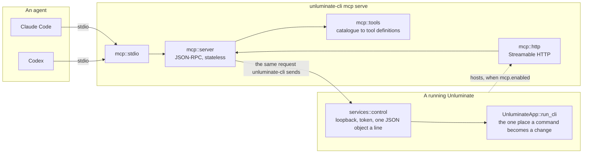

# Unluminate MCP — technical design

`task-1679`

## Introduction

`task-1661` gave Unluminate a command line and, with it, a way for an agent to drive the editor. The
measurement at the end of that ticket is the reason this one exists: the local Qwen 3.8 27B, handed
only `unluminate-cli/docs/commands.md`, carried out 64 instructions phrased as a person would say them
and scored **100%** — against **3.13%** with the documentation withheld. The mechanism works. What
it costs is that somebody has to hand the documentation over, and then the agent has to know it may
shell out to a program it has never heard of.

The Model Context Protocol removes both steps. An MCP client — Claude Code, Codex, Claude Desktop,
anything else that speaks it — asks a server what tools it has and is told, in a form its own
tool-calling machinery understands, before the conversation starts. This document designs that
server: what it exposes, how it stays in step with the CLI as Unluminate grows, where it runs, how it is
switched on, and how it is installed into the two agents on this machine.

The one thing that must not happen is a second list of what Unluminate can do. `catalogue.rs` is one
list that the client parses against and the window dispatches on, which is what stops those two
drifting apart; a hand-written set of MCP tools would be exactly the third copy that rule exists to
prevent. **The tools are generated from the catalogue**, and a test fails the day a command has no
tool.

## Goals and non-goals

### Goals

| | |
|---|---|
| **G1** | Every command in `catalogue.rs` is reachable through MCP, and stays reachable when a command is added — generated, not written out, and enforced by a test. |
| **G2** | An agent can *discover* what Unluminate does from the tool list alone, without being handed a document first. |
| **G3** | Works with Claude Code and with Codex as they are configured today, and installs itself into both from a button in Settings and from the command line. |
| **G4** | A setting to switch the server on and off and to choose its port, and a copy-paste configuration block for somebody wiring up a third client. |
| **G5** | Costs an agent's context as little as it honestly can. Measured, not asserted. |
| **G6** | No new way into the window's state. Every tool call goes down the control channel that already exists, so `UnluminateApp::run_cli` stays the one place a command turns into a change. |
| **G7** | One implementation on Windows and macOS, no new dependency. |

### Non-goals

| | |
|---|---|
| **N1** | Not a remote server. Loopback only, forever, exactly as `services::control` is. |
| **N2** | Not an authorisation framework. MCP's OAuth story is for servers on the internet; this one is on your own machine and its threat model is the control channel's, which §7 restates. |
| **N3** | Not a headless Unluminate. It drives a window that exists. |
| **N4** | Not a second protocol into the window. The MCP server is a **client** of the control channel, not a peer of it. |
| **N5** | No prompts capability, and no tool that summarises a file or writes code. Unluminate's job here is to be operated, not to think. |

## 1. What the research says, and what it changed

### 1.1 The protocol moved twice while Unluminate was being written

| Revision | What it is |
|---|---|
| `2024-11-05` | The original. HTTP+SSE transport, now deprecated. |
| `2025-03-26` | Streamable HTTP replaces HTTP+SSE. |
| `2025-06-18` | What every shipping client speaks today. `initialize` handshake, `Mcp-Session-Id`, `MCP-Protocol-Version` header, structured tool output. |
| `2026-07-28` | **Removes the `initialize` handshake and the protocol-level session.** Each request carries its own protocol version and client identity in `_meta`; capabilities move to an optional `server/discover`. Stateless, cacheable, routable. |

The temptation is to pick one and implement it. The better answer falls out of what the two have in
common: **a server that never requires `initialize` and holds no session satisfies both**. So the
server here is stateless by construction. It answers `initialize` when asked, because a
2025-06-18 client sends it first and expects an answer; it answers `tools/list` and `tools/call`
identically whether that happened or not; and it echoes back whatever protocol version the client
named rather than insisting on its own. There is no version switch in the code, and there is nothing
to migrate when Codex or Claude Code moves to 2026-07-28.

An unknown method is answered `-32601 Method not found`, which is what the JSON-RPC layer is for and
is the correct answer for `server/discover` until there is a client that sends it.

### 1.2 Ninety-seven tools is too many to hand an agent

The catalogue has **97 commands**. A tool definition costs somewhere between 100 and 500 tokens
depending on how much of its documentation is carried, and 2026's own guidance on MCP servers is
consistently that a one-to-one wrapping of an API is the wrong shape — the practical ceiling before
an agent starts choosing badly is a few dozen tools across every server it has connected.

This is worth measuring rather than believing, so it was measured. Both shapes were generated from
the real catalogue and serialised exactly as `tools/list` would return them:

| Shape | Tools | Bytes of JSON | Tokens (≈ bytes ÷ 4) |
|---|---|---|---|
| **`every`** — one tool per command | 97 | 64,355 | ~16,100 |
| **`grouped`** — one tool per area | 14 | 22,140 | ~5,500 |

Nearly **three times** the context, paid on every conversation the server is connected to, before
the agent reads a word of the actual question. That is what decides the default.

**The figures against the code as built**, which are what `unluminate-cli mcp tools --count` prints and
which moved because the five `mcp` commands and their area came after the table above was measured,
and because each area tool now carries a line pointing at the full catalogue:

| Shape | Tools | Bytes of JSON | Tokens (≈ bytes ÷ 4) |
|---|---|---|---|
| `every` | 101 | 72,065 | ~18,000 |
| `grouped` | 15 | 31,954 | ~8,000 |

The ratio held at **2.26x**, which is what the decision rested on. The command is shipped rather than
the numbers being written down once, so the choice is never made against a stale table.

Both shapes are built, because they are not the same trade:

- **`grouped` is the default.** One tool an area — `unluminate_tab`, `unluminate_editor`, `unluminate_git` — with
  the area's verbs as an `enum` on a `command` property and every verb's usage line and summary in
  the description. The agent still sees everything Unluminate can do; it sees it as fourteen paragraphs
  instead of ninety-seven schemas.
- **`every` is there for permissions.** Claude Code allows a tool to be permitted by name —
  `mcp__unluminate__unluminate_tab_open` — and that is only useful if `tab open` is a tool of its own. Somebody
  who wants "may open tabs, may not quit" needs this shape and should pay the context for it.

`mcp.tools` chooses, and the number of tools each produces is printed by `unluminate-cli mcp status` so
the choice is made against the real figure rather than against this table going stale.

### 1.3 How the two clients on this machine are configured

Read off the real files rather than from documentation, because both have moved:

**Claude Code** — `~/.claude.json`, a top-level `mcpServers` object for user scope (`--scope user`);
`.mcp.json` at a project root for project scope. An entry is
`{"type":"stdio","command":…,"args":[…],"env":{}}`, or `{"type":"http","url":…}`. The
supported way in is `claude mcp add-json <name> '<entry>' --scope user`, which is what will be used
when the `claude` program is on the path — the file is 120 kB and is rewritten by every running
Claude Code, so editing it underneath one is a real way to lose somebody's settings.

**Codex** — `~/.codex/config.toml`, a `[mcp_servers.<name>]` table with `command` and `args` (and
`url` for Streamable HTTP). `codex mcp add` is the supported way in. The file is hand-written TOML
with comments and project trust tables in it, so the fallback here appends or replaces exactly one
table rather than reformatting the file.

## 2. Architectural overview



Three facts about that picture matter more than the boxes.

**The MCP server is a client of the control channel, not a bypass of it.** A tool call is turned
into exactly the request `unluminate-cli` would have sent — the same wire name, the same arguments
object, the same token out of the same instance file — and sent to the same port. Nothing new
reaches the window's state, `run_cli` stays the one place a command becomes a change, and a command
run from an agent and the same command typed by a person are the same command. It also means the
server inherits the queueing rule for free: the window answers at the top of a frame, so a
screenshot taken straight after a tool call shows what the tool call did.

**It lives in `unluminate-cli`, not in `unluminate-app`.** The dependency already points that way —
`unluminate-app` depends on `unluminate-cli` and never the reverse — so putting the server in the CLI crate
lets the window host the HTTP transport without the CLI ever learning what a window is. The stdio
server is a program with no graphics card behind it, which is what an agent spawning it wants.

**One server can drive every window.** Because it addresses Unluminates through the instances folder
rather than through its own process, the server hosted by one window can drive the one next to it.
That turns the obvious port collision — two Unluminates, one `mcp.port` — from a bug into the intended
behaviour: the second window sees the port is taken, does not start a second listener, and says so.

## 3. Where the code goes

| File | What is in it |
|---|---|
| `unluminate-cli/src/mcp/mod.rs` | What an MCP server is for, and the module comment carrying the decisions in §1. |
| `unluminate-cli/src/mcp/tools.rs` | The catalogue turned into tool definitions. `Shape::Grouped` and `Shape::Every`. Pure — no socket, no process, no window. |
| `unluminate-cli/src/mcp/server.rs` | The JSON-RPC methods, and turning a tool call into a `protocol::Request` and a `protocol::Reply` back into an MCP result. Takes a `Driver` so it can be tested without an Unluminate. |
| `unluminate-cli/src/mcp/stdio.rs` | Lines in on stdin, lines out on stdout. |
| `unluminate-cli/src/mcp/http.rs` | The Streamable HTTP endpoint: a small HTTP/1.1 reader, `POST /mcp`, `GET`/`DELETE` → 405, loopback bind, origin checking. |
| `unluminate-cli/src/mcp/install.rs` | The Claude Code and Codex configuration: what it should say, how to write it, and how to read back whether it is there. |
| `unluminate-cli/src/mcp/base64.rs` | Twenty lines, so a screenshot can be returned as an image. Written rather than depended on, which is the same decision `protocol.rs` made about serde's derive macros. |
| `unluminate-cli/docs/mcp.md` | What a person needs to connect a client, alongside `docs/protocol.md`. |
| `crates/unluminate-app/src/services/mcp.rs` | The window's half: start and stop the HTTP listener as the settings change, and report what it is doing. |
| `crates/unluminate-app/src/components/mcp_page.rs` | `Settings → Tools → MCP`. |

## 4. The tools

### 4.1 `grouped`, the default

One tool an area, plus one for the six commands that have no area. Fourteen in total.

```json
{
  "name": "unluminate_tab",
  "title": "Unluminate: tab — the files that are open",
  "description": "Run one of the tab commands in a running Unluminate editor.\n\n  tab open <path> [--permanent]\n      Open a file in a tab and show it. A picture opens as a picture; anything else opens as text.\n  tab list\n      The tabs that are open, in order, with the path, the name and whether each has unsaved changes.\n  …",
  "inputSchema": {
    "type": "object",
    "properties": {
      "command": { "type": "string", "enum": ["open", "list", "show", "close", "next", "previous", "…"], "description": "Which tab command to run." },
      "arguments": { "type": "object", "description": "The values it takes, by the name in the usage line. A switch is true.", "additionalProperties": true },
      "instance": { "type": "string", "description": "Which running Unluminate: its process id, its port, or part of its project path. Only needed when several are running." }
    },
    "required": ["command"],
    "additionalProperties": false
  }
}
```

The description is the area's own note from `docs/commands.md` followed by every verb's usage line
and summary — which is to say, it is the document that scored 100%, cut into fourteen pieces and
put where the agent will already be looking.

### 4.2 `every`

One tool per command, named `unluminate_<area>_<verb>` with hyphens turned into underscores, since
Claude Code accepts only letters, numbers, hyphens and underscores in a tool name. Each argument and
each flag becomes a property: a required argument is required, a flag with a value is a string, a
flag without one is a boolean, and every property carries its help text from the catalogue. The
summary, the usage line and the examples are the description.

### 4.3 What a call gives back

A `Reply` becomes one text block, and the two keys that already have a meaning keep it: `text` for
content that is text all through, `lines` for a listing, and otherwise the `result` object laid out.
`structuredContent` carries the `result` unchanged for a client that would rather parse than read.
A refusal is `isError: true` with the code and the sentence the window wrote — a tool execution
error, not a JSON-RPC error, which is the distinction the specification draws and the one that lets
an agent try something else instead of the connection being torn down.

**`window.screenshot` is special-cased, and it is the only one.** A successful screenshot has its
PNG read off disk and attached as an `image` content block beside the text. The alternative is an
agent that has to be told to go and open a file it cannot see, which is most of the value of a
screenshot thrown away. It is a rule about a reply rather than a tool of its own, so it works in
both shapes and there is no fifteenth tool that duplicates `unluminate_window`.

### 4.4 One resource

`unluminate://commands.md` serves the whole of `unluminate-cli/docs/commands.md`, embedded at compile time
with `include_str!`. It costs nothing until it is read, it is the artefact whose comprehension was
actually measured, and `documentation.rs` already fails if it has fallen behind the catalogue — so
the resource cannot go stale either.

### 4.5 Which Unluminate a call goes to

In order, first answer wins:

1. `instance` on the tool call, or `--instance` on `mcp serve`, or `UNLUMINATE_INSTANCE` in the
   environment. A process id, a port, or part of a project path — the same three things
   `client::choose` already accepts.
2. Exactly one Unluminate running: that one.
3. Exactly one running Unluminate whose project folder is the server's own preference — its working
   directory, or `CLAUDE_PROJECT_DIR` which Claude Code sets in a spawned server's environment, or
   the window's own folder when the window is the host.
4. Otherwise a refusal that lists them, which is `client::choose`'s existing `several-instances`
   answer. Guessing which window somebody meant is a command landing in the wrong project, which is
   exactly the mistake that is hard to notice.

## 5. The transports

### 5.1 stdio

`unluminate-cli mcp serve`. The client launches it as a subprocess and speaks newline-delimited JSON-RPC
over its pipes. This is what both agents on this machine use and what the install buttons write.

One rule and it is absolute: **nothing but MCP messages may reach stdout.** Anything the server has
to say goes to stderr, which the client is free to capture or ignore. The CLI's own `complain`
already writes to stderr; the `mcp serve` arm must not reach `say`, which writes to stdout.

### 5.2 Streamable HTTP

`unluminate-cli mcp serve --transport http --port <n>`, and the same server hosted inside Unluminate when
`mcp.enabled` is true. A single endpoint at `/mcp`:

| | |
|---|---|
| `POST /mcp` | A JSON-RPC request → `application/json` with the response. A notification or a response → `202 Accepted`, no body. |
| `GET /mcp` | `405 Method Not Allowed` — there is no server-initiated stream, which the specification explicitly allows. |
| `DELETE /mcp` | `405` — there are no sessions to end. |
| Anything else | `404`. |

No `Mcp-Session-Id` is ever issued, which is what makes the server stateless in the sense
2026-07-28 means. `MCP-Protocol-Version` is read and accepted for any `YYYY-MM-DD` value and
answered `400` otherwise, which is what the specification asks and is also the one rule here that
must not be tightened into rejecting a version that does not exist yet.

The HTTP server is written by hand on `std::net`, for the reason `services::control` gives for its
own socket: it is one piece of code on both platforms, and what it needs to do is read a
`Content-Length`, read that many bytes, and write a response. A framework would be a dependency to
paper over three lines.

## 6. The window's half

### 6.1 Three settings

| Name | Accepts | Default | What it is |
|---|---|---|---|
| `mcp.enabled` | true or false | **false** | Whether this Unluminate hosts the MCP endpoint over HTTP. |
| `mcp.port` | 1024 to 65535 | 7345 | The port it listens on. Fixed rather than chosen by the operating system, because an agent's configuration has to name it. |
| `mcp.tools` | grouped or every | grouped | Which shape §4 describes. |

They go in `settings.conf` under the same names the Settings page shows and the same names
`unluminate-cli settings set` takes, which is the rule the other eleven settings already follow.

**Off by default, and the reason is worth writing down.** The stdio server needs no port and no
setting: the agent spawns it, it lives as long as the conversation, and nothing is listening when
nobody is asking. That is the safer arrangement and it is the one the install buttons set up, so the
default costs nothing. A fixed open port that will run `terminal send` for anything that can reach
it is a different proposition, and it should be a thing somebody turned on rather than a thing they
were given.

### 6.2 Starting and stopping

The window holds `Option<mcp::http::Server>` and reconciles it after any settings change: enabled
with no server, or enabled on a different port, starts one; disabled drops it. Dropping sets a flag
the accept loop reads — the listener is non-blocking and polls, so there is no self-connect trick
and no thread left holding a port after the setting was turned off.

Two states are reported rather than hidden, because both look like a bug otherwise:

- **The port is already in use.** Almost always the Unluminate in the next window. One server drives every
  window, so this is not an error: the page says which process holds it and that it will serve this
  window too.
- **`--control off`.** The window has no instance file, so there is nothing for an MCP server to
  drive. The page says so instead of listening on a port that can do nothing.

### 6.3 `Settings → Tools → MCP`

A new `Page::Mcp`, listed under `Tools` beside `Terminal`, built from `components::modal`'s
furniture like every other page. Three sections:

**Install** first, because it is what somebody opened the page for. One button per client, whose
label is what it will do — `Install for Claude Code` or `Remove from Claude Code` — read once when
the page opens and again after a click, so the button always says the truth. A line under each says
where it wrote and what it wrote there.

**Server**: the `Enable` tick box, the port field, the tool shape, and a status line saying what is
actually true right now — listening, not listening, the port held elsewhere, or the command channel
closed — with the number of tools the current shape produces.

**Configuration**: the two blocks, verbatim, with a `Copy` button each. The JSON for a client that
reads `mcpServers`, and the TOML for Codex. This is the answer for a third client nobody has
written a button for.

Every control gets a plain name for the screenshot tests, and the page gets a screenshot test of its
own.

## 7. Security

The threat model is the control channel's, restated, because the MCP server has exactly the control
channel's reach and no more.

**Loopback only, with a test.** `mcp::http` binds `127.0.0.1` and nothing else, the same assertion
`control.rs` carries about its own listener.

**A page in a browser cannot drive it.** This is the one thing on a desktop that a local port
genuinely has to defend against, and the control channel answers it with a token in a file, since a
page can POST to a loopback port and cannot read a file. The HTTP transport cannot use a token —
the configuration an agent copies would have to carry it — so it uses the defence the specification
mandates for exactly this attack: a request carrying an `Origin` header that is not
`http://127.0.0.1[:port]` or `http://localhost[:port]` is refused `403`, as is one whose
`Sec-Fetch-Site` says `cross-site`. A page cannot set either header, and a browser attaches `Origin`
to every cross-origin POST, so this closes it. Both have tests.

**What it does not defend against**, said plainly here and in `docs/mcp.md`: another program running
as you. Nothing on a desktop does. Anything that can reach the port can `terminal send`, which is to
say it can run a shell command in your project — which is why the port is off by default and why the
recommended install is stdio, where there is no port at all.

**Nothing is fetched and nothing new is executed.** The server reads the catalogue, the instance
files and a PNG the window it is driving just wrote. The installers run `claude` or `codex` if they
are on the path, which is the supported way in for each; nothing else is spawned.

## 8. The command line half

A new `mcp` area, because "everything is reachable from the command line, and that is enforced" has
to include this.

| Command | |
|---|---|
| `mcp serve` | Run the server. `--transport stdio\|http`, `--port`, `--tools`, `--instance`. Local — it needs no Unluminate to start, only to be useful. |
| `mcp status` | What this Unluminate is doing about MCP: enabled, the port, the shape, how many tools, and whether it is actually listening. Not local — the window is the only thing that knows. |
| `mcp install <client>` | `claude`, `codex` or `both`. `--transport`, `--scope`, `--name`, `--remove`. Local. |
| `mcp config [client]` | Print the configuration to copy. Local. |
| `mcp tools` | The tool list as JSON, exactly as `tools/list` returns it. Local, and it is how the shapes in §1.2 were measured. |

Each gets a section in `docs/commands.md` — `documentation.rs` will not pass otherwise — written by
`cargo run -p unluminate-cli --example reference`, and each carries an example that a test parses and
checks runs the command it is filed under.

## 9. What is tested

| | |
|---|---|
| **T1** | Every catalogue command is reachable as a tool, in both shapes. This is the whole "kept up to date" promise, so it is the first test. |
| **T2** | Every tool names a command that exists — the reverse, so a generator bug cannot invent one. |
| **T3** | In `every`, every argument and every flag becomes a property, and required arguments are required. |
| **T4** | A `tools/call` becomes the right `Request`: `unluminate_tab {command:"open",arguments:{path:"README.md"}}` sends `tab.open` with `{"path":"README.md"}`. Against a stub driver, no Unluminate needed. |
| **T5** | A refusal comes back `isError: true` with the code, and does **not** come back as a JSON-RPC error. |
| **T6** | `tools/list` and `tools/call` are answered with no `initialize` first — the 2026-07-28 shape — and `initialize` is answered with whatever version the client named. |
| **T7** | The HTTP endpoint binds the loopback interface and nothing else. |
| **T8** | A cross-site `Origin` is refused `403`; a loopback one is served. `GET` is `405`. A notification is `202` with no body. |
| **T9** | The Claude Code installer writes a readable `mcpServers` entry into a temporary home, is idempotent, and removes exactly what it added. The Codex installer does the same to a `config.toml` that already has other tables in it, and leaves them alone. |
| **T10** | `mcp.enabled`, `mcp.port` and `mcp.tools` round-trip through the settings file, and the port is brought inside its limits rather than refused. |
| **T11** | A screenshot of `Settings → Tools → MCP`. |
| **T12** | The documentation tests, unchanged, now covering five more commands. |
| **T13** | End to end, by hand and recorded on the ticket: a real Claude Code and a real Codex connected to a real Unluminate, listing the tools and driving the window. |

## 10. What was rejected

**A hand-written set of intentional tools.** The 2026 guidance on MCP servers is right that wrapping
an API one-to-one is usually the wrong shape, and it is right for the reason that most APIs were
never designed to be operated by a language model. Unluminate's catalogue was: `task-1661` designed it
for an agent and then measured an agent using it. Hand-writing tools would mean a second list that
falls behind, which is the exact failure `catalogue.rs` exists to prevent, in exchange for a
vocabulary that has already been shown to work as it is.

**One tool with a `command` string and nothing else.** The smallest possible server, and it fails
G2: an agent that has to be told what to put in the string is an agent that had to be handed the
document first, which is the thing this ticket is removing.

**A second binary, `unluminate-mcp`.** More to install, more to keep on the path, and a second program to
be out of date. `unluminate-cli mcp serve` is one binary that is already installed next to `unluminate.exe`.

**A session and an SSE stream.** Streamable HTTP allows both and needs neither. Unluminate has nothing to
push: every answer is the answer to a question that was just asked, and the one command that takes a
while — `terminal read --wait-for` — already holds its own connection open with its own timeout.
Sessions would also be the one part of this that 2026-07-28 deletes.

**Editing `~/.claude.json` in preference to `claude mcp add-json`.** The file is rewritten by every
running Claude Code. Writing it underneath one is how somebody loses their settings, so the CLI is
used when it is there and the direct edit is the fallback, with a backup taken first.

## 11. Order of work

1. `mcp::tools`, with T1–T3. Nothing else can be right if the generation is wrong.
2. `mcp::server`, with T4–T6 against a stub driver.
3. `mcp::stdio`, and connect a real Claude Code to a real Unluminate by hand.
4. `mcp::http`, with T7–T8.
5. `mcp::install` and `mcp config`, with T9.
6. The catalogue rows, the dispatch arm for `mcp status`, and the documentation.
7. The settings, the reconciler and the page, with T10–T11.
8. T13, then the release.

## 12. What building it changed, and what it found

Three things came out of the implementation that the design above did not have, and each is in the
code with its own comment.

**`Endpoint::drop` has to wait for its thread.** The listener is owned by the accept loop, so setting
the stop flag only *asks*: the socket is released when the loop returns. Changing `mcp.port` or
`mcp.tools` drops the old endpoint and starts a new one on the same port in the same breath, and the
bind lost that race — measured on a real window, which then reported the port as taken by another
Unluminate when the other Unluminate was itself a moment earlier. `Drop` now joins the accept thread, which
costs at most one poll and makes "the port is free" true rather than likely.
`an_endpoint_can_be_restarted_on_the_same_port_at_once` is the test that pins it.

**The path an agent is told to launch cannot be `current_exe`.** Both the client and **the window**
ask for it, and `current_exe` in the window is `unluminate.exe`. `install::unluminate_cli_program` works it
out the way `client::unluminate_program` does in the other direction — this program if it is already the
client, then the one beside it, with `UNLUMINATE_CLI_BIN` overriding — which is also what lets the
screenshot test pin it, since a picture holding this machine's own path is a picture no other machine
could match.

**`codex mcp add` rewrites the whole of `config.toml`.** Keys inside a table come back reordered,
arrays are reflowed, `120` becomes `120.0`. That is Codex doing what it does whenever anybody runs
the command, and it is not a reason to prefer the direct edit: the direct edit's own hazard is worse,
because a `[` at the start of a line inside a multi-line string reads as a table header to a text
scanner and cannot fool a parser Codex wrote against a file Codex wrote. §1.3's decision stands.

And one thing about the window rather than the server. **The Settings window grew from 560 to 640
points.** The MCP page is the tallest of the five and a settings page here does not scroll; the
window is one size for every page, because a dialog that changed height as its list was walked would
jump under the pointer. The port and the tool shape share a row, the configuration is one block at a
time chosen by two buttons rather than both at once, and the JSON is laid out by hand because
`to_string_pretty` puts every element of an array on a line of its own and turned a two-word `args`
into four. Four existing snapshots were re-accepted after looking at each.
