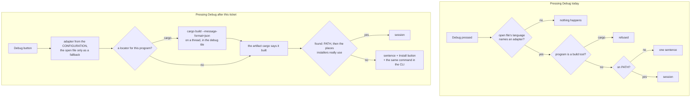

# task-1692 — Debugging that works out of the box

## 1. What was asked

> I had an agent attempt to debug, but it had to look through source code, download a debugger, and
> write a bunch of code. We need better debugging, and the ability for agents to be able to debug
> easily. I should be able to see 2 buttons at the top right to run, similar to intellij: one for
> normal run, and one for debug run. Improve the experience so it works out of the box and is
> intuitive to utilize.

`task-1687`/`1688`/`1689` built a complete DAP client: breakpoints that move with the text, a
variables tree, inline values, thirteen `unluminate-cli debug` verbs. None of that is what failed. What
failed is everything **before** the first `stopped` event, and this ticket is about that half.

Four things stand between a person or an agent and a paused program today, and each of them is a
place the feature simply does nothing:

1. **There is no Debug button.** Debug is `Shift+F9` and a Run-menu entry. The play button is in the
   title bar with nothing beside it, so the feature is invisible to somebody who has not read the
   documentation — which is exactly how an agent ends up "looking through source code".
2. **`cargo run` is refused.** It is the configuration Unluminate's own project suggests, and pressing
   Debug on it says *"cargo builds the program rather than being it"*. The most common Rust project
   in the world cannot be debugged without hand-writing a configuration that names
   `target\debug\unluminate.exe`.
3. **The adapter is looked for on `PATH` only.** On Windows almost nothing that ships an LLDB is on
   `PATH`: LLVM's own installer offers not to add itself, and CodeLLDB lives inside a VS Code
   extension folder. A machine that *has* a debugger is told it has none.
4. **A machine that really has none is told a sentence and left there.** It names what was looked
   for; it does not say how to get it. That sentence is what sent the previous agent off to download
   a debugger by hand.

## 2. Goals and non-goals

**Goals**

- Two buttons at the top right — Run and Debug — in IntelliJ's order, with Stop where it already is.
- `cargo run` debugs the binary cargo builds, without anybody writing a second configuration.
- An adapter that is installed anywhere a normal machine puts one is found without a settings key.
- An adapter that is genuinely absent is one press away from being installed, and the press runs a
  visible command in the run tile rather than the editor reaching out.
- One command — `unluminate-cli debug adapters` — tells an agent the whole state of the world: which
  debuggers exist, where each one was found, what is missing, and the command that installs it.
- Which debugger to use is decided by the **configuration**, so Debug works with a README focused.

**Non-goals**

- Attach, multiple sessions, Python, and the rest of `task-1687` §13 stay deferred.
- The editor still **fetches nothing**. §7 is careful about the difference.
- No new debug adapters are written. This ticket makes the two that exist reachable.

## 3. The shape of it



Nothing in the protocol layer changes. `unluminate-dap` is untouched; every change is in
`services::debuggers`, one new `services::locators`, the title-bar widget, and the catalogue.

## 4. The two buttons

`components::run_widget` becomes `[ Name ▾ ] [▶] [🐞] [⏹]` — IntelliJ's own order and its own two
icons, the bug drawn by `theme::icon` like every other icon in Unluminate rather than lettered.

**When the Debug button is there.** Unluminate's rule is that a control is absent when it cannot apply,
not dimmed — and a button that appeared and disappeared as tabs were switched would be worse than
either. So the rule is asked of the thing the button would act on: **the Debug button is present when
the configuration the play button would start resolves to a debugger** (§5), falling back to the open
file's language when nothing is selected yet. A Rust or a Node project therefore always has both
buttons; a vault of Markdown and CSS has one, because there is nothing there to step through and
never will be.

`WidgetState` gains one field, `debuggable: bool`, computed by the window in
`UnluminateApp::run_widget_state` — the widget itself still knows nothing and still returns an `Action`,
so the button, the menu, `Shift+F9` and `unluminate-cli debug start` remain one path.

Widths: `run_widget::width` adds `2.0 + BUTTON` when `debuggable`, the arithmetic the stop button
already does, so the title bar reserves the right rectangle before anything is drawn.

## 5. Which debugger, decided by the configuration

Today `start_debugging` asks `plugins.debugger_for(the open file)`. That is wrong in a way that is
easy to hit: debug a Node server while reading `README.md` and Unluminate says the file's language has not
named a debugger. The configuration is what is being debugged, so the configuration is what is asked.

`debuggers::adapter_for(program, plugins, open_file)` answers in this order:

| The configuration's program | Adapter | Why |
|---|---|---|
| `cargo` | `lldb` | Cargo builds native binaries; §6 finds which one |
| `node`, `npm`, `npx`, `yarn`, `pnpm`, `bun` | `node` | js-debug runs the command through its own runtime |
| a path ending `.js` `.mjs` `.cjs` `.ts` `.tsx` | `node` | |
| a path ending `.exe`, or with no extension | `lldb` | a built native program |
| anything else | what `plugins.debugger_for` says of the program's extension | so a plugin added later needs no code here |
| nothing matched | the open file's language, as today | the fallback, not the first question |

That table is one function with one test per row. `can_debug` keeps its job — it is what decides
whether the Run menu offers a Debug entry for a configuration — and now answers `true` for `cargo`,
because §6 makes it true.

## 6. The Cargo locator

`task-1687` §13 deferred "debugging a Cargo/npm configuration by deriving the binary — Zed's
locators. Right and wanted, and a design of its own." This is that design, for cargo only.

**How.** `cargo build --message-format=json-render-diagnostics` prints one JSON object a line;
`compiler-artifact` objects carry an `executable` field which is `null` for libraries and the full
path to the binary for everything else. The last artifact with a non-null `executable` is the program
`cargo run` would have run. `cargo test` is the same with `--no-run`, and the artifact is the test
binary — which is how you debug a failing test.

**What is translated.** `services::locators::cargo` rewrites the run command into a build command,
keeping every flag that selects what is built and dropping the ones that only apply to running:

| `cargo run …` | becomes | the debuggee gets |
|---|---|---|
| `cargo run` | `cargo build --message-format=json-render-diagnostics` | no arguments |
| `cargo run --release -- --fast` | `cargo build --release --message-format=…` | `--fast` |
| `cargo run -p unluminate-app --bin unluminate` | `cargo build -p unluminate-app --bin unluminate --message-format=…` | |
| `cargo test the_name` | `cargo test --no-run --message-format=…` | `the_name` |

Everything after `--` is the program's own arguments and never reaches cargo. `--bin NAME`, when
given, also picks which artifact to take when a workspace built several.

**Where it runs.** On a thread, the way `unluminate-git` runs `git` on a thread, with the window woken
when it finishes — never on the UI thread, because a cold `cargo build` of Unluminate is minutes. While it
runs the debug tile says `Building unluminate…` and the status bar says the same; the button does not
lock, because pressing Debug twice should replace the build, which is what starting a second session
already does.

**When it fails.** `--message-format=json-render-diagnostics` puts human-readable compiler errors on
standard error. They go to `debug output`, verbatim, which is the rule git's stderr already follows,
and the status bar says `The build failed — see the debug output.` No session is started and nothing
is invented.

**When it produces nothing.** A workspace whose `cargo build` emits no executable artifact (a library
crate) is a sentence: `Nothing to debug: cargo built no binary.`

`npm` is deliberately **not** given a locator. js-debug takes a command line and runs it through its
own runtime, so `npm run dev` already debugs correctly today — deriving anything would be inventing a
problem.

## 7. Finding an adapter where it actually is

`PATH` first, unchanged. Then the places the installers really use, per platform, resolved with a
one-segment glob (`read_dir` and a prefix/suffix match — no crate):

**`codelldb`** — the VS Code family's extension folders, which is where almost every Windows machine
that has an LLDB has one:
`%USERPROFILE%\.vscode\extensions\vadimcn.vscode-lldb-*\adapter\codelldb.exe`, and the same under
`.vscode-insiders`, `.vscode-oss`, `.vscode-server`, `.cursor`, `.windsurf`; `$HOME/.vscode/...` on
macOS and Linux.

**`lldb-dap`** — `C:\Program Files\LLVM\bin`, `%LOCALAPPDATA%\Programs\LLVM\bin`, Visual Studio's
bundled LLVM (`…\VC\Tools\Llvm\x64\bin`), `/opt/homebrew/opt/llvm/bin`, `/usr/local/opt/llvm/bin`,
`/usr/lib/llvm-*/bin`, Xcode's `/Applications/Xcode.app/Contents/Developer/usr/bin`, and the
versioned `lldb-dap-20` … `lldb-dap-14` names Debian and Ubuntu ship.

**`dapDebugServer.js`** — `…\extensions\ms-vscode.js-debug-*\src\dapDebugServer.js` in the same six
editor folders. This is what makes the `node` entry work **without** `debug.node` being set, which it
required before.

The settings key still beats all of it, and the search is ordered, so a person who has both CodeLLDB
and lldb-dap gets CodeLLDB, which has the Rust formatters.

**Nothing here is a network request.** The editor reads directories on the machine it is running on.

### 7.1 An adapter that is really missing

The refusal keeps its sentence and gains an **install command** — one line, per platform, from the
registry entry that knew:

| Adapter | Windows | macOS | Linux |
|---|---|---|---|
| `lldb` | `winget install --id LLVM.LLVM -e` | `brew install llvm` | `sudo apt install lldb` |
| `node` | `code --install-extension ms-vscode.js-debug` (when `code` is on `PATH`) | same | same |

Where it appears:

- **In the status bar sentence**, so a person reading the refusal is reading the answer.
- **As a button in the debug tile**, which opens instead of staying empty:
  the adapter's name, what was looked for, where it comes from, `Install with winget`, and
  `Copy command`.
- **In `unluminate-cli debug adapters`**, as a field, so an agent does not parse prose.
- **As `unluminate-cli debug install lldb`**, which is the button's own path.

**Pressing it runs the command in the run tile** — a temporary run configuration named
`Install lldb`, so it is a visible terminal with a program in it that can be watched, read with
`run output` and stopped, exactly like every other run. That is the distinction `task-1687` §13 drew
and this keeps: *the editor never reaches out; a package manager the person asked for, in a terminal
they can see, does.* It is the same move `tools/release.ps1` makes when it installs `gh` with winget.

## 8. The command line, and the agent

Two verbs, because Unluminate enforces that everything reachable by hand is reachable from the command
line — the Install button cannot exist without `debug install`.

```
unluminate-cli debug adapters [--json]
unluminate-cli debug install <adapter>
```

`debug adapters` is the doctor, and it is the one command an agent should run first:

```
lldb     found    C:\Program Files\LLVM\bin\lldb-dap.exe
         used by  rust
         looked   codelldb, lldb-dap
node     missing  set debug.node, or install Microsoft's js-debug
         used by  javascript, typescript
         install  code --install-extension ms-vscode.js-debug
```

`--json` gives `{name, found, path, programs, languages, install, settings_key, caveat, comes_from}`
per adapter. That object is the whole of what an agent needs to decide between "start a session" and
"tell the person to install something", and it replaces reading `services/debuggers.rs`.

The refusal an agent gets from `debug start` carries the same command, so even an agent that never
runs the doctor is told what to do at the moment it matters.

Everything else is already there: `debug breakpoint add`, `debug start --wait-for-pause`,
`debug variables`, `debug step-over`. The MCP tools are generated from the catalogue, so the two new
verbs reach a connected agent with no second list to update.

## 9. Testing

Four layers, as always, and the interesting tests are the middle two.

**Unit, `services::debuggers`**

- Each row of §5's table, including the fallback to the open file's language and the case where the
  program is a build tool with no locator.
- The search-location list for each platform contains what §7 says, and every entry that names an
  install command names one for all three platforms or explains itself.
- A refusal's message contains the install command; a found adapter's does not exist.

**Unit, `services::locators`**

- Each row of §6's translation table, including `--` splitting and `--bin` selection.
- Parsing a real `cargo build --message-format=json` transcript (a fixture recorded from this
  repository) picks the executable and not the library.
- A transcript with no executable is the "cargo built no binary" refusal rather than a panic.

**`unluminate-app`**

- `run_widget::width` grows by exactly one button when `debuggable`, and the widget with nothing at
  all is still the play button alone.
- The Debug button's action is `Action::Debug(DebugAction::Start(None))` — the same action the menu
  and `Shift+F9` produce.
- `debug adapters` is in the catalogue, is documented, and its examples run the command they are
  filed under (the three tests that already enforce this for every other verb).

**Screenshots**

- The title bar with both buttons, idle and debugging.
- The debug tile's missing-adapter panel.

**By hand — and this is the acceptance test the whole ticket is about.** On this machine, which has
no LLDB at all:

1. Open Unluminate's own project, press Debug on `cargo run`. Expect the install offer.
2. Press Install. Expect winget in the run tile and `lldb-dap.exe` on the machine.
3. Press Debug again. Expect a build, then a session, then a stop on a breakpoint in Unluminate's own
   source, with the call stack and locals in the tile.
4. Do the whole of it a second time from the command line only — `debug adapters`,
   `debug breakpoint add`, `debug start --wait-for-pause`, `debug variables`, `debug step-over` —
   because that path is the one the ticket says an agent must be able to walk.

## 10. Alternatives considered

**Download the adapter, like Zed.** Rejected, and it is the rule rather than a preference: a document
may not make a network request, so neither may the editor. The install command is the same
convenience without the editor being the thing that reaches out, and the person sees exactly what
ran.

**Bundle an adapter in the installer.** LLVM's lldb-dap is tens of megabytes and is licensed and
versioned separately; Unluminate's installer is a folder of its own with the binary and its plugins in it.
Rejected on size and on what it would commit Unluminate to shipping.

**Make Debug always present and dim it when it cannot apply.** Against the house rule that a control
is absent when it cannot apply. §4's rule gives Jason the two buttons on every project that has
anything to debug, which is what the ticket asked for, without a permanently grey button on a
Markdown vault.

**Derive the binary from `target/debug/<crate>` by convention rather than asking cargo.** It is wrong
for workspaces, examples, tests, custom profiles and renamed binaries — all of which this repository
has. Asking cargo costs one process and is always right.

**Run the cargo build in the run tile instead of on a thread.** The run tile is a ConPTY, and reading
structured JSON back out of a terminal screen is exactly the kind of cleverness that breaks the first
time a diagnostic wraps. The build is a program whose output is data, so it is a thread with a pipe,
which is what `unluminate-git` already does with `git`.

## 11. What the implementation measured, and what it changed about §1–§10

The design above was written before any of it ran. Four things turned out differently, and each was
measured rather than reasoned about.

**The `node` entry had never been run against a real js-debug.** `debug.node` was unset on the
machine that built `task-1687`, so the entry refused before it could be wrong. Running it found three
separate faults, in order:

1. **js-debug binds `::1`.** Its own banner says `Debug server listening at ::1:8123`, and Unluminate
   dialled `127.0.0.1` only — so a healthy adapter was "actively refused". Both spellings of
   localhost are tried now, in that order.
2. **The program runs in a child session.** js-debug answers `launch` on the parent and then sends a
   `startDebugging` reverse request whose `configuration` carries a `__pendingTargetId`. Unluminate
   dropped it, and what was left was a parent with no threads, no stops, and a breakpoint answered
   `provisionalBreakpoint` for ever. `Client::adopt_child` dials the same server again and the
   handshake runs there; the window re-sends the breakpoints. Both connections read onto one channel
   and the child's messages are tagged, because the two number their own requests.
3. **It sends `initialized` twice on a child session** and answers the second `setBreakpoints` for a
   file with an empty list — which, taken, threw away the ids the first answer carried and left a
   breakpoint that stopped the program drawn hollow. An answer that is not one for one with what was
   sent is not taken.

**The install command for js-debug in §7.1 was wrong.** `code --install-extension ms-vscode.js-debug`
answers "already installed": js-debug is one of VS Code's built-in extensions, and that copy ships no
`dapDebugServer.js` at all, because VS Code runs js-debug in process. The standalone DAP server is a
release asset, and that is what is fetched.

**The install command for `lldb` on Windows changed too**, for a better reason: `winget install --id
LLVM.LLVM -e` needs elevation and is two and a half gigabytes, where CodeLLDB's `.vsix` is fifty
megabytes, needs no elevation, and is the adapter the registry prefers anyway. It unpacks into
`%LOCALAPPDATA%\Unluminate\adapters`, which `well_known` now looks in — so `tools/get-debug-adapter.ps1`'s
output is found without the `debug.lldb` line it prints, which was the second half of a two-step
install nobody should have had to know about.

**One thing not in the plan at all.** A long message in the status bar was drawn straight over the
branch name and the font at the right-hand end. It always could have been; these refusals — a
program, where it comes from, and the command that installs it — are what made it the ordinary case.
It is measured and elided now.

### The acceptance test, run

On this machine, with no adapter on `PATH` and the settings key cleared:

```
unluminate-cli debug adapters                     lldb found …\Unluminate\adapters\codelldb…, node missing + the command
unluminate-cli debug install node                 fetched and unpacked; adapters then reports node found
unluminate-cli debug breakpoint add unluminate-cli/src/main.rs 58
unluminate-cli debug start "cli status" --wait-for-pause     cli status is paused at main.rs:58
unluminate-cli debug frames                       20 frames
unluminate-cli debug variables                    the frame's locals
unluminate-cli debug step-over --wait-for-pause   cli status is paused at main.rs:59
```

and the same for node, on a `.js` file: `paused at loop.js:3`, variables, `step-over` → `loop.js:4`,
`evaluate "total + 1"` → `1`, and `breakpoint list` reads **verified** for the file js-debug bound and
**unverified** for the two it could not.
