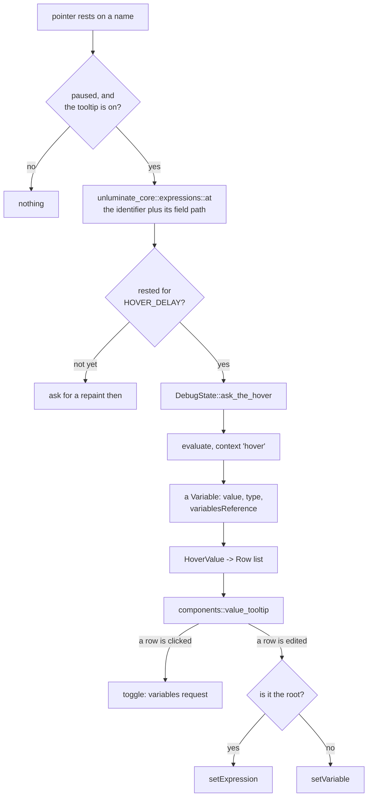

# task-1696 — The value under the pointer

## 1. What was asked

> When I debug, and I hover my cursor over a variable, object, etc I want a popup to show me it's
> current value, and be able to modify it, its sub properties, etc, just like in intellij.
>
> Search the web for how intellij works, screenshots, etc. then create a tdd, then fully implement.

`task-1687`/`1688`/`1689` built the debugger and `task-1692` made it start. What neither built is the
one gesture a person makes most often while a program is paused: **point at a name and find out what
it holds.** Today the only way to read a value in Unluminate is to find the row in the variables tree at
the bottom of the window — which, on the debug scenario `task-1695` watched, is exactly what an agent
failed to do: it drove the debugger correctly and then answered the value of a variable *by doing
arithmetic on the source*, because the value it had already been handed was buried behind nineteen
stack frames.

The inline values `task-1687` §8.5 paints at the ends of lines are the nearest thing, and they are
deliberately not this: one value a line, first name only, elided to a glance, nothing painted for a
name the debugger could not read, and **no structure at all** — `items` shows `Vec(2)` and there is
no way to see what the two are without going to the tile.

## 2. Goals and non-goals

**Goals**

- Rest the pointer on a name while the program is paused and its value appears under it.
- The popup is a **tree**: a structure opens, its children open, as deep as anybody cares to go.
- A value can be **changed from the popup** — the root and any child of it.
- It reads a **field path**, not just a bare word: pointing at `count` in `self.items.count` asks
  about `self.items.count`, which is what IntelliJ does and is most of what makes it useful.
- The same three things are reachable from the command line, in a payload proportionate to the
  question — which is `task-1695`'s rule and the reason the debug scenario failed.
- Nothing runs once a frame. A paused window with the pointer moving over code costs comparisons.

**Non-goals**

- **No new tier.** This is the syntactic reading `task-1675`, `task-1680` and `task-1686` already
  chose, plus the debugger's own answer. Nothing is parsed into an expression tree and nothing is
  executed to decide what a name means.
- **No arbitrary-selection evaluation gesture.** IntelliJ's Alt+click *Quick Evaluate* evaluates
  whatever text is selected. `Evaluate Expression...` already exists here and does that job; a second
  way in would be a second thing to keep in step. §10 records it.
- **No `toString()`/custom renderers.** IntelliJ's Data Views can call a method on an object to
  render it. That is the debugger's business, and both adapters Unluminate drives already render their own
  values.
- **No pinning, no "inline watches"**, no dragging the popup off into a window. §10 says why.
- **Nothing is fetched, ever** — the rule the whole feature has followed since `task-1687`.

## 3. How IntelliJ does it, and what of that is worth copying

Read from JetBrains' own documentation and blog, and from the settings page it is configured on.

| IntelliJ | What it does | Unluminate |
|---|---|---|
| **Value tooltip** | Hover a variable while paused; after a delay a tooltip shows its value. | Copied. §5. |
| **Show value tooltip** (Data Views) | A tick box that switches the whole thing off. | Copied — `debug.value_tooltip`, §8. |
| **Value tooltip delay (ms)** | How long the pointer has to rest. | Copied as a constant rather than a setting. §5.2. |
| **Expand in the tooltip** | Click the arrow, or `Ctrl+F1`, and the tooltip becomes a tree of the object's children. | Copied. §6. |
| **Set Value (`F2`)** | Type a new value into a row and press Enter. | Copied, and reachable from the popup. §7. |
| **Quick Evaluate (`Alt+Click`, `Ctrl+Alt+F8`)** | Evaluate an arbitrary selected expression. | The chord is copied for *showing the value at the caret*; the arbitrary-selection half is `Evaluate Expression...`, which already exists. §8. |
| **On-demand tooltip (Alt held)** | A 2009 option making the tooltip appear only with Alt held. | Not copied. Unluminate already spends the modifier: `Ctrl/Cmd`-hover is Go to Definition. §5.3. |
| **Inline values** | Values at the ends of lines, change-highlighted. | Already built, `task-1687` §8.5. Unchanged. |

The one thing worth naming that IntelliJ does **not** do, and Unluminate will not either: it does not keep
the tooltip alive across a step. A tooltip is about a moment.

## 4. The shape of it



Five pieces, each in the crate that owns it:

- **`unluminate_core::expressions`** — what text a point in a file is a question about. No window, no
  debugger, no allocation beyond the answer.
- **`unluminate_dap`** — the `hover` context on `evaluate`, the `setExpression` request, and the two
  capabilities that gate them.
- **`app::debug::DebugState::hover`** — the question, the answer, and the tree built from it.
- **`app::hover_value`** — when to ask, where the popup hangs, what closes it.
- **`components::value_tooltip`** — drawing, and reporting what happened.

## 5. Asking

### 5.1 What the pointer is over

`FileSymbols::identifier_at` already answers "the identifier under this offset", and it already
answers **nothing** for a keyword, a number, an operator, and anywhere inside a comment or a string.
That is exactly the right floor: a tooltip over the word `return`, or over a word in a doc comment,
would be a promise with nothing behind it.

On top of it, one rule and no more:

> **Extend backwards over field access.** From the identifier under the pointer, walk back over any
> run of `<identifier> <separator>` where the separator is `.` or `->`, and take the whole run.

So pointing at `count` in `self.items.count` asks about `self.items.count`; pointing at `items` in
the same line asks about `self.items`. Backwards only, which is IntelliJ's own behaviour and is the
only direction that is meaningful: the sub-expression that *ends* at the pointer is the thing being
pointed at.

Three things it deliberately does **not** do:

- **It does not cross `::`.** `std::env::args` is a path, not a value; a rule that read `::` as field
  access would hand the debugger a module name at every `use` line. Rust's `::` is the only separator
  in the four bundled languages that means this, and leaving it out costs nothing real — a Rust local
  is never reached through `::`.
- **It does not cross a call or an index.** `items[0].name` stops at `name`, because walking back
  over `]` means matching brackets, and matching brackets means a parser. `f().x` stops at `x` for
  the same reason. The debugger is asked about `name` and `x`, which either resolves in the frame or
  does not, and either way the answer is honest.
- **It does not cross a line.** A field path broken over two lines is rare, and a rule that walked
  back through a newline would hand the debugger the tail of the line above whenever the pointer sat
  on the first word of a line.

`separator` comes from the grammar in the sense that the two spellings are the two that exist —
`.` everywhere and `->` in C-family languages — and neither of them is a word character in any
grammar Unluminate ships, so the walk needs no plugin key. This is deliberately **not** a new manifest
key: `task-1671` and `task-1680` added keys for things where languages genuinely disagree, and every
language that has field access spells it one of these two ways.

### 5.2 When it is asked

**A delay, and a real one.** The pointer has to rest on the same expression for `HOVER_DELAY` before
anything is asked. Without it, sweeping the pointer across one line of code fires four `evaluate`
requests at a debugger, which is both wasteful and — measured against CodeLLDB, which drops the
session on an expression that does not resolve — genuinely dangerous.

`HOVER_DELAY` is **350 ms**. A pointer crossing a line passes over a word in far less than that, so
nothing is asked for a word merely passed over; a pointer that has come to rest is answered before
anybody notices waiting. It is a constant rather than a setting, because IntelliJ's setting exists to
let people turn a *distraction* down and Unluminate's tick box already turns the distraction off. One
number, in one place, with the reason beside it.

The wait costs nothing: the frame that notices the pointer has landed asks egui to repaint after the
remainder of the delay. An idle window would answer within `HEARTBEAT` anyway, and 500 ms is not
350 ms, so the request is made explicitly.

### 5.3 What is not held

**No modifier.** `Ctrl/Cmd`-hover is already Go to Definition's underline, and the two must not both
fire, so while the modifier is held there is no value tooltip. That is the whole rule, and it makes
the two gestures exactly complementary: modifier down asks *where is this defined*, modifier up asks
*what does this hold*. `task-1675`'s pair, one key apart.

### 5.4 The request

`evaluate`, in the **`hover`** context — the context the specification put there for exactly this,
which adapters use to be permissive about side effects and to answer cheaply. It is gated on
`supportsEvaluateForHovers`, a capability `unluminate_dap::Capabilities` has read since `task-1689` and
nothing has ever used.

An adapter that does not offer it is asked in the **`watch`** context instead, which is what the
watch list already uses and what CodeLLDB answers correctly. That is a fallback rather than a
refusal, because the alternative — no tooltip at all on an adapter that would happily answer — fails
the wrong way: `supportsEvaluateForHovers` says *"the hover context is meaningful here"*, not
*"expressions can be evaluated here"*.

**Answering out of the already-fetched locals instead was considered and rejected.** A bare name that
is a local of the paused frame is often already in `DebugState::fetched`, and answering from there
would cost no round trip. But it would answer only when the tile happened to have that scope open, so
the same hover would work or not depending on what else was on the screen — and it would answer
nothing at all for `self.items.count`. A value that depends on what else is showing is the worst kind
of inconsistency. **One question, asked one way.**

### 5.5 The one question in flight

There is exactly one hover question at a time, labelled with the same `next_question` counter the
watches and `Evaluate Expression` already share, so an answer that arrives after the pointer has
moved on lands nowhere rather than in the wrong popup. Asking a second replaces the first.

The answer is kept while the pointer stays on that expression and thrown away when the program
resumes, along with every `variablesReference` in it — `unluminate_dap::Request::resumes`' rule, which
`DebugState` already acts on in one place.

## 6. The tree

The popup's rows are `app::debug::Row`, the same type the tile draws, built by the same
`push_children` walk over the same `fetched` map. That is not tidiness: `fetched` is keyed by
`variablesReference`, references are global to the stop, and a structure opened in the tile and then
hovered is the same reference — so it is already read and the popup opens instantly.

Two things are the popup's own:

- **Its own root.** The tile's roots are the frame's scopes; the popup's root is the evaluate answer.
  It is a `Row` with `depth: 0`, the expression as its name, the debugger's `result` as its value,
  its `type` as its kind, and its `variablesReference` as its reference. `is_scope` is false — it is
  a value, and it can be assigned to.
- **Its own opened set.** Keyed by path of names below the root, exactly as the tile's is. It is
  *not* shared with the tile's, because the two trees have different roots and a key like
  `items/0` would mean two things. It is thrown away when the popup closes, because a tooltip is
  about a moment: IntelliJ's is dismissed on a step and so is this one.

The root is opened **automatically** when it has children, so pointing at a struct shows its fields
without a click — which is what a person means by "show me the object". Nothing deeper is opened
unasked, and nothing deeper is fetched: the lazy model of §8.3 of `task-1687` is untouched.

**Twelve rows and then it scrolls.** A popup as tall as the window is a panel, and the tile is where
a panel belongs.

## 7. Changing a value

Two requests, and which one is used is decided by what the row *is* rather than by a preference.

- **A child row** — anything below the root — has a container reference and a name, which is what
  `setVariable` takes. That is the request the tile already sends and the path
  `DebugState::set_value` already walks. Unchanged.
- **The root row** has no container: it came from `evaluate`, not from `variables`. `setVariable`
  cannot name it. **`setExpression`** can — it takes the expression itself as the left-hand side —
  and it is the request the protocol added for exactly this case.

So `unluminate_dap` gains `Request::SetExpression { expression, value, frame }` and
`Capabilities::set_expression` from `supportsSetExpression`, and the root's value is editable only
when the adapter offers it. **A control that can never apply is absent**, which is Unluminate's rule: with
no `setExpression` the root is drawn as a value and a double click on it does nothing, while its
children stay editable through `setVariable`.

VS Code's own rule is the opposite way round — *prefer `setExpression` whenever the variable has an
`evaluateName`* — and it is deliberately not copied. That rule exists so VS Code can drop
`setVariable` support from adapters entirely; Unluminate's tile already sends `setVariable` and has been
tested against two real adapters doing so, and swapping the request under it to gain nothing would be
a change with only risk in it. Each request is used where it is the only one that can do the job.

The answer is drawn rather than what was typed, which is `DebugState::absorb`'s existing rule for
`setVariable`: a debugger that rounded a float is telling the truth.

**Editing is a field in the row**, opened by a double click, `F2`, or `Enter` on the chosen row —
`DebugPanel::editing`'s shape exactly, through `controls::field_text_rect`, which is what stops it
being the seventh field in Unluminate to put its words against its own top edge. `Enter` applies and
`Escape` cancels.

## 8. The controls

| Control | Where | What |
|---|---|---|
| Hover | The editing area, while paused | The popup, after `HOVER_DELAY`. |
| `Ctrl/Cmd+Alt+F8` | `Debug -> Show Value` | The popup at the caret's own word. IntelliJ's Quick Evaluate chord. |
| `Escape` | While the popup is open | Closes it. |
| Double click / `F2` | A row of the popup | Turns it into a field. |
| `Settings -> Editor -> Debugger` | Tick box | `Show value tooltip`. |

**The setting is `debug.value_tooltip`, `automatic` or `manual`**, which is `editor.suggestions`'
shape and its reason: `manual` is already the off switch, because `Debug -> Show Value` and
`unluminate-cli debug hover` work either way, so there is no third value. It goes on the **Editor** page
under a new `Debugger` heading rather than in a Debugger page of its own: one tick box is not a page,
and the Settings window is one size for every page with the tallest deciding it — a sixth page
holding one control would cost the other five nothing and gain nobody anything.

**`Debug -> Show Value` is absent, not dimmed, when there is no session**, in company with `Resume`
and the rest of the stepping entries — except that those are *dimmed*, being always-present entries
about a session that may not exist. `Show Value` follows them: dimmed unless the program is paused.
It is the same rule, and being in the same menu it should look the same.

**The popup never takes the keyboard**, which is `components::completion`'s rule and it is load
bearing here for the same reason: the document keeps the caret, and a click into the popup must not
move it. Exactly **one** key is taken, and only while it is open: `Escape`. It is compared with the
modifiers read **for real** rather than through `InputState::consume_key`, which matches by
`Modifiers::matches_logically` and would swallow `Shift+Escape` as well — `task-1678`'s trap,
recorded so it is not walked into a third time. A field inside the popup owns `Escape` while it is
open, because there it means "stop editing", which is the narrower meaning and is `show_row`'s own
rule.

### 8.1 What closes it

One rule, pure, testable with no window:

> The popup lives while the pointer is inside the **union** of the word's own rectangle and the
> popup's, grown by `HOVER_SLACK`.

Plus: `Escape`; the program resuming or ending; the text changing; the tab changing; a click outside
it. The union is what lets the pointer travel from the word into the popup without crossing dead
ground — the popup hangs `GAP` points below the word, and a rule that asked only about the popup
would close it in the gap.

A popup asked for by the keyboard has no pointer behind it, so it lives until `Escape`, a resume, or
the caret moving — the same list minus the pointer.

## 9. The command line

Two commands. `task-1695`'s finding decides their shape: an agent that is handed 3,000 tokens to
learn one number stops asking, and the debug scenario failed precisely because the value it wanted
was buried in a payload about something else.

```
unluminate-cli debug hover <path> <line> <column> [--expand <row>]
unluminate-cli debug set-expression <expression> <value>
```

`debug hover` is **not** a spelling of `debug evaluate`. What it adds is the half that is new: it
takes a **position in a file** and does §5.1's reading, so an agent that has just been told a program
stopped at `src/main.rs:42` can ask what the third word on that line holds without working out what
that word is. It answers with the expression Unluminate read, the value, the type, and the rows — the same
rows the popup shows, so the two cannot disagree — and `--expand` opens one, naming it the way
`debug variables --expand` already does.

`debug set-expression` is the CLI half of §7's root edit, and it is worth a verb of its own rather
than a flag on `hover`: it is a DAP request, it works with no popup and no position, and its summary
says the thing `set-value`'s cannot — *it names the target in the program's own language rather than
by a row that has already been read*, which is what makes it the one an agent should reach for.

The MCP tools come from the catalogue with no further work, and `documentation.rs` fails until both
have a section in `docs/commands.md`.

## 10. Alternatives considered

**A second gesture for an arbitrary selection** (IntelliJ's Alt+click Quick Evaluate). Rejected:
`Evaluate Expression...` is that feature and it already exists, with a modal, a history and a CLI
verb. A second path to the same request would be a second thing to keep in step, and Alt+click is not
free — Alt is the modifier `Run to Cursor` and `Evaluate Expression` already build their chords from.

**Pinning the popup / dragging it out into a window.** Rejected for now: a popup that survives being
left is a panel, and Unluminate has a panel for variables that is one keystroke away and already docks to
four edges since `task-1697`. The watch list is the durable form of "keep an eye on this", and
`Add to Watches` from the popup is a natural follow-up rather than part of this.

**Reusing `egui::Popup` / a tooltip.** Rejected for `components::completion`'s reason, which has now
been the deciding reason four times: egui keeps at most one popup open at a time, and this list must
coexist with the text menu, the flyouts and the colour wheel, and must never take the keyboard. It is
an `egui::Area` on the foreground order, positioned by the window from geometry the pane recorded,
drawn **after the pane loop** so it is never under a divider and never drawn twice in a split view.

**Extending the inline values instead.** Rejected: they are a glance and this is an inspection. They
are elided to a line's worth, they show one name a line, they show nothing for a value the debugger
could not read, and they have no structure. Making them expandable would make them a popup with
extra steps, drawn in the one place — the end of a line of code — where there is no room.

**A `hover` result cache across stops.** Rejected: every `variablesReference` dies on resume, and a
cached *value* that outlived the reference beside it would be a number from the previous stop drawn
next to a tree that could not be opened. One rule, already written down, applied unchanged.

## 11. Testing

1. **`unluminate-core`, no window.** §5.1's reading: the bare word, the field path, the `->` spelling, the
   `::` that is not crossed, the bracket that is not crossed, the newline that is not crossed, the
   comment and the string that answer nothing, the keyword that answers nothing.
2. **`unluminate-dap`, scripted adapters.** The `hover` context reaches the wire; `setExpression` is
   shaped as the specification says; `supportsSetExpression` is read; an adapter offering neither
   capability is never sent either request.
3. **`unluminate-app`, no window.** §8.1's liveness rule as a pure function of two rectangles and a point;
   the popup's rows built from a scripted `evaluate` answer; the root that opens itself; the edit
   that goes to `setExpression` for a root and `setVariable` for a child; `manual` stopping the
   unasked popup and not the asked one — `task-1678`'s own test, made once more.
4. **Screenshots.** A detached session fed a stop, a hover answer and a `variables` answer, so the
   picture is of a real state machine having really been driven — `DebugState::detached`'s whole
   purpose. One with the popup open on a struct, one with a row being edited.
5. **A real debugger.** `debug hover` against a real CodeLLDB on this repository, reading a local and
   a field of one, and `debug set-expression` changing it and reading it back changed. This is the
   step that decides whether the feature works, and none of the four above can substitute for it.

## 12. Deliberately not here

- **Auto-`toString()` and custom renderers.** The adapter renders.
- **`Add to Watches` from the popup**, and pinning. §10.
- **Memory and disassembly views**, which were already `task-1687` §13's.
- **A hover over a name in a file the program is not stopped in.** The inline values already refuse
  this and for the same reason: a local of the paused frame means nothing at a word in another file
  that happens to be spelled the same. The popup does not appear there.


## 13. What the implementation measured, and what it changed about §1–§12

Six things, and four of them were found by driving a real CodeLLDB 1.12.3 in a real window rather
than by any test.

**`self` is a keyword, so a pointer resting on it alone asks nothing.** §5.1 said the reading starts
from `FileSymbols::identifier_at`, and that answers nothing for a keyword — which `self` and `this`
are. The alternative is a list of the keywords that happen to be values, which is a list of languages
inside Unluminate and the exact thing `language.definers` and `task-1680`'s nine keys exist to prevent. So
the *segment* walk reads the text through `Grammar::is_word_character` rather than the identifier
list, which means `self.items.count` is read whole; only `self` entirely on its own is not a
question. The cost is small and the rule stays the plugin's.

**`Document::text_revision` is not "the text has not been edited".** §8.1 keyed the popup on it, and
the popup put itself away on the first frame after it opened. Colouring the file goes through
`Document::colour_by`, which counts as a change to the formatting and therefore **moves the text
revision** — which is right, because `colour_the_file` and `refresh_layout` are keyed on it and it is
what tells them to run. What the popup actually wants to know is whether the letters it is about are
still there, so it remembers them and compares the bytes.

**CodeLLDB 1.12.3 does not offer `supportsSetExpression`.** §7 made the root editable only through
`setExpression`, which would have meant that on the adapter Unluminate's own registry prefers, the
commonest thing anybody wants to change — a bare local — could not be changed from the popup at all.
So there are two ways and the second is the fallback: **when the expression is a name the paused
frame's own scopes already hold, `setVariable` on that scope**. That is not an approximation of the
assignment; it is byte for byte the request the debug tile already sends when the same row is typed
over there, so it is one operation reached from two places rather than a second answer. Anything else
— `basket.label` on such an adapter — still has no field, which is §7's absent-control rule intact.
`unluminate-cli debug set-expression` takes the same two ways, so the command line and the popup cannot
disagree.

**The execution point was being followed on every frame rather than on every stop**, and this ticket
is what found it. `take_the_debug_replies` acted on `debug.is_paused()`, which is a *state that
lasts* rather than an event, so `follow_the_execution_point` ran sixty times a second for as long as
a program was stopped — putting the caret back on the stopped line each time. The caret therefore
could not be moved at all while a program was paused, and nothing had noticed because nothing had
ever asked what word the caret was on. It is keyed on `DebugState::stops()` **and** the location the
frames came back with, because the frames arrive a round trip after the `stopped` event and a loop
stopping twice on one line is two stops.

**The inline values were only being refreshed by accident**, and fixing the paragraph above is what
exposed it. `InlineValues`'s key was the text revision, the frame and the path — and *none* of those
moves when the `variables` answer arrives, which is a round trip after the stop. The first ask
therefore cached an empty answer and nothing ever asked again; it looked correct only because the
every-frame jump above was re-laying-out and re-colouring the file, which moves the text revision as
a side effect. The key now carries `DebugState::reads()`, which counts the answers a value is built
from. `inline_values_for_test` stopped clearing the cache first, because a test that throws the cache
away is a test of the arithmetic rather than of what the window draws.

**A row being opened made the popup leap to the other side of the word.** §8.1's placement was worked
out fresh every frame, so expanding a structure made the tree taller, which crossed the bottom of the
pane, which flipped the whole popup above the word — out from under the pointer that had just walked
down into it, which then closed it. Measured on a real window: clicking a disclosure triangle made
the popup vanish. The side is `value_tooltip::goes_above` now, settled the first time the popup is
drawn and kept for as long as it is open, and the height is capped by the room on **that** side so a
tree that outgrows the pane scrolls instead.

Two smaller things. `debug hover --expand` on an expression that had to be asked applies the expand
once the answer arrives and then waits again, so one command is enough where two round trips are
needed. And a row in the popup is named `Value: …` rather than `Variable: …`, because the debug tile
is very often showing the same variable at the same moment and **two controls must not share a name**.
