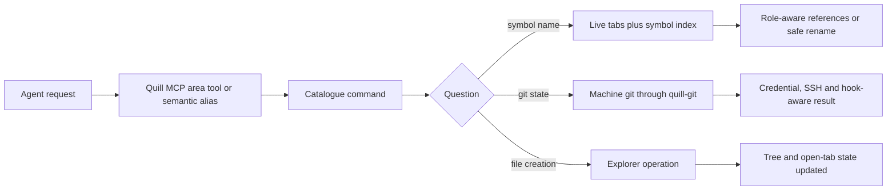
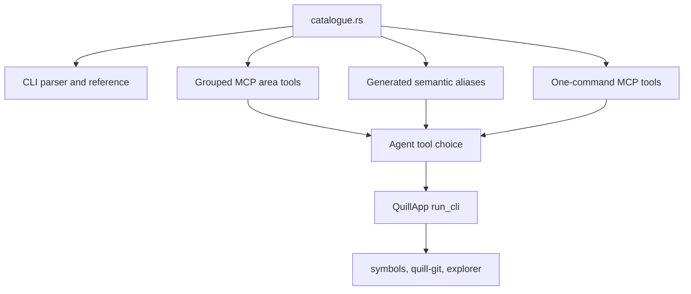
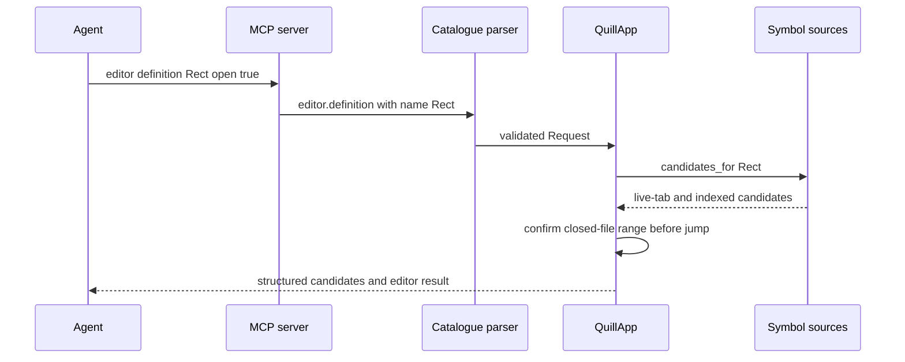

# Task 1699 — Make Quill's native answer the agent's first choice



## Introduction

Quill exposes every editor operation through MCP, but task-1695 showed that reachability is not enough. In five representative scenarios the agent chose generic shell and file tools for git status, symbol search, definition lookup, rename, and project-tree creation. The worst result was a project rename implemented as three text replacements: it changed a Mermaid label that Quill's refactor intentionally leaves alone, wrote behind live tabs, and lost Quill's one-undo-step-per-file guarantee.

This change makes the model-facing catalogue state the information and safety guarantees only Quill has, removes the concrete impedance mismatch in definition lookup by allowing `editor definition [name]`, and gives the three semantic commands narrow generated aliases in the grouped shape. The same catalogue remains the source of the CLI reference, grouped MCP tools, semantic aliases, and one-tool-per-command MCP shape.

## Goals and non-goals

### Goals

- `editor definition Rect` resolves the same project definitions as a caret-based request.
- Omitting the name preserves the caret as the default, including position flags and the existing definition-or-usages pivot.
- The editor, git, and explorer MCP area descriptions briefly name their advantage over generic file or shell tools.
- `editor references` continues to classify code, comment, and string matches and to read open tabs live.
- `editor rename` continues to preview by default, skip comments and strings by default, edit open tabs as documents, and produce one undo step per open file.
- The five task-1695 scenarios choose Quill tools after the change.
- The grouped MCP description remains economical enough to pay on every conversation.
- Existing grouped MCP calls remain compatible while definition, references, and rename also appear as narrow tools.

### Non-goals

- Replacing Quill's syntactic symbol index with a language server.
- Removing or disabling an agent's shell, grep, read, or edit tools.
- Teaching the model through an extra system prompt or a second command catalogue.
- Changing rename's scope, role defaults, preview, or disk-write semantics.
- Adding fuzzy symbol-name lookup; the supplied name is exact, as it is for `editor references` and `editor rename --name`.

## Problem statement

The default MCP shape is one tool per area. Its description is generated from `catalogue::area_note`, followed by each command's usage and summary. The current editor area note says only that commands act on the showing tab and that positions are one-based. It does not tell a model that Quill has live unsaved tab text, a project symbol index, occurrence roles, or refactoring semantics. The git note says work happens on a thread but omits that `quill-git` runs the machine's real git with its credential helper, SSH agent, configuration, and hooks. The explorer note describes filtering but not that its mutation commands update the live editor tree and tab state.

`editor definition` also differs from the neighbouring symbol commands. `references [name]` accepts a name and `rename --name` accepts a name, while `definition` accepts only a caret or explicit position. An agent asked where `Rect` is defined must first locate an occurrence. Once grep has answered that, the editor-native command offers less marginal value and is usually bypassed.

The task-1695 baseline is direct evidence:

- s09 used shell `git status` and `git diff`.
- s10 used grep and included two README diagram labels as apparent usages.
- s11 grepped for `Rect`, guessed the wrong `editor open` command, then manually opened and positioned a tab.
- s12 grepped, read three files, and applied three text replacements, including README prose.
- s14 used `mkdir`, `touch`, and `find` instead of the explorer commands.

## Architectural overview



The source of truth stays `quill-cli/src/catalogue.rs`. The three narrow MCP aliases are generated from the same `Command` values as the every-command shape rather than duplicating schemas or descriptions. The definition implementation remains in `QuillApp::run_cli` and reuses the existing `candidates_for`, navigation history, stale-disk confirmation, and candidate picker in `app::symbols`.

## Detailed technical sections

### Components and interfaces

#### Catalogue

Change the definition command from:

```text
editor definition [--offset bytes] [--line number] [--column number] [--open]
```

to:

```text
editor definition [name] [--offset bytes] [--line number] [--column number] [--open]
```

The optional `name` is exact. When present, the active path and caret provide ranking context only; no occurrence is required in the active document. When absent, the existing offset/caret resolution remains unchanged.

Update the short area notes:

- Editor: prefer definition, references, and rename for symbols because they combine live open-tab text with the project index, classify roles, and preserve refactor undo/safety semantics.
- Git: prefer Quill git commands because they run the machine's real git with its credentials, SSH agent, configuration, and hooks.
- Explorer: prefer Quill creation/list commands because they update the editor's live project tree and open-tab state.

Command summaries retain command-specific detail so the one-command MCP shape receives the same decision cues.

#### Semantic MCP aliases

The grouped shape keeps `quill_editor` unchanged for compatibility and additionally offers `quill_editor_definition`, `quill_editor_references`, and `quill_editor_rename`. Each alias is built by the same `command_tool` function as the every-command shape, so its title, description, arguments, flags, timeout, instance selection, and resolver cannot drift from the catalogue command. These three are additive because the study showed that a broad editor tool still loses probabilistically to dedicated generic `grep` and `edit` tools even when its opening copy is explicit.

#### Definition dispatch

`cli_editor_definition` branches only at input resolution:

1. A non-empty `name` is used directly.
2. Otherwise, validate that the active file supports definitions, resolve the requested position, and read the symbol there.
3. Ask `candidates_for` in both cases, using the active path and position for deterministic ranking.
4. Serialize the same candidates in both cases.
5. With `--open`, a supplied name opens through a small symbol-navigation helper; a caret-based request continues through `go_to_definition` so the definition-to-usages pivot remains intact.

The named helper uses the existing honest navigation rule: no candidates reports none, one candidate jumps, and several open the candidate picker rather than silently choosing an ambiguous definition.

### Data flows and security



The change introduces no transport, privilege, file-format, or network change. MCP still uses the authenticated loopback control channel. Closed files are rechecked at the moment of navigation; open files are read from the live `Document`. The name is data used for exact lookup and is never interpreted as a path, regular expression, command, or shell fragment.

## Research and alternatives considered

### What other agent-facing editors do

- [VS Code workspace context](https://code.visualstudio.com/docs/agents/reference/workspace-context) advertises a dedicated “Usages” capability as the combination of Find All References, Find Implementation, and Go to Definition. This names the richer semantic result beside grep rather than expecting the model to infer it.
- [VS Code tool guidance](https://code.visualstudio.com/docs/copilot/concepts/tools) says the model chooses tools from their advertised set and that reducing the decision surface improves relevance and performance. Quill already applies this with grouped area tools; the missing part is discriminative copy inside those groups.
- [JetBrains' MCP toolset API](https://github.com/JetBrains/intellij-community/blob/master/plugins/mcp-server/src/com/intellij/mcpserver/McpToolset.kt) gives tools explicit agent-facing descriptions and warns that always-included tools should be justified by evaluation because they otherwise pollute context. Quill's task-1695 harness provides that evaluation loop.
- [Zed's built-in tool reference](https://zed.dev/docs/ai/tools) uses compact task-oriented descriptions and examples. Its generic edit guidance explicitly pairs widespread rename with grep, which is a useful counterexample: without an advertised semantic refactor, the model rationally chooses text search and replacement.
- [Zed ACP](https://zed.dev/acp) gives external agents full codebase context and multi-file editing through the editor surface, but ACP integration alone does not resolve competition between a generic file tool and a richer editor-native semantic command. The model-facing distinction still has to be stated.

### Alternatives

1. Add a permanent instruction telling agents always to use Quill.
   - Pros: easy to write.
   - Cons: another paid prompt, disconnected from command availability, and too broad when a generic tool is genuinely appropriate.

2. Remove generic shell/file tools from the study agent.
   - Pros: forces Quill usage.
   - Cons: hides the real product problem and leaves agents unable to do work Quill does not expose.

3. Add hand-written vocabulary aliases such as `go-to-definition` and `find-references`.
   - Pros: matches menu vocabulary.
   - Cons: expands the catalogue and MCP context while leaving the value distinction unstated; the observed definition failure is about input shape, not only naming.

4. Allow `definition [name]` but leave descriptions unchanged.
   - Pros: fixes the concrete entry barrier.
   - Cons: does not address git, rename, search, or explorer choice and is unlikely to move the five-scenario result reliably.

5. Chosen: exact name input, high-salience capability copy, and three generated semantic aliases in the grouped shape.
   - Pros: fixes both capability and selection at the existing source of truth, preserves grouped-call compatibility, and gives semantic commands the same specificity as generic grep/edit tools.
   - Cons: grows the grouped shape from 19 to 22 tools and from roughly 13,303 to 14,613 tokens; the study verifies that the targeted gain justifies the measured 1,310-token increase.

## Testing strategy

### Automated coverage

- Catalogue parsing accepts `editor definition Rect` and still accepts the caret/position forms.
- MCP schemas expose optional `name` in grouped and one-command shapes.
- A live Quill test asks for a definition by name from a different active file and receives the structured candidate.
- `--open` by name navigates to the definition and records navigation history.
- A named request works even when the active tab's language does not define symbols.
- Existing caret-based definition tests continue to cover position lookup and the shared menu path.
- MCP description tests pin the differentiating phrases and the generated command reference stays in sync.
- Grouped MCP tests pin the three direct semantic aliases and prove that they resolve through the same catalogue commands.

### Functional verification

1. Build `quill-cli` and `quill-app` in release mode.
2. Launch the task-1695 sample project in the built Quill.
3. Call `editor definition Rect --open --json` and verify `src/shapes.rs` is showing at the `Rect` definition.
4. Inspect `mcp tools --count` and the grouped editor/git/explorer descriptions.
5. Re-run s09, s10, s11, s12, and s14 through the existing local-model harness.
6. Inspect each transcript for generic `bash`, `grep`, `read`, or `edit` calls and verify the resulting Quill state. In s12, verify that Quill's semantic rename changes only code roles; any README diagram update must be a visible, separate file edit rather than part of the refactor.

The final five-scenario pass chose Quill for every primary operation: Git status, references, definition navigation, semantic rename, and Explorer creation. The isolated grader recorded 9 of 15 calls through Quill with no refusals; the six generic calls printed diff content, updated a non-code README diagram, or compiled after the native operation. Full transcripts and all intermediate passes are in `_agent_output/task-1699-quill-native-preference/`.

No visual change is expected, so screenshot verification is not part of this ticket. The real-window study is behavioural verification, not a visual judgement.
