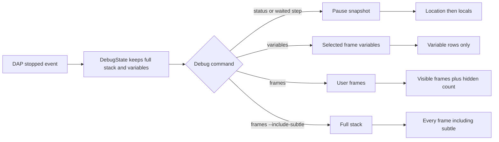
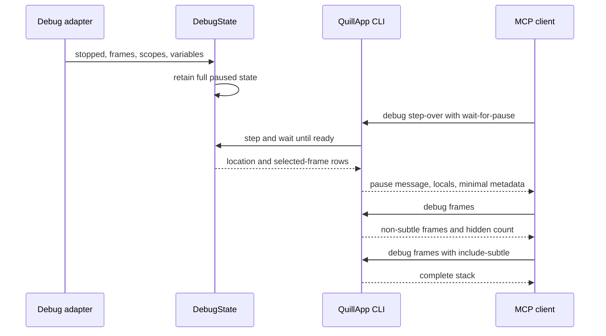

# Task 1700: Proportionate Debug Replies

## Introduction

Quill currently serialises one complete debug envelope for nearly every debug command. In the task-1695 s08 run, `debug start`, `debug step-over`, `debug status`, and `debug variables` each carried nineteen stack frames, fourteen marked `subtle`, plus the selected frame's variables and watches. The 3,214 byte reply held `total = 35.5`, but the agent derived the value from the source instead of reading the debugger's answer.

We don't need to change what the debugger reads. This change keeps the full debugger state in `DebugState` for the window, then shapes each CLI and MCP reply around the command that was asked, with a paused reply starting at the stop location and the selected frame's locals. `debug frames` hides subtle frames by default, and `debug frames --include-subtle` returns the complete stack.

## Goals and Non-Goals

### Goals

- A waited `start`, `continue`, `step-over`, `step-into`, `step-out`, `run-to`, and `status` reply names the stop location and prints the paused frame's locals before secondary metadata.
- `debug frames` omits every frame whose DAP `presentationHint` is `subtle`, reports how many were hidden, and `--include-subtle` restores the full list.
- `debug variables` returns its variable rows without duplicating the stack or watches.
- Every debug verb returns only its own result plus the minimum state needed to interpret it.
- The s08 agent run reports `total = 35.5` from Quill's debugger output.

### Non-Goals

- We won't change DAP request flow, adapter discovery, stepping behaviour, the debugger panel, stored debug state, etc.
- No adapter-side stack filtering. Quill already receives the full stack and needs it for the UI and `--include-subtle`.
- No change to how scopes or children are fetched. Expensive scopes and nested variables stay lazy.
- No change to runtime-frame rendering in the human debug panel.

## Problem Statement

`QuillApp::debug_value()` combines session metadata, all frames, all currently read variables, and all watches. Most debug command handlers call it, including commands with dedicated payloads such as `debug frames` and `debug variables`. The `lines()` helper then adds the requested rows to the same object, so the human-readable MCP text may be concise while `structuredContent` still carries the complete envelope.

The design makes the payload grow with the call stack instead of with the question. Runtime frames therefore compete with the value an agent is meant to observe. It also makes commands semantically indistinct, because `status`, `frames`, `variables`, `watch`, and a waited step expose the same data with a different message.

## Architectural Overview

The DAP overview describes a staged read from threads to stack trace to scopes and variables, with nested values fetched only when opened. Quill already follows that model, and we're keeping it. The change is at the final presentation seam, after `DebugState` has read the stopped state and before `Reply` is serialised.

The surveyed clients make the same separation:

- [VS Code's debugger](https://code.visualstudio.com/docs/editor/debugging) shows variables for the selected frame separately from the call stack. Its [debug model](https://github.com/microsoft/vscode/blob/main/src/vs/workbench/contrib/debug/common/debugModel.ts) chooses a usable top frame and recognises `subtle` or `deemphasize` presentation hints.
- [Zed's debugger actions](https://zed.dev/docs/all-actions) include a user-frame filter that shows only user code until the full stack is requested.
- [nvim-dap](https://github.com/mfussenegger/nvim-dap) treats scopes, frames, threads, etc. as separate on-demand widgets. Its [session implementation](https://github.com/mfussenegger/nvim-dap/blob/master/lua/dap/session.lua) reads non-expensive variables for the selected frame rather than presenting the stack as part of every answer.
- The [DAP overview](https://microsoft.github.io/debug-adapter-protocol/overview.html) keeps stack frames, scopes, and variables as separate requests, and its change log records `subtle` as a stack-frame presentation hint.

## Detailed Technical Sections

### Components and Interfaces

`crates/quill-app/src/app/cli.rs` will replace the single complete envelope with small builders:

| Builder | Contents | Used by |
|---|---|---|
| Debug state | running, state, configuration, adapter, paused, location, exit code | immediate start, stop, non-waited steps, timeout |
| Pause snapshot | state plus printable location and top-level locals | waited start/step/continue/run-to, paused status |
| Variables | location, selected-frame variable rows, printable rows | variables, successful set-value and set-expression |
| Frames | visible frames, hidden subtle count, printable rows | frames |
| Watches | watch expressions and their last answers | watch |

The pause snapshot's `message` names where execution stopped. Its `lines` contain the top-level local rows, so MCP's spoken content puts the observed values before structured metadata. An empty list means no locals have been read for the selected frame.

`debug frames` gains a boolean `--include-subtle` catalogue flag. Without it, the command filters `frame.subtle`, keeps original order among visible frames, and returns `hiddenFrames`. With it, the complete list is returned and each frame keeps its `subtle` field. The full stack remains in `DebugState` in both cases.

`quill-cli/docs/commands.md` is regenerated from the catalogue, so the command reference and both MCP tool shapes receive the flag and its description from the same source.

### Data Flows and Security

The reply builders only project data already held in memory. They don't read files, execute code, broaden control-channel access, or change the loopback token model. Filtering is presentation only, so it can't change debugger execution or the lifetime of DAP references.

## Alternatives Considered

### Keep the full envelope and reorder its keys

This doesn't solve the measured fault, because it leaves the payload at 3,214 bytes and relies on JSON object order surviving every serializer and MCP client. It also leaves unrelated data in every command, so we rejected it.

### Truncate the stack to a fixed number

A fixed cap still spends most replies on frames and can hide the first useful user frame behind runtime entries, while giving no principled route to the complete stack, so we rejected it.

### Drop subtle frames from `DebugState`

This would make the human panel and later commands unable to reveal them, and DAP marks them for presentation rather than deletion, so we rejected it.

### Add a new summary command

The existing waited stepping and status commands already know when the paused state is ready, while adding a summary command would require another round trip and leave the noisy defaults in place, so we rejected it.

## Testing Strategy

- Extend the scripted debug command acceptance test with user and subtle frames. Assert that paused status includes location and locals but no `frames` or `watches` fields.
- Assert `debug variables` includes variable rows and no stack.
- Assert `debug frames` returns only non-subtle frames and reports the hidden count.
- Assert `debug frames --include-subtle` returns every frame and preserves each `subtle` marker.
- Assert a waited step uses the same pause snapshot as status, so the command that lands on the value exposes it directly.
- Regenerate the command reference and run the catalogue documentation checks for the new flag.
- Build the release binaries and drive the real s08 scenario through `tools/agent-study/run-scenario.mjs`, using a task-specific output directory. Record the model's tool calls, Quill replies, payload size, and final answer, and verify the answer cites the debugger value rather than source arithmetic.
