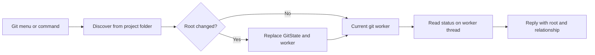
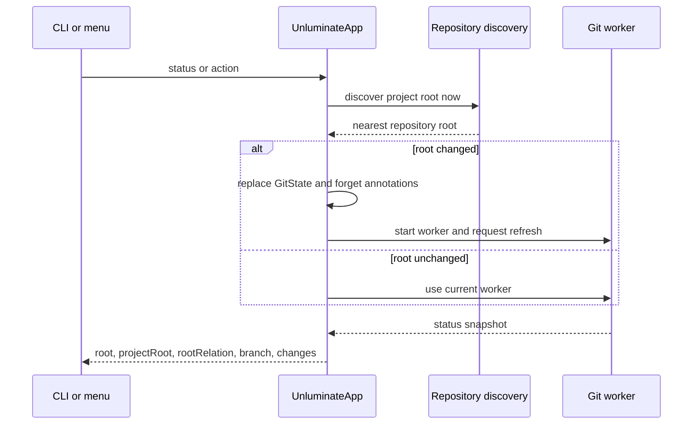
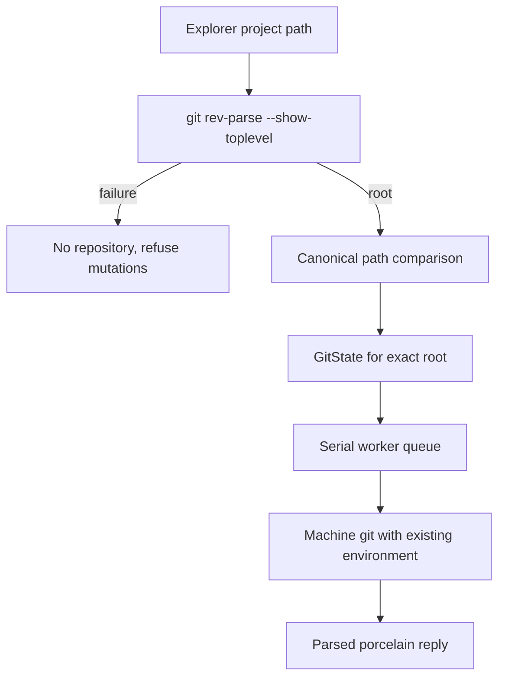

# task-1701: Git repository root refresh



## Introduction

Unluminate discovers the repository containing the project when the first frame opens, stores that `Repository` in `GitState`, and gives a clone of it to a worker that lives for the rest of the window. If the project becomes a repository later, every status and action keeps using the old root. The common case from task-1695 was a project inside Unluminate's own checkout. `git init` made the project a nearer repository, but `git status` still reported Unluminate's `main` branch with zero changes and `git action commit` would have committed there.

This change applies the disk-owned rule from task-1691 to repository identity. We discover from the project folder at the moment a git command is used, replace the state and worker when the answer changes, wait for the new worker's first status before replying, and state whether the discovered root is the project or an ancestor.

## Goals and non-goals

### Goals

- A window opened before `git init` reports the new repository on the first later `git status` request.
- A project that becomes a nearer repository stops sending actions to its former ancestor.
- `status.git` and `git status` expose `root`, `projectRoot`, and `rootRelation` with `rootRelation` equal to `project` or `ancestor`.
- The plain-text `git status` summary names an ancestor relationship, so a caller doesn't need JSON to see it.
- Repository discovery and every git operation continue to use the machine's `git` executable and run actual repository work on the existing worker thread.
- An automated test opens a project under an ancestor repository, initialises the project after the window is running, asks Unluminate for git status, and proves the nearer root, branch, and changes are returned.

### Non-goals

- Supporting several repositories in one Unluminate window at the same time.
- Recursively scanning every project subfolder for repositories.
- Adding repository selection UI like VS Code's Repositories view or IntelliJ's Directory Mappings page.
- Watching `.git` continuously. The point of use is authoritative, and the cheap direct marker check exists only to let a newly initialised project's menu become available.
- Changing how git credentials, hooks, SSH agents, safe-directory checks, worktrees, submodules, etc are handled.

## Problem statement

`GitState::open` calls `Repository::discover` once and starts `Worker` with a cloned `Repository`. `Worker::start` moves that value into its thread, so every request runs against the same root. `UnluminateApp::open_repository` is called on the first frame and when the project folder changes, but nothing calls it when repository metadata changes under an already open project.

The failure is dangerous because the reply is plausible. The wrong repository has a real branch and a valid clean status, and the JSON gives no relationship between the project folder and the repository root. A caller can't distinguish the project repository from an ancestor without comparing paths itself.

## Research

VS Code performs an initial workspace scan, watches filesystem changes matching `.git`, and debounces a later `openRepository` call by 500 ms. It also separates parent repositories and can prompt before opening them. The implementation is in Microsoft's [`extensions/git/src/model.ts`](https://github.com/microsoft/vscode/blob/main/extensions/git/src/model.ts), and the product documentation describes the multi-repository Repositories view in [Working with repositories and remotes](https://code.visualstudio.com/docs/sourcecontrol/repos-remotes).

IntelliJ uses directory mappings, scans project directories for unregistered Git or Mercurial roots, and notifies when new roots appear. Its default registry settings enable automatic mapping detection and automatic registration of detected Git roots. The behaviour is documented in [Version control integration support](https://www.jetbrains.com/help/idea/enabling-version-control.html), and the defaults are visible in JetBrains' [`registry.properties`](https://github.com/JetBrains/intellij-community/blob/master/platform/util/resources/misc/registry.properties).

Both editors keep a repository model and update it when repository metadata appears. Unluminate has one repository per window rather than a multi-root model, so rediscovery at the operation boundary gives us the required correctness without adding a watcher, registry, or second repository selector.

## Architectural overview

`UnluminateApp` remains the owner of which repository the window means. `unluminate-git` remains responsible for discovering and operating on a repository, and `Worker` remains responsible for serialising git commands off the UI thread.



## Components and interfaces

### Repository comparison

`app::git` gets one path-comparison helper which canonicalises both sides when possible. `Repository::discover` resolves through git and can spell a symlink differently from the project path, so lexical equality alone would label the same folder as an ancestor.

`root_relation(repository, project)` returns `Project` when both paths name the same directory and `Ancestor` otherwise. Discovery from the project folder guarantees there isn't a third valid relationship.

### GitState construction

`GitState::open` continues to discover and open in one call for startup. A second constructor accepts an already discovered `Repository`, which lets rediscovery compare once and replace state without running `git rev-parse` twice.

### UnluminateApp refresh boundary

`UnluminateApp::refresh_repository` discovers from `tree.root()`, compares the result with `self.git`, and does nothing when the root is unchanged. On a change it replaces `GitState`, drops the old worker sender, forgets file annotations, and returns whether a new worker is reading its first snapshot.

The method is called before:

- `git status`, every `git action`, and the git parts of the top-level `status` command
- `run_git`, which is the one path used by menus, keys, the rail, and `git action`

`git status` requests a fresh snapshot and waits for the worker. The top-level `status` command waits only when rediscovery replaced the root, since it must not expose a new root with the old root's status or an empty first snapshot.

`menu_state` treats a direct `.git` file or directory under the project as enough to enable git controls before the first action. The action itself still runs real discovery, so a marker that git refuses under `safe.directory`, a malformed marker, etc never becomes authority.

### Reply contract

Both git values include:

```json
{
  "root": "C:/work/parent",
  "projectRoot": "C:/work/parent/project",
  "rootRelation": "ancestor"
}
```

The existing `root` field remains unchanged for compatibility. `rootRelation: project` means git's top level and the explorer root name the same directory after canonicalisation. `ancestor` means git is intentionally operating above the project. The plain summary appends the root and the relationship when it is an ancestor.

## Data flows and security



No path from the client chooses the repository root. The server derives it from the window's project folder, so a request can't redirect commit, reset, push, etc to an arbitrary repository. Git keeps enforcing `safe.directory`, hooks, credential helpers and configuration. A failed rediscovery removes mutation access rather than falling back to the cached root.

Replacing `GitState` drops the old sender. Any in-flight read can finish on its detached thread, but its receiver is gone and its reply can't enter the new state. Git actions are serial within a state, and refresh happens before a later action is accepted.

## Alternatives considered

### Watch `.git` like VS Code

This would update the UI quickly, but it adds another watcher and still needs rediscovery at use because filesystem events can be lost or delayed. Unluminate already uses point-of-use reads for disk-owned state. We keep a cheap direct marker check for menu availability and make discovery authoritative.

### Re-run discovery every frame

This would eventually notice every change but would start `git rev-parse` twice a second because the window heartbeat draws while idle. Repository identity changes rarely, and a subprocess per frame is the wrong cost.

### Keep the cached ancestor until restart

This is the current behaviour. It can commit, reset, stash or push the wrong repository and gives the caller no warning.

### Reject every ancestor repository

A project folder inside a monorepo is a normal Unluminate project. Rejecting it would remove useful git integration. Exposing the relationship keeps the behaviour and removes the ambiguity.

### Add multi-repository selection

VS Code and IntelliJ both support it, but it changes the window model, git panel, status bar, action targeting, persistence and CLI contract. The ticket needs the repository for the project folder to stay current, and that doesn't require a second repository model.

## Testing strategy

1. Build a real ancestor repository in a unique temporary folder and create a project directory inside it.
2. Open an Unluminate harness on the project and wait until it reports the ancestor.
3. Run `git init` in the project, create several changed files, and ask through Unluminate's command path.
4. Pump the window until the held status request completes, then assert the root is the project, the branch is the new repository's branch, the change count is non-zero, `projectRoot` matches, and `rootRelation` is `project`.
5. Keep a separate ancestor test proving that a project with no repository of its own returns `rootRelation: ancestor` and a plain summary that names the relationship.
6. Run the focused Rust tests and build the release binary.
7. Open a real installed Unluminate window on a non-repository project under an ancestor, initialise it after the window is open, run `unluminate-cli git status --json`, and verify the new root, branch and changed files without restarting the window.
