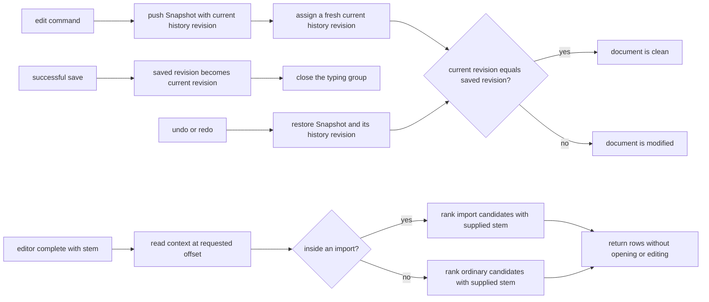
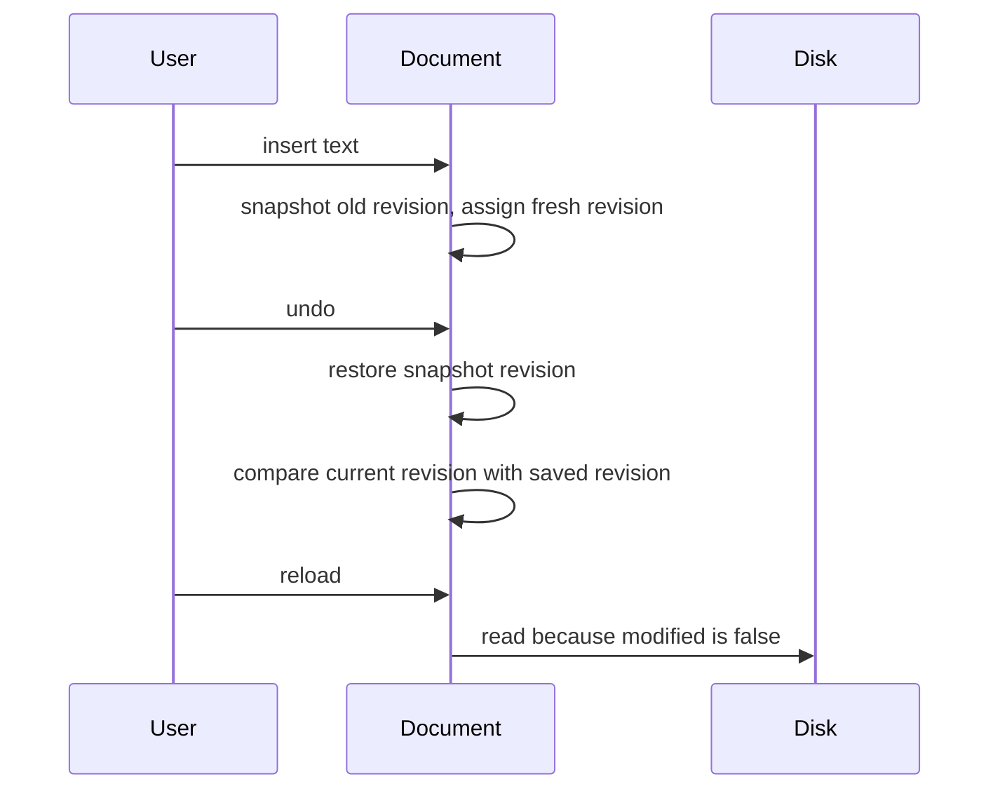

# task-1702 — Saved-state undo and hypothetical completion

## 1. Introduction

`task-1695` measured a harmful sequence in a real agent session: `editor complete` could only answer
about text already in the document, so the agent inserted `ar`, asked for completions, and undid the
insertion. Undo restored the original bytes but left `Document::modified` true. `tab reload` then
refused, the tab stayed dirty, and closing it would have written a file the agent never intended to
change.

This change gives undo history an explicit saved-state revision and gives `editor complete` a
read-only `--stem <text>` query. The two fixes are independent, but both are required to make the
observed sequence safe: undo must tell the truth about disk equality, and a question must not need an
edit in the first place.

## 2. Goals and non-goals

### Goals

- `Document::is_modified()` is false exactly when the current undo state is the state last loaded or
  successfully saved.
- Undo and redo can cross the saved point in either direction and update the dirty marker correctly.
- Saving closes the current typing group, making the saved state an exact undo destination.
- Branching after undo cannot accidentally report clean because a discarded state once occupied the
  same stack index.
- `editor complete --stem <text>` ranks the hypothetical stem at the requested offset without
  changing text, selection, undo/redo history, modified state, or the visible completion popup.
- The catalogue remains the source of the CLI, MCP schema, examples, and generated command reference.
- Automated tests cover the core history rules, the insert/undo/reload round trip, and the read-only
  completion query.

### Non-goals

- Persisting undo history across Unluminous restarts.
- Comparing the whole buffer with disk after every edit; dirty tracking stays O(1).
- A second completion engine or a second candidate pool.
- Applying `--choose` to hypothetical text. Choosing edits the real document and therefore continues
  to require a real stem at the requested position.
- Changing close-tab's existing save-on-close policy.

## 3. Problem statement

`Document` currently stores undo and redo as `Vec<Snapshot>`, but `modified` is a one-way boolean for
ordinary edits: every edit, undo, and redo sets it to true, while only save sets it false. The buffer
therefore cannot recognise that undo returned to the bytes last written to disk. A text comparison in
`is_modified` would answer correctly but would make a frequently-read UI property proportional to file
size.

Completion has the inverse problem. `completion_offer(offset)` derives the stem from the live buffer.
That is correct for the popup and `--choose`, but it means the read-only question “what would `ar`
offer here?” has no representation. The only workaround mutates the person's file.

## 4. Research and precedent

Three editor APIs use the same saved-point idea:

- [Qt `QUndoStack`](https://doc.qt.io/qt-6/qundostack.html) stores a `cleanIndex`; returning to it by
  undo/redo makes the stack clean. If a branch discards that point, the clean index becomes invalid.
- [Scintilla](https://scintilla.org/ScintillaDoc.html) stores a save point between undo actions and
  notifies its container when undo/redo enters or leaves it.
- [CodeMirror 5](https://codemirror.net/5/doc/manual.html) returns a change-generation token which
  `isClean` can compare later; requesting a generation can also close the current grouped event.

Unluminous restores whole snapshots, so a monotonic history revision carried by each snapshot is the
smallest version of this pattern. It is safer than a raw vector index because Unluminous caps history and
clears redo when a new branch is made.

## 5. Architectural overview

## 6. Components and interfaces

### 6.1 `unluminous_core::Document`

Add three counters:

- `history_revision`: identity of the current persisted-content state.
- `saved_history_revision`: identity recorded by open/new/save.
- `next_history_revision`: the next identity assigned to a real text or formatting edit.

`Snapshot` carries `history_revision`. `mark_changed` assigns a fresh revision before clearing redo.
`restore` restores the snapshot's revision. `is_modified` becomes the comparison of current and saved
revisions rather than a stored boolean.

`save_as` records the current revision only after the write succeeds and changes `last_edit` to
`EditKind::Other`. The latter is essential: without it, typing immediately after save would merge
with typing from before save, leaving no snapshot at the saved point.

Fresh revision identities solve branching without extra invalidation logic. A saved revision stranded
in discarded redo history can never be assigned again, so a later branch cannot become clean merely
because it has the same vector index.

### 6.2 Completion query

Keep `completion_offer(offset)` unchanged for the popup and real document stem. Add a sibling helper
that accepts `(offset, stem)` and uses the same candidate functions:

- At an import position, preserve the import context and rank its candidates against `stem`.
- Everywhere else, call `completion_rows(stem)`.
- Return an empty replacement range at `offset`, because no document bytes are being replaced.

`cli_editor_complete` selects the hypothetical helper when `stem` is present. Empty stems and the
combination `--stem` plus `--choose` are usage errors. Listing still leaves the popup untouched.

### 6.3 Catalogue and documentation

Add `stem` to the `editor complete` catalogue flags and make the summary explicit: use this flag for
a hypothetical word instead of inserting it. Regenerate `unluminous-cli/docs/commands.md` from the
catalogue so MCP, CLI help, and the reference cannot drift.

## 7. Data flows and safety

### Saved state

The saved marker advances only after `std::fs::write` succeeds. A failed save leaves the prior marker
and the document dirty. No hashes, file bytes, paths, or content leave the process.

### Hypothetical completion

The query reads the active document, grammar, open-tab symbol caches, and project index exactly as
ordinary completion does. It invokes no `Command`, does not move the caret, does not call
`complete_word`, and does not assign `self.completion`. `--choose` remains the only completion path
that mutates a document.

## 8. Alternatives considered

| Alternative | Advantage | Why not |
|---|---|---|
| Compare current text with disk in `is_modified` | Simple truth source | File I/O and O(n) comparison on a property read throughout the UI; disk can also change independently. |
| Store a hash of the saved text | O(1) comparison after hashing | Every edit still needs an O(n) rehash or an incremental hash with more invariants than the undo stack already provides. |
| Store only an undo vector index | Familiar `savedIndex` shape | Unluminous caps the vector and branches by clearing redo; a reused numeric index can name different content. |
| Put `modified` inside each snapshot | Minimal change to undo | It preserves a derivative boolean rather than the saved point and does not by itself handle grouped typing across save. |
| Implement `--stem` by inserting and rolling back internally | Reuses current offer code literally | Repeats the defect's mutation pattern, risks revisions/caches/observers, and makes a read-only query depend on perfect rollback. |
| Rank `--stem` without looking at position | Smallest CLI change | Gives the wrong candidate family inside imports, where position selects module paths or exports. |

## 9. Testing strategy

- Core document tests:
  - insert then undo to the loaded state clears modified;
  - save, type again, undo returns exactly to the saved state and clears modified;
  - redo leaves the saved state and undo returns to it;
  - undo before the saved state is modified;
  - a new branch after undo does not reuse the clean identity.
- App/CLI integration:
  - open a real fixture, insert, undo, assert `modified: false`, then `tab reload` succeeds without
    `--discard`.
  - ask `editor complete --stem dra` at a position and assert ranked rows while text, selection,
    modified state, undo availability, revisions, and popup state remain unchanged.
  - reject empty `--stem` and `--stem` combined with `--choose` as usage errors.
- Run the focused Rust tests for the changed crates and command path, build release artefacts, then
  drive the installed Unluminous through the real CLI round trip before publishing the patch release.
