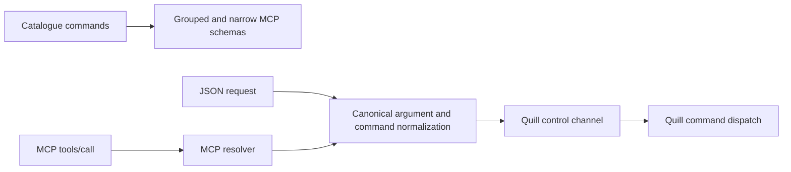
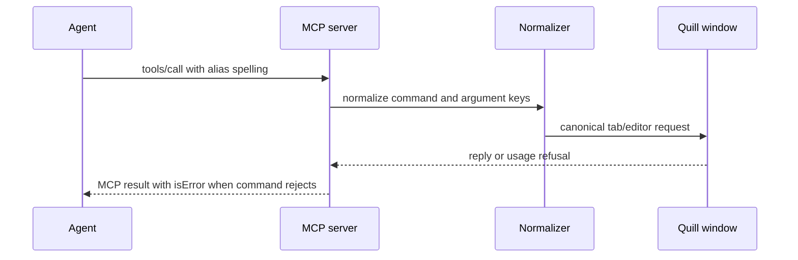

# task-1703: MCP aliases and explicit grouped arguments

## Introduction

The MCP surface currently advertises grouped tools with an untyped `arguments` object. The
catalogue already knows every positional and flag name, but grouped `tools/list` discards that
information, making an agent guess kebab-case names. The control-channel parser also only removes
leading dashes, so camelCase and snake_case guesses fail even when their intent is unambiguous.

This change keeps the grouped shape as the default, exposes a compact catalogue-derived union of
argument properties, accepts equivalent spelling variants, and maps common file-operation guesses
from `editor` to the canonical `tab` commands. The narrow shape and existing grouped calls remain
compatible.

## Goals and Non-Goals

Goals:

- `waitFor`, `wait_for`, and `wait-for` resolve to the same canonical argument; likewise for
  names such as `fromLine` and `from_line`.
- The normalization is identical at the JSON control-channel boundary and in the MCP resolver.
- `editor open`, `editor reload`, `editor save`, and `editor close` resolve to their `tab`
  commands before dispatch.
- Every grouped tool advertises the argument names used by commands in its area, with typed,
  generated properties and closed nested objects.
- `mcp tools --count` remains below 16,000 approximate grouped tokens and a focused test pins the
  budget.

Non-goals:

- No new editor behavior or second command implementation.
- No removal of the existing grouped or every shapes.
- No broad abbreviation or fuzzy command matching.
- No change to production defaults beyond making the existing MCP schema more informative.

## Problem statement

The agent study recorded nine refused calls. Three chose the `editor` area for file-tab verbs and
three used camelCase, snake_case, or mixed spelling for kebab-case arguments. Refusals are safe and
helpful, but each costs a round trip. The grouped schema has `additionalProperties: true` and no
argument properties, despite `every` already generating those properties from the catalogue.

## Architectural Overview

## Detailed Technical Sections

### Components and Interfaces

- `quill-cli/src/catalogue.rs`: add one canonical argument-name conversion that removes leading
  dashes, converts `_` to `-`, and inserts word boundaries before capitals. `normalise_arguments`
  gives an exact canonical key precedence over aliases. `find` recognizes the four explicit editor
  file aliases and returns the existing tab command.
- `quill-cli/src/protocol.rs`: canonicalize a parsed command through `catalogue::find` and apply
  `normalise_arguments` to every object before constructing `Request`.
- `quill-cli/src/mcp/tools.rs`: generate a grouped `arguments.properties` union from each area's
  command metadata; preserve `additionalProperties: false` at the outer call and nested argument
  level. Apply the same argument normalization to narrow calls and resolve aliases to canonical
  commands.
- `crates/quill-app/src/app/cli.rs`: receives canonical wire names, so the existing tab dispatch is
  the only implementation path. Unknown argument refusals continue to use catalogue names.

The grouped schema is intentionally a union rather than a `oneOf` per verb. A `oneOf` would model
the relationship more precisely but repeats command-specific descriptions and costs too much
context in the default shape. The resolver remains authoritative for command-specific validity.

### Data Flows and Security

Normalization changes names only; it does not bypass token checks, instance selection, unknown
command refusal, or the existing MCP distinction between protocol errors and tool errors. Exact
canonical keys win if a caller supplies both a canonical key and an alias, preventing object-key
order from changing behavior.

### Schema budget

The grouped JSON is measured by the existing `mcp tools --count` command. The regression threshold is
16,000 approximate tokens, calculated as serialized bytes divided by four. The test also asserts
that every catalogue argument and flag appears in the grouped tool for its area. The every shape is
not budgeted by this ticket because it already intentionally pays for per-command schemas.

## Alternatives Considered

1. Accept aliases only in prose. This costs no schema tokens but leaves the model to extract and
   spell names from English, which is the observed failure.
2. Add a full `oneOf` schema for every verb. This is the most precise JSON Schema, but repeats
   properties and descriptions across grouped tools and threatens the context budget.
3. Keep `additionalProperties: true` and only normalize at runtime. This preserves compatibility,
   but still provides no completion or machine-readable names to the agent.
4. Add fuzzy command prefixes. Rejected because a future command can make today's unique prefix
   ambiguous and silently change an existing script.

The chosen union schema plus exact spelling aliases gives structural guidance at a bounded cost,
while the catalogue and resolver remain the source of truth.

## Testing strategy

- Catalogue tests for camelCase, snake_case, kebab-case, leading dashes, canonical-key precedence,
  and the four editor-to-tab aliases.
- Protocol tests proving `Request::from_json` normalizes both command and argument spellings.
- MCP resolver tests proving grouped and every calls deliver identical canonical arguments and
  aliases resolve to the same `Command`.
- Schema tests proving each grouped area advertises its catalogue names, nested arguments are
  closed, and serialized grouped tools stay below the 16,000-token budget.
- Functional verification with `cargo run --release -p quill-cli -- mcp tools --count`, direct
  MCP JSON-RPC calls through the existing server test seam, and the agent-study harness scenarios.
  No production visual change is involved.

## Research references

- [MCP tools schema and error behavior](https://modelcontextprotocol.io/specification/2025-06-18/schema)
- [MCP tool input schemas and deterministic tool lists](https://modelcontextprotocol.io/specification/draft/server/tools)
- [JSON Schema object properties and additionalProperties](https://json-schema.org/understanding-json-schema/reference/object)
