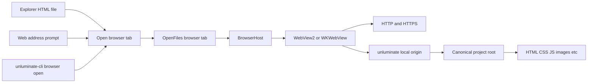
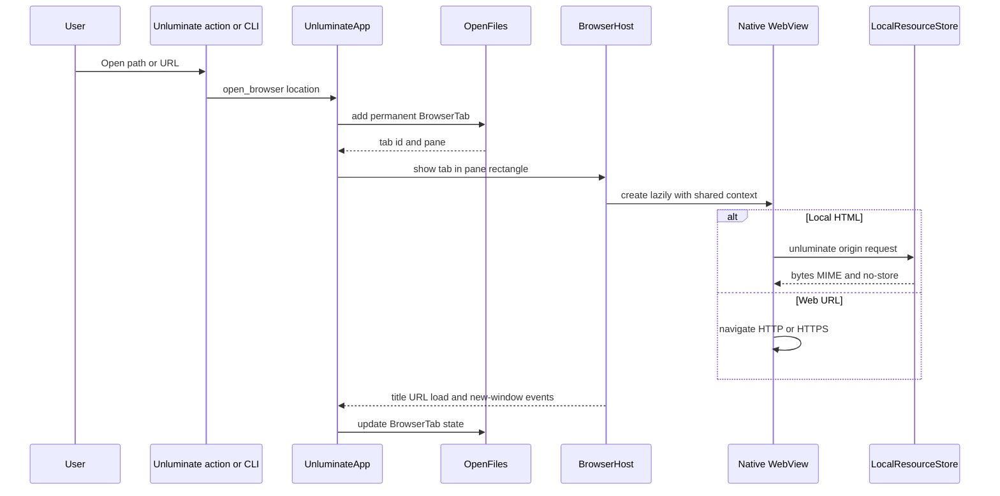
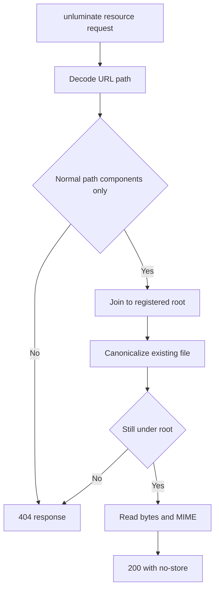

# Task 1756: Unluminate web support

## Introduction

Unluminate can edit HTML, CSS and JavaScript, but it can't show the page those files produce. We want an HTML file in the explorer to open as a rendered page in a normal Unluminate tab, including its relative stylesheets, scripts, images, modules, fonts, etc. We also want a person or agent to open an HTTP or HTTPS address in the same tab system.

IntelliJ's current implementation is the behavior we want to match. Its built-in preview opens in an editor tab, serves project files through the IDE's built-in web server, loads linked assets, and reloads when the HTML or one of its dependencies is saved. We'll provide the same workflow with the operating system's browser engine instead of shipping Chromium inside the installer.

## Goals and non-goals

### Goals

- An HTML file has `Open in Browser -> Tab` in the explorer's context menu.
- `File -> Open Web Address...` opens an HTTP or HTTPS URL in a permanent tab.
- `unluminate-cli browser open <path-or-url>` reaches the same `UnluminateApp::open_browser` function as the human controls.
- Relative and root-relative CSS, JavaScript, images, fonts and module imports load from the project.
- Browser tabs participate in the existing pane, move, close, restore-focus and tab-selection rules.
- Back, forward and reload are available in the browser tab and through `unluminate-cli browser`.
- A saved or externally changed local dependency reloads the local page.
- Browser resources are created lazily, share one browser context, and move inactive Windows views to WebView2's low-memory target.
- A closed browser tab releases its native view and local-file registration.
- Browser content receives no native host objects, IPC bridge, filesystem handle, camera, microphone, geolocation or download permission.

### Non-goals

- Unluminate won't become a full browser with bookmarks, history sync, extensions, password management or multiple profiles.
- Unluminate won't run a Node development server or infer a framework's build command.
- The local origin serves static files as they exist on disk. Server-side templates, PHP, API routes, bundler transforms, etc. still need their real development server and can be opened by URL.
- Linux embedding isn't part of this release. Unluminate ships Windows and macOS installers, and unsupported targets will return a clear refusal while the rest of the workspace keeps compiling.
- Developer tools and downloads won't be exposed in the first release.

## Problem statement

The HTML plugin gives Unluminate syntax color, folding and completion, but opening an HTML file still shows only its source. A person has to leave Unluminate, find the file or start a browser, and manually repeat that step after edits. Opening the file with a raw `file://` URL would load basic relative images but gives modules, origin-based browser APIs, cross-origin requests and root-relative paths different behavior from a site.

Embedding a browser also introduces costs Unluminate doesn't have today. A browser control is a native child window with renderer and GPU processes, it sits above egui's painter, and a separate browser environment per tab wastes RAM. The implementation has to account for those facts explicitly or it will cover Unluminate's menus, leak views after tabs close, and make several tabs much more expensive than they need to be.

## Architectural overview

### Chosen browser layer

Use `wry` as a small cross-platform wrapper around the browser already installed with the operating system. On Windows it hosts WebView2. On macOS it hosts WKWebView. `eframe::Frame` implements `HasWindowHandle`, so the view can be built as a native child of Unluminate's existing window without replacing eframe or changing the wgpu renderer.

`BrowserHost` lives in `unluminate-app/services`. It owns one lazy `wry::WebContext`, a map of tab id to native `WebView`, and the event channels used by static browser callbacks. Native views stay out of `OpenFile`, which keeps the tab model testable without a window handle and prevents a browser object from leaking into project state.

Each open browser tab can keep its page state, scroll position and JavaScript heap. All views use the same context and data directory, which lets WebView2 share browser, network and GPU processes. A view that isn't visible is hidden, and Windows sets `MemoryUsageLevel::Low` until the tab is visible again. The browser context is created on the first browser tab, so a normal editing session pays no browser startup or RAM cost.

### Browser tabs

`OpenFile` gains an optional `BrowserTab` with a stable id, requested location, current URL, title and load state. The tab's `Document` stays pathless, so a rendered HTML tab can coexist with the source tab and can't be mistaken for the live editable copy by symbol search, rename, save, breakpoints, project state or any other document owner.

`BrowserTab::source_path` is used only where a display relationship is intended, such as the tab icon and the explorer's selected row. The tab name is the document title when one exists, then the local filename or URL host. Save, formatting, folding, debugger and text commands are absent for a browser tab through the existing file-kind questions.

The pane loop records a `BrowserPlacement` for every visible browser tab. `BrowserHost::reconcile` runs from `eframe::App::raw_input_hook`, before the egui pass rather than inside it, and creates the view if there is none, points it at the tab that is showing, updates logical bounds and hides it when nothing should be seen. It hides the native view while an Unluminate modal, popup or context menu is open — `egui::Popup::is_any_open` is what covers the menu bar and every dropdown and flyout in one answer — because native child windows paint above egui and would otherwise cover the control.

**A window has one native view, however many rendered tabs are open**, and it is pointed at whichever tab is showing. This replaces the per-tab views this document originally specified; §"What the runtime pass found" records the measurement that forced the change. Where a tab has been is therefore remembered in `BrowserTab` — an address list and a position — rather than read back from the engine, so `Back` in one tab can never land on another tab's page, and a tab ignores the page the view reports while it is leaving it.

### Local resource origin

Local HTML uses an `unluminate://tab-<id>/...` custom origin. Wry maps that to an HTTP-shaped origin on Windows and keeps the custom scheme on macOS, while relative URL resolution continues to work on both. The initial path is relative to the project root when the file is inside the project, or relative to its containing folder when it isn't.

The protocol handler accepts `GET` and `HEAD`, percent-decodes the path, rejects parent, root and platform-prefix components, canonicalizes the resulting file, and verifies it is still below the tab's canonical root. Symlinks therefore can't escape the project. Directory requests may resolve to `index.html`. Missing, unreadable and escaped paths return the same 404 so a page doesn't learn about paths outside its origin.

The handler records the disk stamp of every resource it serves. Unluminate polls only that bounded set on its existing file-watch interval, and reloads a local tab when one changes. This covers HTML, linked CSS, JavaScript, images, fonts, etc. without walking the project or injecting a script into untrusted pages.

### Navigation and events

`components::browser_view` draws a 28 point toolbar using Unluminate's palette and measurements, with named Back, Forward and Reload controls plus the current address. The component returns an outcome and changes no browser state. `UnluminateApp` sends that outcome to `BrowserHost`, the same path used by `unluminate-cli browser back`, `forward` and `reload`.

Browser callbacks send title, current URL, load status and `window.open` requests into a channel and request a repaint. `UnluminateApp` drains the channel at the top of a frame. A requested new window is denied by the engine and reopened as another Unluminate browser tab, so a page can't create an unmanaged operating-system window.

## Components and interfaces

### `services::browser`

- `BrowserLocation::parse(value, project_root)` accepts an existing HTML path or an absolute HTTP or HTTPS URL.
- `LocalResourceStore` registers a canonical root per tab and resolves custom-origin requests.
- `BrowserHost::reconcile(frame, placements, occluded)` owns native view creation, visibility, bounds and memory targets.
- `BrowserHost::command(tab_id, BrowserCommand)` handles back, forward, reload and navigation.
- `BrowserHost::take_events()` returns browser events without exposing native objects to `UnluminateApp`.
- A target-gated stub preserves the same interface and returns `Browser support is available on Windows and macOS` elsewhere.

### `app::files`

- `BrowserTab` contains serializable, testable page state and no native handle.
- `OpenFile::browser(location, id)` creates a permanent rendered tab.
- `OpenFile::is_browser`, `browser` and `associated_path` answer the three places that need to distinguish it.
- Closing an index reports the browser id so `BrowserHost` releases the corresponding view and registration immediately.

### Actions and CLI

- `Action::OpenWebAddress` opens the existing prompt dialog and submits through `open_browser`.
- `Action::OpenInBrowser(PathBuf)` is present only for `.html` and `.htm` file rows, under `Open in Browser -> Tab`.
- The `browser` catalogue area provides `open`, `back`, `forward`, `reload` and `status` commands.
- `browser open` accepts `location`, resolves relative paths against the project, and calls `UnluminateApp::open_browser`.
- The MCP surface remains generated from the catalogue.

## Data flows and security

Web content is untrusted. The browser gets no IPC handler, initialization script, native object or automation API. Permission requests are denied. Downloads and unmanaged popups are denied. Navigation allows HTTP, HTTPS and the tab's own local origin, and rejects file, data, javascript and other schemes. Remote pages can make the network requests a browser page normally makes, but they can't ask Unluminate to read a file or run a command.

The browser profile lives in Unluminate's per-user settings folder, not beside `unluminate.exe`, `Program Files`, a project or a network share. All views share it. No token, source content or browser data is written into the task comments or test artifacts.

Local content can execute its own JavaScript because that is part of rendering an HTML project. Its filesystem access is limited to HTTP-style reads through `LocalResourceStore`, and the canonical-root check is applied on every request. The origin gets no CORS allowance for arbitrary remote sites.

Failures stay inside the tab. A missing WebView2 runtime, unsupported platform, invalid URL, unreadable file or native view creation failure produces a browser error panel and status message. It doesn't panic or close Unluminate.

## What the runtime pass found

Two defects were found by running the built window rather than by reading the code, and both are the reason parts of this document changed.

**A second browser tab hung the window for good.** No crash, no error, no log line; the process still pumped Windows messages, so it looked alive while no frame was ever drawn again. Creating a WebView2 controller blocks the thread inside a nested `GetMessage`/`DispatchMessage` pump, waiting for a completion the runtime delivers on that same thread — and with another view already alive, that completion did not arrive. Measured with a locally patched `wry`: twenty seconds of active pumping, two messages, no completion; abandon the call and the completion lands immediately afterwards, and the retry succeeds in 17 ms. Ruled out along the way: the shared browser environment (`WebViewBuilderExtWindows::with_environment`), the shared data folder, the custom protocol, every builder handler, focus, the new view's visibility, Unluminate's transparent DirectComposition window and its `run_and_return: false` loop. A minimal `eframe` + `wry` probe with all of those matched created two views happily, which is what makes this a real limit of the combination rather than a fault in one of them. Hiding the sibling first made a two-tab window work and a four-tab window hang, so the answer is one view.

**A rendered tab kept showing the previous page.** `WebView::load_url` hands its string straight to `Navigate`, and WebView2 cannot navigate a scheme of its own: wry rewrites the address a view is *built* with to `http://unluminate.<origin>/`, but not the one it is later sent to. An unknown scheme is refused in silence, so the toolbar said `Loading` while the pane went on showing the page it was already on — visible only in a screenshot, not in any state Unluminate reported. `engine_url` and `canonical` are the two directions of that translation, and a tab's history holds the canonical form so the same page under either engine's name is one entry.

## Performance and RAM

- No browser context or process is created until the first rendered tab becomes visible: **197 MB** with rendered tabs unopened, and no `msedgewebview2` process at all.
- One browser serves every rendered tab, so the second and later tabs cost their remembered state and nothing else: **527 MB** with one tab, **531 MB with four**, six browser processes throughout.
- Closing the last rendered tab drops the view and every process with it, back to **207 MB**.
- The view is hidden rather than destroyed when no rendered tab is showing, and Windows marks a hidden one for low memory usage.
- Bounds are changed only when the pane's logical rectangle changes.
- Local resources are read only when the browser asks for them. Change detection polls the resources that page loaded, not the project.
- Closing a tab drops its local root and the resources it had loaded; closing the last one drops the view.
- A local page is watched only through the resources it actually requested, polled at most twice a second, so a changed stylesheet reloads the page and an untouched project costs nothing.

## Alternatives considered

### `file://` URLs

This is the smallest implementation and handles basic relative assets. Browser modules, root-relative paths, CORS, storage and secure-origin APIs behave differently from a served site, which is why IntelliJ uses its built-in server. Rejected.

### A loopback HTTP server

This matches IntelliJ closely and gives every browser engine an ordinary HTTP origin. It also adds a listener, authentication token, lifecycle, port discovery, request parsing and another thread to a desktop editor. Wry already provides a custom origin with the same relative-resource behavior and no reachable port. Rejected for this scope.

### Render HTML in egui

Unluminate could parse a subset of HTML as it does Markdown and Mermaid. Correct CSS layout, JavaScript, modules, media, browser APIs and current web compatibility would become a browser-engine project. Rejected.

### Ship Chromium or CEF

This gives the most consistent rendering across platforms and is IntelliJ's JCEF approach. It adds a large runtime to Unluminate's installer and duplicates the Chromium already present through WebView2 on Windows. The operating-system engines cover Unluminate's two shipped platforms at much lower disk and RAM cost. Rejected.

### One native view for each tab

This was the original choice, and it is what a browser does: a view for each tab keeps page state, JavaScript state and scroll position while switching. It cannot be built here. Creating the second view hangs the window permanently, for the reason measured in §"What the runtime pass found", and no arrangement of environment, context, visibility or window options avoided it. **Rejected on evidence, and this document previously specified it.**

What the shipped design gives up is page state on a tab switch: coming back to a rendered tab loads its address again. What it keeps is per-tab history, which is the part a person notices, and it costs one browser for the window rather than one renderer per tab. If a later wry or WebView2 makes concurrent creation work, the change is contained: `BrowserTab` already holds everything a tab knows, and only `native::NativeHost` would grow from one view to a map of them.

## Testing strategy

Automated coverage will include:

- Local URL construction for project-root and outside-project HTML.
- Percent encoding, MIME types, `HEAD`, directories and linked HTML, CSS, JavaScript and image fixtures.
- Traversal, absolute path, symlink escape, unsupported method and missing-file refusals.
- Dependency stamp changes causing one reload and unchanged resources causing none.
- Browser tab naming, source coexistence, panes, close cleanup and unsupported-platform errors.
- Explorer menu presence for HTML files and absence for folders and non-HTML files.
- `File -> Open Web Address...` and browser toolbar controls through egui's test harness.
- Catalogue, JSON wire, documentation and CLI dispatch for every `browser` command.
- A real released-window scenario that opens a fixture page, verifies its CSS, script and image, follows a link, goes back, edits a dependency, observes reload, opens an HTTPS URL, closes the tabs, and confirms the browser processes are released when the last Unluminate window closes.

Visual checks happen only after the feature build is released and installed. The released window is captured over the desktop, then the matching component baseline and platform screenshot are accepted and included in the final patch release.

## Sources

- [IntelliJ IDEA HTML preview](https://www.jetbrains.com/help/idea/editing-html-files.html)
- [IntelliJ Platform JCEF embedded browser](https://plugins.jetbrains.com/docs/intellij/embedded-browser-jcef.html)
- [Wry WebViewBuilder](https://docs.rs/wry/latest/wry/struct.WebViewBuilder.html)
- [Wry WebContext](https://docs.rs/wry/latest/wry/struct.WebContext.html)
- [WebView2 local content](https://learn.microsoft.com/en-us/microsoft-edge/webview2/concepts/working-with-local-content)
- [WebView2 performance guidance](https://learn.microsoft.com/en-us/microsoft-edge/webview2/concepts/performance)
- [WebView2 security guidance](https://learn.microsoft.com/en-us/microsoft-edge/webview2/concepts/security)
- [WebView2 user data folders](https://learn.microsoft.com/en-us/microsoft-edge/webview2/concepts/user-data-folder)
