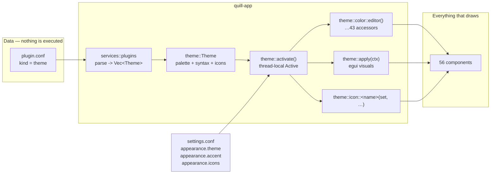
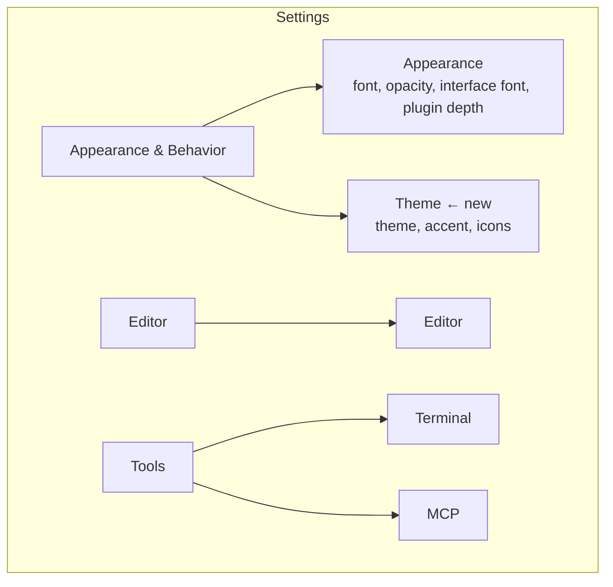

# task-1776 — themes, and icons that belong to them

What was asked for:

> Look at the IntelliJ themes I use, like Material. Search online for their colors, icons etc.
>
> We want to use our ai service ideogram and/or krea 2 to help generate icons, etc.
>
> All icons in Quill should be themeable. Our default icons on the left bar for file folders, chat,
> etc, need to be improved.
>
> Folder panel arrow/expand icon needs improved and to be themeable.
>
> Create a theme architecture in Quill. Then create a themes bundle 1 plugin that has a few themes
> that are similar to my IntelliJ ones I have installed.
>
> Have appropriate settings in quill that mirror IntelliJ, font, colors, etc.

## 1. The themes that are actually installed, read rather than guessed at

The first sentence says to look at the IntelliJ themes *I use*. That is a question with a factual
answer on this machine, so it was answered by reading
`%APPDATA%/JetBrains/IntelliJIdea2025.3` rather than by searching for what Material Theme UI looks
like in general.

| File | What it says |
|---|---|
| `options/laf.xml` | the look and feel is `8b2c3d4e-5f67-89ab-cdef-012345678901` |
| `plugins/dracula-theme/.../plugin.xml` | that id is **Islands Dracula Colorful** |
| `options/colors.scheme.xml` | the editor colour scheme is **Dracula Colorful** |
| `options/material_theme_new.xml` | Material Theme UI's accent is `#ff79c6` |
| `plugins/` | Material Theme UI 10.10.1, **Atom Material Icons** 104, Monokai Pro, One Dark, Gradianto, Spacegray |

So the theme in front of him every day is Dracula with a pink accent, and the other five plugins are
the ones he switches between. Every colour in §7 was then read out of those jars — the
`.theme.json` files and the `colors/*.xml` editor schemes — not off a web page. `Dracula Colorful`
in particular is not the Dracula everybody quotes: its comments are `#98afff` and its braces are
`#737fff`, both blue, where plain Dracula's comment is `#6272a4`. A theme called Dracula that shipped
plain Dracula's numbers would have been wrong in the one place he would notice first.

**Atom Material Icons is the other half of the answer, and it decides the icon design.** Its whole
job is to replace the IDE's marks with a set of its own and let the theme tint them. Material Theme
UI's own theme files carry an `icons.ColorPalette` block for exactly that:

```json
"Actions.Grey":  "#676E95",
"Objects.Blue":  "#82aaff",
"Objects.Yellow":"#ffcb6b",
"Checkbox.Focus.Wide": "#ab47bc"
```

An icon there is not a picture the theme replaces; it is a **shape** plus a **role**, and the theme
says what colour a role is. That is the model this ticket copies, because it is also the model
Quill's `theme::icon` already half has: every icon is drawn from numbers and tinted where it is used.

## 2. What is in the way

Three things, and only the first is hard.

**The palette is forty-three `const`s.** `theme::color` is the whole list of colours Quill draws
with, the style guide says so, and every one of them is a compile-time constant read at 689 places in
56 files. A constant cannot be themed. Nothing else about the change matters until that is dealt
with, and §3 is entirely about it.

**A colour scheme lives in the wrong plugin.** Today the nine token colours come from the *language*
plugin: `plugins/rust/plugin.conf` carries `theme.keyword = #FF79C6`, and so does JavaScript's, and
TypeScript's, and CSS's, and HTML's. Five copies of Dracula. Choosing a colour scheme means editing
five manifests, and a sixth language would arrive with a sixth copy. In IntelliJ a colour scheme is
one global thing, which is obviously right: the colours are a property of the scheme, not of the
language.

**`plugin.kind` has two values and a theme is neither.** `language` describes a file type and `ui`
draws a pane. The seam was named to be widened, and this widens it, visibly and with a check —
`CLAUDE.md` says *"Do not quietly widen it"*, so §5 widens it loudly.

## 3. The palette stops being constant, and the names stay closed



### 3.1 One value, forty-three accessors

`theme::Palette` gains one field per name the style guide's table already lists, and
`theme::color::EDITOR` becomes `theme::color::editor()`. The names, the order and every doc comment
stay exactly as they are — the style guide's sentence *"`theme::color` is the whole list of colours
Quill draws with"* is still true, and the list is still closed. What changes is that a name is now a
question rather than a number.

```rust
// theme/mod.rs
pub mod color {
    /// Behind the text. The window's alpha is applied to this by the opacity setting.
    pub fn editor() -> Color32 { with(|palette| palette.editor) }
}
```

689 call sites gain `()` and a lower-case spelling. That is a large diff and a boring one: it is a
single regular expression, and the compiler finds every site it missed. It is done in one commit of
its own so that the interesting commits are readable.

**Why not thread a `&Palette` through instead.** Because it is the same 689 edits *plus* a new
parameter on several hundred function signatures, and because a component that already takes a
rectangle and returns what happened would gain a second thing it has to be handed before it can draw
a divider. `services::plugin_ui::Palette` — the value a plugin's provider is handed — stays exactly
as it is and is filled from the active theme, so a provider keeps the seam it has.

### 3.2 The active theme is thread-local, and that is not a hedge

```rust
thread_local! {
    static ACTIVE: RefCell<Theme> = RefCell::new(Theme::quill_dark());
}
```

A window is one thread. A second window is a **second process** — `services::launcher::open_window`
runs `current_exe` — so there is no case in the shipped binary where two themes are wanted in one
process, and a process-global would have been correct for the product.

It would have been wrong for the tests. `crates/quill-app/tests/screenshots.rs` holds 169 accepted
pictures and cargo runs them in parallel on one process; a test that switched a global theme would
change the colours of whatever other tests were mid-frame, and the failure would move around between
runs. Thread-local, a theme chosen in one test cannot reach another's picture, and the four theme
tests need no lock, no serial attribute and no ordering.

It is also the fastest of the three shapes. A colour is read thousands of times a frame; a
`RefCell` borrow returning one `Color32` costs a counter check and a four-byte copy, where a
`RwLock` costs an atomic pair and a `Cell<Palette>` copies all 43 colours to read one.

The one thing it demands is that nothing paints off the UI thread, and nothing does: the four
background workers (`quill_git::Worker`, `text_search`, `symbol_index`, the DAP thread) hold no
`egui::Painter` and name no colour, and `run_cli` — the other place a colour is read, for
`mermaid_scene::theme` — runs inside `pump_control` at the top of a frame. A debug assertion in
`activate` records the thread it was called on so a later worker that starts painting says so.

### 3.3 What a theme is

```rust
pub struct Theme {
    /// `quill/dark`, `themes-bundle-1/dracula` — the plugin and the theme, as a pane is named.
    pub key: String,
    pub name: String,
    /// False is refused for now. See §5.3.
    pub dark: bool,
    pub palette: Palette,
    /// The nine token colours, or none — in which case each language plugin's own are used.
    pub syntax: Option<SyntaxTheme>,
    /// Which drawn set the icons come from, from `theme::icon::Set`.
    pub icons: Set,
}
```

`Theme::quill_dark()` holds today's forty-three numbers and **names no syntax colours at all**, which
is what makes the default build pixel-identical: every language plugin keeps colouring its own files
exactly as it does now, and the five copies of Dracula in §2 stay where they are until a theme is
chosen. A theme that names the nine wins over all of them at once, which is what a colour scheme is
for.

## 4. Icons: a role and a set

The style guide is unambiguous — *"If a drawn icon is not liked, the answer is to draw it better"* —
and it gives the reason: each rail icon is drawn in three different colours depending on its state,
and a picture can carry one colour at one size. That rule is kept. **Nothing here replaces a drawn
icon with a bitmap.**

So "themeable icons" is two separate things, and the ticket asks for both.

### 4.1 Colour — every icon, through a role

Six roles join the palette, and each one **defaults to the colour that is passed today**, so no
pixel moves until a theme says otherwise:

| Role | Default | Where |
|---|---|---|
| `icon` | `TEXT_DIM` | an icon sitting there |
| `icon_active` | `TEXT_STRONG` | its pane is open, its button is on |
| `icon_disabled` | `TEXT_FAINT` | it cannot be used — git outside a repository |
| `folder` | `TEXT_DIM` | a folder's mark and its arrow in the explorer |
| `folder_open` | `ACCENT` | an expanded folder — Atom Material Icons' one loud move |
| `file` | `FILE_TEXT` | the square in front of a file with no plugin icon |

They are Material Theme UI's `Actions.Grey`, `Objects.*` and `Checkbox.Focus.Wide` under Quill's own
names. With them the answer to *"is every icon in Quill themeable"* is yes for **every icon there
is**, including the fifty in `theme::icon` this ticket does not redraw, because all fifty are already
tinted at the point of use and the point of use now reads the theme.

### 4.2 Shape — two sets, and the second one is the improvement

`theme::icon::Set` is an enum with two members, checked against `plugins::ICON_SETS` the way
`RENDERERS`, `PROJECT_RUNNERS`, `DEBUGGERS`, `UI_PROVIDERS` and `CHROME` are:

| Set | What it is |
|---|---|
| `quill` | the marks that ship today, unchanged |
| `material` | new: heavier, rounder, filled where the Quill one is a stroke, in the manner of Atom Material Icons |

The `material` set covers exactly the marks the ticket names, and the boundary is written down rather
than left to be discovered:

- **the rail** — `folder`, `editing_area`, `branch`, `terminal`, `run`, `bug`, `board`, `chat`
- **the explorer** — `disclosure` and a folder mark that the `quill` set does not draw at all
- **the small controls that sit beside them** — `magnifier`, `collapse`, `plus`, `cross`, `tick`

Everything else — the alignment marks, undo and redo, the debugger's five steps, the symbol kinds,
the colour wheel — has one drawing, asks for no second one, and is themed by §4.1. A set with no
drawing for a mark falls through to the `quill` one, so adding a third set later is adding the four
shapes it wants to differ on rather than fifty.

**The disclosure arrow is the one the ticket calls out, and it is the clearest case for the split.**
Today it is a solid triangle, seven points across, and it is the same triangle rotated. IntelliJ,
VS Code and every Material icon set draw a **chevron** — two strokes meeting at a point — because a
stroke reads as an affordance and a filled triangle reads as a bullet. The `material` set draws a
1.5 point chevron with round caps, and the `quill` set keeps the triangle so that 169 accepted
pictures do not all move on a change nobody asked them to make.

### 4.3 Where the artwork comes from

The ticket asks for Ideogram or Krea 2 to help generate the icons. They do, in the role they can
actually fill here: **as the design, not as the asset.** `POST /image-creation/generateImageToProjectFile`
renders with Krea 2 and is the same call `plugins/css/icon.md` and `plugins/html/icon.md` already
record for the file-type icons; it produces a 1024-square PNG. A rail button is a ten-point square
drawn in three different colours, so the PNG cannot *be* the button — but it is a far better thing to
draw against than an opinion, and it is what a designer would have handed over.

So: one generated sheet per set, kept in `design/`, and `design/icons.md` records the prompt, the
endpoint and the two commands beside it, exactly as the plugin icons do. The Rust is then measured
against the sheet, and the sheet is the thing that changes when the design changes — which is the
split `design/` and `tests/snapshots` already are.

The **file-type icons** in `plugins/*/icon.png` are pictures and stay pictures; they are unaffected.

## 5. A theme is a plugin, and a plugin is still data

### 5.1 `plugin.kind = theme`

A third value, checked, and refused with a message naming the three this version runs. A theme plugin
claims no extensions and contributes no pane, which `parse` already has to allow for `ui`; the check
becomes "a `language` needs extensions, a `ui` needs a contribution, a `theme` needs at least one
theme".

### 5.2 The manifest

One plugin carries several themes, which is what "a themes bundle" means. Names are read with
`Values::starting_with("theme.")` and grouped on the first segment — the same mechanism that already
reads `menu.submenu.<id>.submenu.<other>`, so no new parsing.

```conf
plugin.id   = themes-bundle-1
plugin.kind = theme

theme.dracula.name         = Islands Dracula Colorful
theme.dracula.dark         = true
theme.dracula.icons        = material

theme.dracula.ui.editor       = #282A36
theme.dracula.ui.accent       = #FF79C6
theme.dracula.ui.selected_row = #44475A
# …every name in theme::color, in snake case. Any that is left out keeps Quill Dark's.

theme.dracula.syntax.keyword = #FF79C6
theme.dracula.syntax.comment = #98AFFF
# …the nine tokens. All nine or none: eight would half-recolour a file.

theme.dracula.icon.folder      = #FFB86C
theme.dracula.icon.folder_open = #FF79C6
```

Three properties of that shape are deliberate:

- **A name that is left out inherits.** That is IntelliJ's `parentTheme` in one line, and it is what
  keeps a manifest to the thirty colours that matter instead of forty-three.
- **A name Quill does not have is refused**, with the list, like every other checked key. A theme
  quietly missing a colour it thought it set is the failure this avoids.
- **The manifest still names no code.** `icons = material` names a drawing that shipped in the
  binary, checked against `ICON_SETS`; it is `language.renders` again. Nothing is loaded and nothing
  is executed, and the most a third-party theme can do is pick one of the sets that is here.

The rule in `services/plugin_ui.rs` — *"There is deliberately no way for a **manifest** to add
one \[a colour]"* — is about a **plugin's pane**, and it is unchanged: a `ui` plugin still cannot
name a colour. What a `theme` plugin does is say what the closed list of names *means*, for the whole
window at once, which is the opposite of a pane inventing a forty-fourth grey.

### 5.3 Light themes are refused, and the reason is written down rather than implied

`theme.<id>.dark = false` is refused with a message. Bundle 1 is five dark themes because the five
IntelliJ themes on this machine are dark, and because a light theme is not a palette swap here: the
window is drawn on a transparent ground so the desktop shows through, the elevation recipe in
`vello_canvas` is *"the pale half is the surface lifted and the dark half is black at an alpha"*,
and 169 accepted pictures are judged against a dark ground. Naming the seam and leaving it closed is
what `plugin.kind` itself did, and it is honest in a way that shipping a light theme nobody had
looked at every screen in would not be.

### 5.4 Switching a plugin off withdraws its theme in the same frame

`Plugins::themes()` is worked out from the manifests each time, the way `Surfaces` is. If the active
theme's plugin is switched off, uninstalled or fails to parse, the window falls back to
`quill/dark` on that frame and says so in the status bar. This is `Plugins::renders`' rule applied to
colour, and it is what stops a half-disabled plugin leaving the window in a palette nothing can
name.

## 6. The settings, and which IntelliJ page each one mirrors



| Quill | IntelliJ it mirrors | Key |
|---|---|---|
| `Theme` page → Theme | Appearance & Behavior → Appearance → **Theme** | `appearance.theme` |
| `Theme` page → Accent | Material Theme UI → **Accent Color** | `appearance.accent` |
| `Theme` page → Icons | Atom Material Icons → **icon set** | `appearance.icons` |
| `Appearance` → Interface font | Appearance → **Use custom font** | `appearance.ui.font.family`, `appearance.ui.font.size` |
| `Appearance` → Font | Editor → **Font** | `appearance.font.family`, `appearance.font.size` (exist) |
| the theme's `syntax.*` | Editor → **Color Scheme** | — |

**Theme** is a page of its own rather than a section on Appearance for a measured reason: the Settings
window is one size for every page, no page scrolls, and Appearance already fills 640 points with
Font, Background and Plugin panes. IntelliJ separates them too.

**Accent** is one colour on top of whatever the theme said, empty meaning "the theme's own". It is
the setting Material Theme UI is best known for, `components::color_wheel` is already in the binary,
and it costs one `Option<Color32>` applied after the theme is read.

**Icons** offers `Follow the theme`, `quill` and `material`. Following is the default, so choosing a
theme brings its icons with it and a person who wants the old triangles under a new palette can say
so.

**Interface font** is the one genuinely new piece of plumbing. `theme::install_fonts` binds the
*editor's* family into egui's proportional stack today, so the interface font is the editor font and
there is no way to have a large editor and a compact window. It gains a family of its own — empty
meaning "the editor's", which is `terminal.shell`'s sentence again — and a size that scales egui's
text styles in `theme::apply`.

**Editor line height is deliberately not added**, though IntelliJ has one on the same page. Quill
already has line spacing, as a **paragraph** property, with its own three buttons in the text options
flyout and its own place in the document model. A second, window-wide number that meant nearly the
same thing would be two answers to one question, which is what `## One action, one place` exists to
prevent. If the flyout's control is in the wrong place that is a ticket about the flyout.

## 7. Themes Bundle 1

Five, each the numbers of a plugin that is installed on this machine.

| Theme | Ground | Accent | Keyword / String / Comment | Read from |
|---|---|---|---|---|
| **Islands Dracula Colorful** | `#282A36` | `#FF79C6` | `#FF79C6` / `#F1FA8C` / `#98AFFF` | `dracula-theme-1.19.0.jar` — the one that is switched on |
| **Material Palenight** | `#292D3E` | `#AB47BC` | `#C792EA` / `#C3E88D` / `#676E95` | `material-theme-jetbrains-10.10.1.jar` |
| **Material Deep Ocean** | `#0F111A` | `#84FFFF` | `#C792EA` / `#C3E88D` / `#717CB4` | the same jar |
| **Monokai Pro** | `#2D2A2E` | `#FFD866` | `#FF6188` / `#FFD866` / `#727072` | the same jar, and `monokai-pro/` |
| **One Dark** | `#282C34` | `#61AFEF` | `#C679DD` / `#98C379` / `#59626F` | `one-dark-theme-6.2.2.jar` |

Two decisions inside those numbers are worth stating.

**The editor ground is the scheme's, not the Islands chrome's.** Islands Dracula draws the editor on
`#3A3D4C` because IntelliJ's editor is an island floating on a darker frame, and Quill has no such
frame. The canonical `#282A36` is used, with `#414450` and `#3A3D4C` becoming the title bar and the
tab strip — which is where those colours are in the picture anyway.

**A theme sets its own red, amber and green.** `CLOSE`, `MINIMISE` and `MAXIMISE` are the three window
buttons and are also, as the style guide records, the red that means *went wrong* and the amber that
means *unsaved*. Under Monokai Pro they become `#FF6188`, `#FFD866` and `#A9DC76`. A traffic light
that stayed macOS red on a Monokai window would be the one thing on the screen from another palette.

## 8. Reaching it from the command line

Three commands, in a `theme` area of their own, because `settings set appearance.theme dracula` can
change a theme but cannot tell you what themes exist — and the study in `CLAUDE.md` is explicit that
an agent that cannot discover a thing uses `bash` instead.

| Command | Answers |
|---|---|
| `theme list` | every theme: key, name, the plugin it came from, dark, its five headline colours, and which is active |
| `theme show [key]` | one theme in full — all forty-three roles, the nine token colours, the icon set. The active one when the argument is left out |
| `theme set <key>` | switch. Takes the full `plugin/theme` key or an unambiguous name, the way a sprint is named by its name |

`settings set appearance.theme` reaches the same code, because `run_cli` is the one place a command
becomes a change. The MCP tools are generated from the catalogue, so all three are tools the day they
are added, and `quill-cli/docs/commands.md` gains a section for each — which is a test, not a
courtesy.

## 9. Alternatives considered

| Option | Why not |
|---|---|
| **A theme is a `.theme.json` read at the IntelliJ schema** | It would let his real theme files be dropped straight in, which is genuinely attractive. It costs a JSON dependency in `quill-app`, and the schema is 400 lines of Swing component keys — `ComboBox.ArrowButton.nonEditableBackground` — of which Quill has an analogue for about twenty. Quill would be pretending to read a format it mostly ignores. The numbers are copied instead, once, with the file each came from named. |
| **Thread the `Palette` through every component** | The same 689 edits plus a parameter on several hundred signatures, and a component that draws a divider would need to be handed the window's state to do it. |
| **A process-global palette behind a `RwLock`** | Correct for the product, wrong for the tests: 169 screenshot tests run in parallel in one process and a theme test would recolour whatever else was mid-frame. |
| **Bitmap icons generated by Krea 2, shipped per theme** | Refused by the style guide with its reasons already written: an icon is drawn in three colours depending on state and at any zoom, and a picture is one colour at one size. `task-1657` refused the same offer for the `F` button. The generated sheet becomes the design instead. |
| **Keep the token colours in the language plugins and let a theme override each one** | Five copies of Dracula stay five copies, and a sixth language arrives with a sixth. The theme owning the scheme is what IntelliJ does and is why a scheme can be switched at all. |
| **Ship a light theme in bundle 1** | §5.3. |
| **`plugin.kind = ui` with a `ui.provider = themes`** | A theme draws no pane, contributes no menu and has no state; it would be a `ui` plugin with every `ui` field empty, which is what a wrong `kind` looks like. |

## 10. Testing

Favouring the tests that drive real things over unit tests, which is what the rest of this crate
does.

**Reading a manifest** — `services::plugins::tests`

1. `a_theme_plugin_carries_several_themes` — the bundle's own manifest parses to five themes, in
   order, each with a key, a name and a palette.
2. `a_theme_inherits_every_colour_it_does_not_name` — a two-line theme differs from Quill Dark in
   exactly the one role it set.
3. `a_theme_naming_a_colour_quill_does_not_have_is_refused` — with the name in the message.
4. `a_light_theme_is_refused_with_a_reason` — §5.3.
5. `a_theme_naming_an_icon_set_this_version_has_not_got_is_refused` — with the list.
6. `the_older_plugins_ask_for_none_of_what_themes_added` — the seventh time this test is written, and
   what proves the eight plugins that shipped before are byte-identical in behaviour.

**Activating one** — `theme::tests`

7. `quill_dark_is_exactly_what_shipped` — all forty-three accessors against the old constants. This
   is the test that makes the 689-site rewrite safe.
8. `a_theme_reaches_every_accessor` — activate Monokai Pro, assert `color::editor()`,
   `color::accent()` and four others are its numbers, then reset and assert they are back.
9. `an_accent_setting_wins_over_the_theme` — and clearing it goes back to the theme's.
10. `switching_the_plugin_off_falls_back_to_quill_dark` — in the same frame.
11. `a_theme_with_no_syntax_colours_leaves_the_plugins_alone` — the default path, asserted rather
    than assumed.
12. `the_active_theme_does_not_leak_between_threads` — two threads, two themes, both read their own.

**Driving the window** — `tests/screenshots.rs`, real windows through `run_cli`

13. `theme_list_names_every_theme_and_which_is_active`
14. `theme_set_changes_the_window` — `theme set monokai-pro`, then a screenshot: `themed_window.png`.
15. `theme_set_by_name_finds_it` — `theme set "Deep Ocean"`.
16. `theme_set_unknown_says_what_there_is` — a refusal that lists them.
17. `settings_set_appearance_theme_is_the_same_path` — the two routes leave identical state.
18. `the_theme_page_lists_them` — `settings_theme_page.png`.
19. `the_explorer_arrow_follows_the_icon_set` — `explorer_material_icons.png` beside the existing
    `explorer.png`.
20. `every_command_is_offered_as_a_tool_in_both_shapes` and the documentation test — both already
    exist and both fail until §8 is written down.

**Looked at, not only diffed.** Every new or changed snapshot is opened and judged before it is
accepted, which is what `UPDATE_SNAPSHOTS=1` means here.

## 11. Deliberately left out

- **Light themes** — §5.3.
- **Editor line height** — §6.
- **A theme editor in the window.** Themes are files; `plugins install` already writes a bundled
  plugin out so it can be edited by hand, and `plugins reload` reads it back with no restart. A
  colour picker per role is forty-three colour wheels and a file format Quill would then own.
- **Per-language colour scheme overrides.** IntelliJ has them; nothing here needs them, and the nine
  tokens are already the whole of what Quill's tokeniser distinguishes.
- **Theming the terminal's sixteen ANSI colours.** `quill_terminal::Palette` is a different palette
  with a standard behind it, and a program printing red expects red. It is named here so the next
  person does not think it was forgotten.
- **Downloading a theme.** Nothing in Quill fetches anything, and this does not start.
