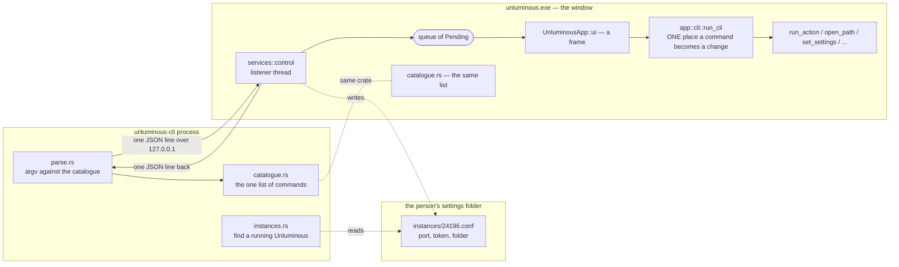
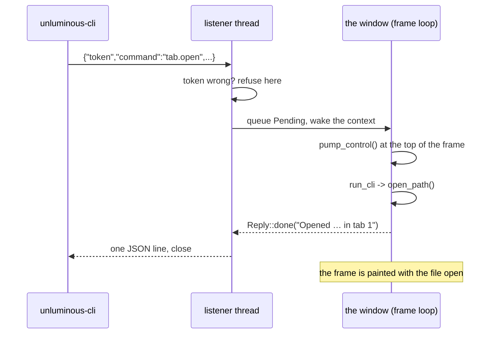
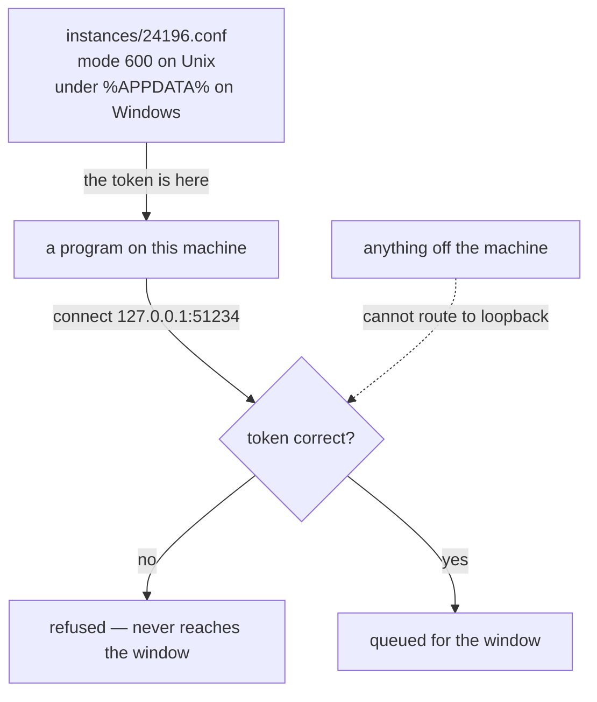

# Unluminous CLI — technical design

`task-1661`

## Introduction

Unluminous can only be driven by hand. Everything it does — opening a file, starting a terminal, running a
command in it, collapsing the explorer, opening a modal and typing into it, changing a setting — needs
a person with a mouse. That makes it impossible to script, impossible to demonstrate reproducibly,
and, most of the point of this ticket, impossible for an AI agent to use.

This document designs `unluminous-cli`: a command line that drives a **running** Unluminous window, a control
channel for it to speak down, and a rule that keeps the two from drifting apart as Unluminous grows. The
measure of success is not the number of commands. It is whether a local model, handed only the
written documentation, can carry out instructions given in English with a **97% success rate**.

## Goals and non-goals

### Goals

| | |
|---|---|
| **G1** | Every common operation reachable from the command line: tabs, the editor's text and caret, terminals and what is typed into them, the explorer, every modal, every setting, git, and every entry on every menu. |
| **G2** | Machine-readable output (`--json`) with a stable shape and codes, and exit codes a script can branch on. |
| **G3** | Several Unluminous windows at once, each addressable, since a project is a window. |
| **G4** | An agent given only `unluminous-cli/docs/commands.md` can drive Unluminous. Measured, at **≥97%** on a scored assessment. |
| **G5** | A new feature comes with a command and with documentation — **enforced by tests**, not by memory. |
| **G6** | Visual verification: a command can be followed by a real screenshot of the real window. |
| **G7** | Works the same on Windows and macOS, one implementation. |

### Non-goals

| | |
|---|---|
| **N1** | Not a headless Unluminous. It drives a window that exists; it is not a way to edit files without one. `sed` already exists. |
| **N2** | Not a remote control. Loopback only, forever. |
| **N3** | Not a plugin or extension API. Nothing in a plugin is executed today and this does not change that. |
| **N4** | Not a replacement for the commit panel's message and file list. `git action commit` opens it; committing is done in it or with git. |
| **N5** | No file choosers. Three menu entries open the platform's own chooser and are refused with the name of the command that takes the path instead. |

## Problem statement

Unluminous's architecture already has the right shape for this and does not use it. `app::actions::Action`
is the one thing a menu or a shortcut can ask for, and `UnluminousApp::run_action` is the one place an
action turns into a change — but an `Action` can only be produced by a menu or a key press, both of
which need a person. `main.rs` grew a handful of switches (`--opacity`, `--view`, `--terminal`) to set
a *starting* state for capturing screenshots, which is the same need answered in the smallest possible
way: they can only be given once, before the window exists, and there are five of them.

The practical costs today:

- **`documentation/overview.md` is captured by hand.** Every picture in it is somebody arranging the
  window and pressing a key. A change to the window means doing it again.
- **A screenshot test is not the real window.** Layer 3 renders offscreen through `egui_kittest`;
  only a real run shows that the operating system honoured transparency or drew the menu bar. There
  is no way to put the real window into a state and photograph it except by hand.
- **An agent cannot use Unluminous at all.** This is the ticket's actual ask, and there is no partial
  version of it: without a channel, there is nothing to document.

## Architectural overview



Three decisions carry the whole design.

**One catalogue, two halves.** `unluminous-cli` is one crate with a library and a binary. The library holds
the command list, the wire format and instance discovery; `unluminous-app` depends on it. The client parses
against the same list the window dispatches on, so a command the CLI accepts is a command the window
knows. The dependency points one way — the client never depends on the window — so `unluminous-cli` stays a
small, fast program with no graphics card and no fonts behind it.

**The window answers, not the thread.** The listener never touches `UnluminousApp`. It queues the request,
wakes the window, and waits. The window drains the queue at the **top of a frame**, before anything is
drawn, so a command's effect is in the frame about to be painted — which is exactly what makes a
screenshot taken straight after a command show what the command did.

**One place a command becomes a change.** `run_cli` is to the command line what `run_action` is to the
menus, and wherever there is already a way in it uses it: `run_action` for anything on a menu,
`open_path`, `save`, `set_settings`, `FileTree::expand`, `Document::apply`. A thing done from the
command line and the same thing done by hand are therefore the same thing, not two implementations
that agree today.

## Components and interfaces

| Where | What |
|---|---|
| `unluminous-cli/src/catalogue.rs` | Every command: area, verb, positional arguments, flags, summary, examples. The single list. |
| `unluminous-cli/src/parse.rs` | argv → a named argument map, against the catalogue. No argument-parsing library: the catalogue already says what each command takes, and a library would mean writing those facts down twice. |
| `unluminous-cli/src/protocol.rs` | `Request`, `Reply`, the error codes, and `ask()`. |
| `unluminous-cli/src/instances.rs` | The instance file: its format, where it lives, and reading the folder. |
| `unluminous-cli/src/client.rs` | Choosing an instance, sweeping stale files, launching an Unluminous and waiting for it. |
| `unluminous-cli/src/help.rs` | `--help` and `commands --json`, both printed from the catalogue. |
| `crates/unluminous-app/src/services/control.rs` | The listener thread, the token, the instance file, and `Pending`. |
| `crates/unluminous-app/src/app/cli.rs` | `run_cli`: what a command *means*. The only place a request turns into a change. |
| `crates/unluminous-app/src/app/action_names.rs` | A plain name for every `Action` and `GitAction`, and the test that every menu entry has one. |

### The command surface

`unluminous-cli <area> <verb>` — the noun first, as `docker container create` and `dotnet tool install`
are. Microsoft's guidance is explicit that a command holding subcommands is a *grouping* and the verb
under it is the action; clig.dev notes noun-verb is the more common of the two orders. Areas are the
parts of the window, so somebody who can see Unluminous can guess the area.

| Area | Commands |
|---|---|
| *(none)* | `status`, `instances`, `launch`, `quit`, `commands`, `version` |
| `window` | `screenshot`, `focus`, `size`, `position`, `message` |
| `tab` | `open`, `list`, `show`, `close`, `next`, `previous`, `save`, `save-as`, `reload` |
| `editor` | `status`, `text`, `set-text`, `insert`, `caret`, `select`, `undo`, `redo`, `view`, `preview` |
| `terminal` | `show`, `hide`, `toggle`, `new`, `list`, `select`, `close`, `send`, `read`, `height` |
| `explorer` | `show`, `hide`, `toggle`, `width`, `filter`, `expand`, `collapse`, `tree`, `files`, `reveal` |
| `modal` | `list`, `open`, `state`, `type`, `results`, `choose`, `accept`, `cancel`, `move`, `size`, `reset` |
| `settings` | `list`, `get`, `set`, `reset`, `fonts` |
| `plugins` | `list`, `install`, `enable`, `disable` |
| `git` | `status`, `actions`, `action` |
| `action` | `list`, `run` |
| `project` | `open`, `recent` |

Two of these are load-bearing beyond their own commands.

**`modal` is generic.** Open it, type in it, read its results, choose a row, accept or cancel, and move
or resize it. `Go to File`, `Find in Files`, Settings, `New File` and `Rename` are all driven with the
same eleven commands, and a modal added later is driven with them too without anybody adding a
command. This mirrors `components::modal`, which is already the furniture every modal is built from.

**`action` is the escape hatch and the guarantee.** `action list` is built by *walking the real menus*,
so every entry on every menu is reachable by name, and a menu entry added tomorrow is on the command
line tomorrow with nobody adding anything. That is how G5 is met structurally rather than by promise.

### The instance file

An Unluminous that is listening writes `<settings folder>/instances/<pid>.conf` in the same `name = value`
format `services::store` already uses:

```
folder = C:\jason\dev\unluminous
pid    = 24196
port   = 51234
token  = 4f1a9c2e77b3d051a8e6b40cf1927d3a
```

A file per window, because a project is a window and several Unluminouss run at once — so there is no
single fixed port. The file is removed when the `Server` is dropped; one left behind by a killed
process is swept by the client when it finds nothing answering on the port.

### The wire format

One JSON object a line, request then reply, connection closed.

```
-> {"token":"4f1a…","command":"tab.open","arguments":{"path":"README.md"}}
<- {"ok":true,"command":"tab.open","message":"Opened …\\README.md in tab 1","result":{"tab":1,…}}
<- {"ok":false,"command":"tab.open","error":{"code":"not-found","message":"There is no file at …"}}
```

`message` is written by the **window**, not by the client, because the window is the only thing that
knows what actually happened — which tab the file landed in, what the setting was before it changed,
how many results a search found. A client that composed its own sentence would be guessing at
something it just asked somebody else to do.

`error.code` is a word, not a number: `not-found`, `not-applicable`, `usage`, `unknown-command`,
`refused`, `failed`, `timed-out`, `not-running`, `several-instances`. A caller matching on
`not-found` is reading its own program a year later. The client turns the word into a process exit
code, which is the one place a number is what the shell understands.

| Exit | Meaning |
|---|---|
| 0 | It worked |
| 1 | Unluminous refused it (`not-found`, `not-applicable`, `failed`) |
| 2 | The command line was wrong (`usage`, `unknown-command`) |
| 3 | No Unluminous running / unreachable (`not-running`, `refused`) |
| 4 | Several Unluminouss, none named (`several-instances`) |
| 5 | Reached but too slow (`timed-out`) |

The split is what a script cares about: 2 is the caller's mistake, 1 is Unluminous's answer, 3–5 are about
the connection rather than the command.

## Data flows

### A command that finishes on the frame it arrives on



### A command answered later

Four commands cannot be answered on the frame they arrive on, and each keeps its `Pending` in a
`Waiting` until it is ready or its time runs out:

| Command | Waiting for | Why it cannot be immediate |
|---|---|---|
| `window screenshot` | `Event::Screenshot` | eframe captures the painted frame and delivers the image on the *next* frame's input. |
| `terminal read --wait-for` | text on the screen | The shell is a separate process; when it answers is not knowable. |
| `modal results --wait` | the search thread | `Find in Files` reads the project on a thread, newest question only. |
| `git action --wait` | `unluminous_git::Worker` | git runs one command at a time on a thread. |

Every one takes a timeout, because a command that could wait for ever is a script that hangs. While
anything is waiting the window asks for a repaint, so a window that has gone idle cannot leave a
request unanswered.

### Security



Three claims, and what each is worth.

**Bound to `127.0.0.1` and nothing else.** Nothing off the machine can reach it. `bind()` is a
function of its own so a test can assert the address is a loopback address without starting a thread —
this is the one property that must never quietly change.

**The token is a capability, not a key.** Sixteen bytes from the operating system's own randomness
(`RandomState`, which the standard library seeds from the platform's random source), written into a
file in the person's own settings folder, mode `600` where modes exist. It does **not** defend against
another program running as that person — nothing on a desktop does, and a program running as you can
read the file. What it does defend against is a page in a browser, which can `fetch` a loopback port
and cannot read a file. That is a real and common attack shape, and it is the one this closes.

**It can be closed.** `unluminous --control off`, or `UNLUMINOUS_CONTROL=off`. Open by default, because a
command line that has to be switched on first is one an agent cannot rely on being there.

Two smaller rules that are easy to lose: the token is compared **only after** the request has parsed,
so a wrong token gets the same refusal whatever else was wrong with the line; and a `Pending` dropped
without an answer sends a failure from its `Drop`, so a forgotten match arm can never leave a caller
hanging.

## Alternatives considered

### The transport

| Option | Pros | Cons | Verdict |
|---|---|---|---|
| **Loopback TCP + token** | One code path on both platforms, `std::net` only. Any language with a socket speaks it. Trivially testable. | Every program running as the person can reach the port; needs a token. | **Chosen.** |
| Unix socket / named pipe | File-system permissions do the access control; no token needed. | Two implementations — `std` has no portable AF_UNIX on Windows — so a dependency, two sets of semantics, two sets of bugs. Harder to reach from another language. | Rejected. The token buys back what it costs, in one implementation. |
| A watched command directory | No networking at all. Dead simple. | Polling, no replies, no way to return a value or wait for one. `terminal read --wait-for` is impossible. | Rejected: replies are most of the value. |
| Extending `main.rs` switches | Nothing new to build. | Only settable before the window exists, once. Cannot read anything back. Does not answer the ticket. | Rejected. |
| An HTTP server | Familiar; `curl` works. | A whole HTTP surface to get right, CORS and browser-reachability to worry about, and a dependency. JSON-lines is the same thing without the framing. | Rejected. |

nvim's `--listen`/`--server` is the closest prior art and takes the same shape: a per-instance address,
a line protocol, a client that is convenient rather than privileged.

### Where the CLI's knowledge of commands lives

| Option | Verdict |
|---|---|
| **A shared library crate both sides depend on** | **Chosen.** One list; a command the client accepts is one the window knows. |
| The client depends on `unluminous-app` | Rejected: drags eframe, wgpu and fonts into a program that should start in milliseconds. |
| The client validates nothing and forwards | Rejected: `--help` would then need its own copy of every command, which is the duplication this avoids. |
| The client asks the window for the catalogue at startup | Rejected: a round trip before every command, and `--help` would need a running Unluminous. |

### The argument parser

Hand-written, against the catalogue. `clap` would mean declaring every command twice — once for the
parser and once for the catalogue the window dispatches on — or generating one from the other, which
is more machinery than the parsing is worth. The parser is about 200 lines and the catalogue is the
only place a command is described.

### JSON

`serde_json`, used through `Value` and `json!` with no derive macros. Nothing here is a Rust type going
over the wire; it is a small open protocol another language has to speak, so the values are built and
read as values. A hand-written encoder was considered and rejected: terminal output carries control
characters, quotation marks and newlines, and the wire format is one object a line — getting the
escaping subtly wrong would corrupt exactly the data the terminal commands exist to return.

### Output format

Human sentences by default, JSON with `--json`. Making JSON the default when stdout is not a terminal
was considered — clig.dev's "stdout is your API" — and rejected as too clever for the primary
audience: an agent that always passes `--json` gets the same answer whether it is piped or not, and
one rule documented once beats a rule that depends on where the output is going.

## Testing strategy

Unluminous's four layers, and where this work lands in each.

**1. Unit tests with no window** — `unluminous-cli` (43) and the naming rules in `unluminous-app`:

- the catalogue is well formed: no two commands share a name, names are lower-case and hyphenated, a
  required argument never follows an optional one, only the last argument takes the rest of the line;
- **every example in the catalogue parses**, and runs the command it is filed under — an example an
  agent copies that does not work is worse than no example;
- parsing: flag before text, text swallowing dashes, `--` ending the flags, `--flag=value`, a missing
  required argument naming which one, an unknown flag refused rather than taken as text, an unknown
  command suggesting the nearest;
- the protocol survives a round trip, including a reply carrying newlines, quotes and escape
  characters — the case that would break a one-object-a-line format;
- **every action on every menu has a name that reads back to it** (`action_names.rs`). This is the
  test that keeps G5 true.

**2. The control channel, end to end in one process** (`services/control.rs`): a request reaches the
window and the answer comes back; a wrong token is refused *without reaching the window*; a line that
is not a request is refused rather than ignored; the instance file appears while it runs and is gone
when it stops; `bind()` binds a loopback address; two tokens are never the same; a dropped `Pending`
still answers.

**3. Integration through the real window** (`crates/unluminous-app/tests/cli.rs`): build a `UnluminousApp`
through `egui_kittest`, run commands through `run_cli`, and assert on what the window then holds —
a file opened lands in a tab, `editor insert` changes the document, `settings set` reaches every open
tab, `modal open go-to-file --query` finds files, `explorer hide` hides it. This is where a command
is checked against the window rather than against itself.

**4. The real application.** A script that launches `unluminous.exe`, drives it with `unluminous-cli`, takes a
**screenshot after each step**, and leaves the pictures under `_agent_output/task-1661-unluminous-cli/` to
be looked at. Layer 3 renders offscreen; only this shows the real window really did it.

**And the measurement the ticket asks for.** A scored assessment: the local Qwen 3.8 27B is given
`docs/commands.md` and a set of instructions written as a person would say them, and its answers are
run against a live Unluminous and checked. The bar is **97%**, and the result — after the bar is reached —
goes in `unluminous-cli/agent-assessment/qwen-38-27B-assessment.md`.

## Risks

| Risk | What is done about it |
|---|---|
| A loopback port is reachable by any local program. | A per-run token in a user-only file; refused before the request reaches the window; the channel can be switched off. |
| A command that waits could hang a script. | Every waiting command has a timeout, and the listener has a 120-second backstop for a window that has stopped drawing altogether. |
| The catalogue and the window drift apart. | They are the same list, in a crate both depend on. |
| The documentation falls behind the commands. | A test fails while a command has no section, while a usage line is out of date, or while a section describes a command that no longer exists. |
| A test opens a port or writes an instance file into the person's settings. | `open_control_channel` is called from `main.rs` and nowhere else, exactly as `load_settings` and `restore_project` are. The control tests point `UNLUMINOUS_INSTANCES` at a folder of their own and take turns under a mutex, because an instance file is named after the process id. |
| `unluminous-cli` cannot find `unluminous`. | It looks beside itself first — where both a build and an installation put them — then at `UNLUMINOUS_BIN`, then the path, and says which it tried. |
